# AVenger Writeup

**Machine Name:** AVenger  
**Platform:** TryHackMe  
**Difficulty:** Medium

---

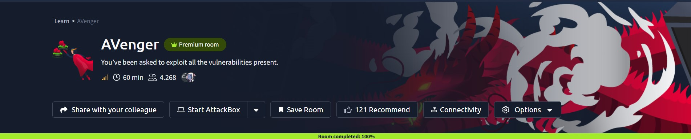

## Introduction

AVenger is a Windows box on TryHackMe built around a superhero themed training site. The front page talks about training the next generation of Avengers, but the real story is a WordPress install hiding behind a second virtual host, running a plugin old enough to have a public exploit sitting on Exploit-DB.

Getting in didn't need anything exotic. A vhost nobody bothered linking, a contact form plugin that hadn't been updated in a while, and a password reused between the database and the actual Windows account. That's really all it took to go from an anonymous visitor to Administrator.

## Phase 1: Enumeration

Started with a full port scan, then moved to content discovery once the base web server turned out to be nothing more than a default Apache index page.

Dirsearch against the main site turned up a `/dashboard/` path and not much else of interest.

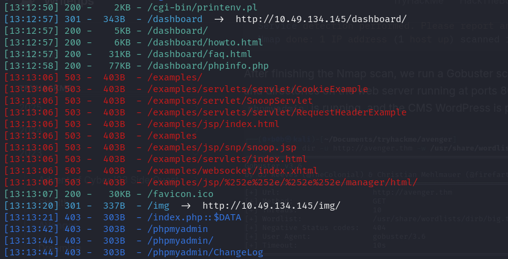

Dirsearch felt incomplete, so I switched to ffuf with a larger wordlist for a second pass.

That pass paid off. Buried in the noise were two entries worth a second look: a `wordpress` folder and a `gift` folder returning a 301 redirect.

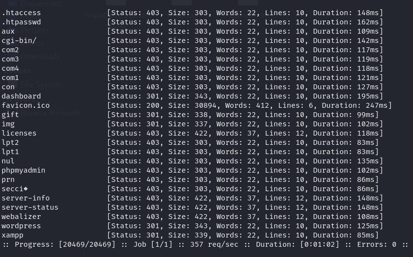

The presence of a `wordpress` directory suggested the real application was a WordPress site, and `gift` looked like a second host or path worth chasing down.

## Phase 2: A Hidden Virtual Host

Browsing straight to `/gift/` failed to resolve.

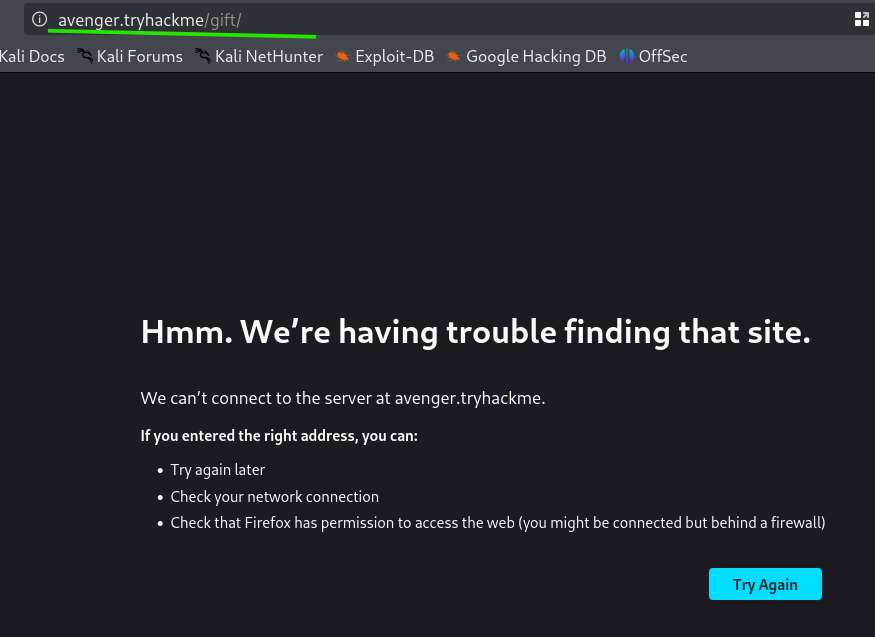

That's a virtual host, not a folder. Adding the domain to `/etc/hosts` brought up an entirely different site, a superhero training landing page with its own navigation, services, and a contact form.

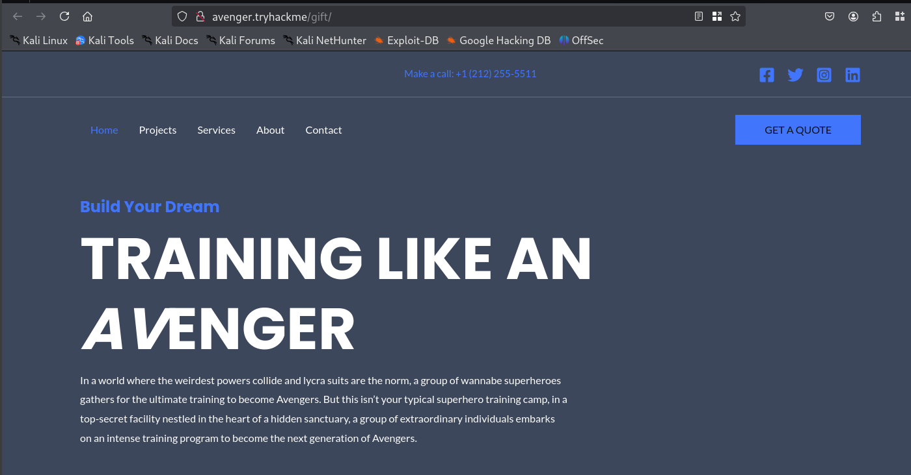

> **Security Issue #1:** Hidden Site Only Reachable by Guessing a Hostname. A second WordPress install was reachable only by knowing the exact virtual host name, which isn't a real access control. Anything discoverable through brute forcing or a leaked DNS record should be treated as public.

Near the bottom of the page was a "Request your training" form with a file upload field.

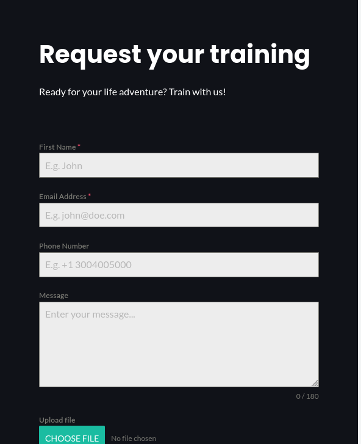

A quick test with a `.txt` file was rejected, but a `.jpg` was accepted without issue, confirming the endpoint processes file uploads server-side.

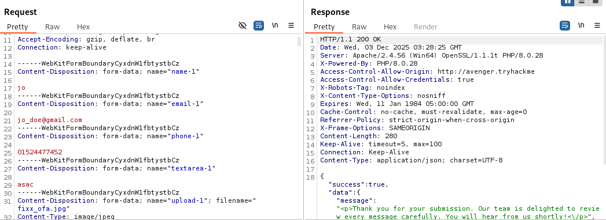

## Phase 3: Fingerprinting With WPScan

Ran WPScan against the newly discovered vhost.

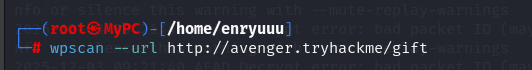

The scan confirmed the WordPress install, flagged an enabled XML-RPC endpoint, an exposed readme, and an open uploads directory listing.

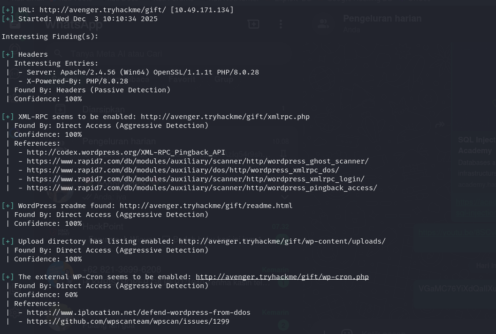

It also identified the active theme, Astra, along with two low-severity stored XSS issues that weren't relevant to the eventual foothold.

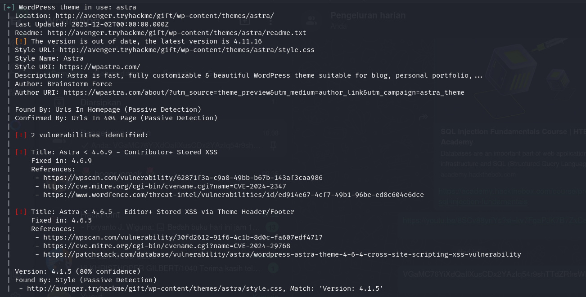

The more interesting find was the Forminator plugin, the same plugin powering that training request form, and it was badly out of date.

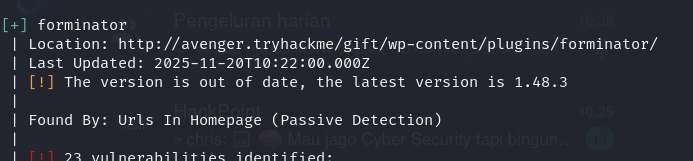

> **Security Issue #2:** Outdated Plugin Left Exposed to a Public Exploit. Forminator was running several versions behind, and a documented arbitrary file upload exploit ([EDB-51664](https://www.exploit-db.com/exploits/51664)) was already public for that version range. An out-of-date plugin on an internet-facing form is an open invitation.

## Phase 4: Bypassing Antivirus and Getting a Shell

The upload field accepted files, but a plain `.exe` reverse shell would get flagged by antivirus on a Windows target. To get around that, I used a Nim-based reverse shell template, since Nim binaries tend to fly under the radar of common AV signatures.

> Resource https://github.com/Sn1r/Nim-Reverse-Shell/blob/main/rev_shell.nim

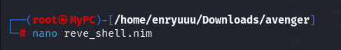

Edited the source to point at my listener before compiling.

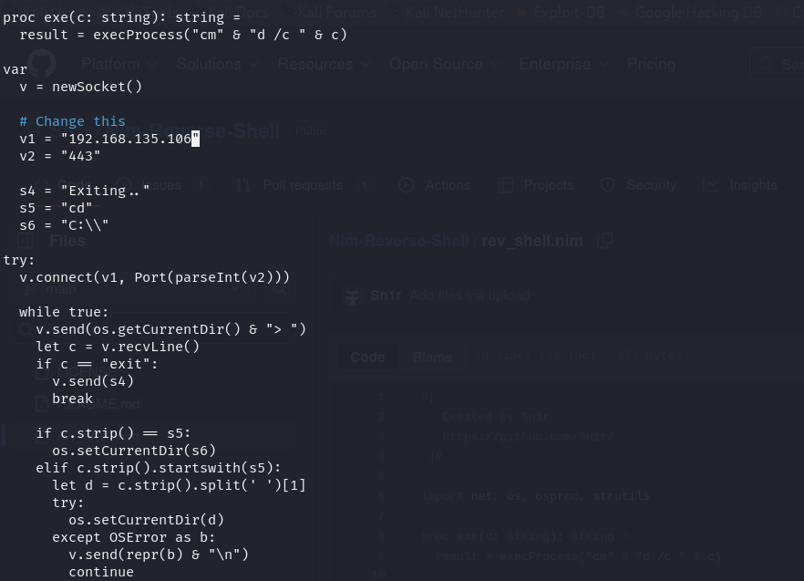

Compiled it with the Nim compiler targeting Windows.

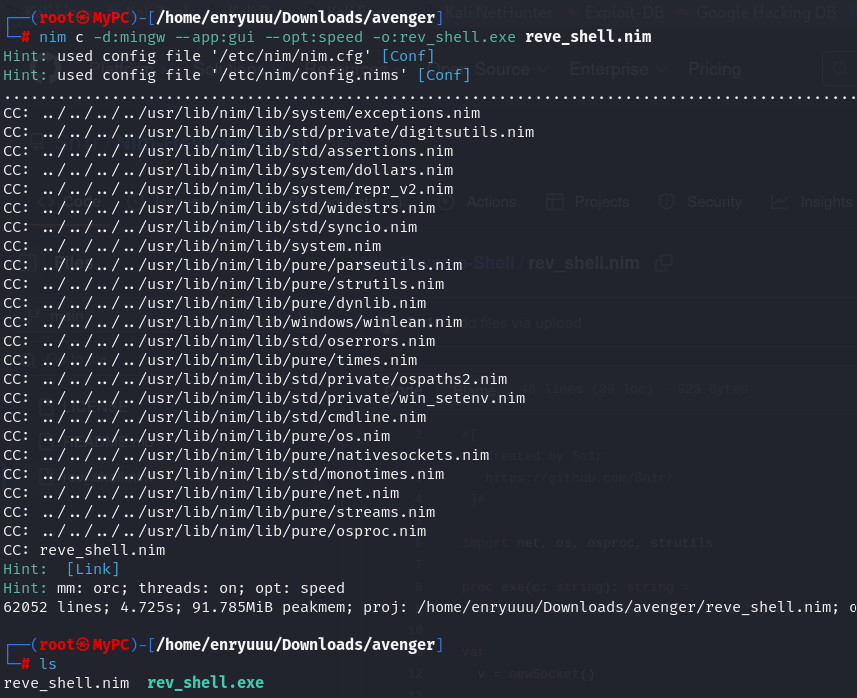

Renamed the resulting binary to something innocuous looking before uploading it, since an obviously suspicious filename tends to get blocked on sight.

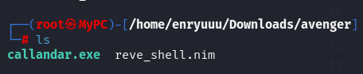

With a listener ready,

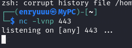

I submitted the training request form with the renamed payload attached.

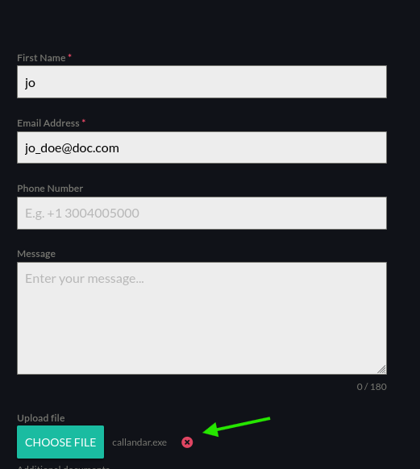

The callback landed a few seconds later, a working shell on the box.

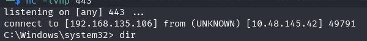

### First flag

`user.txt` was sitting in the user's desktop folder.

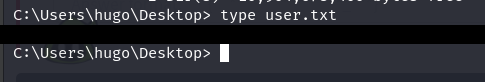

## Phase 5: Privilege Escalation

With a foothold established, the next step was checking the web root for anything useful, starting with the WordPress config file.

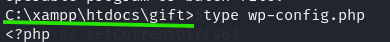

`wp-config.php` held the database credentials in plain text.

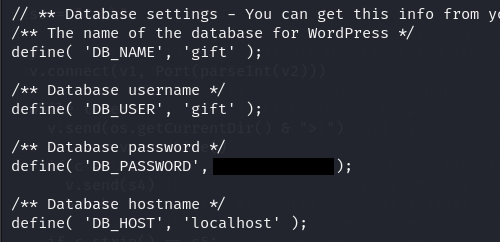

> **Security Issue #3:** Database Credentials Stored in Plaintext. The WordPress config file held a live database password with no encryption or secrets management in front of it. Anyone who can read the file system can read the database credentials.

Trying to log into MySQL directly with that password didn't immediately lead anywhere useful.

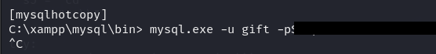

Since the box was Windows, I checked the registry for any autologon configuration that might reuse the same credentials.

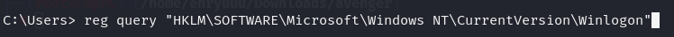

That paid off. The `Winlogon` key had `AutoAdminLogon` enabled, with a default username and a default password stored in plain text, and the password matched the same one from `wp-config.php`.

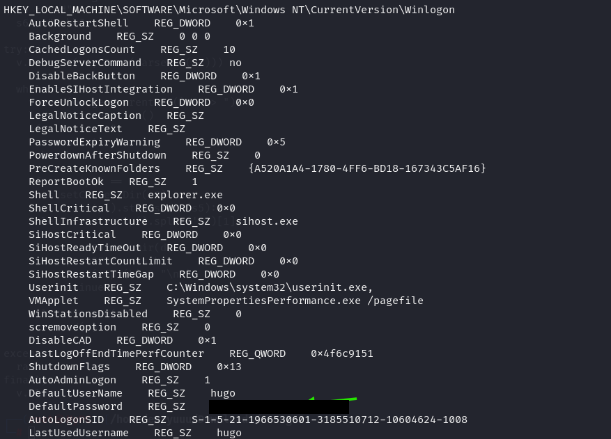

> **Security Issue #4:** One Password Reused Across the Database and the OS. The exact same credential protected the WordPress database and the Windows autologon account. Recovering one plaintext value handed over both.

## Phase 6: RDP and Root

With a valid Windows account and password, the fastest way in from here was RDP.

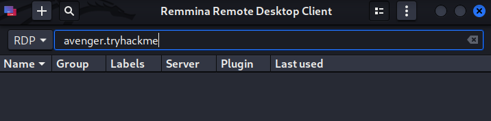

Logged in with the recovered username and password.

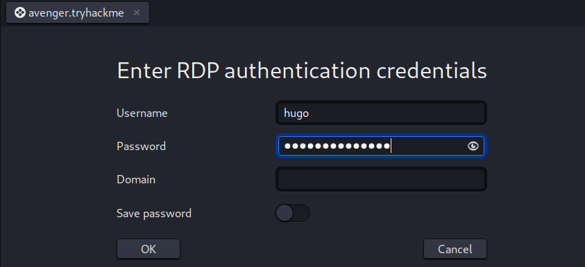

That dropped straight into an administrator shell.

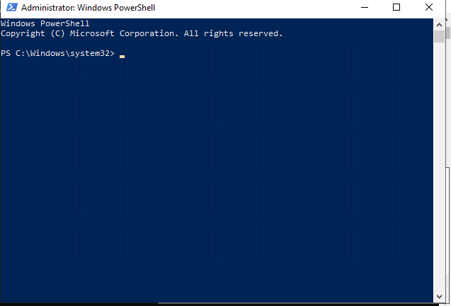

### Second flag

From the Administrator desktop, `root.txt` closed the room out.

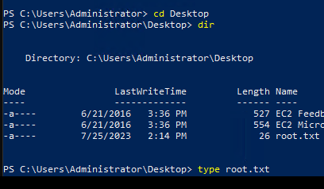

## Blue Team Perspective

Working back through this chain, here is what a defensive team could have caught, and where.

### 1. Undocumented Virtual Host Exposed to the Internet.

A second site reachable only through hostname guessing is still a live attack surface. Fix: keep an inventory of every vhost and subdomain in production, and monitor DNS and certificate transparency logs for anything unexpected.

### 2. Outdated Plugin With a Public Exploit.

Forminator was several versions behind a documented arbitrary file upload vulnerability. Fix: tie WordPress plugin updates to a patch management schedule, and run authenticated vulnerability scans against plugins, not just core.

### 3. No Antivirus Detection on an Uncommon Binary Format.

A Nim-compiled reverse shell walked straight past the endpoint's AV. Fix: pair signature-based AV with behavioral detection (EDR) that flags outbound reverse shell activity regardless of how the binary was built.

### 4. Shared Credentials Across Systems.

The same password protected a MySQL account and a Windows autologon account. Fix: unique credentials per system, a proper secrets manager instead of plaintext config values, and disable autologon entirely on any production or training host.

This write-up is part of my ongoing series documenting CTF challenges as I build my portfolio in cybersecurity. I approach each challenge from both offensive and defensive perspectives, because understanding both sides is what makes a well-rounded security professional.

If you're also on the journey toward a SOC or Security Engineering role, feel free to connect, I'm always happy to discuss techniques and share resources.
