# Biblioteca Writeup

**Machine Name:** Biblioteca  
**Platform:** TryHackMe  
**Difficulty:** Medium

---

## Introduction

Biblioteca is a medium rated TryHackMe room built around a small Flask web app. On the surface it's just a login form, a registration form, and a web server on port 8000, nothing that looks particularly dangerous. But the login form trusts user input a bit too much, and that one flaw is enough to go from anonymous visitor to a full database dump, then a shell on the box, then root.

There's no long chain of exploits to walk through here. It's one weak input field that opens the database, one weak password that opens SSH, and one overly generous sudo rule that opens root.

## Phase 1: Enumeration

A scan of the target turned up two open ports.

> nmap -p- -sV

| Port | Service | Version                              |
| ---- | ------- | ------------------------------------ |
| 22   | ssh     | OpenSSH 8.2p1 Ubuntu 4ubuntu0.13     |
| 8000 | http    | Werkzeug httpd 2.0.2 (Python 3.8.10) |

Port 8000 led to a login page, and the Werkzeug banner already gave away that a Flask app was running underneath.

## Phase 2: Walking the Application

Before poking at the login form, I checked how the registration page behaved with an existing username. Registering as admin worked once, then failed on the second try with an "account already exists" message.

Small detail, but it matters. A registration form that confirms whether a username already exists lets anyone enumerate valid accounts without ever touching a password.

> **Security Issue #1:** Username Enumeration via Registration Form. The registration endpoint responds differently depending on whether a username already exists, letting anyone confirm valid accounts without authenticating.

I tried automating this against a short wordlist to see how many accounts I could confirm. Only the one I had just registered came back valid.

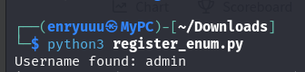

A directory search against the web root didn't turn up anything extra either.

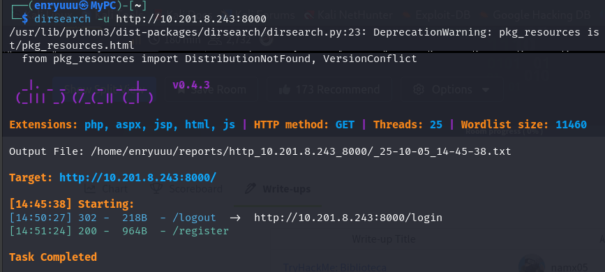

## Phase 3: SQL Injection on the Login Form

With the enumeration angle running dry, I went back to the login form and tried a classic bypass payload in the password field.

> username=admin&password=' OR 1=1 --

That was it. Logged straight in as admin, no valid password required.

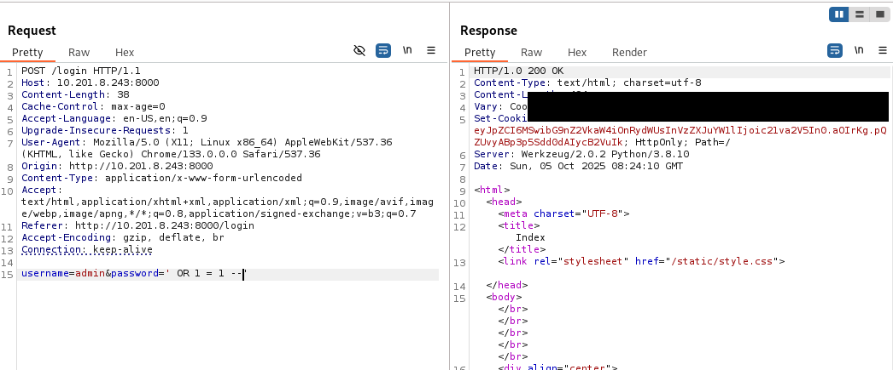

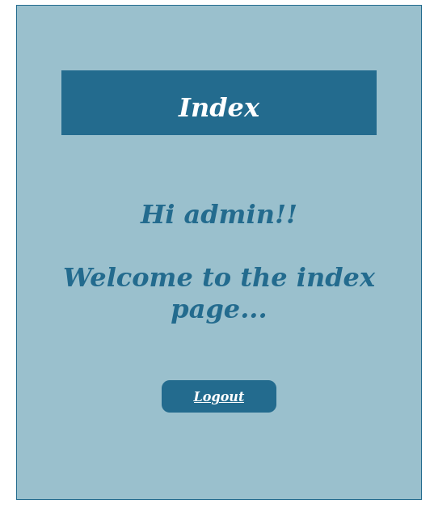

> **Security Issue #2:** SQL Injection Authentication Bypass. The login form builds its database query directly from user input with no sanitization or parameterization, so a crafted payload bypasses authentication entirely.

## Phase 4: Dumping the Database with SQLMap

Getting into the admin dashboard didn't lead anywhere further on its own, but a confirmed injection point is worth more than a dashboard. I saved the raw login request to a file and pointed sqlmap at it.

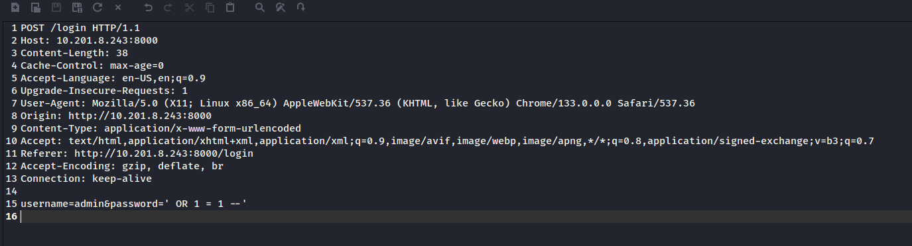

> sqlmap -r biblioteca.txt --dump --batch

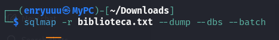

The dump handed over the app's entire users table, including a working set of credentials for a second account.

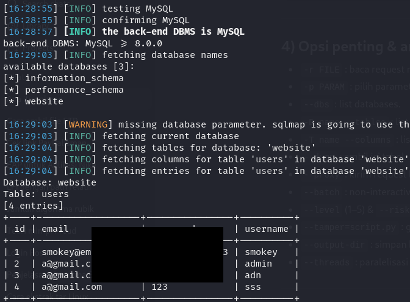

> **Security Issue #3:** Database Credentials Exposed via SQL Injection. Because the login query was injectable, the full users table, including plaintext passwords, could be pulled straight through the same vulnerable field.

## Phase 5: SSH Access as smokey

The credentials from the dump did nothing on the web app itself, so I tried them against SSH instead. They worked.

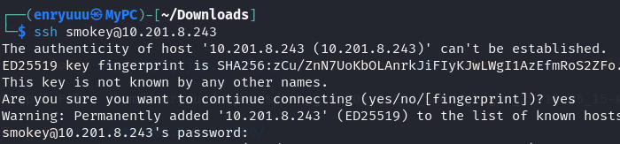

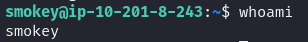

## Phase 6: Switching to hazel and the First Flag

The user flag sat in a different home directory, hazel, which smokey couldn't read.

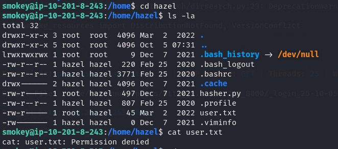

Nothing on the box pointed to hazel's password, so I went for the laziest guess available: the username as the password. It worked, which is a little embarrassing for whoever set up this account.

> **Security Issue #4:** Weak, Guessable Password on a Second Account. The hazel account was protected only by its own username as a password, undoing whatever value the first credential leak should have been limited to.

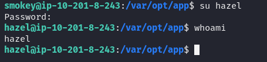

### Flag 1

Inside hazel's home directory, the first flag was right there waiting.

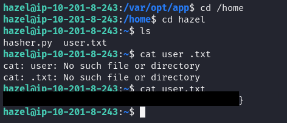

## Phase 7: Privilege Escalation via PYTHONPATH Hijack

Also in hazel's home was a small script, hasher.py, that imports Python's standard hashlib module to hash whatever input it's given.

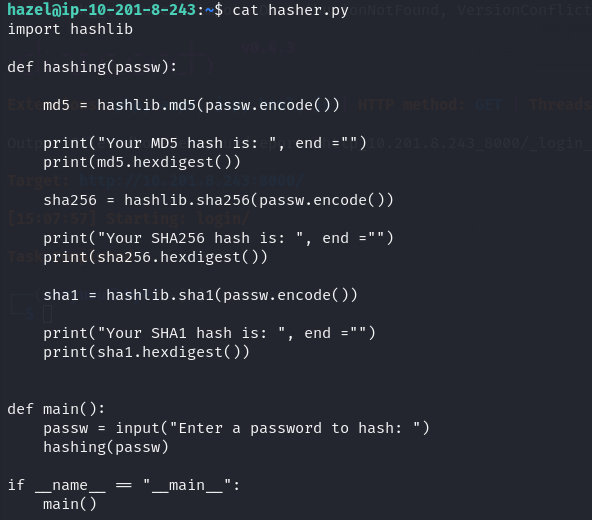

Checking sudo permissions showed hazel could run this exact script as root, and with SETENV allowed on top of that.

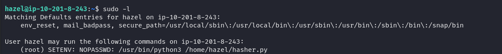

SETENV means hazel can set environment variables for the command before sudo runs it. And since hasher.py imports hashlib without an absolute path, Python will load a file named hashlib.py from anywhere on its module search path, including a directory handed to it through PYTHONPATH.

So I wrote my own hashlib.py in /tmp, loaded with a reverse shell payload from a standard one liner generator.

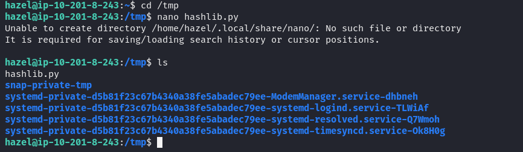

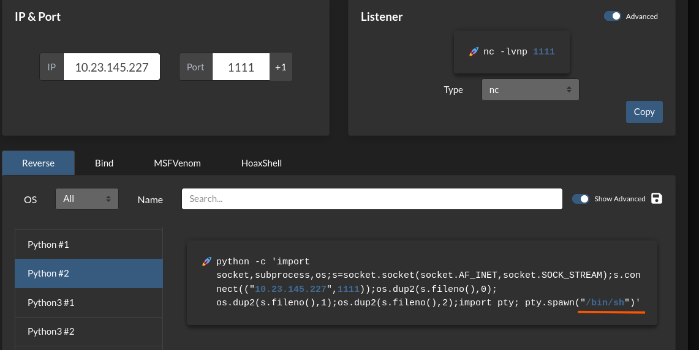

Then ran the sudo command while pointing PYTHONPATH at /tmp, forcing Python to load my fake module instead of the real one.

> sudo PYTHONPATH=/tmp /usr/bin/python3 /home/hazel/hasher.py

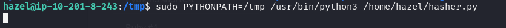

With a listener already up, the shell that came back was root.

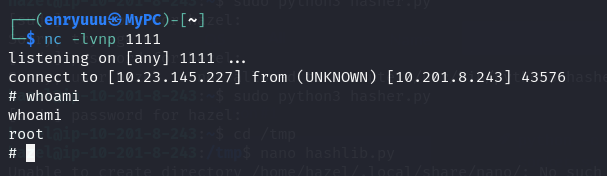

> **Security Issue #5:** Insecure Sudo Rule Allowing Environment Variable Injection. Granting SETENV on a script that imports modules without absolute paths lets a low privilege user control what code actually runs as root, turning a narrow sudo rule into a full compromise.

### Flag 2

whoami confirmed root, and the final flag was sitting in /root.

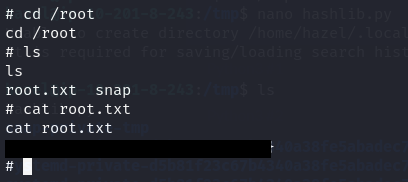

## Blue Team Perspective

### 1. Input Validation on the Login Form

A login field that accepts raw SQL and hands back a valid session should be caught by any code review or automated scan. Fix: parameterized queries or an ORM everywhere user input touches a database call, never string concatenation.

### 2. Silent Confirmation of Existing Usernames

The registration endpoint shouldn't leak whether a username exists. Fix: return the same generic response either way, and rate limit registration attempts.

### 3. Weak and Reused Credential Hygiene

A password that matches its own username shouldn't survive a basic password policy check. Fix: enforce minimum complexity at account creation and run periodic audits against common and default passwords.

### 4. Overly Permissive Sudo Rules

SETENV on a script with unqualified imports is effectively code execution as root. Fix: avoid SETENV unless it's genuinely needed, and make sure anything run under sudo uses absolute imports or runs where PYTHONPATH can't be influenced by the calling user.

---

This write up is part of my ongoing series documenting CTF challenges as I build my portfolio in cybersecurity. I try to look at each box from both the offensive and defensive side, since understanding both is what actually makes a well rounded security person.

If you're also working toward a SOC or Security Engineering role, feel free to connect. Always happy to talk shop or share resources.
