# Blog Writeup

**Machine Name:** Blog  
**Platform:** TryHackMe  
**Difficulty:** Medium

---

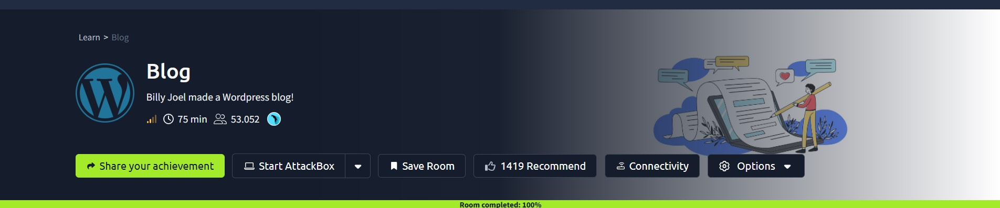

## Introduction

This write-up covers Blog, a medium-difficulty TryHackMe room built around Billy Joel's personal WordPress blog. Nothing here needed a zero-day, and that's what makes it worth writing up. Every step, from finding a working username to sitting at a root shell, came from information the site handed out for free: a name left in a public comment, a password a wordlist could guess in minutes, an outdated plugin with a public exploit sitting in Metasploit, and a SUID binary that trusted an environment variable no attacker needs permission to set.

## Phase 1: Enumeration

Started with a full TCP port scan against the target.

> nmap -p- -sV -sC \<TARGET_IP\>

```
PORT    STATE SERVICE      VERSION
22/tcp  open  ssh          OpenSSH 7.6p1 Ubuntu 4ubuntu0.3 (Ubuntu Linux; protocol 2.0)
80/tcp  open  http         Apache httpd 2.4.29 ((Ubuntu))
|_http-generator: WordPress 5.0
| http-robots.txt: 1 disallowed entry
|_/wp-admin/
|_http-title: Billy Joel's IT Blog – The IT blog
139/tcp open  netbios-ssn  Samba smbd 3.X - 4.X (workgroup: WORKGROUP)
445/tcp open  netbios-ssn  Samba smbd 4.7.6-Ubuntu (workgroup: WORKGROUP)
```

Four ports open. The banner grab already gave away the CMS (WordPress 5.0) and the site title, and `robots.txt` pointed straight at `/wp-admin/` without being asked. SMB was open too, but I never ended up needing it, everything worth finding lived on port 80.

## Phase 2: Finding the Real Site

Visiting the IP directly landed on a generic login page rather than the blog itself.

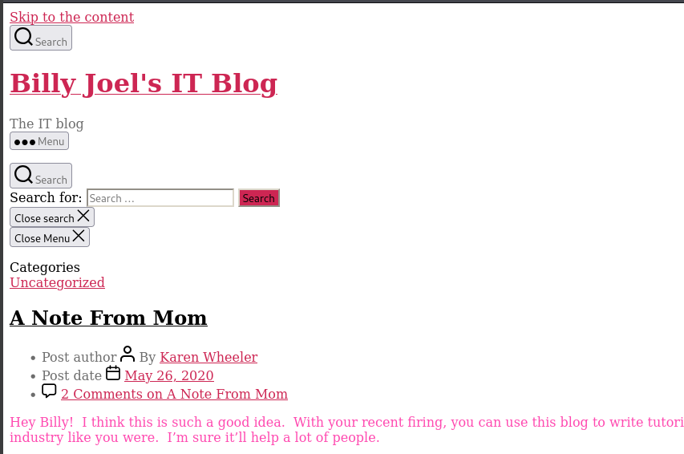
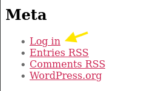

Clicking through redirected to `blog.thm`, which meant the site expected to be reached by hostname.

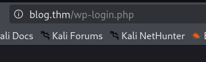

> **Security Issue #1:** Hostname-Dependent Virtual Host. Adding `blog.thm` to `/etc/hosts` and revisiting the IP surfaced the real content: Billy Joel's IT Blog, running on WordPress 5.0.

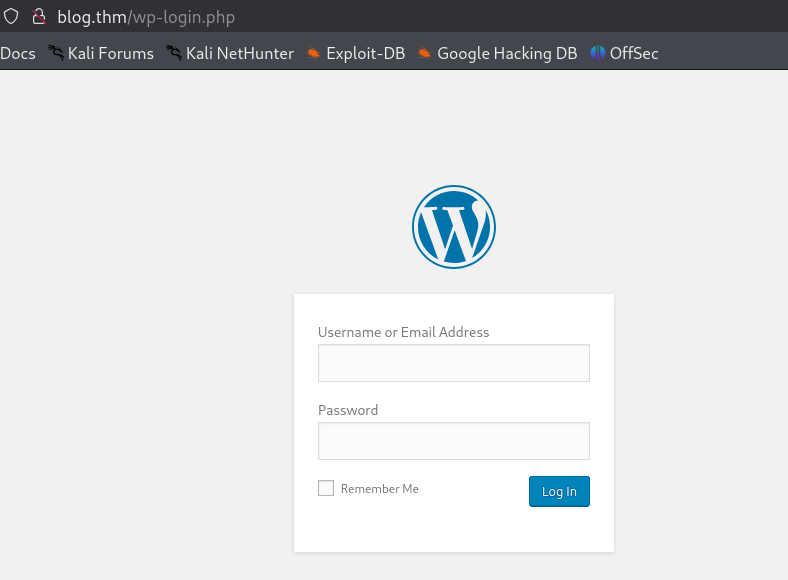

## Phase 3: WPScan and a Wall of Vulnerabilities

With the CMS confirmed, WPScan was the obvious next move.

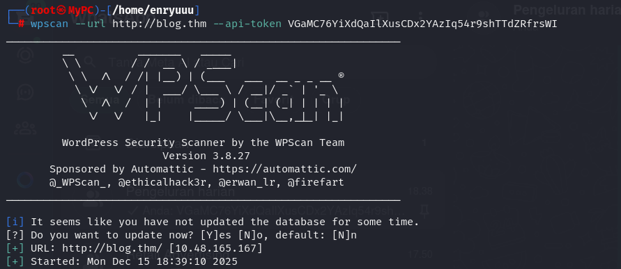
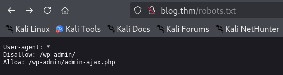

72 potential vulnerabilities came back, tied to the installed plugins and theme. WordPress 5.0 is old enough that pretty much every component had something outstanding against it.

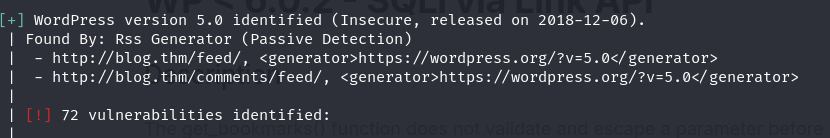

> **Security Issue #2:** Outdated WordPress Core and Plugins. 72 flagged vulnerabilities on a single install is not a shortlist to work through, it is a sign the site was never kept up to date. Any one of them was a plausible way in.

## Phase 4: A Username Hiding in Plain Sight

Browsing the blog's posts and comments turned up a reply from "Karen Wheeler," signed off as Billy's mother, on a post called _A Note From Mom_.

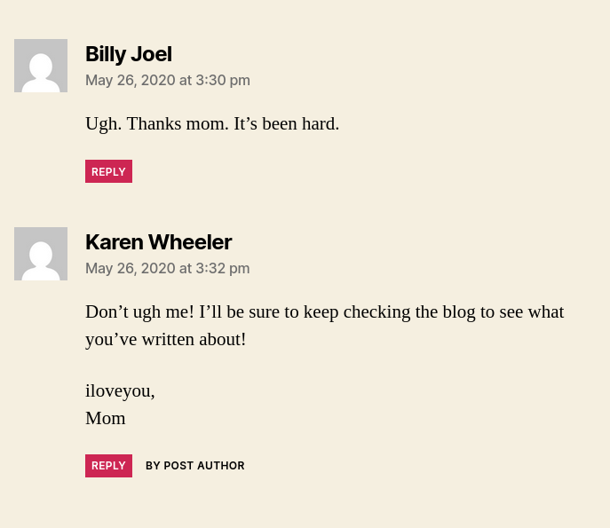

The display name converted cleanly into a likely WordPress login: `kwheel`. No enumeration plugin needed, the username was sitting in a public comment thread.

## Phase 5: Brute Forcing the Login

With a candidate username in hand, the login form was brute forced with Hydra.

> hydra -l kwheel -P /path/to/wordlist blog.thm http-post-form "/wp-login.php:log=^USER^&pwd=^PASS^&wp-submit=Log+In:F=The password you entered for the username"

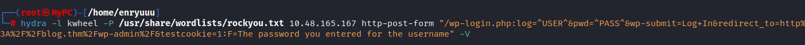

A valid password came back after a few minutes.

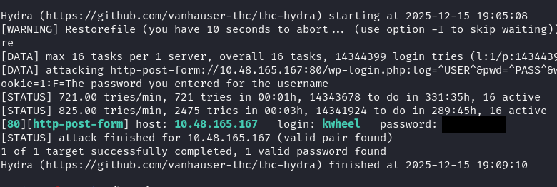

> **Security Issue #3:** Weak, Guessable Password. The account's password wasn't random or complex enough to resist a standard wordlist attack. Logging in confirmed it worked against the live WordPress admin panel.

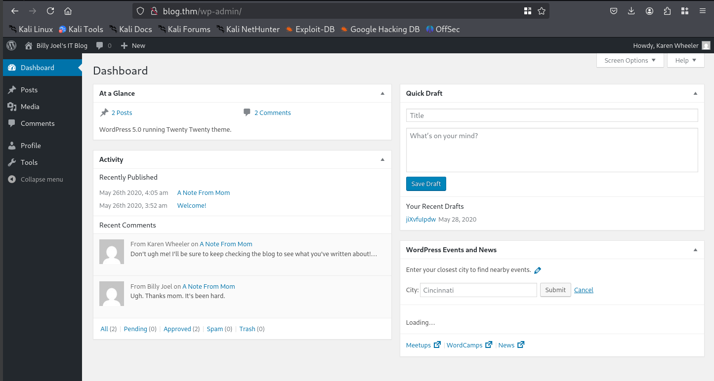

## Phase 6: RCE via a Vulnerable Plugin

Access to the dashboard is useful, but the real win was the plugin behind it. WordPress 5.0 ships with a bundled image-cropping feature affected by a known unauthenticated-to-authenticated RCE (the crop-image vulnerability, exploitable once valid credentials are available). Metasploit had a ready-made module for it.

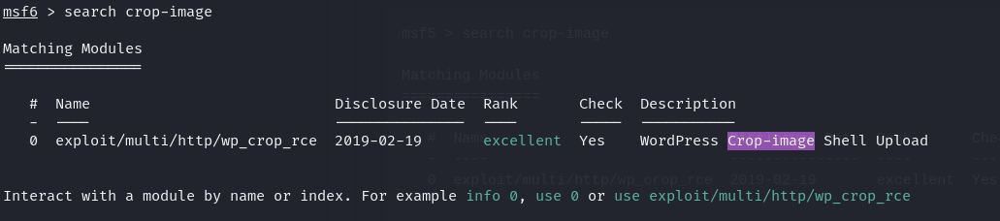

The module was configured with the credentials recovered from Hydra and the target's connection details.

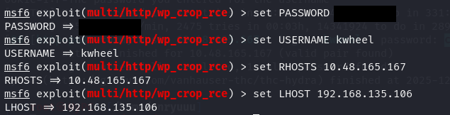

Running it authenticated to WordPress, uploaded a malicious image disguised as a theme asset, and popped a Meterpreter session.

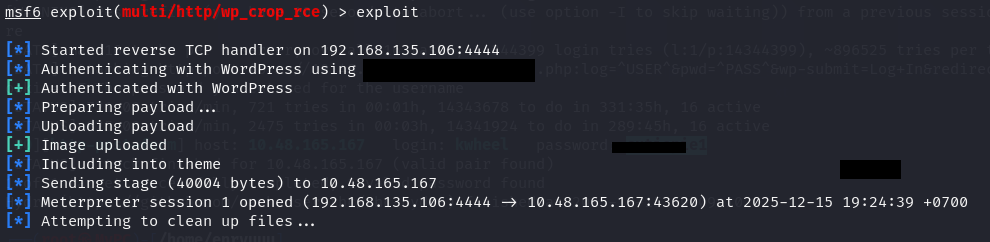

> **Security Issue #4:** Unpatched Plugin RCE Chained From a Single Password. One recovered password was enough to go from "logged into a dashboard" to full remote code execution, because the underlying image-crop feature had a public, weaponized exploit sitting in Metasploit.

## Phase 7: Shell and a Rabbit Hole

Dropping into a shell from the Meterpreter session confirmed low-privilege access as `www-data`.

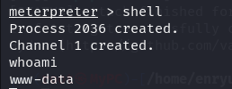

The obvious next move was to check Billy Joel's home directory for a flag.

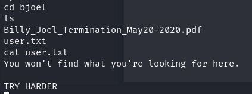

That folder held a PDF and a `user.txt`, but reading it only returned a taunt: _"You won't find what you're looking for here. TRY HARDER."_ A deliberate rabbit hole, the real path forward was elsewhere on the filesystem.

## Phase 8: Privilege Escalation via SUID

A search for SUID binaries turned up the usual system utilities, plus one that didn't belong: `/usr/sbin/checker`.

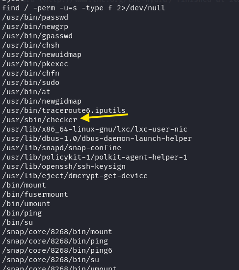

Tracing its execution showed it read an environment variable called `admin` and exited immediately if it wasn't set.

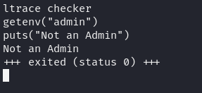

Setting that variable before running the binary was worth a try.

> export admin=1


With `admin=1` in place, the trace showed the binary calling `setuid(0)` and spawning `/bin/bash` directly, no further checks.

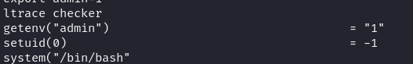

> **Security Issue #5:** SUID Binary Trusting a User-Controlled Environment Variable. A setuid-root binary that branches its privileged behavior on an environment variable the calling user fully controls is a straightforward privilege escalation path, there was nothing left to guess once the check itself was visible.

Running the binary with the variable set dropped straight into a root shell.

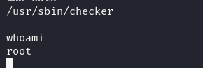

### Flag 1

`/root/root.txt` was readable immediately as root.

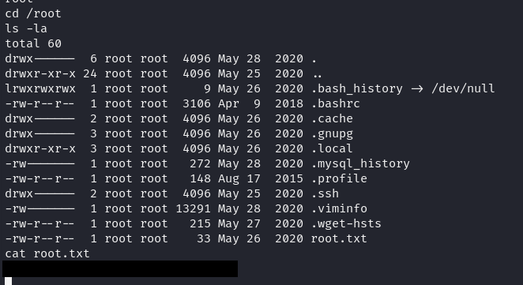

### Flag 2

The second flag wasn't in a typical location. A system-wide search for `user.txt` was needed to track it down.

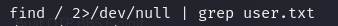

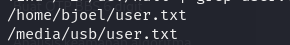

It turned out to be sitting under `/media/usb/`, and reading it closed out the room.

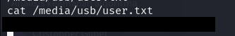

## Blue Team Perspective

Working back through this chain, here's what I think a defensive team would have caught, and where.

### 1. Public Comments Leaking Real Names and Usernames.

A "Karen Wheeler" comment signed as family was enough to derive a working login name. Fix: moderate or anonymize public-facing comments, and never assume a display name won't be reused as a system username.

### 2. No Lockout on Repeated Login Failures.

Hydra ran thousands of attempts against `wp-login.php` without ever being blocked. Fix: rate-limit or lock out accounts after a handful of failed logins, and put a proxy or WAF in front of the login endpoint.

### 3. Outdated WordPress Core and Plugins Left Unpatched.

A wall of 72 flagged vulnerabilities, including a working public RCE exploit, is not a small maintenance gap. Fix: tie WordPress core and plugin updates to a regular patch cycle instead of leaving a 2018-era install running.

### 4. A SUID Binary That Trusts Untrusted Input.

`checker` handed out root to anyone who could set one environment variable. Fix: SUID binaries should never make privilege decisions based on caller-controlled environment variables, and any custom SUID tooling should go through security review before deployment.


This write-up is part of my ongoing series documenting CTF challenges as I build my portfolio in cybersecurity. I approach each challenge from both offensive and defensive perspectives, because understanding both sides is what makes a well-rounded security professional.

If you're also on the journey toward a SOC or Security Engineering role, feel free to connect, I'm always happy to discuss techniques and share resources.
