# Boogeyman 2 Writeup

**Machine Name:** Boogeyman 2  
**Platform:** TryHackMe  
**Difficulty:** Medium

---

## Introduction

This write-up covers my run through Boogeyman 2 on TryHackMe, the sequel to an earlier room where the fictional company Quick Logistics LLC first got hit by the Boogeyman threat group. This time the attacker comes back with a new pretext: a resume submitted to Maxine Beck, an HR specialist at Quick Logistics, for an open IT Analyst role. The resume was never real. Opening it kicked off a chain that ran from a malicious macro, through two more payload stages, to a live command-and-control connection and a scheduled task built for persistence.

I was given two artifacts to work from: the original phishing email and a full memory dump of Maxine's workstation. No live access to the box, no second chances at capturing volatile data — just the .eml file and a .raw memory image, and the job of reconstructing what happened using `olevba`, `strings`, and Volatility 3. Fifteen questions, one attack chain. Here's how it came together.

## Phase 1: Identifying the Phishing Sender

_Objective: confirm the email address the attacker used to deliver the phishing message._

Every investigation like this starts with the header. Opening the `.eml` file in the mail client shows the `From`, `To`, `Subject`, and `Date` fields laid out plainly — no extraction tooling needed for this one, just a careful read.

_The phishing email's header, with the sender address highlighted._

> **Key Finding:** The email came from `westaylor23@outlook.com`, a free, external mailbox posing as an applicant named Wesley Taylor. A legitimate job applicant using a personal Outlook address isn't unusual on its own, but it's the first thread to pull on.

## Phase 2: Identifying the Victim

_Objective: confirm which employee at Quick Logistics received the email._

Same header, different field. The `To` address ties the email directly to a real mailbox inside the company's Microsoft 365 tenant.

_The recipient field, confirming the intended target._

> **Key Finding:** `maxine.beck@quicklogisticsorg.onmicrosoft.com`. Maxine is the HR specialist who handles applications, which makes her an obvious target for a resume-themed lure. Attackers picking on HR isn't random — anyone whose job is to open unsolicited attachments from strangers is a soft entry point almost by design.

## Phase 3: Naming the Malicious Attachment

_Objective: identify the file name of the malicious attachment._

The email body references an attached resume, and the attachment itself is visible right at the bottom of the message.

_The attached file, underlined at the bottom of the email._

> **Key Finding:** `Resume_WesleyTaylor.doc`. The legacy `.doc` format is a deliberate choice here — older Word binary files support VBA macros in a way that's still very much alive as an infection vector, and a resume attachment reads as completely mundane to someone screening job applications.

## Phase 4: Hashing the Malicious Attachment

_Objective: generate a hash of the attachment for identification and future correlation._

With the file saved locally, a quick `md5sum` gives a fingerprint that can be checked against threat intel feeds or reused later in the investigation without second-guessing whether two file references point to the same binary.

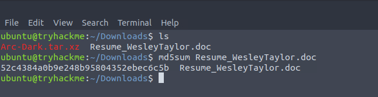

_MD5 hash generated for the saved attachment._

> **Key Artifact:** `52c4384a0b9e248b95804352ebec6c5b`. Small step, but it's the anchor that makes every later reference to "the malicious document" unambiguous.

## Phase 5: Extracting the Stage 2 Download URL

_Objective: recover the URL the document's macro reaches out to for the next stage of the payload._

`.doc` files are OLE containers, and `olevba` (part of the oletools suite) is built specifically to pull VBA macro source out of them without ever opening the document in Word. Running it against the attachment surfaces the full `AutoOpen()` subroutine — the code that fires the moment the file is opened.

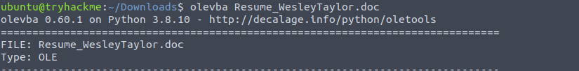

_Kicking off the macro extraction with olevba._

Inside the macro, an `XMLHTTP` object issues a GET request to an external file server, and the response gets written to disk with `Adodb.Stream`.

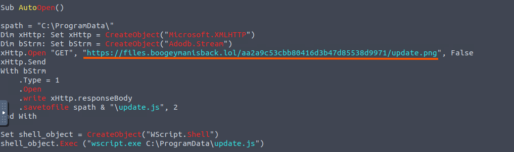

_The macro's download URL, underlined._

> **Key Artifact:** `https://files.boogeymanisback.lol/aa2a9c53cbb80416d3b47d85538d9971/update.png`. Worth noting the `.png` extension — the file being fetched is not an image. That mismatch shows up again a few phases later.

## Phase 6: Identifying the Stage 2 Execution Process

_Objective: determine what process actually ran the downloaded stage 2 payload._

Same macro, further down. Once the download finishes, a `WScript.Shell` object is created and its `Exec` method is called against the saved file.

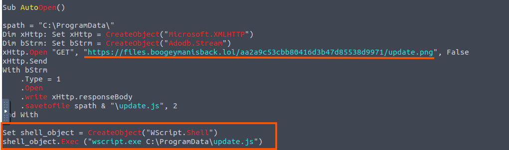

_The Exec call that hands the downloaded file off for execution._

> **Key Finding:** `wscript.exe`. The macro doesn't run the downloaded content directly — it drops it to disk and hands it to the Windows Script Host to execute, a step removed from the Word process itself. That handoff surfaces again once parent-child process relationships get traced in the memory dump.

## Phase 7: Locating the Stage 2 Payload Path

_Objective: recover the full file path of the stage 2 payload on disk._

The macro sets a `spath` variable earlier in the script and reuses it when saving the downloaded content, and the file gets renamed from `.png` to `.js` in the process — the download URL's extension was cosmetic all along.

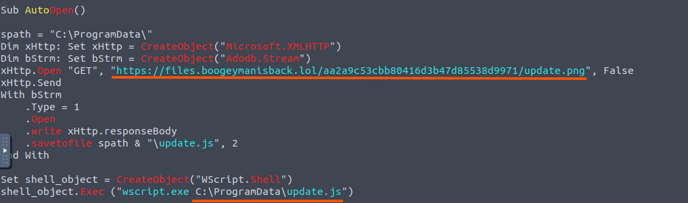

_The save path, combining the spath variable with the .js extension._

> **Key Artifact:** `C:\ProgramData\update.js`. `ProgramData` is a common staging directory for this kind of activity: it's writable, it doesn't usually raise eyebrows during a casual folder browse, and most users never look there.

## Phase 8: Finding the Stage 2 Process ID

_Objective: identify the process ID of the wscript.exe instance that ran the stage 2 payload._

Document analysis only gets you so far — it tells you what should have happened, not what actually did. To confirm execution and pull runtime detail like PIDs, I switched to the memory dump, `WKSTN-2961.raw`, and Volatility 3. The `windows.pslist` plugin walks the memory image and reconstructs the list of processes that were running on the system at capture time.

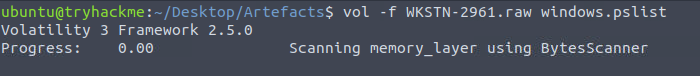

_Kicking off the process list reconstruction._

The output is a full process table: PID, PPID, image name, thread and handle counts, creation time, and more.

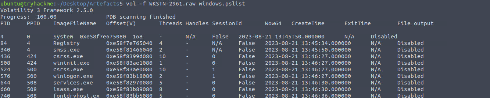

_A slice of the reconstructed process list._

Scrolling further down turns up the process from the macro.

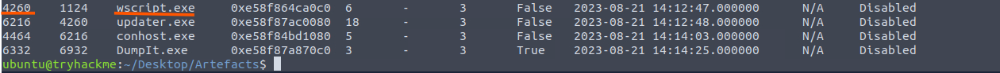

_wscript.exe, sitting alongside updater.exe and conhost.exe further down the table._

> **Key Artifact:** PID `4260`. This confirms `wscript.exe` did run on the box — it isn't just a theoretical outcome inferred from reading macro code, it's a process that was actually alive in memory.

## Phase 9: Tracing the Parent Process

_Objective: identify the parent process ID of the stage 2 execution._

Same table, same row — just reading the column one over from PID.

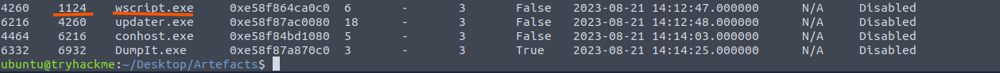

_The parent process ID for wscript.exe, at 1124._

> **Key Finding:** PPID `1124`. That's consistent with the infection chain traced through the document: Word (running as the parent) launched the Windows Script Host as a child process when the macro fired, exactly as the VBA code laid out.

## Phase 10: Recovering the Stage 3 Binary URL

_Objective: find the URL used to download the malicious binary that the stage 2 payload executes._

The `update.js` script pulled down in Phase 7 follows the same download-and-run pattern as the Word macro before it, fetching a payload from the same file server and the same folder — only this time the file being retrieved is a Windows executable rather than a script.

> **Key Artifact:** `https://files.boogeymanisback.lol/aa2a9c53cbb80416d3b47d85538d9971/update.exe`. Reusing the same hosting path across both downloads is a minor inconsistency on the attacker's part, and a useful one: everything pulled down in this incident traces back to one piece of infrastructure.

## Phase 11: Identifying the C2 Process

_Objective: find the process ID of the binary that established the command-and-control connection._

Back in the Volatility process table, the executable from Phase 10 appears under the name `updater.exe`, a small rename that makes it look like a routine Windows or software update process at a glance.

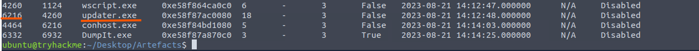

_updater.exe, spawned as a child of wscript.exe._

> **Key Finding:** PID `6216`. Its PPID of `4260` also lines up neatly with the `wscript.exe` PID from Phase 8, keeping the whole chain (Word, script host, downloaded binary) intact and traceable through process lineage alone.

## Phase 12: Locating the C2 Binary Path

_Objective: recover the full file path of the process used to establish the C2 connection._

`windows.dlllist` normally gets used to see which DLLs a process has loaded, but the same output also reports the path to the process's own main executable image, which is what's needed here.

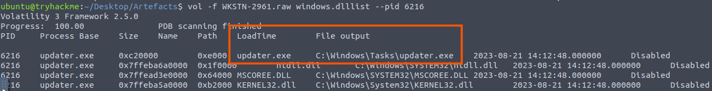

_dlllist output for PID 6216, with the executable's file path highlighted._

> **Key Artifact:** `C:\Windows\Tasks\updater.exe`. The `Tasks` folder is worth flagging on its own: it's the directory Windows uses to store files tied to the Task Scheduler, and that detail pays off in the final phase.

## Phase 13: Uncovering the C2 Server

_Objective: recover the IP address and port of the outbound C2 connection._

`windows.netscan` reconstructs network connection state from the memory image, including sockets that were already closed by the time the dump was captured.

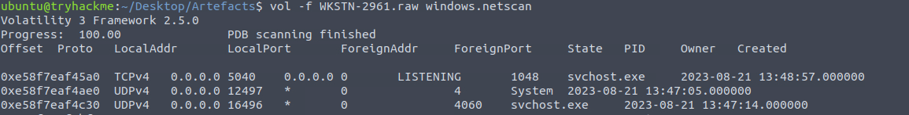

_Running netscan across the full memory image._

Scrolling to the entries tied to `updater.exe` turns up a repeated outbound connection to the same external address.

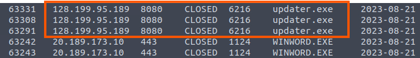

_Three connection records from updater.exe, all pointing to the same IP and port._

> **Key Artifact:** `128.199.95.189:8080`. Port 8080 is a common choice for C2 traffic precisely because it's plausible as legitimate web traffic on a casual glance, without drawing the attention that an unusual high port might.

## Phase 14: Recovering the Attachment Path from Memory

_Objective: confirm the full file path of the malicious email attachment as recorded in memory._

`windows.filescan` scans the memory image for file objects — anything that was open, cached, or still resident in RAM at capture time. With the file name already known from Phase 3, piping the output through `grep` cuts straight to the relevant entries.

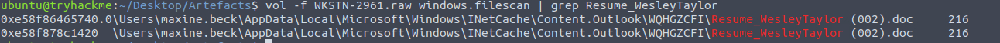

_Two file records for the resume attachment, both under Outlook's local cache._

> **Key Artifact:** `C:\Users\maxine.beck\AppData\Local\Microsoft\Windows\INetCache\Content.Outlook\WQHGZCFI\Resume_WesleyTaylor (002).doc`. This is Outlook's own local cache path for a viewed attachment, which independently corroborates that Maxine's mailbox is where the document was opened.

## Phase 15: Extracting the Persistence Command

_Objective: recover the full command the attacker used to plant a scheduled task for long-term access._

Every scheduled task creation on Windows goes through `schtasks.exe`, no matter what's driving it under the hood. That makes it a reliable string to filter for, so I ran `strings` against the raw memory dump and grepped for `schtasks`.

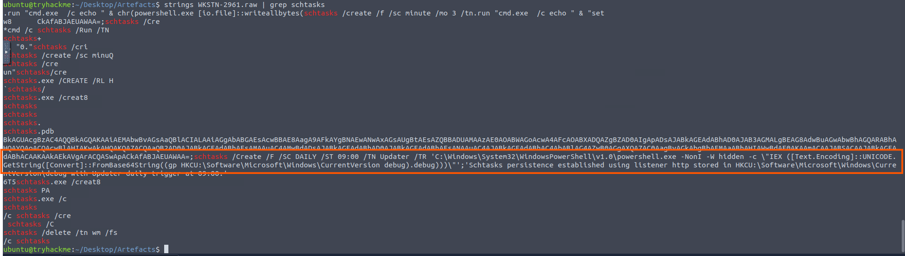

_The full scheduled task command, buried among dozens of partial schtasks fragments in memory._

> **Key Artifact:** `schtasks /Create /F /SC DAILY /ST 09:00 /TN Updater /TR 'C:\Windows\System32\WindowsPowerShell\v1.0\powershell.exe -NonI -W hidden -c \"IEX ([Text.Encoding]::UNICODE.GetString([Convert]::FromBase64String((gp HKCU:\Software\Microsoft\Windows\CurrentVersion debug).debug)))\"'`. This task runs daily at 09:00, launching PowerShell in hidden mode to read a Base64 blob out of a registry value (`HKCU:\Software\Microsoft\Windows\CurrentVersion\debug`), decode it, and execute it in memory with `IEX`. No second-stage file ever touches disk again after this point. The payload lives entirely in the registry, which is the kind of persistence a casual antivirus sweep of the filesystem will walk right past.

## Reconstructed Attack Chain

Put together, the fifteen answers line up into a single narrative:

1. The attacker, posing as job applicant "Wesley Taylor," sent a resume-themed phishing email from `westaylor23@outlook.com` to HR specialist `maxine.beck@quicklogisticsorg.onmicrosoft.com`.
2. The attachment, `Resume_WesleyTaylor.doc`, carried a malicious VBA macro that fired automatically on open.
3. That macro downloaded a stage 2 payload disguised as an image (`update.png`) and saved it to `C:\ProgramData\update.js`, then handed it off to `wscript.exe` (PID 4260, spawned from Word under PPID 1124) for execution.
4. The stage 2 script pulled down a third payload — `update.exe` — from the same hosting path, and executed it as `updater.exe` (PID 6216) from `C:\Windows\Tasks\`.
5. `updater.exe` opened an outbound connection to `128.199.95.189:8080`, giving the attacker live command-and-control over the compromised workstation.
6. Outlook's local cache independently confirmed the attachment had been opened from Maxine's mailbox, storing a copy under her `INetCache` folder.
7. To survive a reboot, the attacker registered a daily scheduled task named `Updater` that runs hidden PowerShell, decoding and executing a payload stored directly in a registry value rather than on disk.

This write-up is part of my ongoing series documenting CTF challenges as I build my portfolio in cybersecurity. Boogeyman 2 leaned more on document and memory forensics than the log-search rooms I've covered before, and reconstructing the same chain of events from two completely different artifacts (the email and the memory dump) was a good reminder of how often independent evidence sources end up telling the same story from different angles.

If you're also on the journey toward a SOC or Security Engineering role, feel free to connect — I'm always happy to discuss techniques and share resources.
