# Bookstore Writeup

**Machine Name:** Bookstore  
**Platform:** TryHackMe  
**Difficulty:** Medium

---

## Introduction

Bookstore is a medium difficulty TryHackMe room built around a small online bookstore backed by a separate REST API. On the surface it looks like two unrelated services: a static website on port 80 and a Flask API on port 5000. In practice the two are connected. A hint left inside the website's own JavaScript points straight at an older, unprotected version of the API, and that older version is where the whole chain starts.

There is no single flashy exploit here. Instead, one enumeration mistake (an old API version still answering requests) leads into a file read bug, the file read bug leaks a secret meant to stay server side, and that secret unlocks a debugging feature that was never meant to face the internet. From there it is a short walk to a shell, and a short reverse engineering exercise to root.

## Phase 1: Enumeration

Started with a full TCP port scan against the target.

> nmap -p- -sV -sC \<TARGET_IP\>

Three ports came back open: SSH on 22, a standard Apache web server on 80, and a second web service on 5000 running Werkzeug, the development server that ships with Flask.

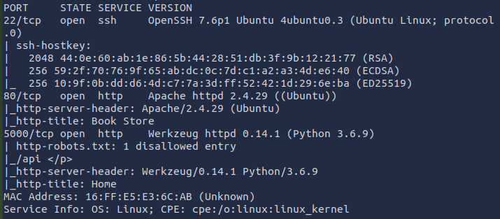

Port 80 served a themed "Book Store" front end, while port 5000 answered with a plain page describing itself as the store's own REST API.

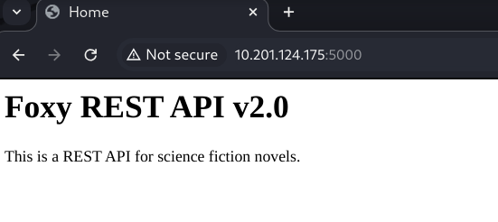

## Phase 2: Mapping the Web and API Surface

A directory scan against port 80 turned up a handful of static pages and an exposed assets folder.

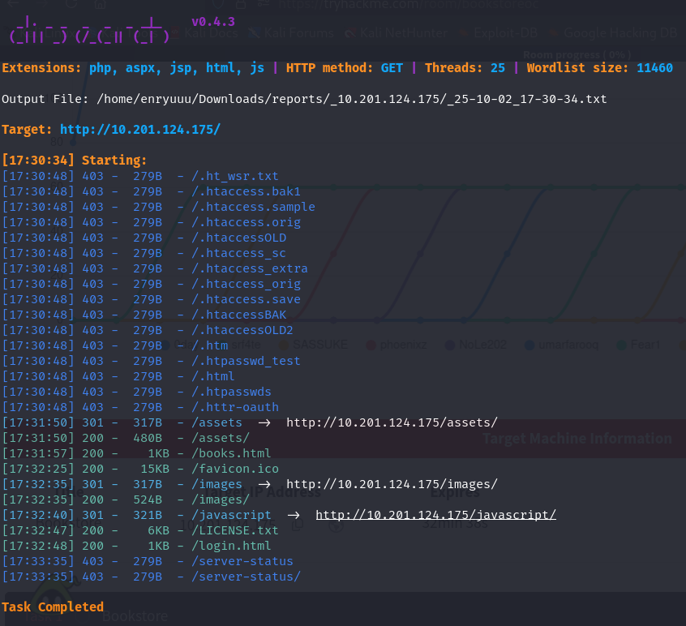

Browsing the open `/assets` directory led to `js/api.js`, the script responsible for pulling book data into the site. Reading it was worth the detour: the code calls a v2 API endpoint, and sitting right underneath it is a developer comment stating that the previous version of the API had a parameter vulnerable to local file inclusion, and that the issue was supposedly fixed in the new version.

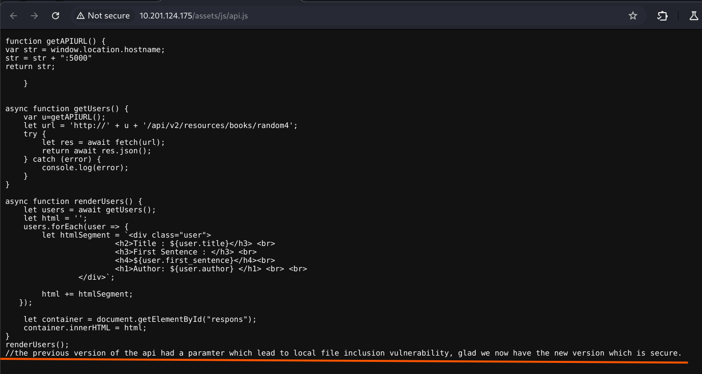

That comment is basically a signpost pointing back at the old v1 API, and a good reminder that "we fixed it in the new version" only counts if the old version actually got taken down.

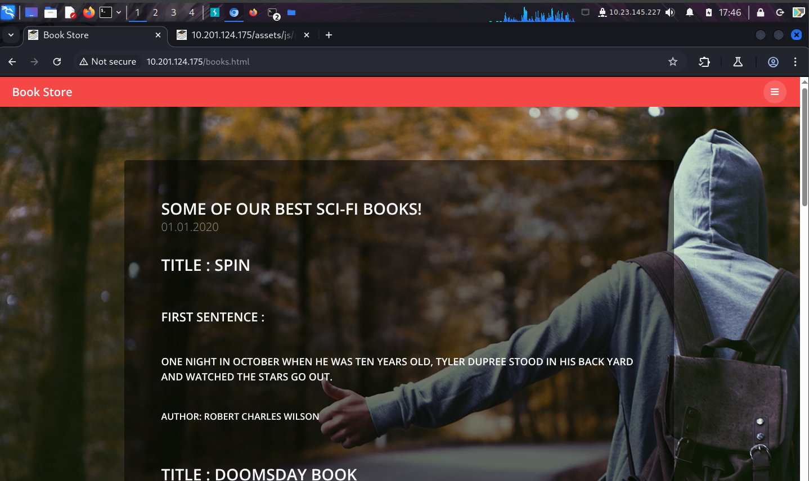
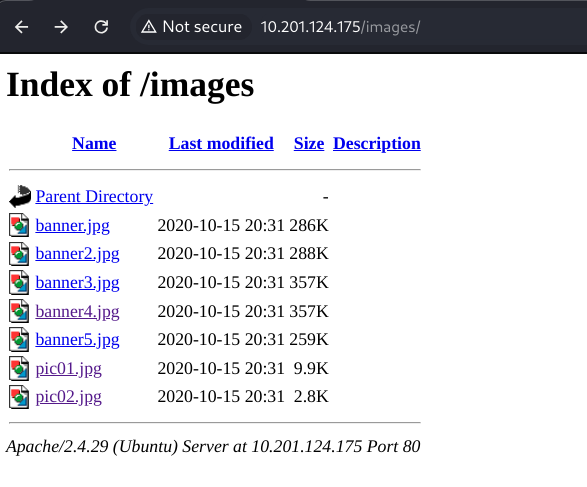
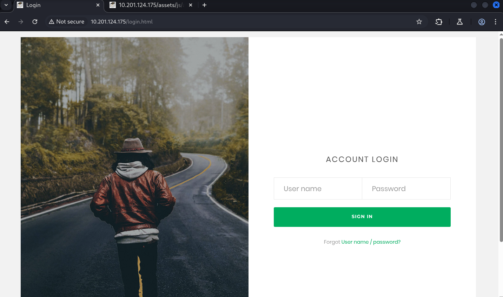

A separate scan against port 5000 confirmed the API itself, an interactive `/console` endpoint, and a `robots.txt` disallowing `/api`, which is usually a good sign that something interesting lives there.

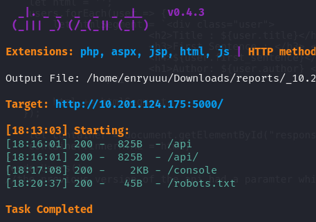
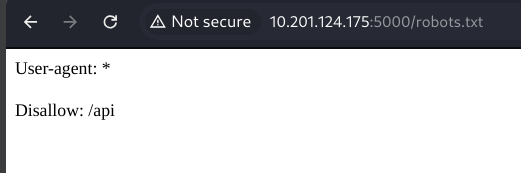

The API's own documentation page listed every supported route on the current v2 version, including endpoints to search books by id, author, or year.

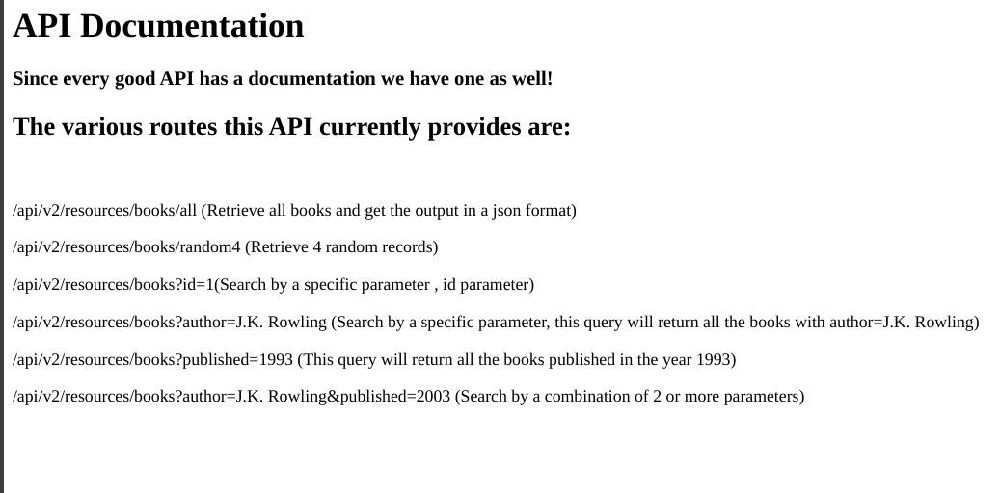

The `/console` route rendered Werkzeug's interactive debugger, locked behind a PIN.

> **Security Issue #1:** Sensitive Debug Interface Exposed to the Network. Flask's Werkzeug debugger is a development tool that allows arbitrary Python execution once unlocked. It should never be reachable outside a local development machine, let alone left running against a production style deployment.

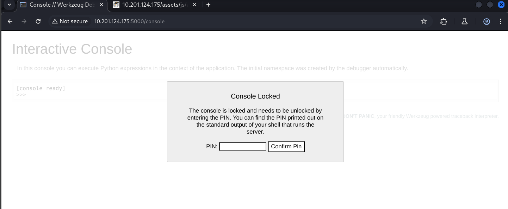

## Phase 3: Local File Inclusion in the Legacy API

With the v2 documentation in hand and a comment pointing at a vulnerable v1, fuzzing the old version's query parameters was the obvious next step.

> wfuzz -u http://\<TARGET_IP\>:5000/api/v1/resources/books?FUZZ=../../../etc/passwd -w /usr/share/wordlists/dirbuster/directory-list-2.3-medium.txt

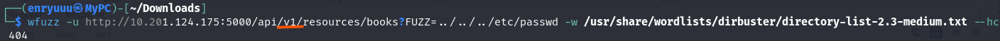

The fuzz found a parameter called `show` that returned a `200` response.

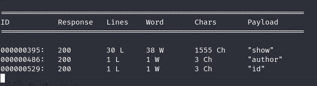

Sending that parameter a path traversal payload confirmed the local file inclusion by reading `/etc/passwd` straight off the server.

> GET /api/v1/resources/books?show=../../../etc/passwd

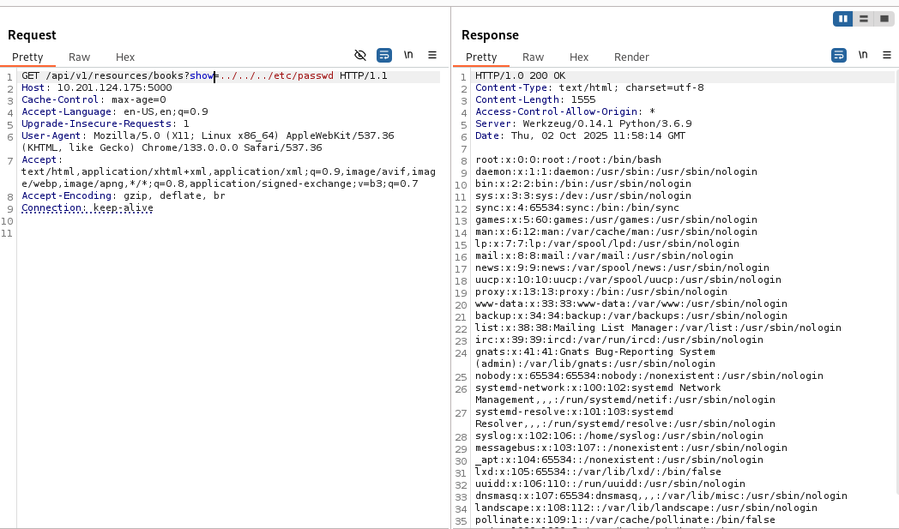

## Phase 4: A Leaked Debug Secret

An arbitrary file read is only as useful as the files it can reach. Pivoting the same parameter toward the shell history of the API's own user, `.bash_history`, returned something far more useful than another system file: the exact environment variable the developer used to unlock the debugger, `WERKZEUG_DEBUG_PIN`, sitting in plaintext.

> GET /api/v1/resources/books?show=.bash_history

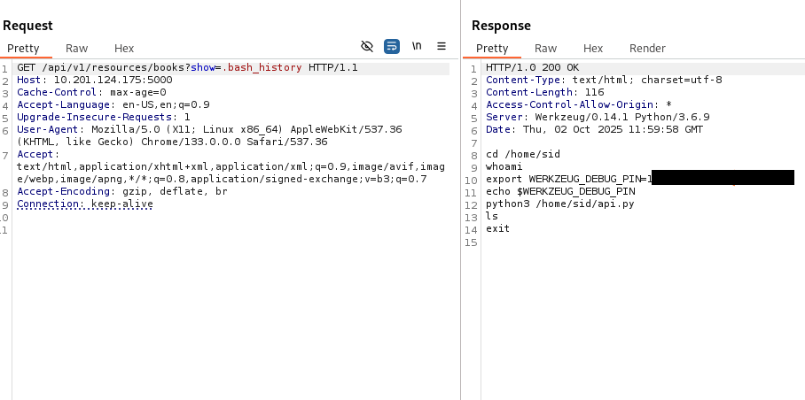

> **Security Issue #2:** Debug Secret Committed to Shell History. A secret meant to gate a powerful debugging feature was exported in a normal shell session and never cleared from `.bash_history`. Combined with the file inclusion bug, that one line of history was enough to bypass the PIN entirely.

## Phase 5: Remote Code Execution via the Werkzeug Console

With the PIN in hand, the locked console at `/console` opened straight into a live Python interpreter running in the context of the Flask application.

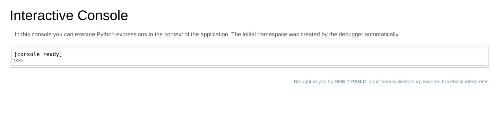
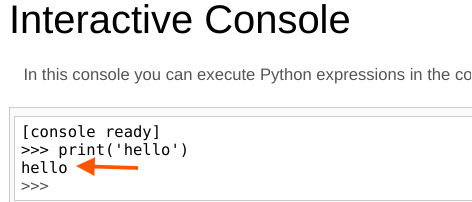

> **Security Issue #3:** Local File Inclusion Chained Into Remote Code Execution. On its own, a file read is annoying. A debug console with a PIN is annoying too. Put them next to each other and an unauthenticated attacker walks away with full code execution. Neither finding looks critical in isolation, which is exactly why it is worth checking what else a bug can reach before rating it "low."

## Phase 6: Reverse Shell and the First Flag

The console accepts arbitrary Python, so a one liner reverse shell payload was enough to get an interactive session back.

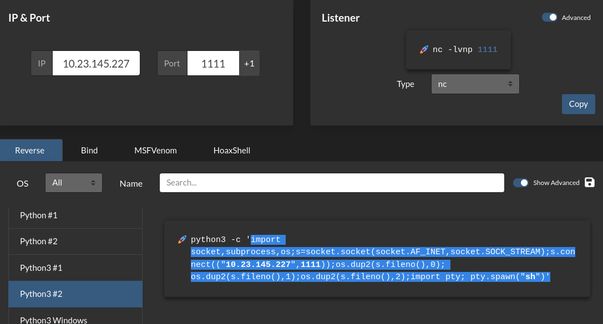

With a listener running, the callback landed as the `sid` user.

> nc -lvnp 1111

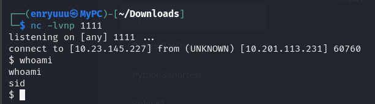

### Flag 1

`user.txt` was sitting in `sid`'s home directory alongside the API source and a curious SUID binary named `try-harder`.

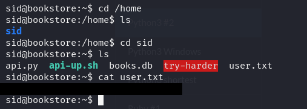

## Phase 7: Privilege Escalation

Listing the home directory showed `try-harder` owned by root with the SUID bit set. Running it just asks for a number and rejects the wrong guess.

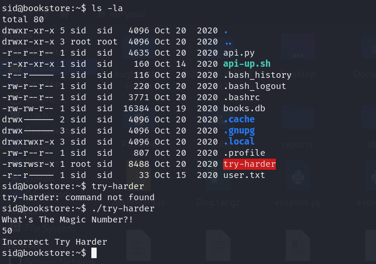

Pulling the binary down and reverse engineering it in Ghidra showed the logic behind that prompt. The program reads an integer, XORs it against two hardcoded constants, and compares the result to a fixed target value. Match it, and the binary drops straight into a root shell via `setuid(0)` followed by `system("/bin/bash -p")`.

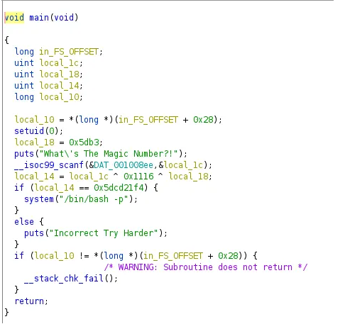

Solving the equation for the expected input recovered the value **1573743953**. Feeding that number back into the binary popped a root shell immediately.

> **Security Issue #4:** SUID Binary With Reversible Logic. Gatekeeping a root shell behind a simple, reversible XOR check is functionally equivalent to hardcoding the password in plaintext. Any local user able to pull the binary off the box can recover the "magic number" with a decompiler in a few minutes.

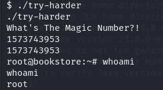

### Flag 2

`root.txt` closed the room out.

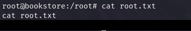

## Blue Team Perspective

Working back through this chain, here is what a defensive team could have caught, and where.

### 1. Retire Old API Versions Instead of Leaving Them Reachable

A v2 API existed specifically because the v1 parameter handling was unsafe, yet v1 was still live and unauthenticated. Fix: decommission or firewall off deprecated API versions the moment a replacement ships, and verify with a scan rather than assuming the old routes are gone.

### 2. Never Expose the Werkzeug Debugger Outside Development

An interactive Python console reachable from the internet is remote code execution waiting for a PIN. Fix: disable debug mode entirely in any deployment reachable outside a developer's own machine, and treat `/console` style endpoints as a critical finding on sight.

### 3. Keep Secrets Out of Shell History and Environment Exports

Exporting a sensitive PIN in an interactive shell left it permanently readable in `.bash_history`. Fix: use a secrets manager or a `.env` file excluded from version control and logs, and periodically audit history files on servers for leftover credentials.

### 4. Do Not Gate Privilege Escalation Behind Reversible Logic

A SUID binary that can be decompiled and solved in minutes offers no real protection. Fix: avoid custom "magic number" checks entirely, rely on proper `sudo` rules with least privilege, and audit SUID binaries on production hosts regularly.

---

This write up is part of my ongoing series documenting CTF challenges as I build my portfolio in cybersecurity. I approach each challenge from both offensive and defensive perspectives, because understanding both sides is what makes a well rounded security professional.

If you are also on the journey toward a SOC or Security Engineering role, feel free to connect. I am always happy to discuss techniques and share resources.
