# Bounty Hacker Writeup

**Machine Name:** Bounty Hacker  
**Platform:** TryHackMe  
**Difficulty:** Easy

---

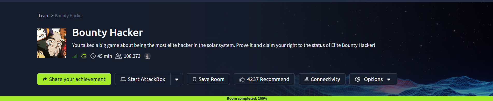

## Introduction

Bounty Hacker is an easy-difficulty TryHackMe room wrapped in a Cowboy Bebop themed briefing: track down a bounty hiding somewhere on the target machine. The framing is playful, but the vulnerabilities behind it are ordinary ones that show up in real environments all the time. A file server that talks to anyone who asks, a password that turns up in a small custom wordlist, and a sudo rule that was scoped a little too generously.

None of these issues is advanced on its own. What makes the room work is the order they fall in: the FTP server hands over a username and a wordlist, the wordlist cracks the SSH login, and the SSH session leads straight to a sudo rule that hands over root. Three small oversights, chained end to end, are enough to fully compromise the box, and it is a fair reminder that in a real assessment, the fastest way in is rarely a clever exploit. It is usually just a door nobody bothered to close.

## Phase 1: Enumeration

Started with a full TCP port scan against the target.

> nmap -p- -sV -sC \<TARGET_IP\>

Three ports came back open:

| Port | Service | Version                |
| ---- | ------- | ---------------------- |
| 21   | FTP     | vsftpd 3.0.5           |
| 22   | SSH     | OpenSSH 8.2p1 (Ubuntu) |
| 80   | HTTP    | Apache 2.4.41 (Ubuntu) |

The FTP banner already stood out. Nmap's script scan flagged anonymous login as allowed on port 21, which meant the file server would let anyone in without a single credential. The web server on port 80 only served a static, themed splash page with no further content, and the SSH service was a stock OpenSSH install with nothing unusual in its banner.

With anonymous FTP access confirmed as a possibility, that became the obvious next step rather than the web server.

## Phase 2: Anonymous FTP Access

Connecting to the FTP service and logging in with the username "anonymous" and a blank password worked immediately.

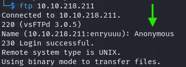

> **Security Issue #1:** Anonymous FTP Login Enabled. Anonymous access is meant for public file drops, not for a server that also stores internal notes. Leaving it turned on here handed over two files that should never have been reachable without a login.

A directory listing showed two small files sitting in the FTP root.

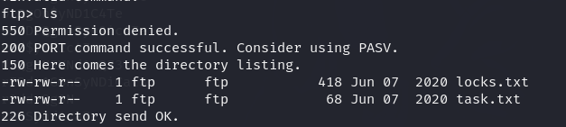

Both were pulled down with `get`.

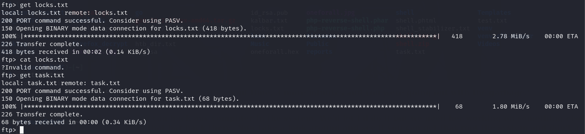

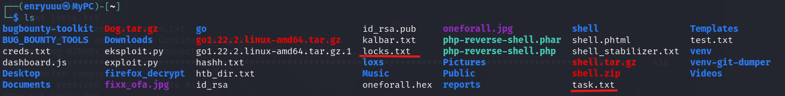

`task.txt` turned out to be a short to-do note, signed off with a name at the bottom:

```
1.) Protect Vicious.
2.) Plan for Red Eye pickup on the moon.
-lin
```

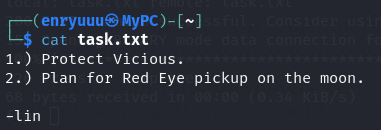

That signature was the first real lead: a likely username, "lin", for whatever login the box expected next.

`locks.txt` was a list of password-like strings, all variations on the same theme.

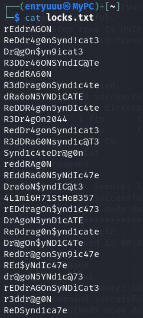

On its own it didn't confirm anything. But paired with a username, it was obviously meant to be used as a small, hand-built wordlist rather than something generic like rockyou.txt.

## Phase 3: Web Directory Enumeration

Before committing to the FTP lead, the web server got a quick content-discovery pass to rule out any other angle.

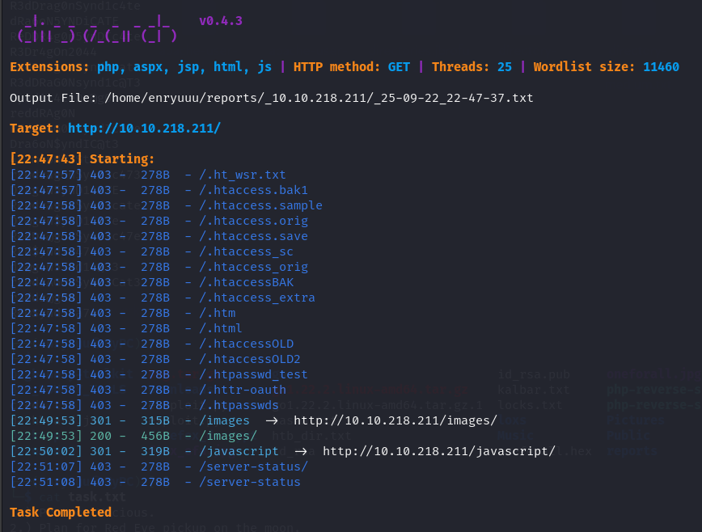

The scan turned up an `/images` directory holding a single themed picture and nothing else of substance.

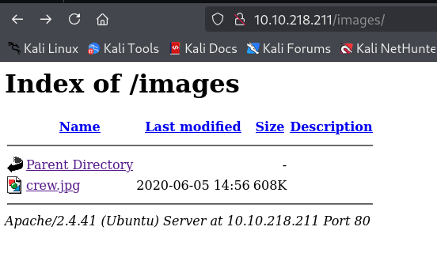

A dead end, but worth ruling out before doubling back to the FTP findings.

## Phase 4: Cracking SSH via Wordlist

With a username from `task.txt` and a password list from `locks.txt`, SSH was the obvious next target.

> hydra -l lin -P locks.txt \<TARGET_IP\> ssh

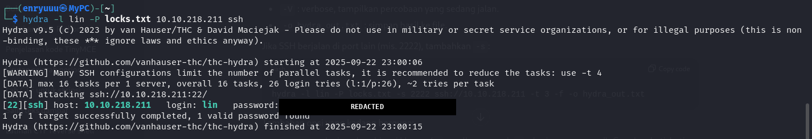

The very first pass turned up a working combination: username `lin`, with a valid password pulled straight out of the wordlist.

> **Security Issue #2:** Weak, Wordlist-Crackable Password. The account's password was one of only a couple dozen close variations of the same word and pattern, small enough that an off-the-shelf brute-force tool solved it in seconds. A password that predictable offers almost no real protection once an attacker has any hint about its shape.

## Phase 5: Initial Access and First Flag

The recovered credentials logged straight into the box over SSH.

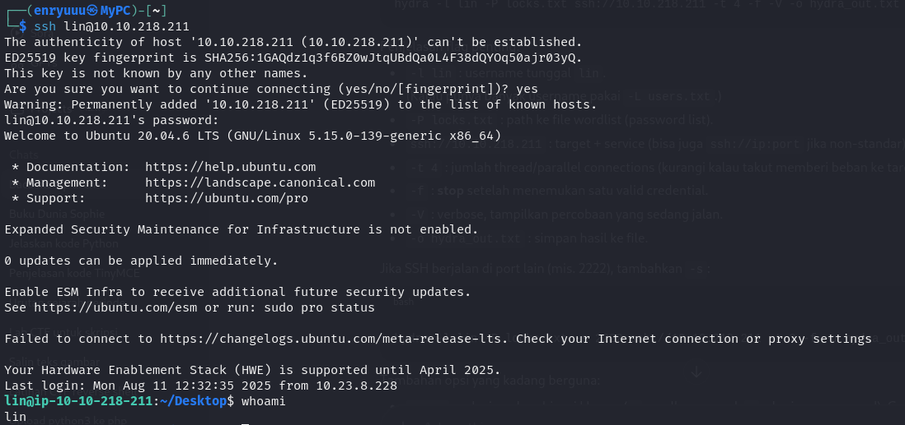

### First flag

From the home directory, `user.txt` gave up the first flag.

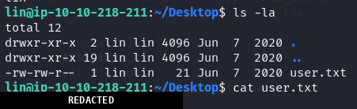

## Phase 6: Privilege Escalation

A quick permissions check was the natural next step.

> sudo -l

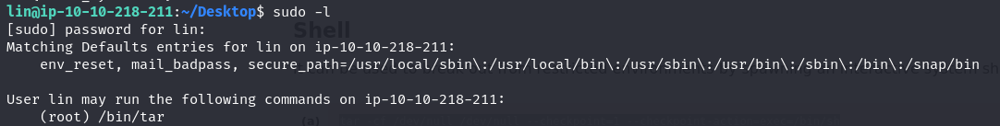

The account was allowed to run `/bin/tar` as root with no restrictions. `tar` is a well-known entry on GTFOBins, the community-maintained list of Unix binaries that can be abused to break out of a restricted shell or escalate privileges when sudo rules allow them to run unchecked.

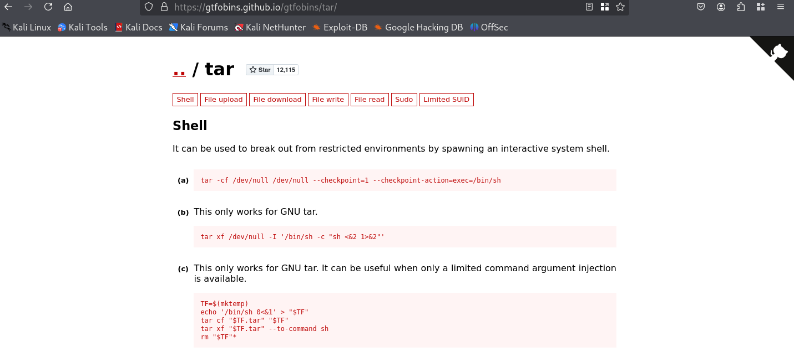

Running the documented GTFOBins command for `tar` spawned a shell running as root.

> sudo tar -cf /dev/null /dev/null --checkpoint=1 --checkpoint-action=exec=/bin/sh

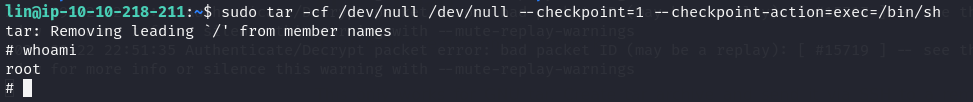

> **Security Issue #3:** Overly Permissive Sudo Rule. Granting sudo access to a binary like `tar`, with no argument restrictions, is functionally the same as granting full root access. Many everyday Unix tools carry a documented escape hatch just like this one, so any sudo rule needs to be checked against that risk before it's approved.

### Second flag

From an anonymous FTP login to full root, in six commands, that's about as fast as a box can fall. `root.txt` closed out the room.

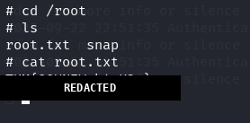

## Blue Team Perspective

Working back through this chain, here's what I think a defensive team would have caught, and where.

### 1. Anonymous FTP Left Enabled

An FTP service accepting anonymous logins is a finding any basic service scan would flag immediately. Fix: disable anonymous access unless a service genuinely requires public, unauthenticated file sharing, and never store internal notes or credential material on a share reachable that way.

### 2. Weak, Predictable Password

A password that falls within the first few dozen guesses of a small custom wordlist would not survive a routine credential audit. Fix: enforce a real password policy, add account lockout or rate-limiting on SSH (e.g. fail2ban) to slow down brute-force attempts, and prefer key-based authentication over passwords where possible.

### 3. Sudo Rule Too Broad

A sudo entry for a general-purpose binary like `tar`, `vim`, or `find` should be treated as a red flag during any access review, since GTFOBins documents an escape path for most of them. Fix: scope sudo rules to the narrowest command and argument set that the task actually needs, and audit the sudoers file regularly against known GTFOBins entries.


This write-up is part of my ongoing series documenting CTF challenges as I build my portfolio in cybersecurity. I approach each challenge from both offensive and defensive perspectives, because understanding both sides is what makes a well-rounded security professional.

If you're also on the journey toward a SOC or Security Engineering role, feel free to connect, I'm always happy to discuss techniques and share resources.
