# Cheese CTF Writeup

**Machine Name:** Cheese CTF  
**Platform:** TryHackMe  
**Difficulty:** Easy

---

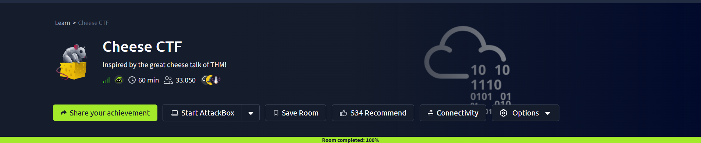

## Introduction

Cheese CTF is an easy-rated TryHackMe room, but "easy" here means the path is well signposted, not that it's short. Getting from the front page to root touches five different weaknesses, and each one hands you the key to the next.

The theme is a small online cheese shop. Behind the friendly storefront is a login form that trusts user input far too much, a script that will read almost any file you name, and a server whose SSH and sudo setup quietly undoes everything else. No single bug here is exotic. What makes the room worth writing up is how neatly the mistakes stack on top of each other.

I worked it from both sides: the offensive steps to get in, and a short blue-team read at the end on where a defender would have caught each move.

## Phase 1: Enumeration

Every box starts the same way, with a full port scan.

> nmap -p- -sV -sC <TARGET_IP>

I used `-p-` to sweep all 65,535 ports instead of the default top thousand, then let Nmap's scripts and version detection fill in the details. The web service was the way in, so I opened the site in a browser.

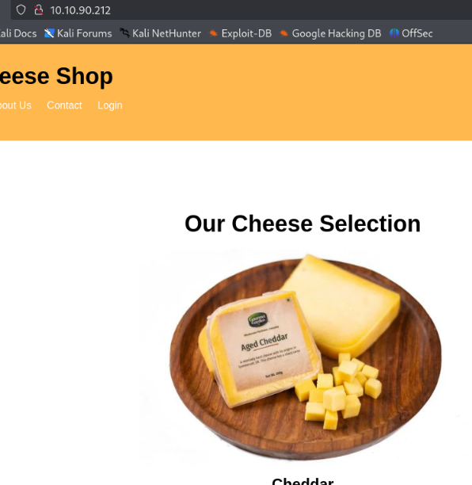

The homepage is a plain shop front for "The Cheese Shop." Nothing clickable stood out, so I checked the page source. That's where the first thread showed up.

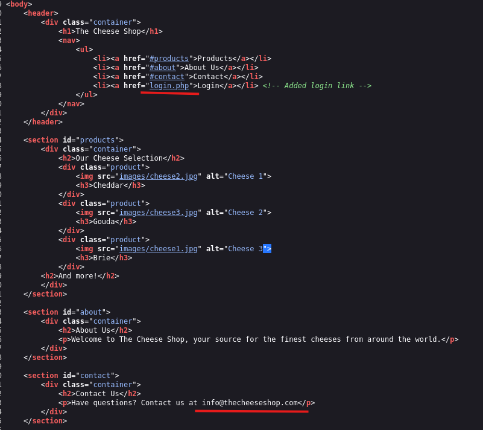

Tucked inside an HTML comment was a login link (`login.php`) that the normal menu never shows, along with a contact email. A hidden login page is exactly the kind of thing worth pulling on.

## Phase 2: Content Discovery

Before touching the login, I ran a directory scan to map what else was reachable.

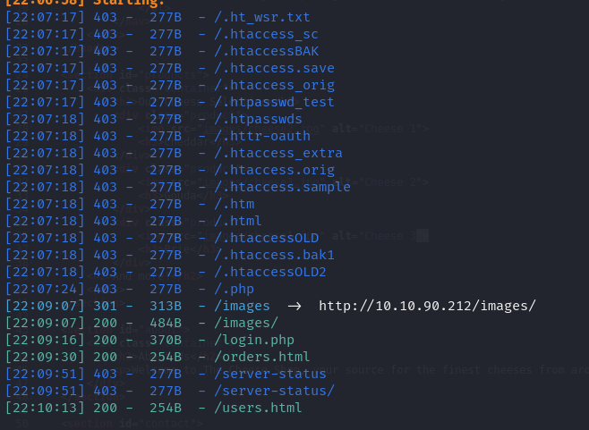

That turned up a handful of live paths: an `/images` directory with listing left on, the `/login.php` form, and static `/orders.html` and `/users.html` pages.

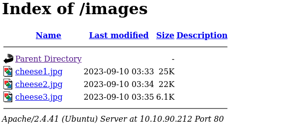
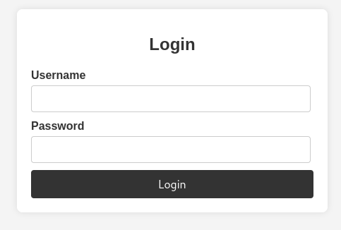
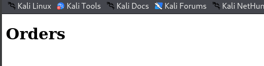

## Phase 3: SQL Injection Login Bypass

The login form was the obvious target. Rather than guess passwords, I tested whether it was building its SQL query straight from my input.

> ' || 1=1; -- -

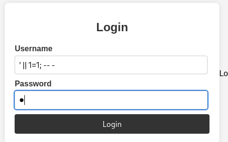

It was. The payload turns the password check into a condition that's always true and comments out the rest of the query, so the database hands back a valid user without a real password. That dropped me onto a hidden admin page, `secret-script.php`, serving `supersecretadminpanel.html`.

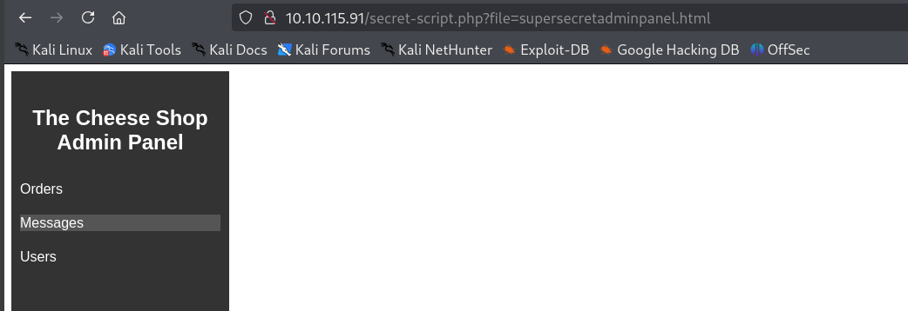

> **Security Issue #1:** SQL Injection Auth Bypass. The login form drops raw input into its query, so a single line walks past authentication. Parameterized queries would have stopped this.

## Phase 4: Local File Inclusion

The admin script loaded its pages through a `file` parameter in the URL. Any time a filename comes from the user, it's worth checking whether the app will read files it shouldn't.

> /secret-script.php?file=../../../../etc/passwd

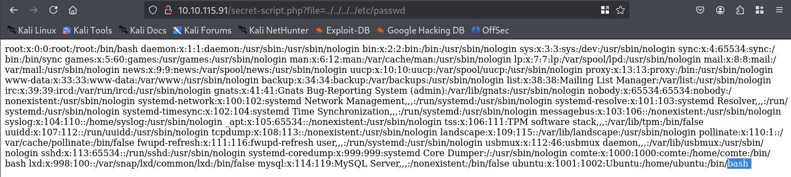

It read `/etc/passwd` right back to me. On top of confirming the LFI, the file named a real account on the box, `comte`, which became my target for a foothold.

> **Security Issue #2:** Unrestricted File Inclusion. The `file` parameter accepts directory traversal and reads arbitrary files off the server. User input should never be trusted as a file path.

## Phase 5: RCE via PHP Filter Chain

One page, `messages`, was loaded through PHP's `php://filter` wrapper. That wrapper is the ingredient for a filter chain attack: stack enough encoding filters and you can make PHP build and run your own code out of nothing.

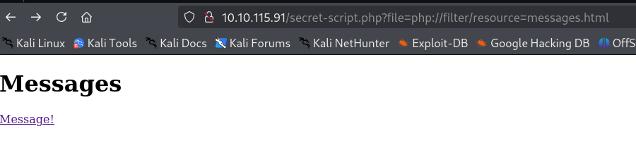
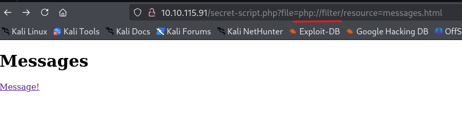

I used a public tool, `php_filter_chain_generator.py`, to produce the chain. The plan was simple: host a reverse shell on my machine, have the generated PHP fetch and run it, then catch the callback.

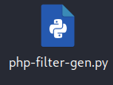
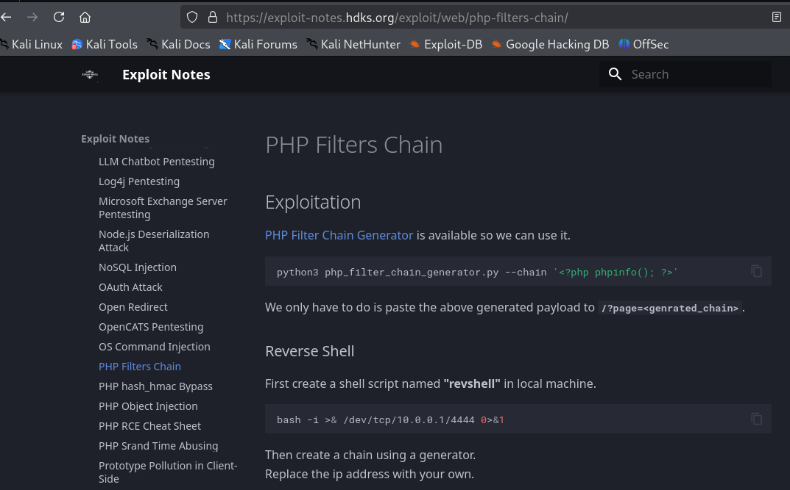

Generate the chain:

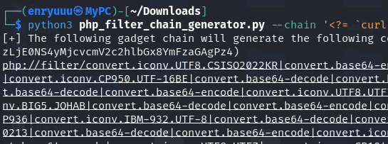

Serve the reverse shell script and start a listener:

> python3 -m http.server 80  
> nc -lvnp <PORT>

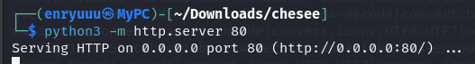
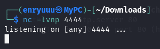

Then I pasted the chain into the `file` parameter. The target pulled my revshell script...

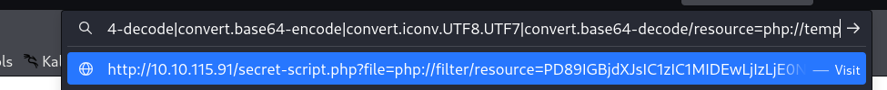
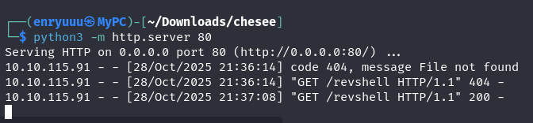

...and the listener caught a shell as `www-data`.

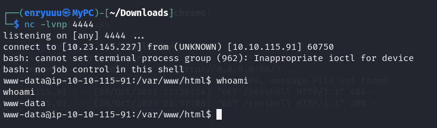

> **Security Issue #3:** Filter Chain RCE. An LFI plus PHP's filter wrappers is enough to run code with no upload and no credentials. Outdated PHP settings and unsanitized includes turn file reading into command execution.

## Phase 6: Foothold as comte

The user flag sat in `/home/comte/user.txt`, and `www-data` couldn't read it. But `comte`'s `.ssh` directory told a different story.

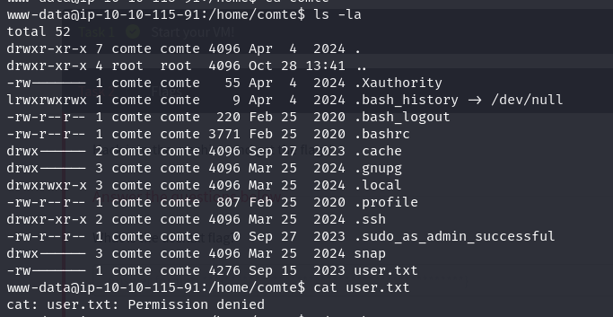

The `authorized_keys` file was world-writable. That's all an attacker needs. Write your own public key into it and you can log in as that user over SSH.

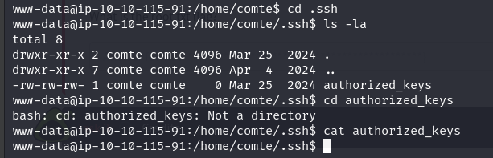

I generated a key pair on my machine

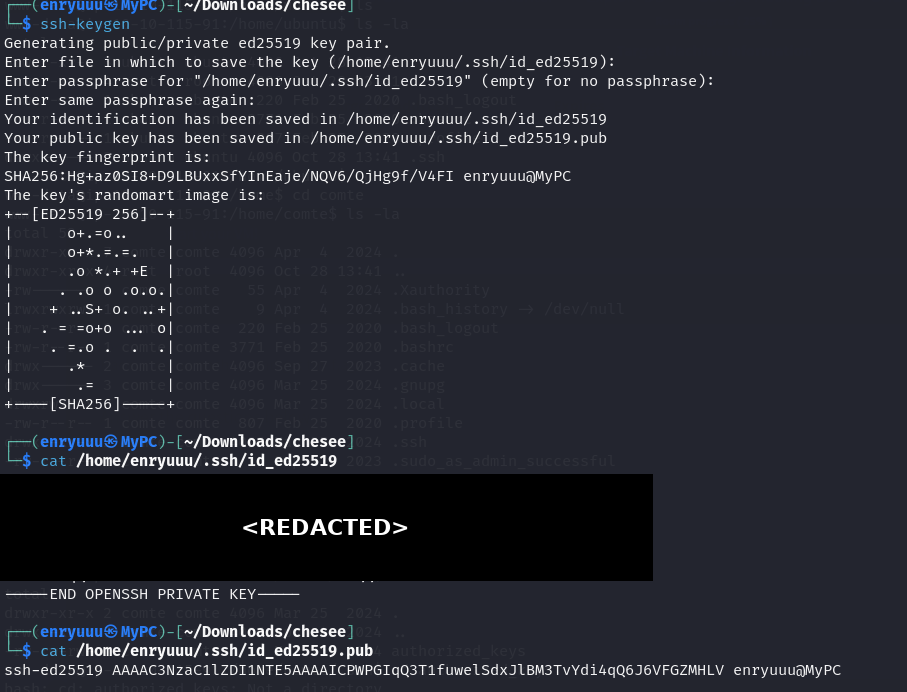

appended the public half to `comte`'s `authorized_keys`

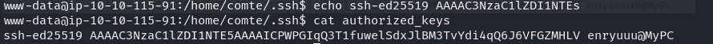

and logged straight in with the matching private key.

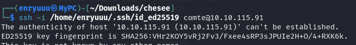
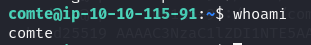

### First flag

With a proper `comte` session, `user.txt` gave up the first flag.

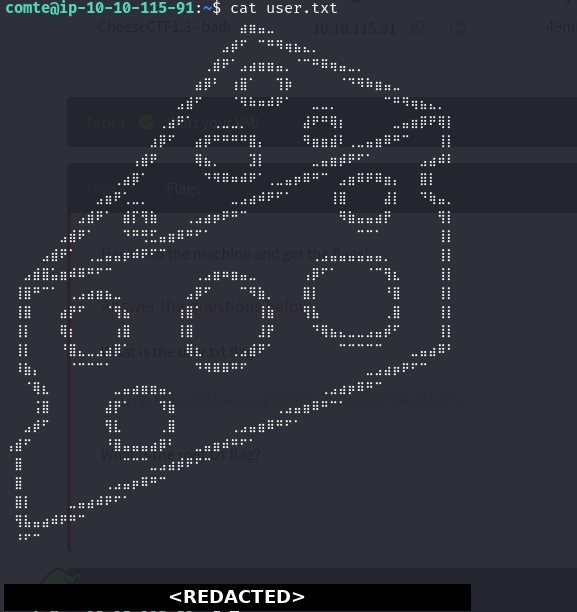

> **Security Issue #4:** World-Writable SSH Keys. A writable `authorized_keys` lets anyone add their own login key and become that user. SSH key files should be writable only by their owner.

## Phase 7: Privilege Escalation

First stop on any new account is `sudo -l`.

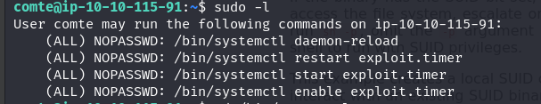

`comte` could run a set of `systemctl` commands as root with no password: `daemon-reload`, plus `start`, `restart`, and `enable` on a unit called `exploit.timer`. A timer I can control as root is worth a close look, so I went and found the unit files.

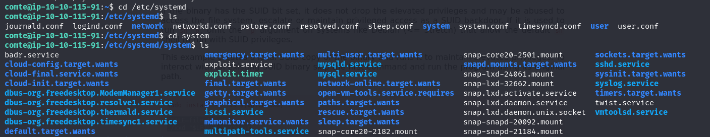

The timer had no trigger time set, and its paired service spelled out the payoff.

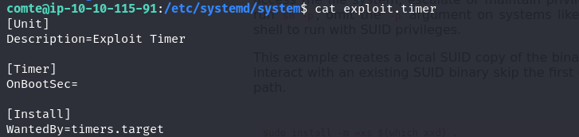
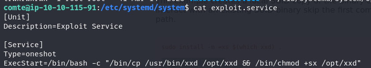

`exploit.service` copies `xxd` into `/opt` and sets the SUID bit on the copy. Run it and you end up with a version of `xxd` that executes as root. I edited the timer to fire a few seconds after boot, reloaded, and restarted it through the sudo commands I was allowed to run.

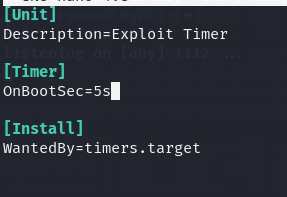
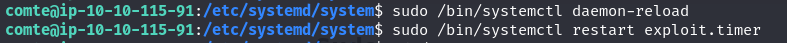

The SUID `xxd` showed up in `/opt`, exactly as the service promised.

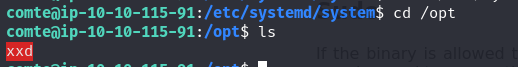

`xxd` has a GTFOBins entry for reading files it shouldn't. Pointing it at the root flag while it runs as root is a small tweak on that technique.

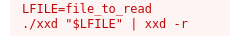
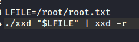

### Second flag

The adjusted payload read `/root/root.txt` back, and that closed the room out.

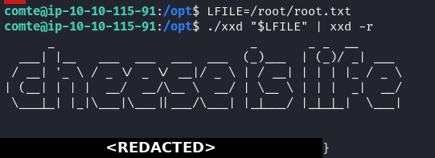

> **Security Issue #5:** Over-Permissive Sudo. Letting a normal user control a root systemd unit turns into a root SUID binary in one step. Sudo rights should never cover services that write executable files.

## Blue Team Perspective

Working back through the chain, here's where a defensive team would have caught each step.

### 1. Untrusted input on the admin script.

The login bypass and the file inclusion share one root cause: user input used without validation. Fix: parameterized queries for every database call, and never build file paths out of request parameters. A web-app scanner flags both of these on a first pass.

### 2. PHP configuration that allowed filter-chain RCE.

The jump from reading files to running code leaned on permissive PHP wrappers. Fix: disable the dangerous wrappers, restrict what `include` can load, and keep PHP patched. An alert on a web process spawning a shell would also catch the reverse shell as it lands.

### 3. World-writable SSH keys.

A writable `authorized_keys` is account takeover waiting to happen. Fix: enforce owner-only permissions on SSH files, and alert on any change to `authorized_keys`, since a new line in that file is a strong sign of compromise.

### 4. Over-permissive sudo on systemd units.

The last hop came from sudo rights that were far too broad. Fix: scope sudo to the exact commands a user needs, keep service files out of user control, and watch for new SUID binaries, which are rarely created for a good reason.

This write-up is part of a series I'm building as I work toward a SOC and security role. I take each room from both sides, offensive and defensive, because spotting an attack matters as much as pulling one off.

If you're on the same path, feel free to connect. I'm always happy to trade notes and resources.
