# Chocolate Factory Writeup

**Machine Name:** Chocolate Factory  
**Platform:** TryHackMe  
**Difficulty:** Easy

---

## Introduction

This write-up covers Chocolate Factory, an easy-difficulty TryHackMe room built around Charlie and the Chocolate Factory. Underneath the theme is a fairly ordinary chain: a leftover backup file that leaks source code, a command form that never checks for a login, credentials sitting in plaintext, an SSH key with the wrong permissions, and a sudo rule that looks safer on paper than it turns out to be in practice.

None of these are exotic bugs. They’re the kind of small, everyday mistakes that show up in real applications too. That’s exactly what made the room worth documenting properly instead of just screenshotting my way to the flag.

## Phase 1: Enumeration

Started with a plain nmap scan against the target. For a room billed as easy, the port list came back busier than expected:

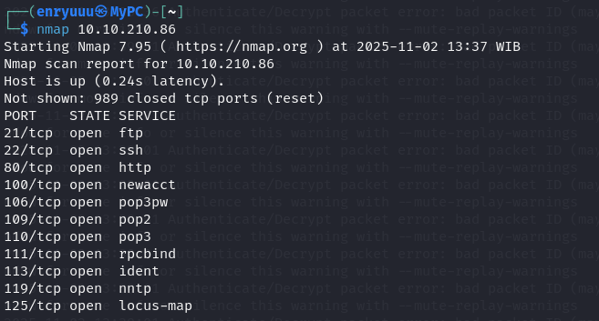

Eleven open ports is a lot of surface area, and most of it was a red herring. The entire attack path ran through port 80. Loading the site in a browser landed on a login form for something called the “Squirrel Room”: a username field, a password field, and nothing else to go on.

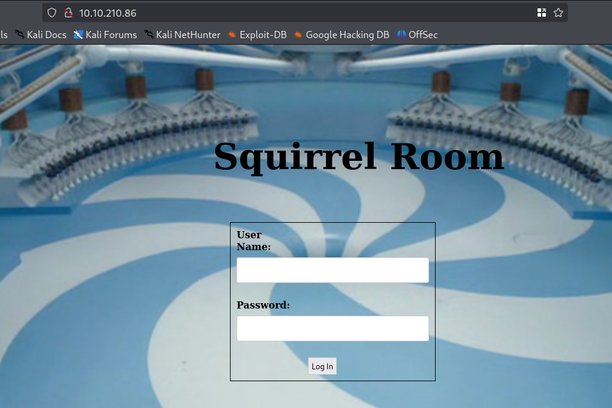

## Phase 2: Directory Brute-Forcing

With the login form giving up nothing, the next step was a directory brute-force against the web root. Most hits were the usual pile of 403s on .htaccess variants, but two came back 200:

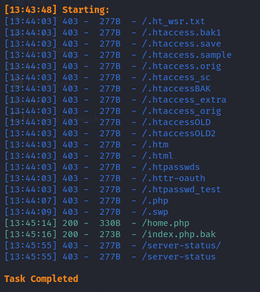

A .bak extension on a PHP file is one of the more reliable “free win” signals in web testing: it usually means a plaintext copy of source code got left behind by an editor or a backup script. Downloaded it right away.

> **Security Issue #1:** Backup File Left in the Web Root. index.php.bak was never meant to be reachable over HTTP, but a directory scan found it in seconds. It handed over the application’s raw PHP source, no guessing required.

## Phase 3: Confirming Unauthenticated Code Execution

The obvious next move was checking whether /home.php, the other 200 from the directory scan, ran this same code live. It did, and it never asked for a login: loading it directly showed the identical command box, no session or cookie required.

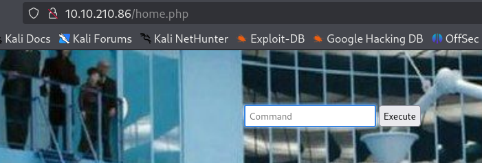

Ran a quick directory listing through the box to see what else was sitting there:

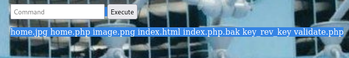

Two names worth remembering: `validate.php`, presumably the logic behind the visible login form, and `key_rev_key`, an odd enough filename to be worth a second look later.

## Phase 4: Digging for Credentials

Rather than fumbling through the command box one instruction at a time, I spun up a temporary web server on the target through the same RCE and pulled the file back locally:

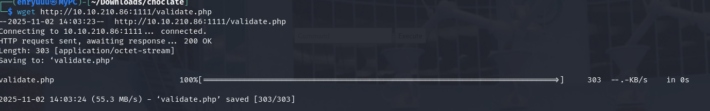

Reading it explained the entire login flow in four lines:

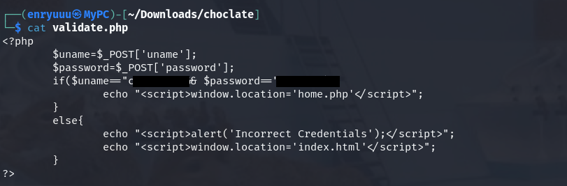

> **Security Issue #2:** Hardcoded Credentials in Application Code. The username and password were compared against a plaintext pair baked directly into the PHP. Anyone able to read the file had the login for free.

The credentials worked on the real login form too, redirecting straight to home.php, which, given the endpoint was already open, felt almost beside the point. SSH with the same pair went nowhere, so whatever charlie’s actual access looked like, it wasn’t going to come from a password.

## Phase 5: Reverse Shell as www-data

With confirmed, unauthenticated code execution, the fastest path to a real shell was a one-liner. I built a Python3 reverse shell with [revshells.com](https://revshells.com), started a listener, and dropped the payload into the command box:

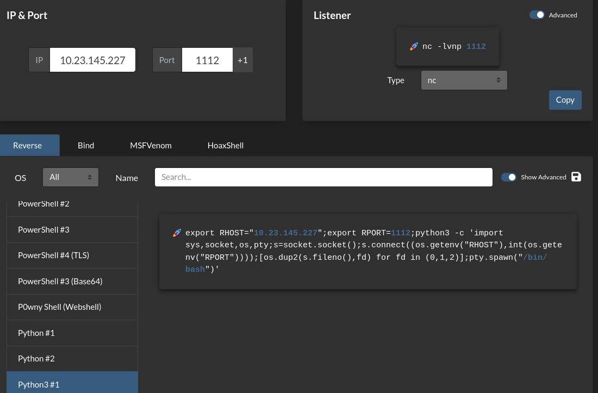

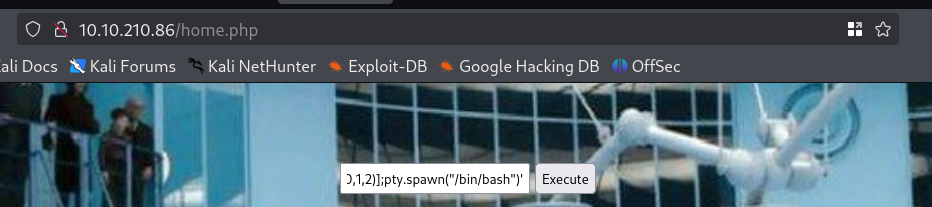

The listener caught it almost immediately:

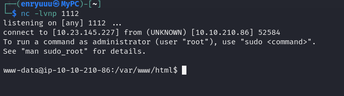

## Phase 6: An SSH Key Left Out in the Open

`www-data` doesn’t own much, so the next step was mapping /home. Three accounts existed: charlie, ssm-user , and ubuntu. Charlie’s directory had something more useful than usual sitting in it.

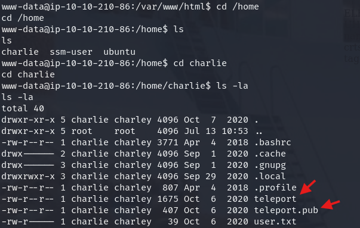

teleport.pub gives away exactly what teleport is. Reading it confirmed an RSA private key, and it was world-readable, unlike user.txt sitting right next to it.

> **Security Issue #3:** World-Readable SSH Private Key. Charlie’s private key sat in his own home directory with permissions loose enough for the low-privilege web server account to read it. A key is only as private as the file permissions guarding it.

Copied it over, fixed the permissions, and used it directly:

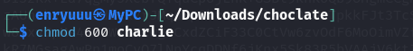
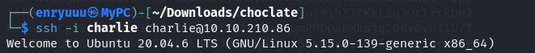

### First Flag

`user.txt` had been visible since the very first directory listing as `www-data`, locked to charlie by permissions. With a real shell as charlie, it finally opened. First flag captured.

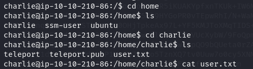

## Phase 7: Root via a Sudo Rule That Didn’t Hold

`sudo -l` as charlie turned up one entry:

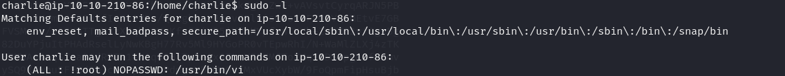

On paper that’s a deliberately narrow grant: charlie can run vi with sudo, but explicitly not as root. GTFOBins lists the standard escape for a sudo-editable viregardless of who it’s supposedly restricted to.

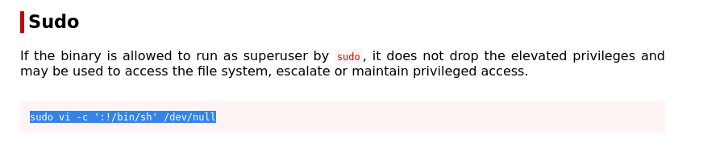

execute command:

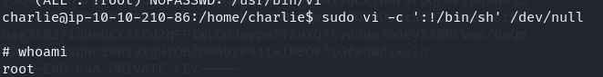

> **Security Issue #4:** Sudo Restriction That Didn’t Actually Restrict. The !root qualifier was meant to stop charlie from reaching a root shell through this rule. It didn’t hold, and a documented one-line GTFOBins escape was all it took to get there anyway.

## Phase 8: The Real Puzzle, Decrypting the Root Flag

/root didn’t hold a plain root.txt. Instead there was root.py, a script that asks for a key, uses it to decrypt a Fernet-encrypted string, and prints an ASCII banner announcing the new owner of the factory before revealing the flag:

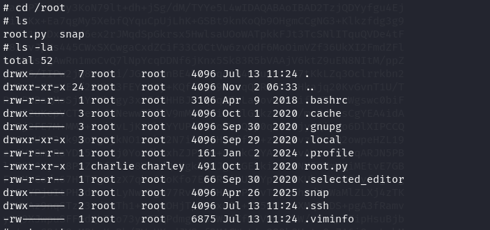

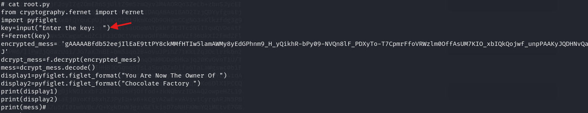

The key it wanted was sitting in that oddly named file spotted back in section 3 — `key_rev_key`.

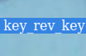

Viewing the raw source of `home.php` (via `view-source:`) turned up a block of binary-looking padding with one readable line buried inside it:

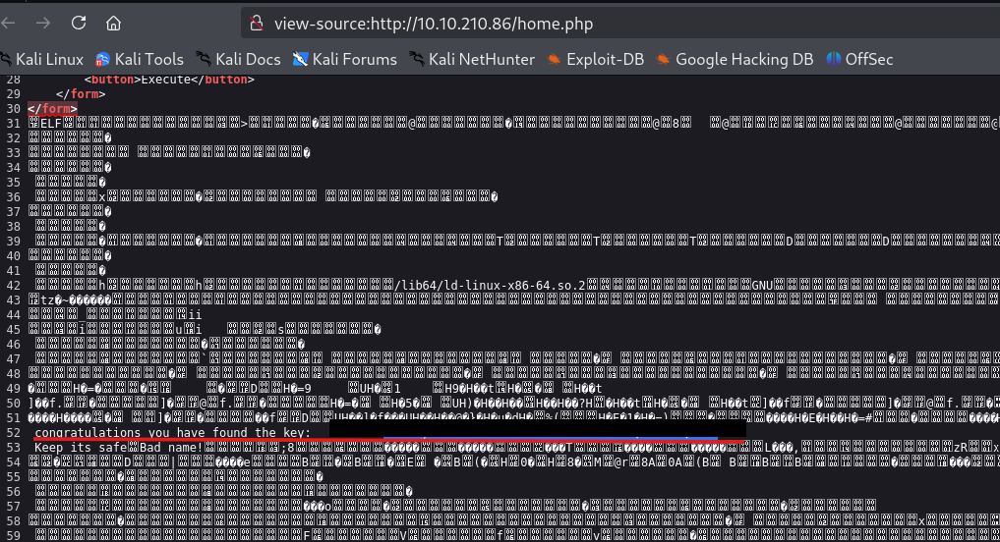

### Flag 2

Using that key to python script to unlock second flag.

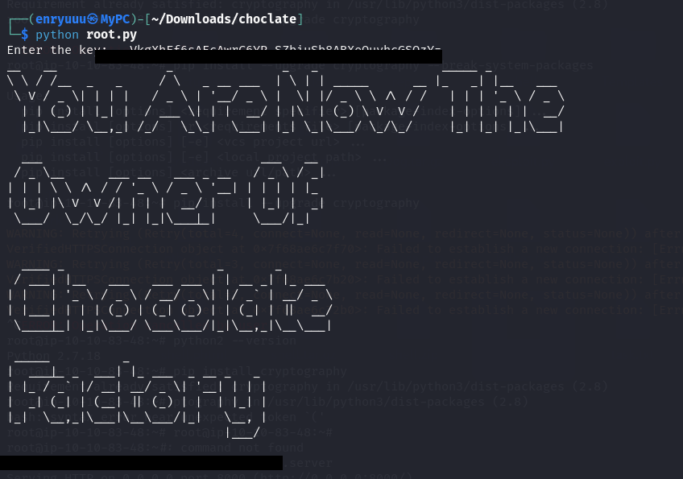

## Blue Team Perspective

Working back through the chain, here’s where I think a defensive team would have had a real chance to catch this, and what I’d fix.

### 1. Backup and Debug Files in the Web Root.

A single automated content scan would have found index.php.bak in seconds. Fix: exclude backup, .bak, .old, and editor-swap files from every deploy, and alert on repeated 200s against common backup extensions in the web server logs.

### 2. Missing Access Control on a “Protected” Endpoint.

Home.php should have rejected any request without a valid, server-side session, regardless of whether the user arrived through the login form or a direct URL. Fix: enforce authentication centrally, rather than trusting each page to remember to check.

### 3. Secrets in Plaintext: Code, Files, and Permissions.

Hardcoded credentials, a world-readable SSH key, and a decryption key sitting in a public file are three symptoms of the same habit: treating “nobody will look here” as a control. Fix: use a secrets manager or environment-based config, default privatekeys to 600 , and rotate anything that was ever exposed.

### 4. Sudo Grants That Look Safer Than They Are.

A NOPASSWD rule with a “not root” qualifier still handed over root, because the binary it allowed, vi, documented GTFOBins escape. Fix: never grant sudo on an editor, pager, or interpreter without a hard command restriction, and check new sudoers lines against GTFOBins before they ship.

This write-up is part of my ongoing series documenting CTF challenges as I build my portfolio in cybersecurity. I approach each challenge from both offensive and defensive perspectives, because understanding both sides is what makes a well-rounded security professional.

If you’re also on the journey toward a SOC or Security Engineering role, feel free to connect — I’m always happy to discuss techniques and share resources.
