# Dreaming Writeup

**Machine Name:** Dreaming  
**Platform:** TryHackMe  
**Difficulty:** Easy

---

## Introduction

Dreaming is an easy-difficulty TryHackMe room built around a vulnerable install of Pluck CMS, followed by a chain of privilege escalations across three accounts named after figures from dream mythology: Lucien, Death, and Morpheus. Each account holds one flag, and each hop between them comes down to a different mistake left behind by whoever set the box up.

Where a lot of easy boxes lean on one big exploit, this one is more of a scavenger hunt. A weak admin password gets you in the door, a file upload filter that only checks the extension gets you a shell, and from there it's a trail of scripts and files that were never supposed to be readable by the accounts that ended up reading them.

## Phase 1: Enumeration

Started with a full TCP port scan against the target.

> nmap -p- -sV -sC \<TARGET_IP\>

Only two ports came back open: 22 (SSH, OpenSSH 8.2p1 on Ubuntu) and 80 (HTTP, Apache 2.4.41 on Ubuntu). Visiting the web server in a browser showed nothing but the default Apache landing page, so there was no obvious application to attack yet.

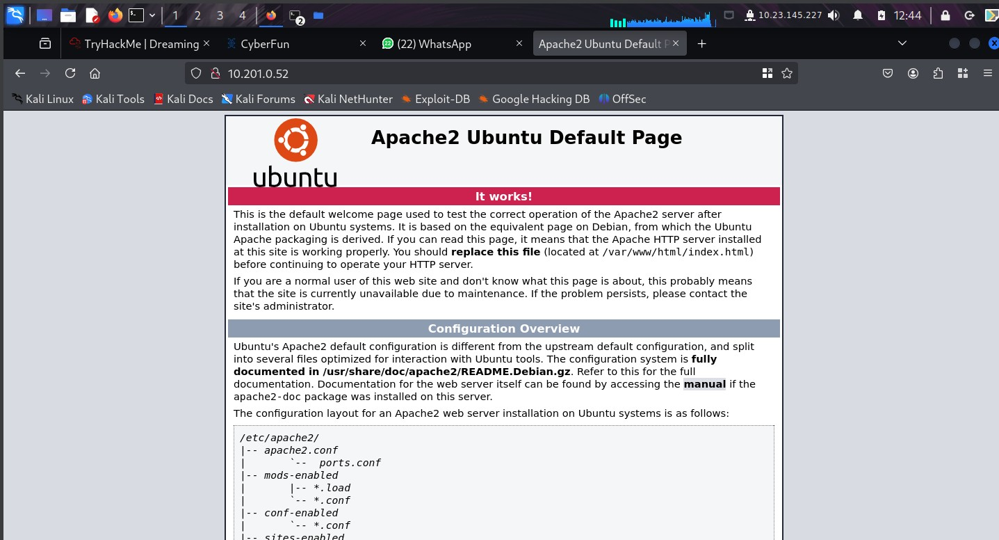

## Phase 2: Finding Pluck CMS

A directory scan against the web root turned up an `/app/` folder.

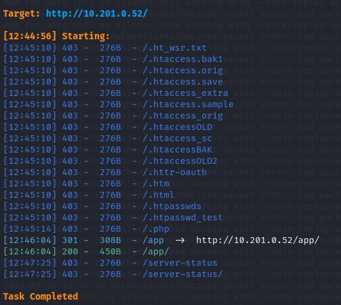

`/app/` had directory listing enabled, and inside it sat a folder for **Pluck CMS 4.7.13**.

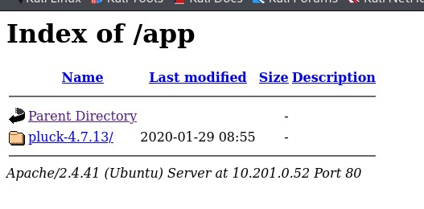

Opening that folder led to the Pluck CMS front end, which included a link to an admin panel.

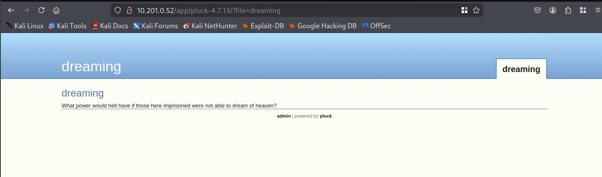

> **Security Issue #1:** Directory Listing Left Enabled. With listing turned on, `/app/` handed over its full contents to anyone who asked, including the exact CMS name and version, before a single exploit was needed.

## Phase 3: Cracking the Admin Login

Pluck's admin panel only asks for a password, no username, which makes it a single field to attack.

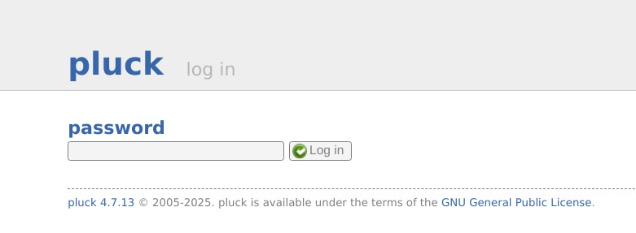

Running it through Burp Suite's Intruder against a small wordlist, the password `password` came back with a 200 response while everything else failed.

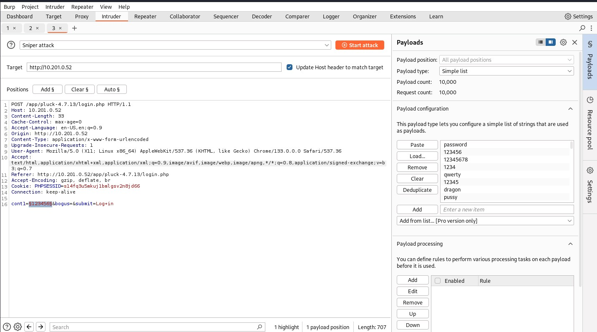
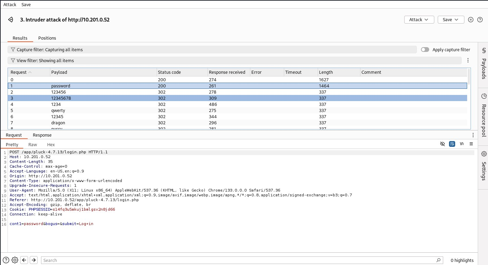

That was enough to log straight into the Pluck dashboard.

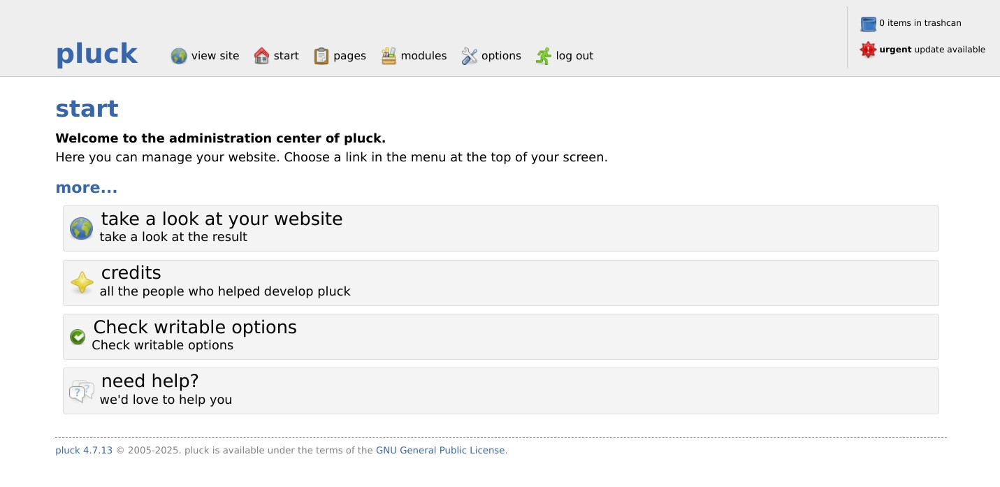

> **Security Issue #2:** Weak, Brute-Forceable Admin Password. A CMS with full publishing and file-management rights was sitting behind the password "password." No lockout, no rate limiting, no second factor. A handful of Intruder requests was all it took.

## Phase 4: Remote Code Execution via File Upload

The admin dashboard's "manage files" feature let the logged-in admin upload arbitrary files. A PHP reverse shell went up first, but Pluck silently appended a `.txt` extension to it, so the code just displayed as text instead of running.

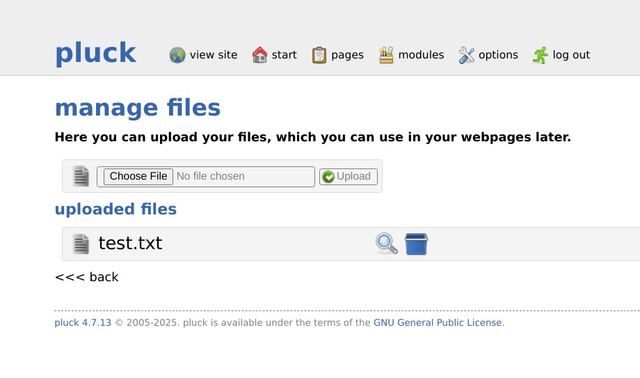
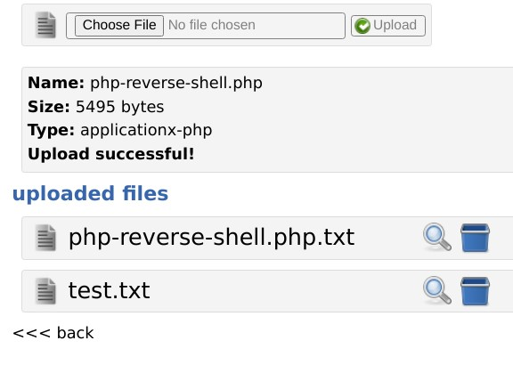

A quick search turned up the reason: Exploit-DB entry EDB-ID 49909, tied to CVE-2020-29607, a file upload restriction bypass in Pluck CMS before 4.7.13. The upload filter blocks common script extensions but lets `.phar` files through, and PHP will execute those just as happily as a `.php` file.

if you want to read the resource from exploit db: https://www.exploit-db.com/exploits/49909

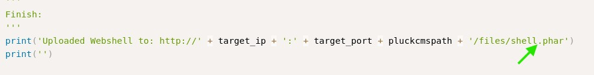

Renaming the reverse shell from `.php` to `.phar` and re-uploading it did the trick. Requesting the uploaded file triggered the payload, and a shell landed on the listener as `www-data`.

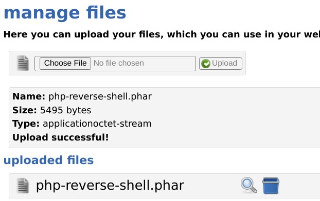
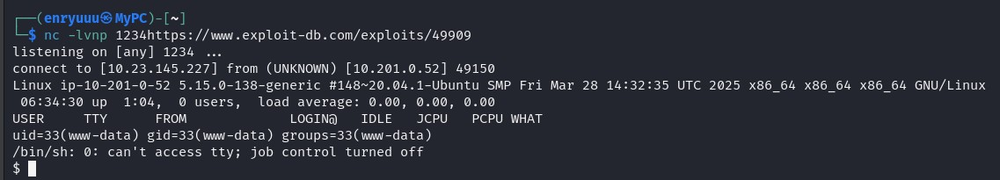

> **Security Issue #3:** Blocklist-Based Upload Filter. Blocking `.php` while leaving `.phar` untouched is the classic gap in a blocklist. Because Pluck still executes `.phar` as PHP, the upload feature amounted to remote code execution for anyone who could reach the admin panel.

## Phase 5: Foothold as www-data

The shell landed as `www-data`. `/home` listed three users, Lucien, Death, and Morpheus, but none of their folders were readable yet. `/opt` was more useful: it held two Python scripts, `test.py` and `getDreams.py`, both world-readable regardless of who owned them.

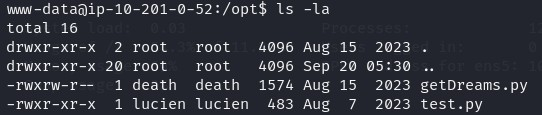

`test.py` turned out to be Lucien's own script for checking that his CMS login still worked, and it had his password hardcoded in plain text.

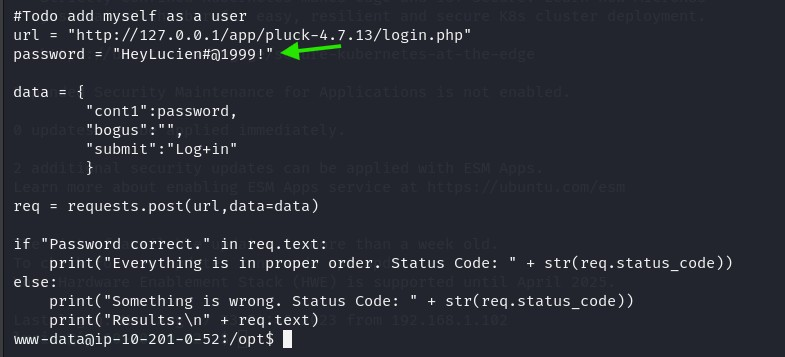

Since the earlier enumeration had already confirmed a `lucien` account existed, that password worked straight over SSH.

- **Username:** lucien
- **Password:** HeyLucien#@1999!

> **Security Issue #4:** Hardcoded Credentials in a Readable Script. Lucien's own test script stored his password in the clear inside `/opt`, a location any local user, including the low-privileged `www-data` account, could read.

### Flag 1

Logging in as Lucien and reading his home directory gave up the first flag.

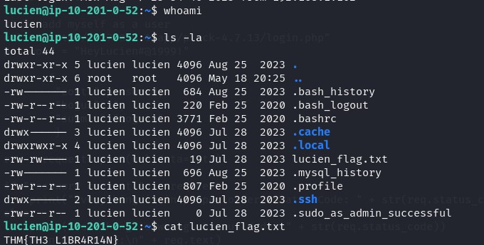

## Phase 6: Escalating to Death via Command Injection

`sudo -l` as Lucien showed a single, oddly specific entry: he could run `/usr/bin/python3 /home/death/getDreams.py` as the user `death`, no password required.

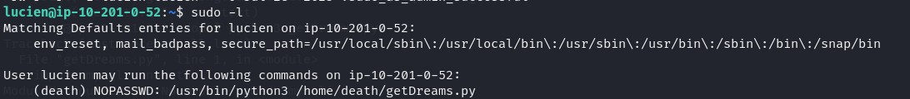

That script shared a name with the second file spotted earlier in `/opt`, so that copy was the first one worth reading.

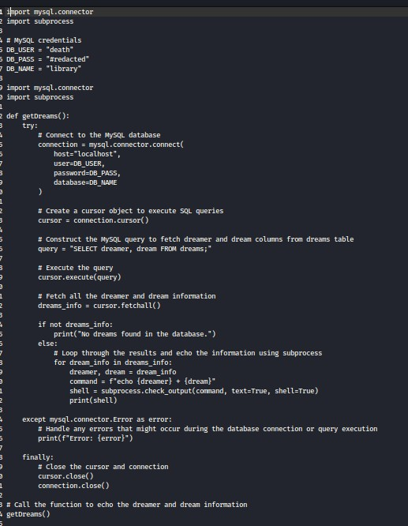

The code connects to a local MySQL database, pulls every row from a `dreams` table, and builds a shell command out of each row's `dreamer` and `dream` values before running it with `subprocess.check_output(..., shell=True)`. Whatever sits in that table gets executed on the box.

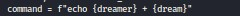

Running the script confirmed it: the output printed each row's contents straight to the terminal.

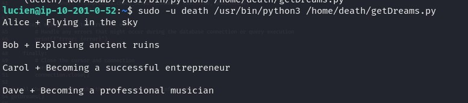

Lucien's own `.bash_history` had the missing piece, a previous MySQL login typed directly on the command line.

> mysql -u lucien -p\<LUCIEN_MYSQL_PASSWORD\>

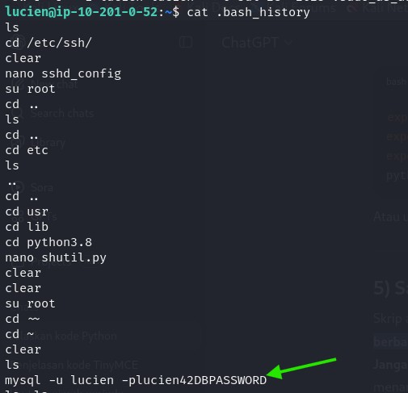

Logging in with that password confirmed Lucien could insert, update, and delete rows in the `dreams` table.

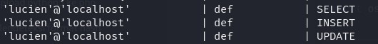
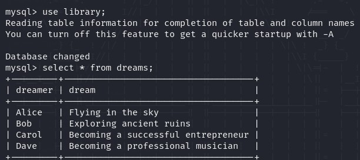

That was all it took to weaponize the script. Inserting a row where the `dreamer` field ended in a shell separator and a path meant that path would run as a command once `getDreams.py` processed it:

> insert into dreams values ("deku;/tmp/deku","number one hero!");

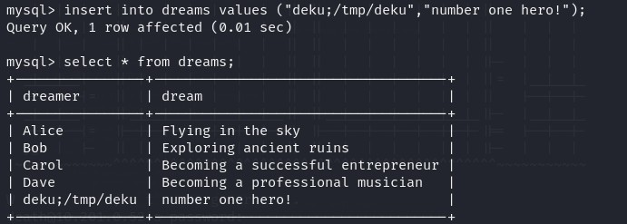

`/tmp/deku` was written with a Bash reverse shell one-liner from revshells.com and made executable.

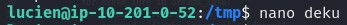
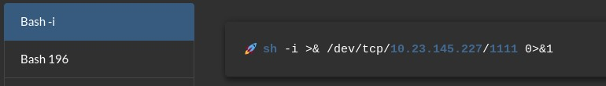

With a listener running and the sudo command triggered again, the script worked through the legitimate rows and then hit the poisoned one, executing `/tmp/deku` as `death`.

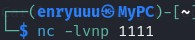
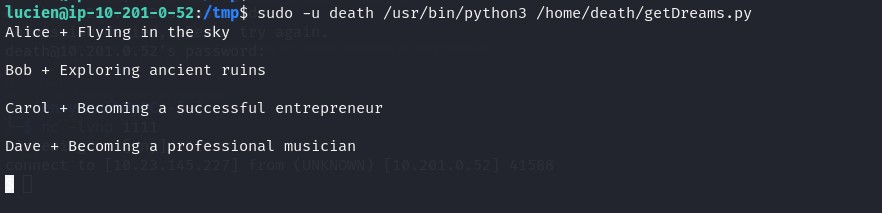
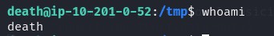

> **Security Issue #5:** Database Content Executed as an OS Command. `getDreams.py` treated every value in the `dreams` table as safe to drop into a shell command. Any account with write access to that table, even one meant only to log dreams, could use it to run arbitrary commands as `death`.

### Flag 2

The shell as `death` gave up the second flag.

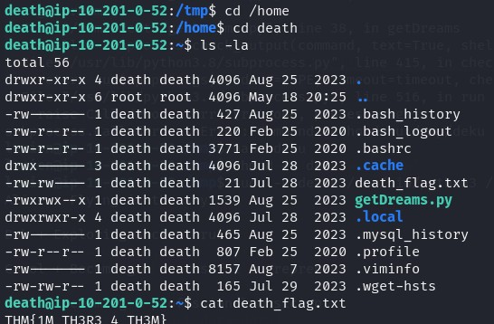

Reading `death`'s own copy of `getDreams.py`, in his home directory rather than the redacted one in `/opt`, showed his real MySQL password in plain text.

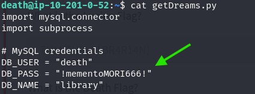

That same password also worked as `death`'s system login over SSH.

- **Username:** death
- **Password:** !mementoMORI666!

> **Security Issue #6:** Database Password Reused as the System Login Password. One exposed password unlocked two separate accounts, a MySQL user and the matching Linux user, because they shared the same credential.

## Phase 7: Escalating to Morpheus via Library Hijacking

As `death`, Morpheus's home directory was partially readable: a flag placeholder and a script called `restore.py` that imports `copy2` from Python's built-in `shutil` module to back up a file.

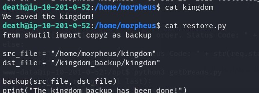

Locating that library file and checking its permissions showed something that should never be true of a system library: the `death` group had write access to it.

> find / -type f -name shutil.py 2\>/dev/null

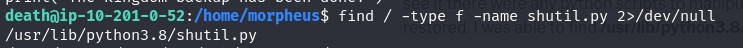
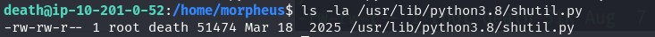

Since `restore.py` presumably runs on a schedule as Morpheus, editing that shared library meant the next run would execute whatever got added to it. A single line dropped into `shutil.py`'s `copy2()` function was enough:

> os.system("chmod 777 /home/morpheus/morpheus_flag.txt");

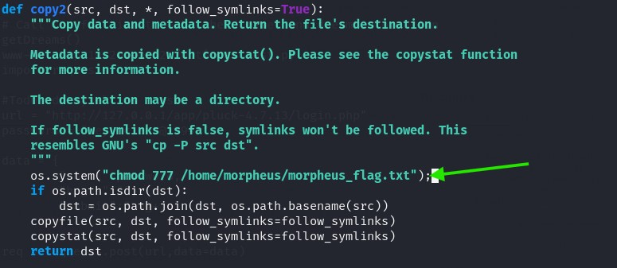

Once `restore.py` ran again as Morpheus, the injected line executed with it and opened Morpheus's flag file up for anyone to read.

> **Security Issue #7:** Group-Writable Python Standard Library File. A core library that every Python script on the box imports, including ones that run as higher-privileged users, was writable by a low-privileged account's group. That turned a routine backup script into a privilege escalation path.

### Flag 3

Reading the now world-readable file in Morpheus's home directory closed the room out.

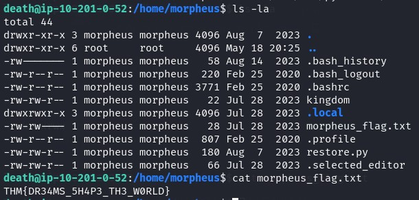

## Blue Team Perspective

Working back through this chain, here's what I think a defensive team would have caught, and where.

### 1. Weak, Unmonitored Admin Authentication

A single-field admin login with no lockout let an attacker brute-force it in minutes. Fix: rate-limit or lock out repeated failed logins, and alert on brute-force patterns against admin panels.

### 2. File Uploads Trusted by Extension Alone

Blocking `.php` while allowing `.phar` is a blocklist gap, not real validation. Fix: validate uploads by content and MIME type, store them outside the web root, and strip execute permissions from the upload directory.

### 3. Hardcoded and Reused Credentials

Two separate scripts stored plaintext passwords, and both passwords doubled as system logins. Fix: keep credentials out of source files entirely, use a secrets manager, and never reuse a password across a database account and an OS account.

### 4. Unsafe Handling of Data and Writable System Files

A script that ran database rows as shell commands, and a Python library file a low-privileged group could edit, both turned routine automation into privilege escalation. Fix: never build shell commands from stored or user-controlled data, and lock down write access to anything the system imports or executes automatically.

---

This write-up is part of my ongoing series documenting CTF challenges as I build my portfolio in cybersecurity. I approach each challenge from both offensive and defensive perspectives, because understanding both sides is what makes a well-rounded security professional.

If you're also on the journey toward a SOC or Security Engineering role, feel free to connect — I'm always happy to discuss techniques and share resources.
