# GoldenEye Writeup

**Machine Name:** GoldenEye  
**Platform:** TryHackMe  
**Difficulty:** Medium

---

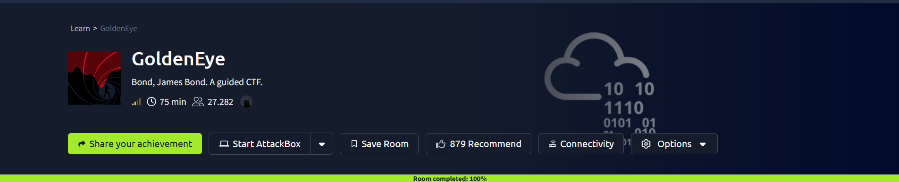

## Introduction

GoldenEye is a James Bond themed room on TryHackMe, and the theme is more than set dressing. The whole box runs on one idea: people leaving passwords where they should never be. There is no single clever trick that cracks it open. Instead the machine hands you one account, that account points you at the next, and the trail of leaked credentials keeps going until it finally runs into an old Linux kernel that gives up root.

What I like about this room is that nearly every step maps to a mistake that shows up in real environments. A password sitting in a web page's source. A login with nothing stopping you from guessing it. Sensitive notes passed around over email in plain text. A secret tucked inside an image. None of it is exotic, and all of it is exactly the kind of thing a defender is paid to catch.

## Phase 1: Enumeration

I started with a full port scan to see what the server was actually running.

> nmap -p- -sV -sC <TARGET_IP>

Four ports came back open:

- 25 (SMTP), Postfix
- 80 (HTTP), Apache 2.4.7 on Ubuntu
- 55006 (SSL)
- 55007 (POP3), Dovecot

Two of those caught my eye right away. Port 25 sends mail and port 55007 receives it, which told me email was going to matter on this box. The web title also came back as "GoldenEye Primary Admin Server", so I loaded port 80 in a browser.

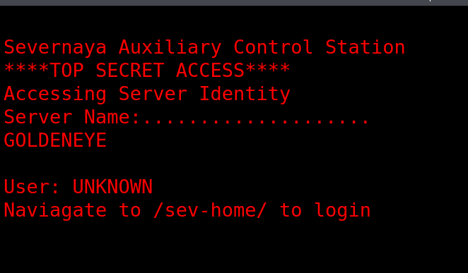

Nothing useful on the surface. But the interesting parts of a web page usually are not on the surface, so I opened the page source. One of the linked JavaScript files carried a comment about a user named Boris, along with his password, which someone had tried to "hide" by writing it as HTML character codes.

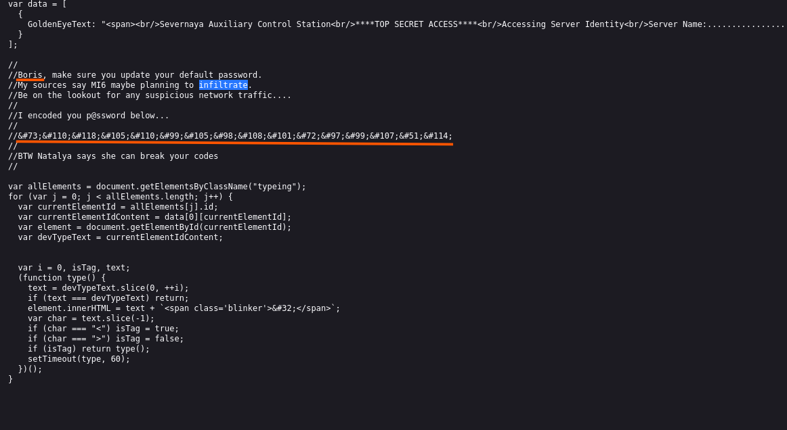

Encoding is not the same as hiding. I decoded the string and Boris's password came straight back in plain text.

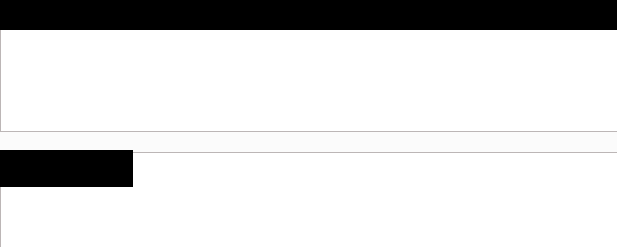

That gave me a first account:

- Username: boris
- Password: `<REDACTED>`

> **Security Issue #1:** Credentials in the page source. A password written into client side code is still a password anyone can read. The browser decodes it, and so does the attacker.

## Phase 2: First Login

A directory scan against the site root did not turn up much.

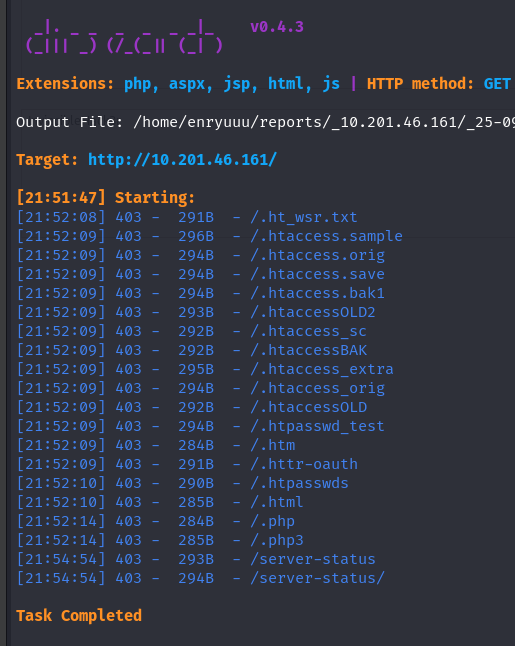

The home page had already mentioned a login at `/sev-home/`, though, so I went there directly and signed in with Boris's credentials. Straight in.

## Phase 3: Into the Mail Server

Since SMTP and POP3 were both open, the mailbox was the obvious next stop. SMTP handles sending and POP3 handles receiving, so POP3 was where Boris's messages would be waiting. I connected to it over an encrypted session.

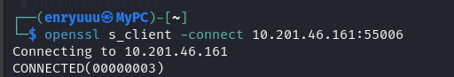

His web password did not work here, which is worth noting on its own: the same person reused one identity across two services but set different passwords. So I brute forced the POP3 login with Hydra.

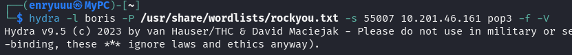

The flags I used:

- `-s` to target the specific port
- `-f` to stop as soon as a valid password is found
- `-V` to print every attempt

Hydra recovered the password, and I logged into the mailbox.

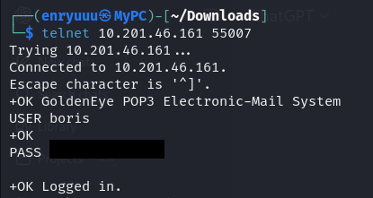

`LIST` showed three messages sitting in the inbox.

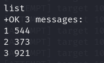

Reading through them with `RETR`, the second message was the one that mattered. It was from a user named Natalya, and the line "Boris, I can break your codes!" told me exactly who to go after next.

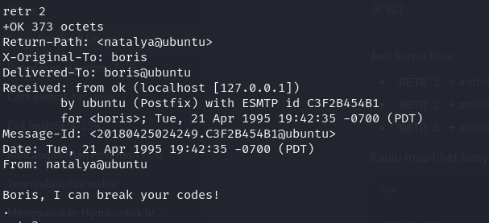

> **Security Issue #2:** Weak passwords and no lockout. The mailbox password was a short dictionary word, and the server let Hydra hammer it with unlimited guesses. Either problem alone is bad. Together they turn a login into a formality.

## Phase 4: One User Leads to the Next

Same approach, new target. I pointed Hydra at Natalya's POP3 account, recovered her password, and read her mail. Two messages this time.

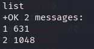

The second one was a gift. It carried a full set of credentials for another user, xenia, and it named an internal training site the team used: `severnaya-station.com/gnocertdir`.

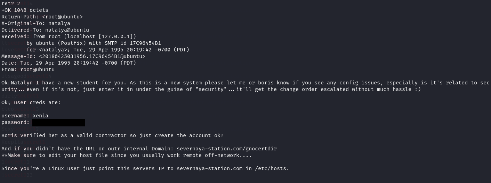

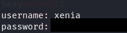

> **Security Issue #3:** Credentials passed around over email. Usernames and passwords sent in plain text through internal mail mean one compromised mailbox spills every account mentioned in it. That is exactly what happened here, twice over.

## Phase 5: The Training Site

The email mentioned that this internal domain only resolves if you point it at the server yourself, so I added `severnaya-station.com` to my hosts file and loaded it.

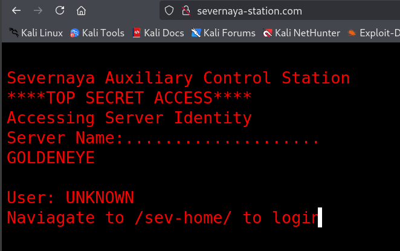

The `/gnocertdir` path led to a Moodle instance, a learning platform, sitting behind a normal login.

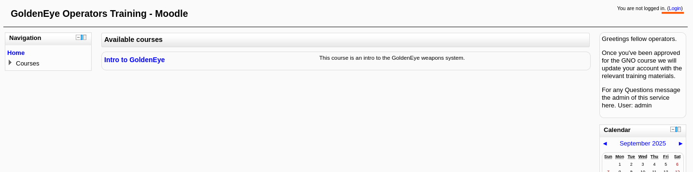

I logged in as xenia and started clicking through the site. In the messages section there was a note from a "Dr Doak" to Xenia, and it quietly revealed his account username: doak.

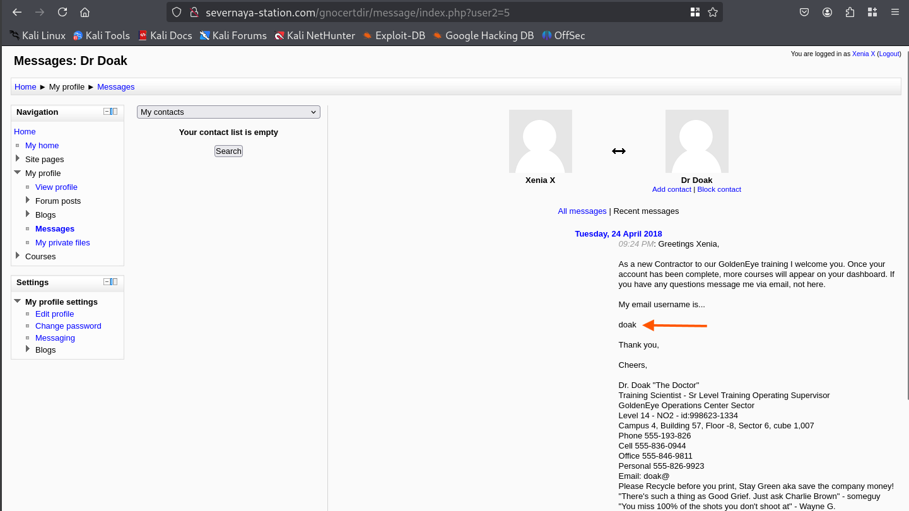

By now the pattern was clear. I brute forced doak's POP3 password, logged into his mailbox, and found a single message. Inside it were credentials for a higher access account, dr_doak.

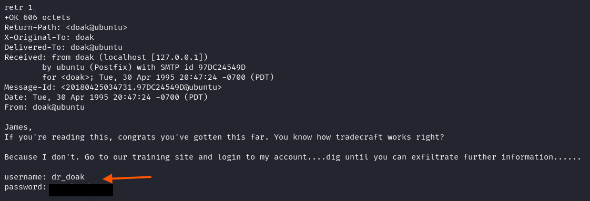

## Phase 6: Hidden in the Metadata

Logged into the training site as dr_doak, I checked his "My private files" area and found a file called secret.txt.

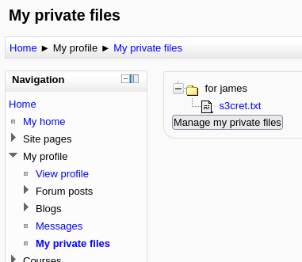

The note itself did not hand over a password. It pointed at an image instead, sitting at `/dir007key/for-007.jpg`, and hinted that something interesting was hiding in it.

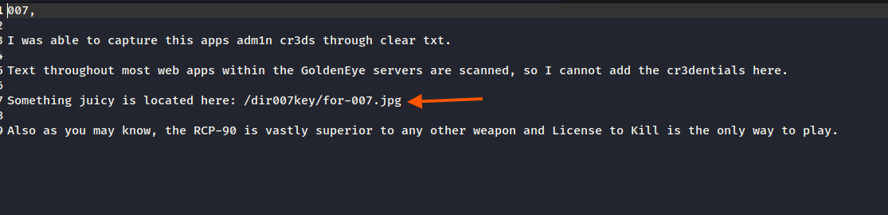

So I downloaded the image and ran it through exiftool, a utility for reading and editing the hidden metadata attached to a file.

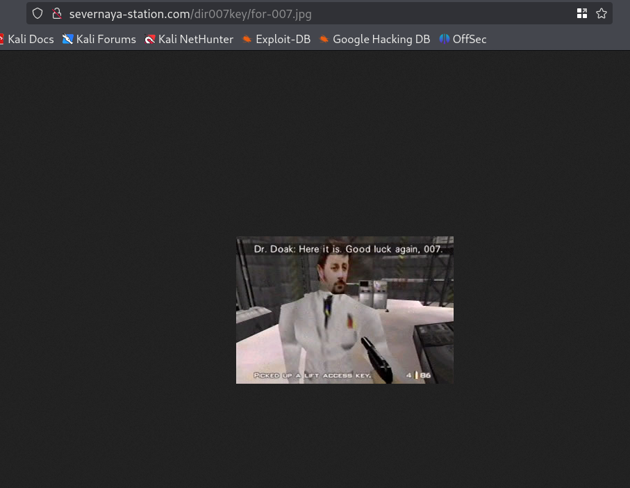

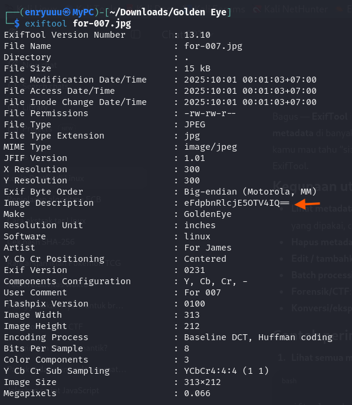

The image's description field held a base64 string. Decoding it revealed the administrator's password.

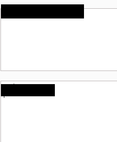

- Username: admin
- Password: `<REDACTED>`

> **Security Issue #4:** Secrets hidden in a file's metadata. A password buried in an image's EXIF data feels clever, but it is trivial to pull out with a standard tool. Obscurity is not security. The password was one command away the whole time.

## Phase 7: Admin Access and a Shell

With the admin account I logged into the Moodle dashboard.

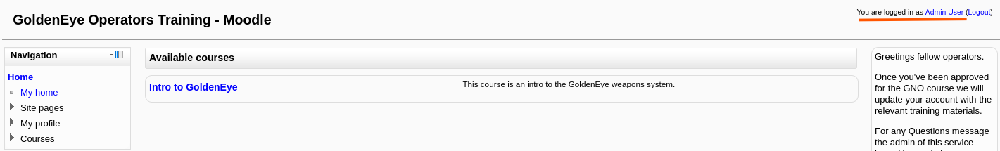

Older Moodle versions have a well known weak spot in the administrator settings. One field lets you set the path to the spell checking program, "aspell". Because the platform runs whatever program you put in that field, you can point it at your own payload instead and have it execute.

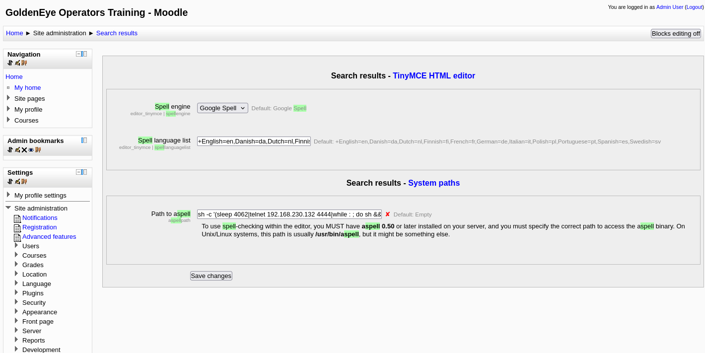

I set it to a Python reverse shell.

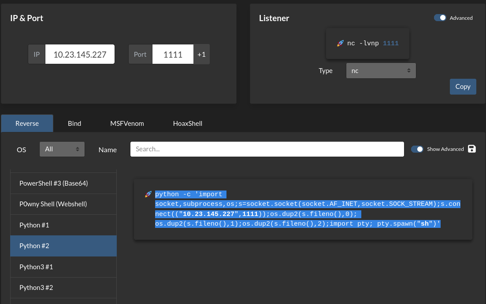

Then I created a blog post and ran it through the spell checker, which fired my payload.

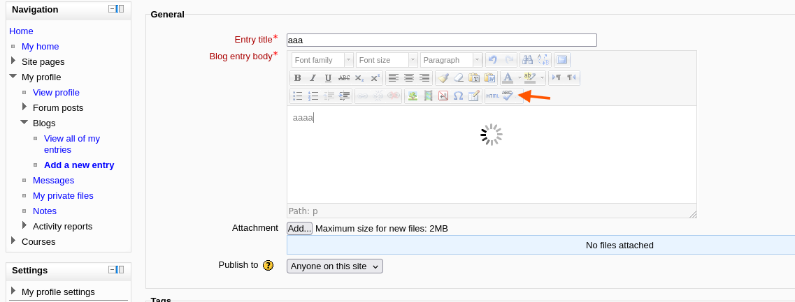

With a listener already waiting, the connection landed a few seconds later. A working shell as the web server user, www-data.

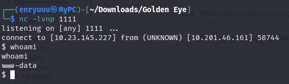

## Phase 8: Getting Root

A quick look at the running kernel showed it was old enough to have a public local privilege escalation exploit.

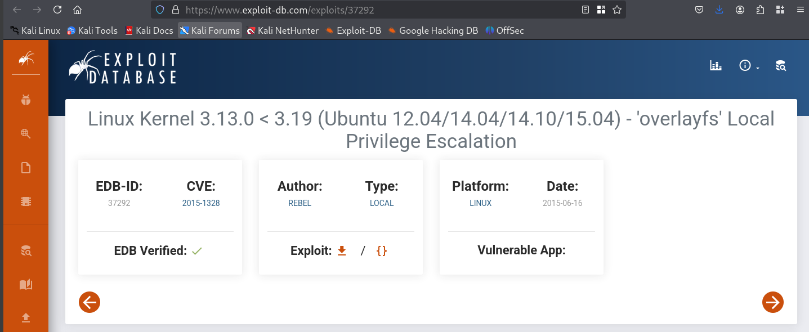

I hosted the exploit from my own machine with a small web server and pulled it down onto the target with wget.

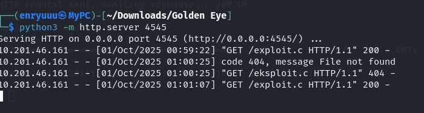

The box did not have gcc, but it did have cc, so I compiled the exploit with that instead and saved the output as a runnable file.

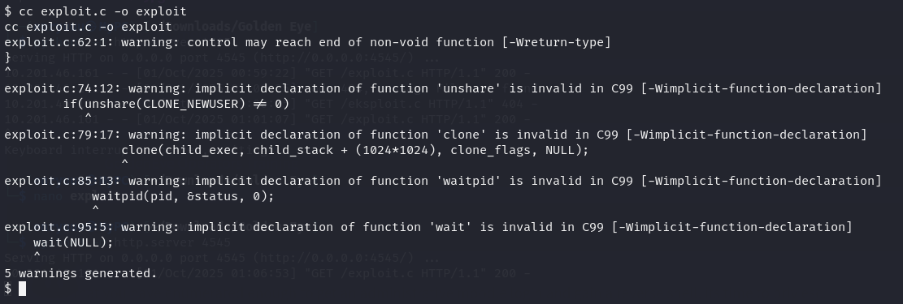

Running it dropped me into a root shell.

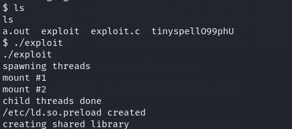

> **Security Issue #5:** An outdated kernel. The machine was running a kernel with a documented, publicly available exploit. Keeping software this far behind on patches leaves the last door wide open, even after everything before it has been done right.

### The Flag

With root access, the final flag was waiting in the `/root` directory.

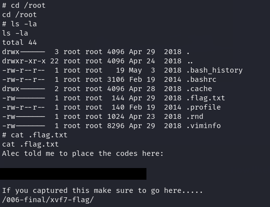

Flag: `<REDACTED>`

## Blue Team Perspective

Looking back over the whole chain, here is where a defender could have stopped it and how.

### 1. Keep credentials out of the code.

The very first foothold came from a password sitting in a JavaScript file. Any content review or automated secret scanner in the deployment pipeline would flag that before it ever reached production. Passwords do not belong in anything the browser downloads.

### 2. Make guessing expensive.

Two of the accounts fell to Hydra because the passwords were weak and nothing slowed the attempts down. Enforcing strong passwords, and adding rate limiting or lockouts on both the mail server and the web login, turns a two minute brute force into a dead end.

### 3. Stop moving secrets through email and files.

The same passwords kept turning up in mailboxes and in an image's metadata. Credentials should live in a proper secrets manager, not in messages people forward or files they upload. One leaked mailbox should never cascade into three more accounts.

### 4. Patch the operating system.

Root came from a known kernel exploit that had been public for years. Tying patch management to a vulnerability feed, and prioritising internet facing hosts, closes that final step before an attacker can reach it.

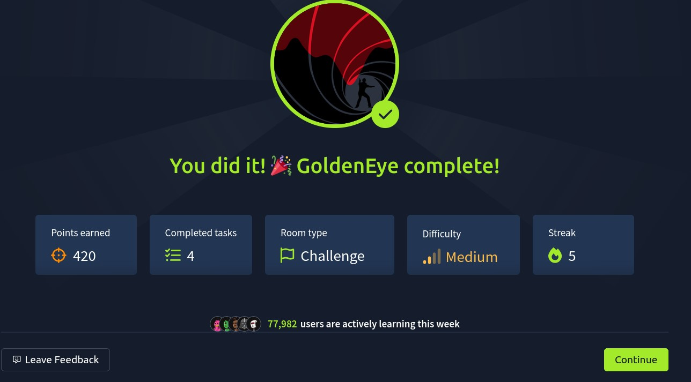

This write-up is part of a series where I document CTF challenges while building my portfolio in cybersecurity. I try to work each box from both sides, the attacker's path in and the defender's chance to catch it, because understanding both is what the role actually asks for.

If you are on a similar path toward a SOC or security role, feel free to connect. I am always happy to talk technique and swap resources.
