# IDE Writeup

**Machine Name:** IDE  
**Platform:** TryHackMe  
**Difficulty:** Easy

---

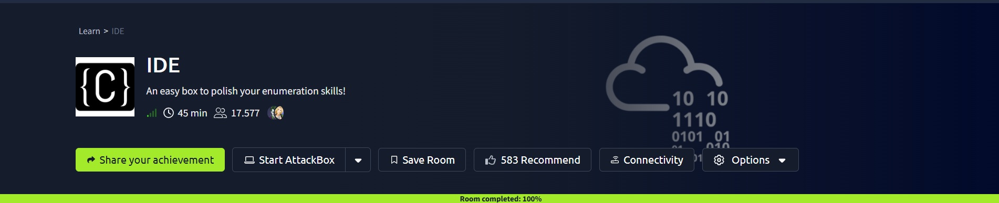

## Introduction

This write-up covers IDE, an easy-difficulty TryHackMe room built around a small self-hosted web IDE called Codiad. The room's own tagline calls it "an easy box to polish your enumeration skills," and that holds up pretty well. Nothing here needs an exotic exploit. What it actually rewards is noticing details that are easy to skim past: an oddly named FTP folder, a one-line note left behind by an admin, a password typed once into a terminal and never rotated again.

## Phase 1: Enumeration

Started with a full TCP port scan against the target.

> nmap -p- -sV -sC <TARGET_IP>

```
PORT      STATE SERVICE VERSION
21/tcp    open  ftp     vsftpd 3.0.3
22/tcp    open  ssh     OpenSSH 7.6p1 Ubuntu 4ubuntu0.3 (Ubuntu Linux; protocol 2.0)
80/tcp    open  http    Apache httpd 2.4.29 ((Ubuntu))
62337/tcp open  http    Apache httpd 2.4.29 ((Ubuntu))
```

Four ports, and two stood out right away: an FTP service that allowed anonymous login, and a second HTTP service running on an unusual port (62337) alongside the normal port 80.

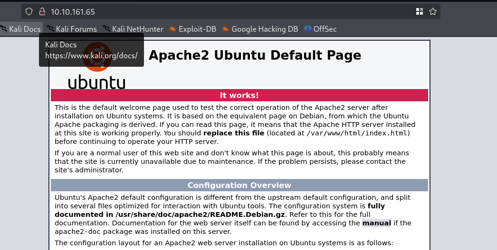

Port 80 turned out to be the untouched Apache default page. No content, no attack surface. Port 62337 was more promising: a login form for something else entirely.

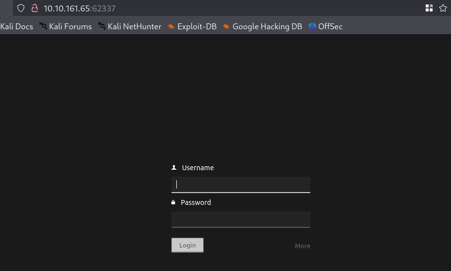

A directory scan against port 80 came back empty. The same scan against port 62337 pulled back `composer.json`, `INSTALL.txt`, `build.xml`, and a handful of application folders, a combination that pointed straight at Codiad, a lightweight, self-hosted web IDE.

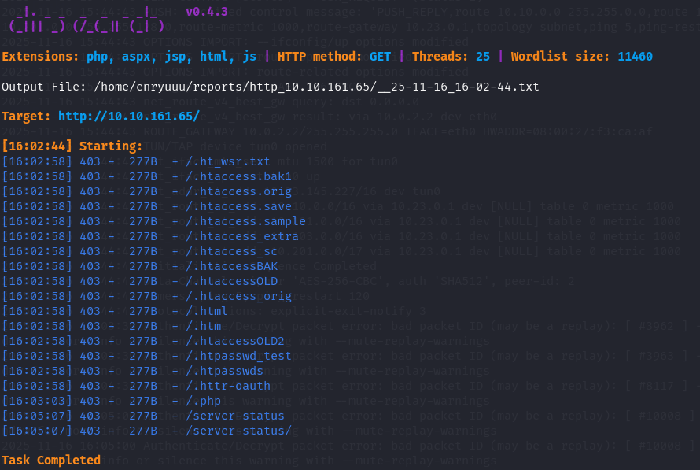
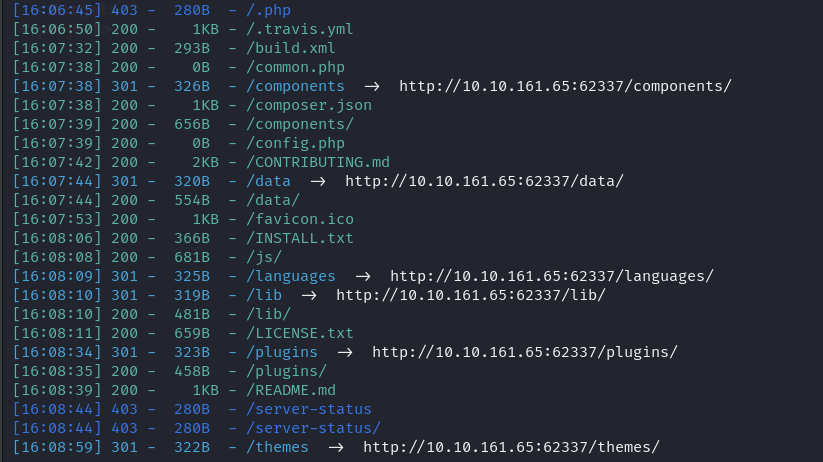

## Phase 2: An Anonymous FTP Drop With a Careless Note

Nmap had already flagged anonymous FTP login as allowed, so that was the natural next stop.

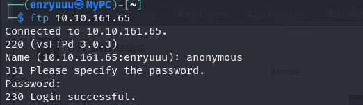

The login went through without any trouble. The root directory listing looked unremarkable at first glance, except for one entry: a folder literally named `...`. In Linux, `.` means "this directory" and `..` means "one level up," but three dots don't mean anything special. It's just a folder name, and an easy one to miss in a listing full of real dots.

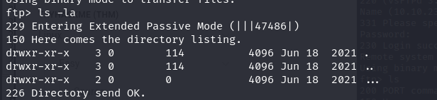

Inside `...` was a second small trick: a file named `-`. Most command line tools read a leading dash as the start of an option flag rather than part of a filename, so a plain `cat -` would fail or hang instead of showing the content.

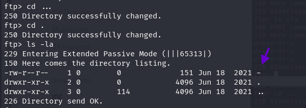

Downloading the file and opening it locally sidestepped that problem entirely.

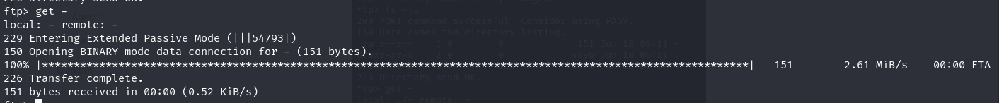

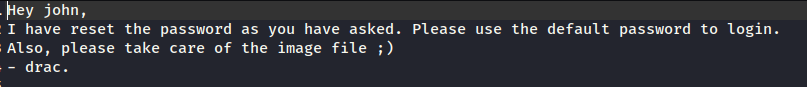

The file held a short note, apparently from one user to another:

> "Hey john, I have reset the password as you have asked. Please use the default password to login. Also, please take care of the image file ;) - drac."

Two useful facts came out of four lines: a valid username, `john`, and a strong hint that his account was still sitting on whatever password counts as "default" here.

> **Security Issue #1:** Internal Note Left on Anonymous FTP. Anonymous FTP is sometimes fine for public downloads, but it should never double as a scratch space for internal messages. An oddly named folder or file slows down a casual look, but it isn't access control. Anyone who can browse the share can still read it.

## Phase 3: Logging Into the Web IDE

With a username in hand and a strong suggestion that the password had never really changed, the Codiad login page on port 62337 was the clear next target. A short list of common default and weak passwords was enough. John's account logged in on the first realistic guess.

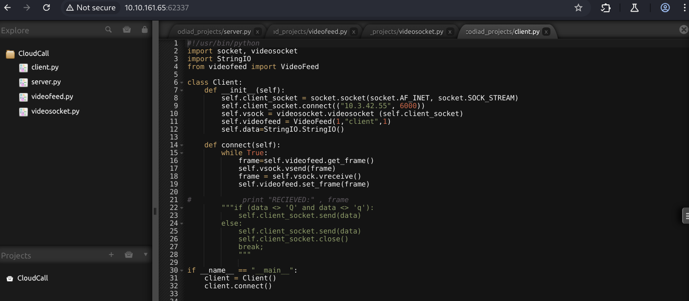

Inside was a single existing project named "CloudCall," plus the usual Codiad workspace, file browser, and code editor. The interface identified the running version as Codiad 2.8.4.

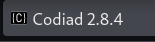

> **Security Issue #2:** Default Credentials Left Unrotated. The note from Phase 2 all but confirmed that this account's password had never changed since a reset. An account still sitting on a default or first-login password long after that reset offers little more protection than having no authentication at all.

## Phase 4: Remote Code Execution via a Public Codiad Exploit

Codiad is a small, largely unmaintained project, and version 2.8.4 is old enough to have public exploits written against it. A search turned up a GitHub repository packaging a working proof of concept, listing several CVEs, including CVE-2017-11366 and CVE-2017-15689, affecting this and earlier versions.

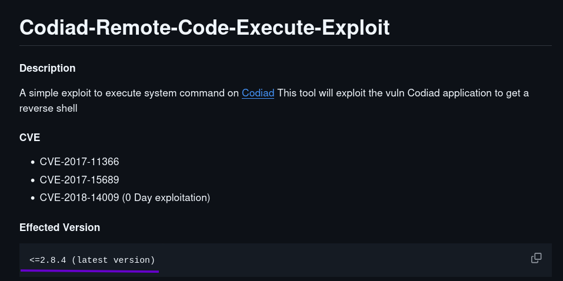

The script logs in with valid Codiad credentials, then uses the application's own file manager component to write a malicious payload to a web-reachable path and run it. No extra vulnerability research needed, just working credentials and a version number.

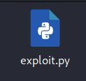

Running it against the target with the credentials recovered earlier:

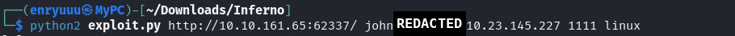

> **Security Issue #3:** Outdated Software With a Public, Working Exploit. Codiad 2.8.4 has known, publicly documented remote code execution issues. Once an attacker already has any valid login, which Phase 2 and Phase 3 provided for free, an outdated install like this turns straight into full code execution on the server.

## Phase 5: Reverse Shell as www-data

The exploit's own execution channel isn't an interactive shell, so it was used to push a two-stage reverse shell command back to the attacker machine instead. After standing up a listener as instructed, the callback landed a few seconds later and dropped into a proper interactive shell running as `www-data`, sitting inside Codiad's own file manager directory.

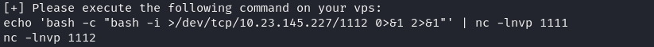
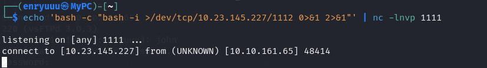
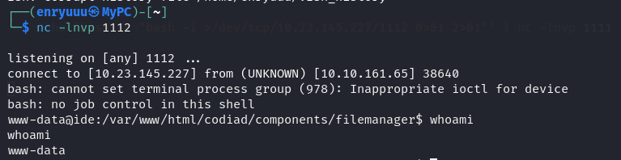

## Phase 6: Lateral Movement to drac and the First Flag

`/home` held a second, more interesting user: `drac`. Their home directory was readable, and a look inside `.bash_history` turned up a plaintext MySQL login command, password included.

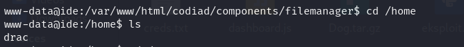
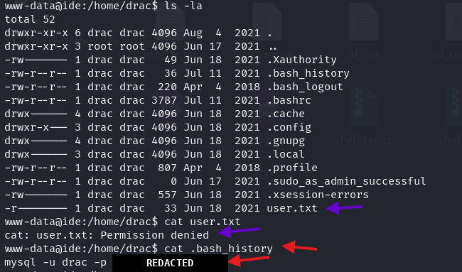

MySQL's own client wasn't even installed on the box, so the credential couldn't be used the way it was originally typed. But a password used once in a terminal is rarely used in only one place. Trying the same string against `su drac` got a shell on the second try.

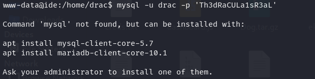
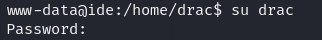
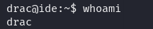

### First Flag

With a shell as `drac`, the first flag was sitting right there in the home directory.

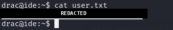

> **Security Issue #4:** One Password Reused Across Two Services. The password typed into a MySQL login command turned out to also be `drac`'s own login password for the box itself. Reusing one credential across a database account and an operating system account means leaking one instantly leaks both.

## Phase 7: Privilege Escalation to Root and the Second Flag

A quick `sudo -l` as `drac` showed a narrow but dangerous allowance: permission to run `/usr/sbin/service vsftpd restart` as any user, with no further restriction.

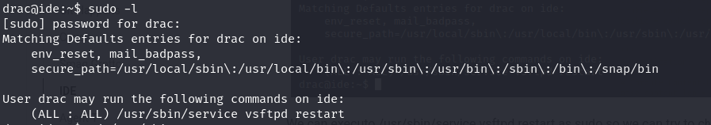

That alone isn't dangerous unless something else lines up with it, and here it did. The systemd unit file for the vsftpd service, `/lib/systemd/system/vsftpd.service`, was writable by `drac`. Editing its `ExecStart` line meant choosing exactly what command systemd would run the next time the service restarted, as root.

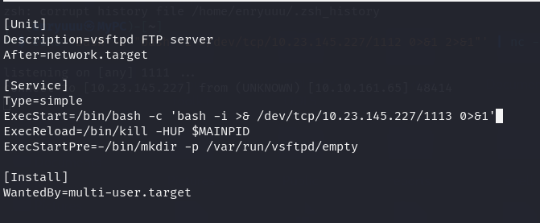

Restarting the service right after that produced a warning instead of the payload. systemd noticed the unit file had changed on disk and refused to use the new version until told to reload.

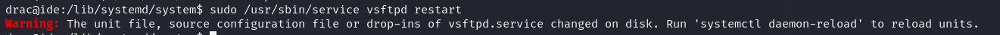

Running `systemctl daemon-reload` picked up the modified file, and running the restart command again executed the new `ExecStart` line as root.

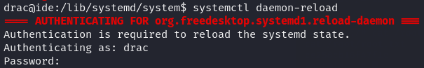
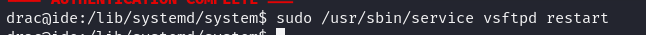

### Second Flag

A listener on the attacker machine caught the callback, confirming root access, and the second flag closed the room out.

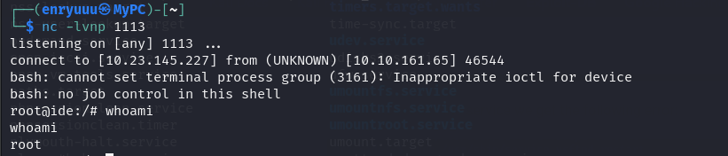
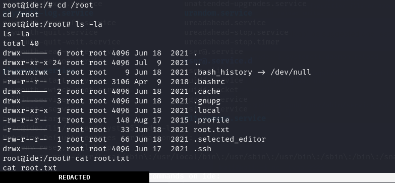

> **Security Issue #5:** Writable Service File Behind a Narrow Sudo Rule. A sudo rule that only allows restarting one service looks harmless on paper. It stops being harmless the moment that service's own configuration file can be edited by the same low-privileged user. At that point, "restart the service" and "run any command as root" are the same permission.

## Blue Team Perspective

Working back through this chain, here's what I think a defensive team would have caught, and where.

### 1. Sensitive Notes on Anonymous Shares

An anonymous FTP or file share should never be treated as private, no matter how the folders or files inside it are named. Fix: disable anonymous access where it isn't strictly required, and treat any shared drop folder as public by default. Never store credentials, resets, or internal notes there.

### 2. Default and Reused Passwords

A password still sitting on "the default one" long after an account reset, and a password reused across a database login and an OS login, are both single points of failure. Fix: force a password change on first login, and use unique, randomly generated credentials per system paired with a real secrets manager instead of memorized or reused strings.

### 3. Outdated Software With Known Exploits

Codiad 2.8.4 had public, working exploits by the time this box was live. Fix: track the versions of every internet-facing application against a CVE feed, and retire or replace software that is no longer actively maintained rather than leaving it exposed indefinitely.

### 4. Overly Trusting Sudo Rules

A sudo rule scoped to "restart this one service" is only as safe as the files that service depends on. Fix: lock down ownership and write permissions on systemd unit files and other service configuration to root only, and audit sudo rules for exactly this kind of indirect escalation path before granting them.


This write-up is part of my ongoing series documenting CTF challenges as I build my portfolio in cybersecurity. I approach each challenge from both offensive and defensive perspectives, because understanding both sides is what makes a well-rounded security professional.

If you're also on the journey toward a SOC or Security Engineering role, feel free to connect. I'm always happy to discuss techniques and share resources.
