# Include Writeup

**Machine Name:** Include  
**Platform:** TryHackMe  
**Difficulty:** Medium

---

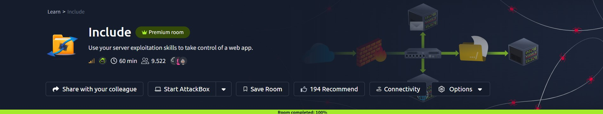

## Introduction

Include is a TryHackMe room built around a small web application called Review App, paired with a second internal tool called SysMon. On the surface it looks like a simple login page with a hint credential pair sitting right on the sign in screen. In practice, the room turns into a short chain of everyday web mistakes: an endpoint that trusts the wrong input, a form field that quietly merges into a user object it should never touch, a server that will fetch any URL it is given, and a file parameter that reads whatever path it is handed.

None of these bugs are exotic on their own. What makes Include interesting is how naturally they connect. A small authentication quirk leads to an admin panel, the admin panel leads to a server making requests on the attacker's behalf, and that server-side request forgery leaks the credentials for a second application entirely. From there, a file inclusion bug and an unauthenticated mail service combine into full command execution. Enumerate patiently, and one flaw after another opens the next door.

## Phase 1: Enumeration

A full port scan against the target returned eight open services, including SSH, mail related ports (SMTP, POP3, IMAP), and two web applications on ports 4000 and 50000.

Port 4000 turned out to be a Node.js application called Review App, fronted by a sign in page that openly advertised a hint pair of credentials.

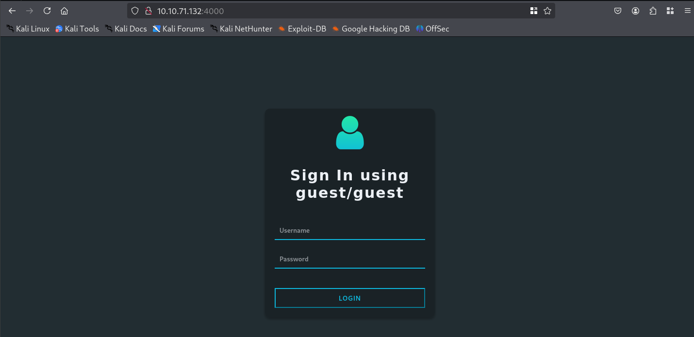

Port 50000 served a PHP application called SysMon, labelled as a "Restricted Portal" and clearly meant for internal system monitoring only.

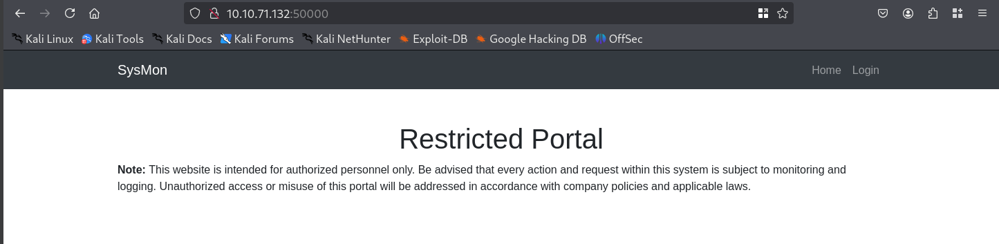

## Phase 2: Mapping Both Applications

A directory scan against port 4000 turned up little beyond the expected sign in routes, but one entry stood out: requesting `/signup` directly returned a server error instead of a normal response.

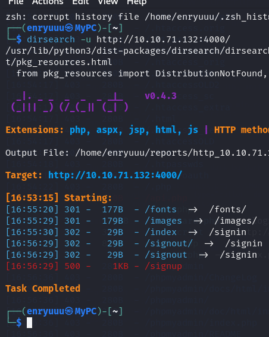

That error page leaked a full stack trace, including the application's internal folder path and the fact that it was built on Express.

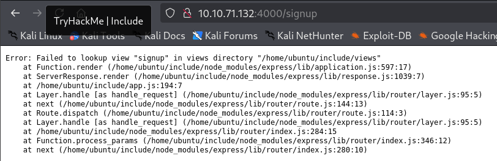

> **Security Issue #1:** Verbose Error Disclosure. A failed request to an internal route returned a full stack trace instead of a generic error, handing over the server's file structure and framework details for free.

A separate scan against port 50000 mapped out the SysMon application's file layout, including `profile.php`, `dashboard.php`, and an `uploads` directory, all of which would matter later in the room.

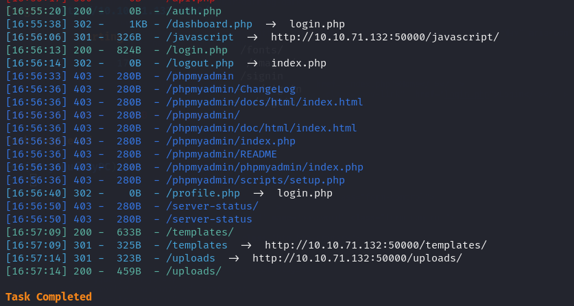

## Phase 3: A Sign In Page That Accepted a Sign Up

Rather than log in with the hinted guest credentials, the sign in request was intercepted in Burp and its path was changed from `/signin` to `/signup`, while keeping the same username and password fields.

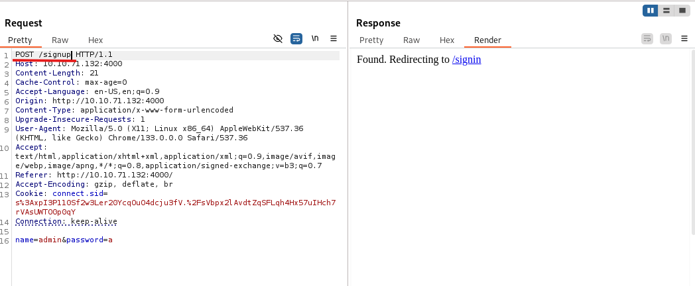

The application accepted this without complaint and registered a brand new account instead of validating a login attempt. Logging in with that freshly created account dropped straight onto the Review App dashboard.

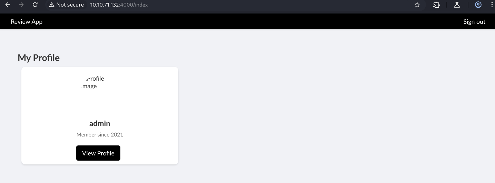

> **Security Issue #2:** Unrestricted Account Registration. The sign in and sign up logic shared the same backend without separating what each request was allowed to do, so simply changing the request path was enough to create an account outside the intended registration flow.

## Phase 4: Turning a Form Field Into Admin Access

Inside the app, the "Friend Details" page displayed a user's profile as a set of readable fields: id, name, age, country, and a boolean called `isAdmin`. Just below it sat an unrelated looking form labelled "Recommend an Activity."

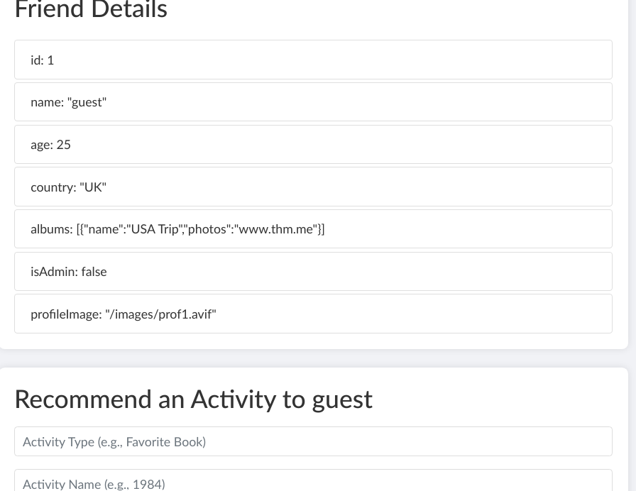

Submitting that form with an arbitrary field name and value caused a brand new key to appear inside the profile object above it. The form's input was being merged directly into the user record, with no filtering at all.

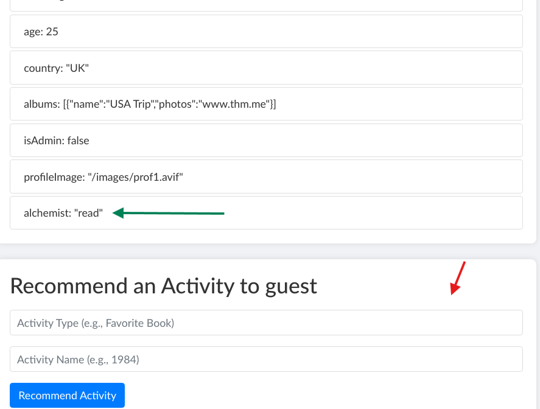

Repeating the trick with the field name `isAdmin` and a value of `true` flipped that flag on the account, and new navigation items labelled "API" and "Settings" appeared immediately.

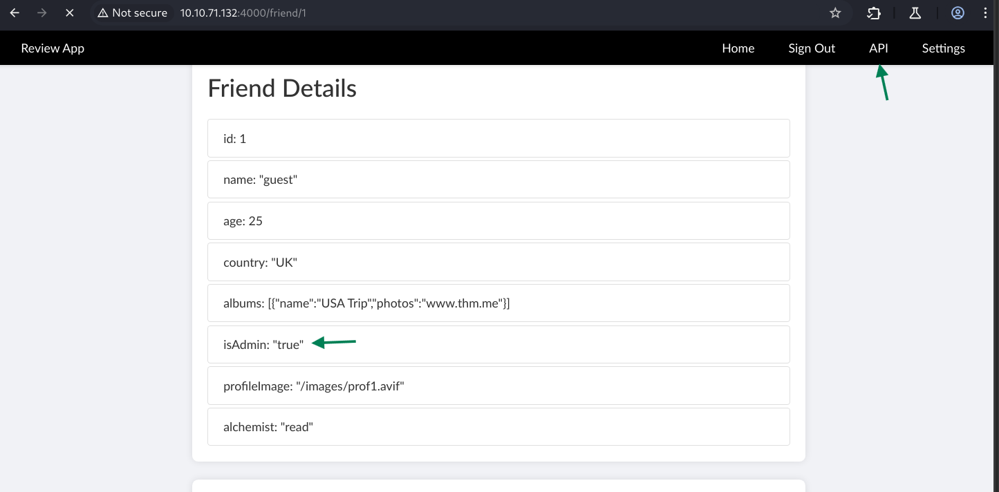

The new API dashboard listed two sample internal endpoints, complete with example responses. It read like a map of exactly what to target next.

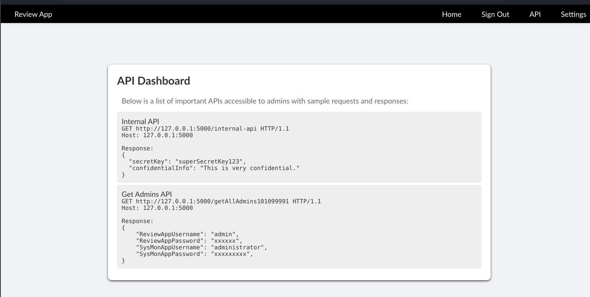

> **Security Issue #3:** Mass Assignment Privilege Escalation. The backend merged any field submitted through a public form directly into the user's data object with no allow list. A normal account could grant itself administrative rights just by naming the right field.

## Phase 5: Server-Side Request Forgery

The newly unlocked Settings page included a field for updating a banner image by URL, the kind of feature that fetches whatever address it is given without asking questions.

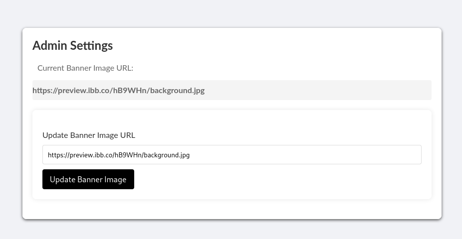

To confirm the theory, a local HTTP listener was stood up, and the banner field was pointed at it.

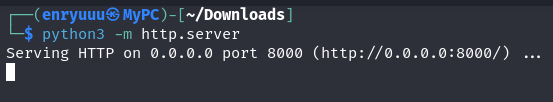

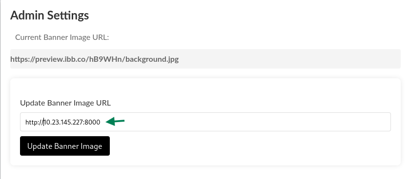

The listener logged an inbound request seconds later. The server really was fetching attacker-controlled URLs on its own.

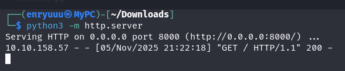

With that confirmed, the two internal API URLs from the earlier dashboard became the real targets.

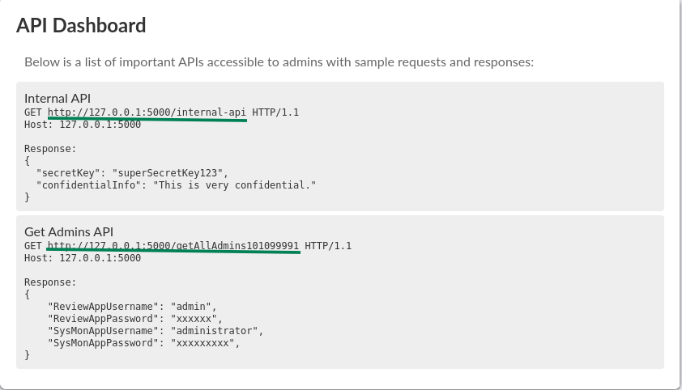

Pointing the banner field at the first internal URL caused the app to fetch it and hand the response straight back as a base64-encoded data URI.

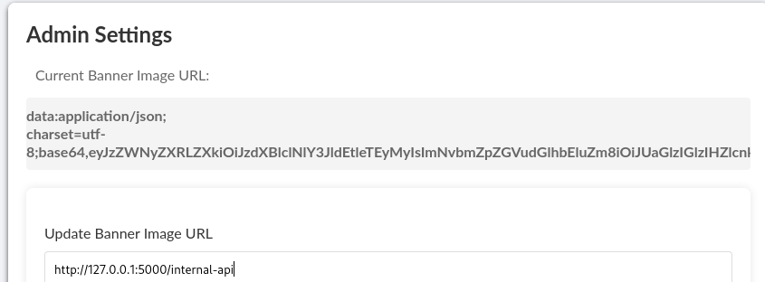

Decoded, it revealed an internal secret key.

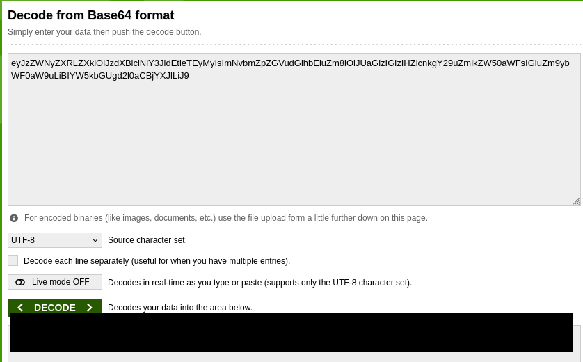

Repeating the request against the second internal URL, the one used to list admin accounts, returned something far more useful.

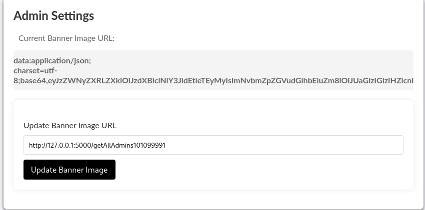

Once decoded, that response contained working login pairs for both Review App and SysMon.

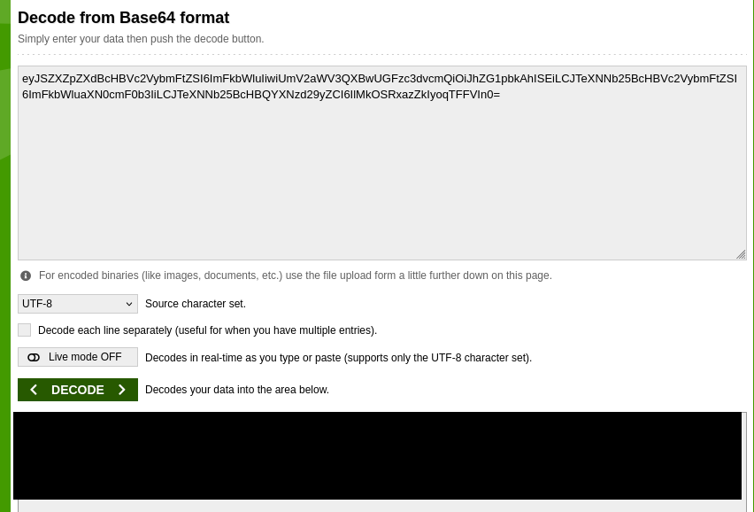

> **Security Issue #4:** Server-Side Request Forgery. A feature meant to fetch a banner image would happily reach internal-only endpoints on request and hand their raw responses back to the browser. A cosmetic setting turned into a path straight into the internal network.

### Flag 1

The leaked SysMon credentials logged in cleanly on port 50000. The dashboard opened up completely, flag included.

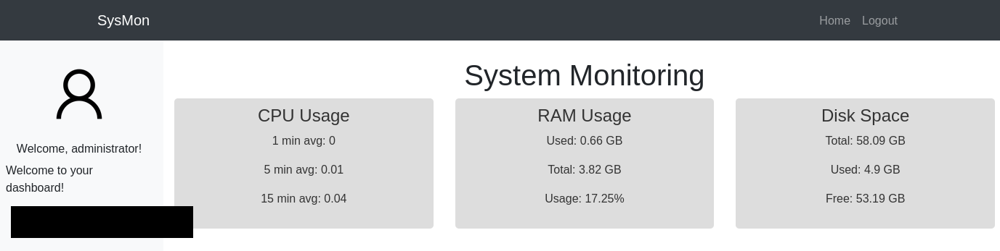

## Phase 6: Local File Inclusion

Viewing the SysMon dashboard's page source revealed that the profile picture was being loaded through a suspicious pattern: `profile.php?img=profile.png`.

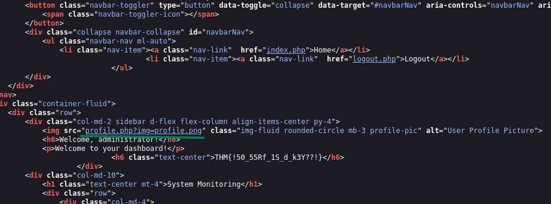

Requesting that endpoint directly returned the raw contents of whatever file the `img` parameter pointed to, rather than a rendered image, a strong signal of local file inclusion.

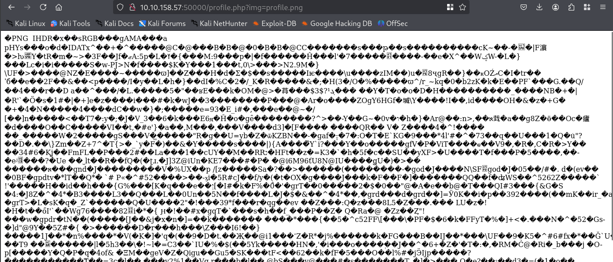

Standard traversal payloads were blocked, so the parameter was fuzzed with Burp Intruder using a public LFI payload list to find a filter bypass.

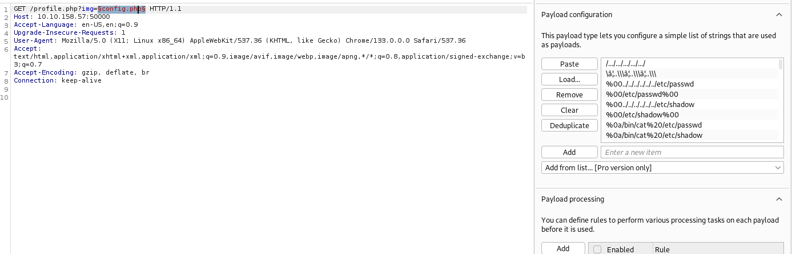

A doubled traversal pattern got past the filter and returned the full contents of `/etc/passwd`. Every local account on the box was right there in the response.

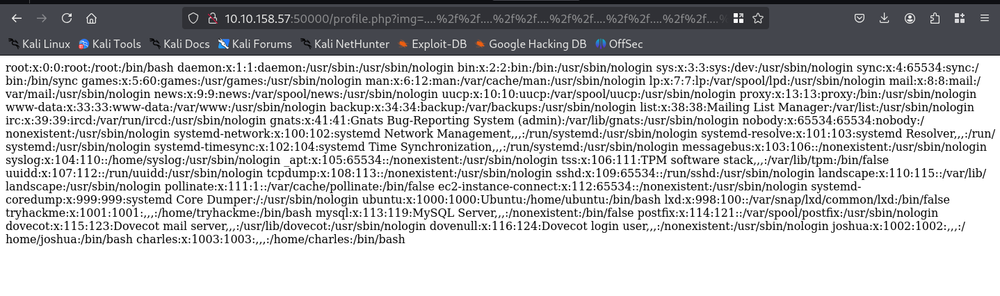

> **Security Issue #5:** Local File Inclusion. The image parameter accepted a raw file path with only a weak traversal filter in place, and a slightly modified payload was enough to read arbitrary files off the server.

## Phase 7: Log Poisoning to Remote Code Execution

With arbitrary file reads confirmed, attention turned to the mail service running on port 25. The same traversal technique successfully pulled up `/var/log/mail.log` through the vulnerable parameter.

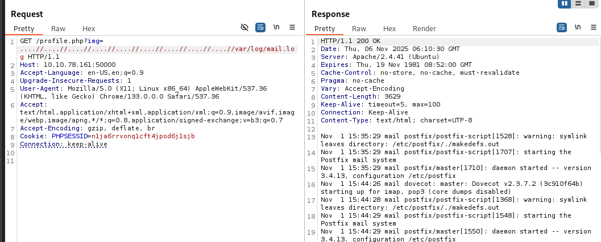

A test email sent directly over telnet confirmed that the sender address, unvalidated and fully attacker-controlled, was written straight into that same log file.

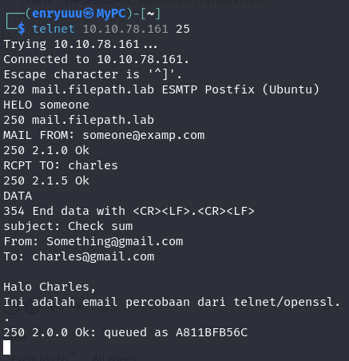

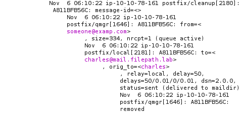

That was enough to attempt log poisoning. A second email went out with a small PHP payload placed in the sender field instead of a real address. The goal was to have that payload stored in the log as literal, unescaped text.

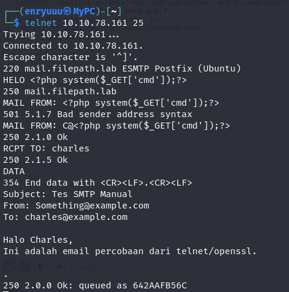

Reloading the poisoned log file through the LFI parameter confirmed the payload had landed inside it untouched.

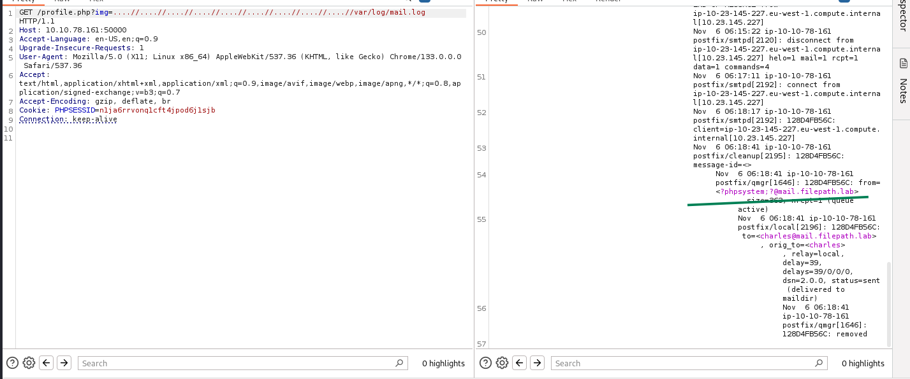

Because a PHP file inclusion executes any code inside the included file, appending a `cmd` parameter to the same request turned that poisoned log line into a live command runner. A quick `whoami` confirmed execution as `www-data`.

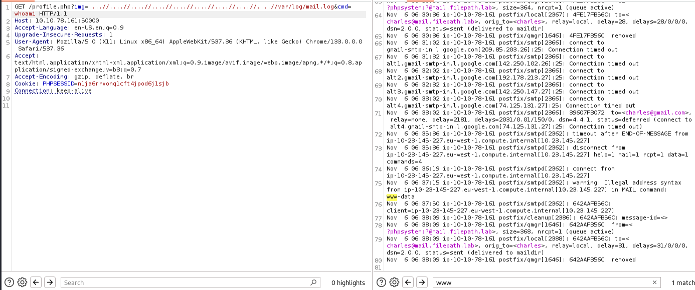

> **Security Issue #6:** Unauthenticated Mail Relay Enabling Log Poisoning RCE. The SMTP service accepted unvalidated sender data from anyone, and that same data could later be replayed through the file inclusion bug as executable PHP. Two separate, low severity issues added up to full remote code execution.

### Flag 2

From the newly gained shell, listing `/var/www/html` surfaced an oddly named hidden text file.

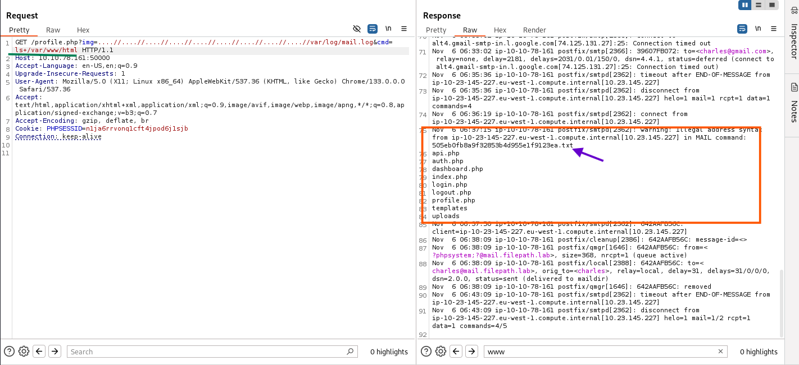

Reading it with `cat` through the same command execution channel returned the second flag.

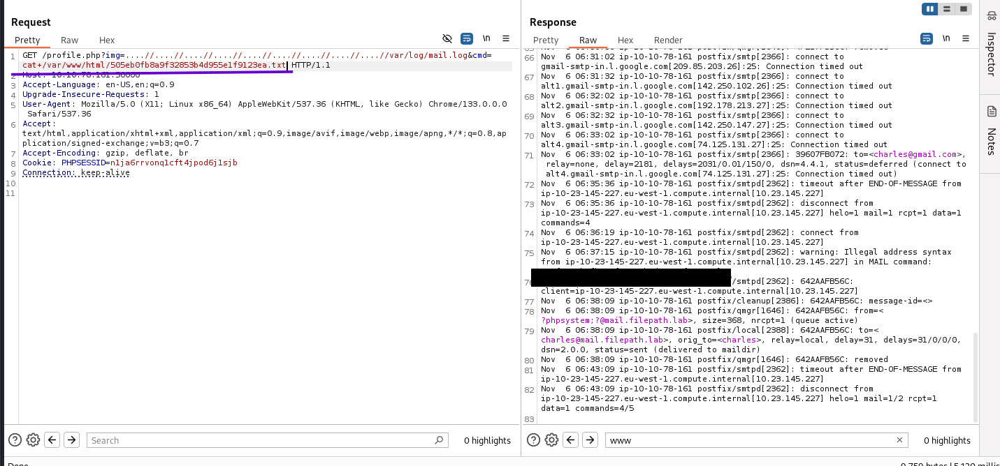

## Blue Team Perspective

Working back through this chain, here is what a defensive team could have caught, and where.

### 1. Enforce Server-Side Route and Method Authorization

An endpoint meant only for account registration accepted a repurposed login request with no extra checks. Every route should validate what kind of action it is actually performing server side, not simply trust whichever path the client happened to call.

### 2. Never Merge Unvalidated Client Data Into Sensitive Objects

A public-facing form was able to inject an arbitrary field, including a privilege flag, straight into a user record. Fields like `isAdmin` should never be settable through a normal user-facing form; use a strict allow list for anything the client is permitted to write.

### 3. Restrict Outbound Requests From the Server

The banner image feature would fetch any URL supplied to it, including internal-only services. Server-initiated requests should be limited to an approved destination list, and requests to internal or loopback addresses should be blocked outright.

### 4. Treat Log Files and File Parameters as Untrusted Input

A file parameter accepted a raw path with a weak filter, and a log file with attacker-influenced content was later included and executed as code. File paths need strict canonicalization against an allow list, and logs should never sit in a location or format that lets them be interpreted as executable content.

This write-up is part of my ongoing series documenting CTF challenges as I build my portfolio in cybersecurity. I approach each challenge from both offensive and defensive perspectives, because understanding both sides is what makes a well rounded security professional.

If you are also on the journey toward a SOC or Security Engineering role, feel free to connect. I am always happy to discuss techniques and share resources.
