# Investigating with Splunk Write-Up

**Machine Name:** Investigating with Splunk  
**Platform:** TryHackMe  
**Difficulty:** Medium

---

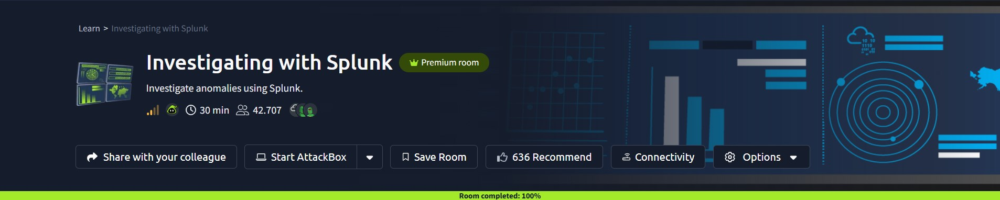

## Introduction

This write-up covers my run through Investigating with Splunk on TryHackMe, a blue-team room built around a suspected backdoor. The setup: I'm playing SOC Analyst Johny, and I've noticed anomalous behaviour across a handful of Windows machines. It looks like an adversary got access to some of them and successfully planted a backdoor. My job was to pull those logs into Splunk and work out what happened using only what was already logged.

## Phase 1: Confirming the Log Volume

_Objective: check how many events were actually ingested into the working index before digging into anything specific._

Before chasing anything, it's worth confirming there's data to work with in the first place. A bare `index="main"` search with the time range set to All time gives that count directly. No extra fields needed.

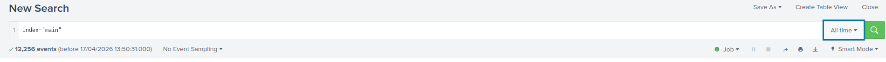

_A baseline `index="main"` search confirming the total event count before any filtering._

> **Key Artifact:** 12,256 events ingested into `index=main`. That's the full dataset this investigation pulls from.

## Phase 2: Finding the Backdoor Account

_Objective: identify the new user account the adversary created on one of the infected hosts._

Windows logs account creation under Event ID 4720 every time, no exceptions. Filtering for it and tabling `TargetUserName`, `SubjectUserName`, and `Hostname` turns a haystack into a single row.

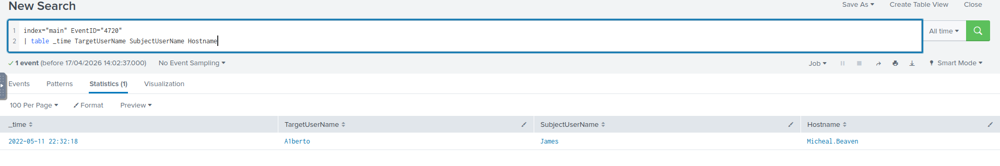

_Filtering on EventID 4720 surfaces the one account-creation event in the dataset._

> **Key Finding:** The account `A1berto` was created by `James`, on host `Micheal.Beaven`. Whatever happens next, this is where the persistence starts.

## Phase 3: Tracing the Registry Change

_Objective: find the full registry key path that was updated alongside the new account._

Account creation on Windows doesn't only write to the Security log. SAM database changes show up in Sysmon too, tagged Event ID 13 for a registry value set. Filtering that ID against the same host narrows things down to ten results, and one of them names the account directly.

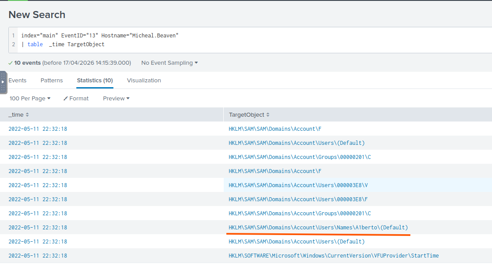

_Ten registry-modification events on the host, with the one referencing the new account underlined._

> **Key Artifact:** `HKLM\SAM\SAM\Domains\Account\Users\Names\A1berto`. The SAM database entry for the account, written the moment it was created.

## Phase 4: Spotting the Impersonation

_Objective: work out which real user the new account was designed to look like._

This is the part of the room that's genuinely clever. Pulling every distinct `TargetUserName` value across the whole index — deduped and sorted — surfaces something easy to miss on a quick scan: two entries that look identical, `A1berto` and `Alberto`, sitting one right after the other. Swap the digit `1` in for a lowercase `l` and most fonts won't show you the difference.

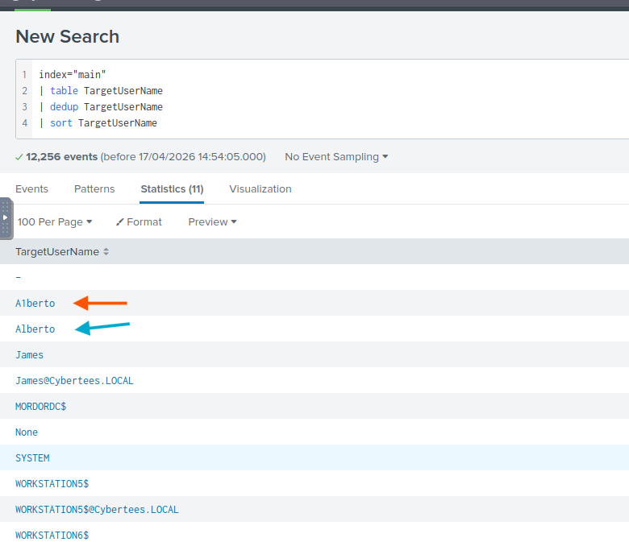

_Deduplicating and sorting every username in the index puts the two lookalike accounts side by side._

> **Key Finding:** The backdoor account `A1berto` is a one-character typosquat of a legitimate account, `Alberto`. It wasn't a random name — it was picked to survive a glance.

## Phase 5: Recovering the Remote Creation Command

_Objective: recover the exact command line used to plant the backdoor account._

With the account and the host both known, the next question is how it got there. Event ID 1 covers process creation, so I searched for it and tabled the `CommandLine`, `Image`, and `ParentImage` fields — 25 events came back.

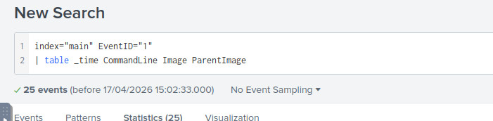

_The process-creation search, tabling the fields that matter for this question._

One row in that table stands out from the rest.

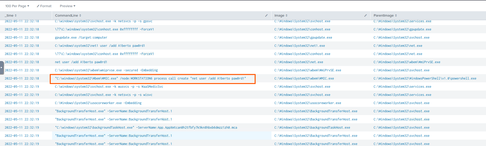
_A WMIC call spawned from a PowerShell parent process — the row that answers the question._

> **Key Artifact:** `"C:\windows\System32\Wbem\WMIC.exe" /node:WORKSTATION6 process call create "net user /add A1berto paw0rd1"`. The parent process was `powershell.exe`, not a logged-in user typing at a keyboard — the account was created remotely, through WMI, from an existing foothold.

## Phase 6: Checking Whether the Backdoor Was Ever Used

_Objective: determine how many times the backdoor account actually logged in during the incident._

A backdoor account is only useful once someone logs into it. Windows records successful logons under Event ID 4624 and failed ones under 4625, so checking both for `A1berto` should say whether it was ever touched.

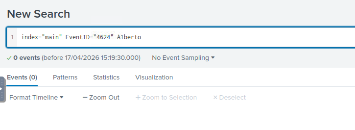

_No successful logons for the account._

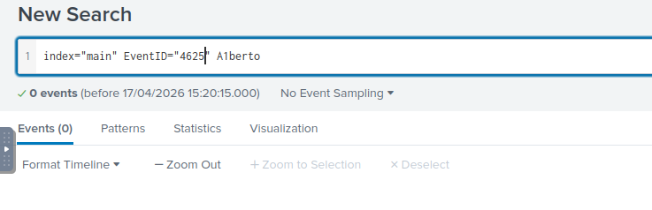

_No failed logons either._

> **Key Finding:** Zero login attempts, successful or failed. The account exists, but nobody used it — at least not in the window this dataset covers. It reads like a backup access point staged for later, not something the attacker needed yet.

## Phase 7: Locating the Second Compromised Host

_Objective: identify the machine where the suspicious PowerShell activity was actually executed._

Up to this point, every trail has led back to `Micheal.Beaven`. Pulling Event ID 1 across the whole index again — this time with the `Hostname` field included — shows that isn't the only machine involved.

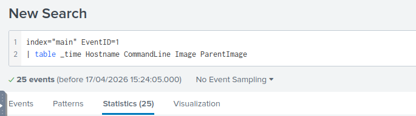

_Same process-creation event ID, this time with the host included in the table._

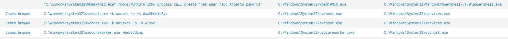

_A cluster of activity tied to a different host than the one from Phase 2._

> **Key Finding:** `James.browne`. A second, distinct host from the one where the backdoor account landed — the room, true to its "a few Windows machines" framing, has more than one victim.

## Phase 8: Sizing the Malicious PowerShell Activity

_Objective: measure how much logging exists for the malicious PowerShell execution._

PowerShell logging splits across two event IDs: 4104 for script-block content, 4103 for module logging. Checking 4104 first comes back empty.

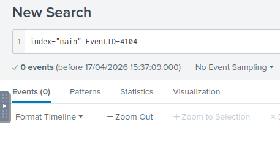

_Script-block logging: nothing._

Checking 4103 tells a different story.

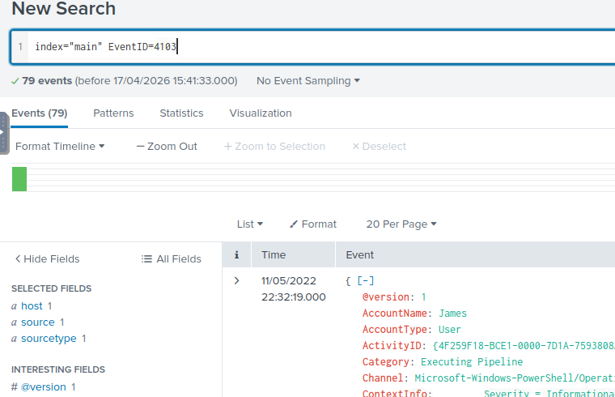
_Module logging: 79 events, including a decodable command field._

> **Key Artifact:** 79 events under Event ID 4103. That gap between the two IDs is worth noting on its own — script-block logging staying quiet while module logging fills in is exactly the kind of detail that decides whether a SIEM catches an attack or misses it.

## Phase 9: Decoding the Callback URL

_Objective: recover the full URL the encoded PowerShell script reached out to._

The 4103 events carry a `Host Application` field, and inside it sits a `powershell.exe -enc` call with a long Base64 blob attached. It's a common way to slip a PowerShell one-liner past casual log review — it just doesn't survive a decode.

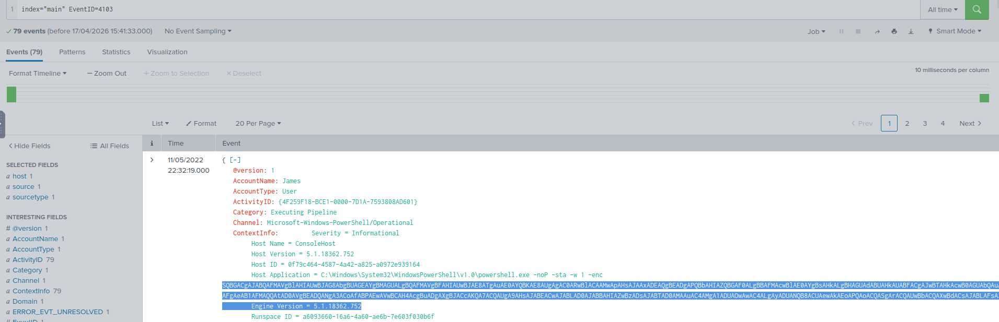

_The `-enc` flag and the Base64 payload sitting in the Host Application field._

Feeding it into CyberChef with a From Base64 step and a UTF-16LE text decode (PowerShell writes `-enc` payloads in UTF-16, not plain ASCII) unpacks into a full script, one that disables AMSI and turns off PowerShell script-block logging before doing anything else. That explains why Event ID 4104 came back empty earlier: the malware switched it off on its way in.

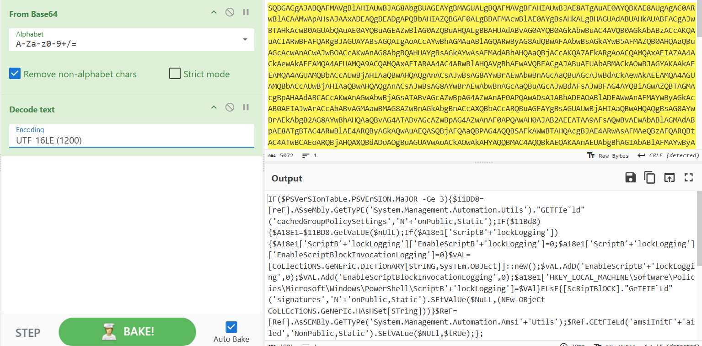

_The decoded script's opening lines: disabling AMSI and script-block logging before continuing._

Buried further into that same decoded script is a second, much shorter Base64 string, assigned to a variable called `$ser`. Decoding that one directly gives up an IP address, with a nearby `$t` variable holding `/news.php`.

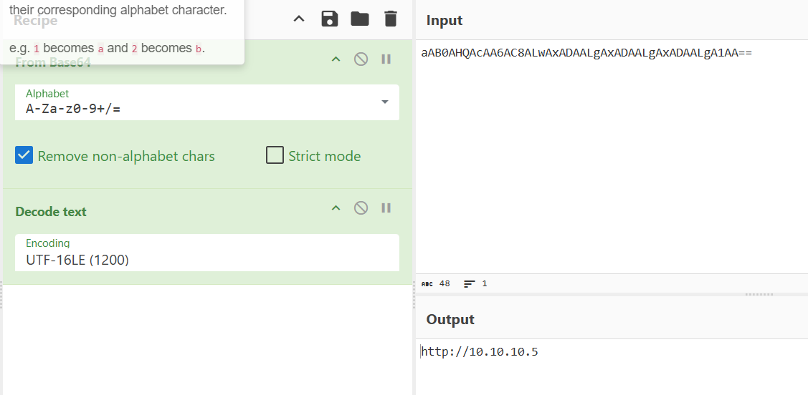

_The second, smaller payload decodes straight to an IP address._

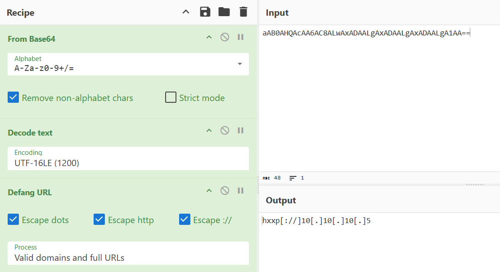

_Defanging the reconstructed URL for safe reporting._

> **Key Artifact:** `hxxp[://]10.10.10.5/news[.]php`. Combine the decoded IP with the `/news.php` path pulled from the same script, and that's the address the payload was calling out to.

## Reconstructed Attack Chain

Pulled together, the individual answers line up into one sequence:

1. From an existing PowerShell foothold, the attacker issued a WMIC command targeting `WORKSTATION6`, remotely creating a local account (`net user /add A1berto paw0rd1`) — logged on host `Micheal.Beaven`.
2. The new account name, `A1berto`, was a one-character typosquat of a real account, `Alberto`, built to blend in during a casual review.
3. The creation also wrote a matching SAM registry entry: `HKLM\SAM\SAM\Domains\Account\Users\Names\A1berto`.
4. The account was never used. zero logon attempts, successful or failed, which reads more like staged backup access than something the attacker needed right away.
5. On a second host, `James.browne`, the attacker ran obfuscated PowerShell that disabled AMSI and script-block logging before doing anything else, which is why that event ID shows nothing.
6. That execution still generated 79 module-logging events (Event ID 4103), which is what made it visible at all.
7. Decoding the payload inside those events revealed a callback to `hxxp[://]10.10.10.5/news[.]php`, the adversary's external contact point.

This write-up is part of my ongoing series documenting CTF challenges as I build my portfolio in cybersecurity. I approach each challenge from both offensive and defensive perspectives, because understanding both sides is what makes a well-rounded security professional.

If you’re also on the journey toward a SOC or Security Engineering role, feel free to connect — I’m always happy to discuss techniques and share resources.
