# Invite Only Writeup

**Machine Name:** Invite Only  
**Platform:** TryHackMe  
**Difficulty:** Easy

---

## Introduction

This write-up covers my run through Invite Only on TryHackMe, a blue team room built around a threat intelligence investigation rather than a machine to exploit. The setup: I'm playing a SOC analyst at TrySecureMe, a managed service provider, and an L1 analyst has already flagged two indicators, a SHA256 hash and an IP address, then passed them up for deeper analysis. There's no shell to grab and no host to log into here. Just two raw indicators, VirusTotal, and whatever open source research it takes to turn them into an actual picture of the campaign behind them.

## Phase 1: Identifying the Flagged File

_Objective: resolve the flagged SHA256 hash to an actual file._

With nothing to go on but a hash, the obvious first move is checking whether anyone else has already seen it. Pasting `5d0509f68a9b7c415a726be75a078180e3f02e59866f193b0a99eee8e39c874f` into VirusTotal returns an immediate hit. 55 out of 72 vendors flag it, and the sample carries the name `syshelpers.exe`.

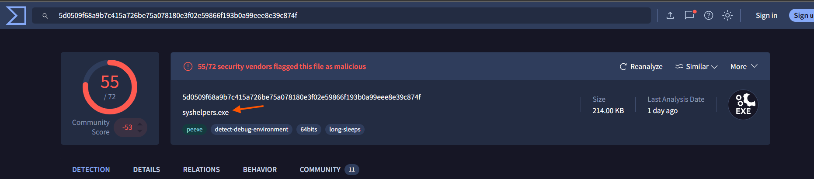

_The flagged hash resolves straight to a named file with a clear detection rate._

> **Key Artifact:** `syshelpers.exe`, flagged by 55/72 vendors on VirusTotal.

## Phase 2: Confirming the File Type

_Objective: work out what kind of file this actually is._

The Details tab fills in the basic profile. `syshelpers.exe` is a Win32 EXE, tagged `pe`, `peexe`, and `executable`. A standard Windows binary, nothing exotic about the format itself.

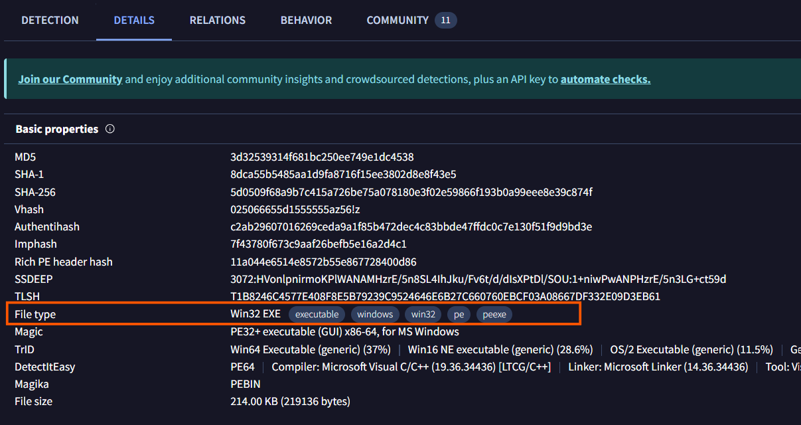

_The basic properties section confirms the sample is a Win32 executable._

> **Key Artifact:** File type `Win32 EXE`.

## Phase 3: Tracing the Execution Parents

_Objective: find out what actually launched this file._

Two Execution Parents show up under the Relations tab, and the order they're listed in matters. First a PowerShell object named `361GJX7J`, then a Win32 EXE named `installer.exe`. A script ran first and handed off to a compiled binary, which is a fairly typical shape for a staged infection.

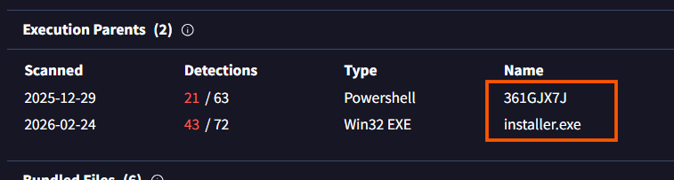

_Two execution parents, listed in the order they ran._

> **Key Finding:** Execution parents, chronologically: `361GJX7J`, then `installer.exe`.

## Phase 4: Identifying the Dropped Payload

_Objective: find what `installer.exe` itself dropped onto the system._

Scrolling further down the same Relations tab surfaces the Dropped Files section for `installer.exe`. One entry stands out here: `AClient.exe`. Worth noting the hash down too, since it comes back up later.

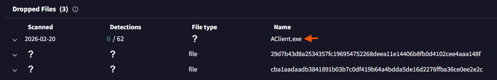

_`installer.exe` drops a second executable, `AClient.exe`._

> **Key Artifact:** `AClient.exe`, dropped directly by `installer.exe`.

## Phase 5: Mapping the Installer's Full Toolkit

_Objective: pull the second execution parent (`361GJX7J`) and see what it dropped._

The PowerShell parent hash has a much longer Dropped Files list attached to it, 33 entries in total. Most look incidental, but four read as clearly malicious: two executables and two VBScript files. Read top to bottom, they are `searchhost.exe`, `syshelpers.exe`, `nat.vbs`, and `runsys.vbs`. Seeing `syshelpers.exe` again here is what ties this list straight back to Phase 1.

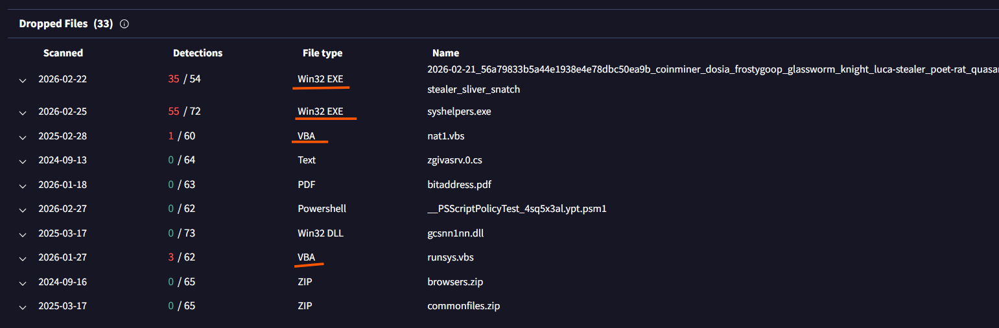

_A single PowerShell stage was responsible for planting the entire toolkit below it._

> **Key Finding:** Four malicious dropped files, in order: `searchhost.exe`, `syshelpers.exe`, `nat.vbs`, `runsys.vbs`.

## Phase 6: Attributing the Malware Family

_Objective: work out what actually links every one of these files together._

The flagged IP has its own VirusTotal report, and its Communicating Files list a few familiar names: `winhelper.dll`, `installer.exe`, `syshelp.exe`. My first instinct was that the malware family had to be sitting somewhere in that list, so I went through each file's individual report looking for a name. None of them gave one up directly, and that dead end cost some time.

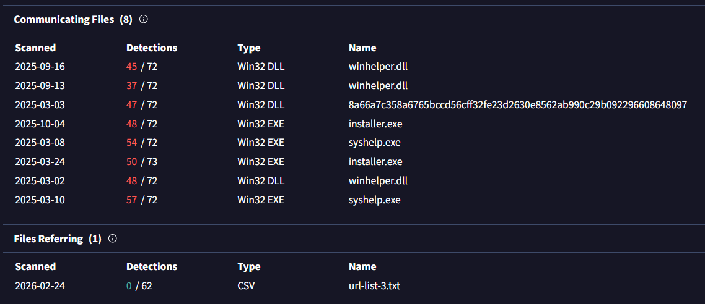

_Files communicating with the flagged IP, none individually naming a malware family._

The answer was sitting in the Community tab instead. Another researcher had already posted an IOC context comment tying the C2 IP directly to AsyncRAT, a remote access trojan commonly used for persistence, remote control, and data theft.

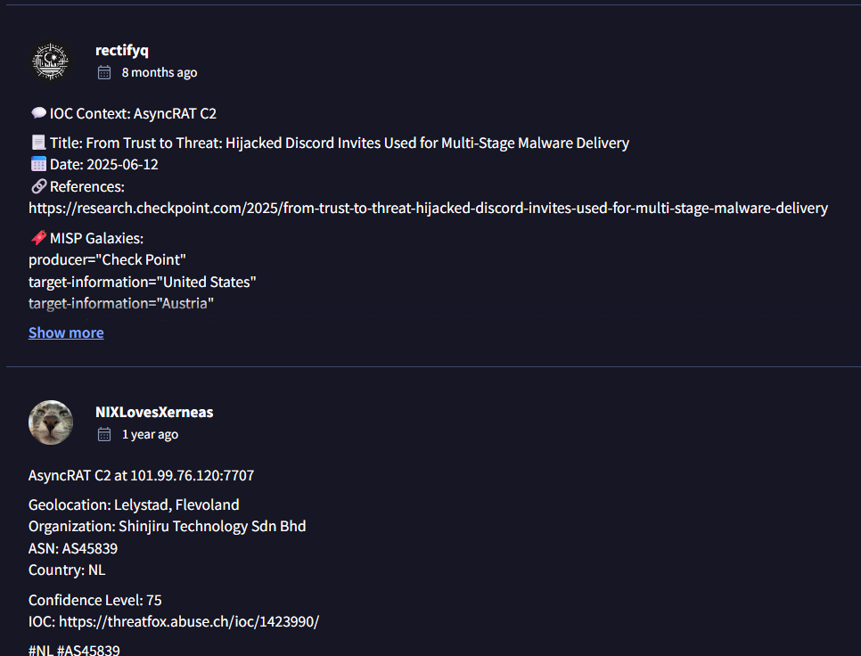

_A community IOC comment fills the gap the automated detections left open._

> **Key Finding:** AsyncRAT, confirmed via a community comment rather than any individual file's detection tags.

## Phase 7: Locating the Original Threat Intelligence Report

_Objective: find the public research these indicators were originally pulled from._

That same comment naming AsyncRAT also cited a report title: "From Trust to Threat: Hijacked Discord Invites Used for Multi-Stage Malware Delivery," published by Check Point Research in June 2025.

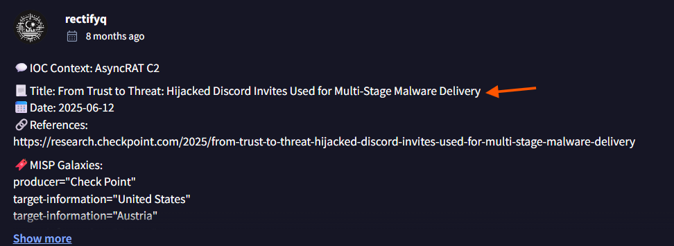

_The comment doubles as a citation, pointing straight to the source report._

> **Key Artifact:** "From Trust to Threat: Hijacked Discord Invites Used for Multi-Stage Malware Delivery," Check Point Research.

## Phase 8: Identifying the Cookie Theft Tool

_Objective: find out how the attackers pulled cookies out of Chrome._

The report itself covers this in its section on post-exploitation credential theft. The tool named there is ChromeKatz, made specifically to pull cookies out of Chrome even on newer versions with tighter cookie protections.

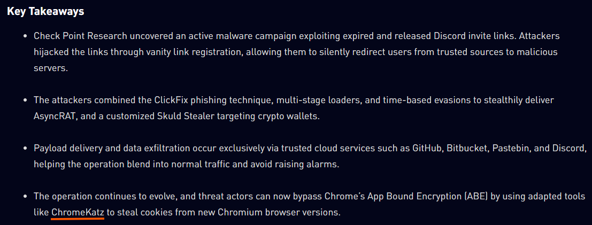

_The report attributes cookie theft to a dedicated tool rather than a generic script._

> **Key Artifact:** ChromeKatz, used for stealing Chrome cookies and hijacking sessions.

## Phase 9: Identifying the Phishing Technique

_Objective: find out how victims were tricked into running anything in the first place._

The initial hook is a technique called ClickFix. A fake verification step walks the victim through copying and pasting a command themselves. No exploit involved, just a convincing enough prompt and a victim willing to follow it.

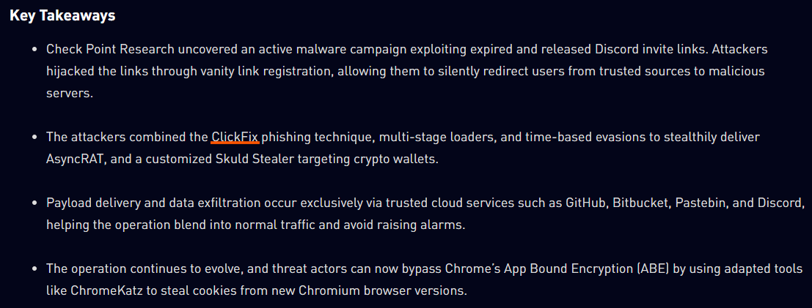

_ClickFix relies on the victim doing the work of infecting their own machine._

> **Key Artifact:** ClickFix, the social engineering technique behind the initial infection.

## Phase 10: Identifying the Redirect Platform

_Objective: find out where victims were coming from before they ever touched the malicious infrastructure._

Discord turns out to be the platform behind all of it. Attackers reclaimed expired or deleted Discord invite links through the platform's vanity link system, so anyone who still trusted an old invite shared on a forum or a blog got quietly redirected into the attacker's own server instead of the one they expected.

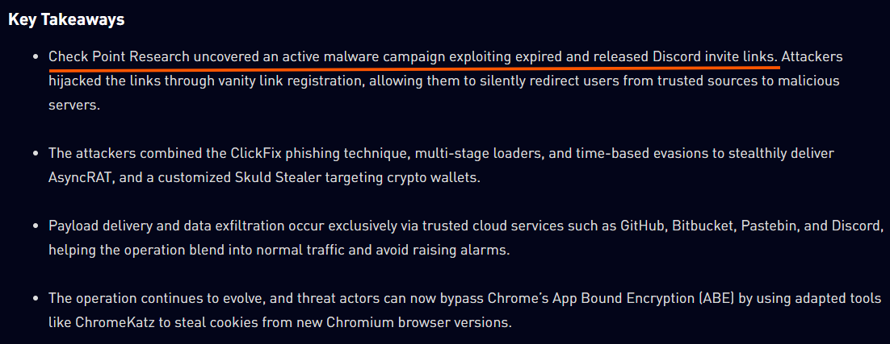

_Old, previously trusted invite links became the entry point for the whole campaign._

> **Key Finding:** Discord, exploited through hijacked invite links rather than any flaw in the malware itself.

## Reconstructed Campaign Overview

Pulled together, the individual answers line up into one sequence:

1. A flagged SHA256 hash resolves to `syshelpers.exe`, a Win32 EXE flagged by 55 of 72 vendors on VirusTotal.
2. Its execution lineage traces through two parents in order: a PowerShell object (`361GJX7J`) followed by `installer.exe`.
3. `installer.exe` drops a secondary payload, `AClient.exe`.
4. The PowerShell parent alone accounts for a much larger toolkit, including `searchhost.exe`, `syshelpers.exe`, `nat.vbs`, and `runsys.vbs`.
5. Pivoting to the flagged C2 IP and reading community comments on VirusTotal ties every file in the chain to the AsyncRAT malware family.
6. That same comment points to the original public research, Check Point's "From Trust to Threat: Hijacked Discord Invites Used for Multi-Stage Malware Delivery."
7. The report fills in the rest of the kill chain: attackers hijacked expired Discord invite links to redirect victims, used ClickFix to get them to run a malicious command by hand, then later deployed ChromeKatz to steal Chrome cookies for session hijacking.

This write-up is part of an ongoing series where I document CTF rooms as I build my portfolio in cybersecurity. I try to work through each room from both angles, offense and defense, since that balance is what a solid SOC or security role actually asks for.

If you're also working toward a SOC or Security Engineering role, feel free to connect. I'm always happy to compare notes on techniques and share resources.
