# Jack-of-All-Trades Writeup

**Machine Name:** Jack-of-All-Trades  
**Platform:** TryHackMe  
**Difficulty:** Easy

---

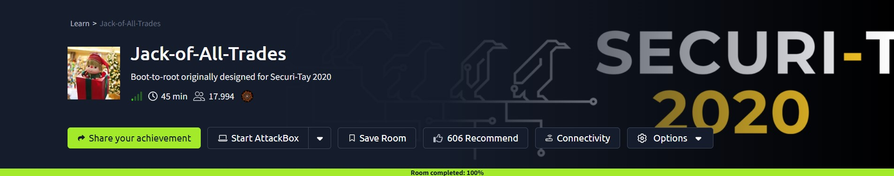

## Introduction

This write-up covers Jack-of-All-Trades, an easy-difficulty TryHackMe room built around Jack, a toymaker hired by a local zoo to help recapture a group of escaped penguins. Underneath the theme is a fairly ordinary chain: a comment left in the page source that gives away a hidden login path, a password hidden inside an image using nothing more than a shared passphrase, a recovery form that runs whatever command you hand it, a password list left sitting in a directory it should never have been in, and a system binary carrying a permission bit that was never meant to be there.

None of these are exotic bugs. They're the kind of small, everyday mistakes that show up in real applications too. That's exactly what made the room worth documenting properly instead of just screenshotting my way to the flag.

## Phase 1: Enumeration and a Very Confusing Port Scan

A full TCP scan against the target came back with two open ports, but not in the configuration you'd expect:

```
nmap -p- -sV -sC <TARGET_IP>

PORT   STATE SERVICE VERSION
22/tcp open  http    Apache httpd 2.4.10 ((Debian))
|_http-server-header: Apache/2.4.10 (Debian)
|_http-title: Jack-of-all-trades!
80/tcp open  ssh     OpenSSH 6.7p1 Debian 5 (protocol 2.0)
```

Port 22, normally SSH, was serving a web page. Port 80, normally HTTP, was running SSH. Nothing was broken; the services had simply been swapped. Browsers refuse to load pages on port 22 by default since it's flagged as a restricted port, so the site wouldn't open at first.

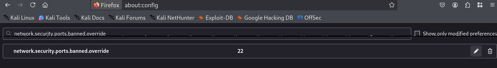

Overriding `network.security.ports.banned.override` in Firefox's `about:config` and setting it to `22` let the browser through, and the homepage finally loaded: a "Welcome to Jack-of-all-trades!" landing page introducing Jack as a toymaker with a fondness for dinosaurs.

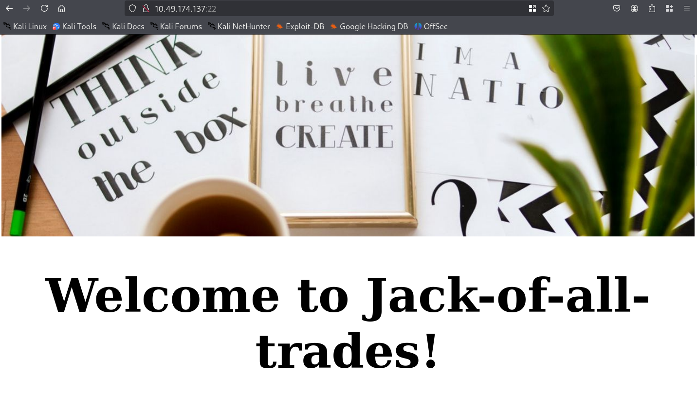

## Phase 2: A Comment That Wasn't Meant to Be Read

Viewing the page source turned up a note-to-self left in an HTML comment: a reminder that if Jack ever gets locked out, he can recover access at `/recovery.php`, followed by a Base64-encoded block sitting right underneath it.

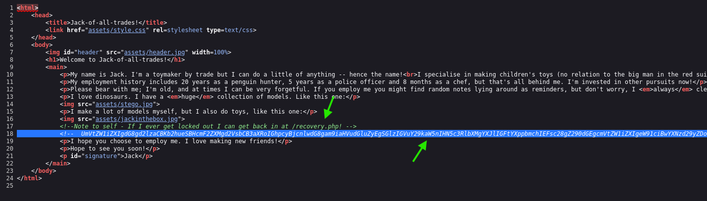

Decoding the Base64 string produced a short note that mentioned a friend, Johny Graves, and ended with what looked like a password.

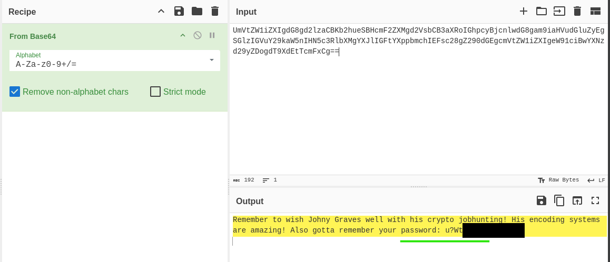

> **Security Issue #1:** Sensitive Notes Left in Public Source Code. A developer's private reminder, including a login path and what reads like a password, was sitting in plain HTML comments, visible to anyone who opened the page source. Comments like this should never make it past a local dev environment.

## Phase 3: The Recovery Page and a Trail of Encodings

`/recovery.php` turned out to be a simple username/password recovery form addressed directly to Jack.

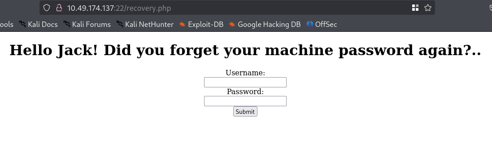

Submitting the credentials found in the comment didn't return an error, but it didn't log in either, just a blank non-response. Checking the page source after the failed attempt revealed yet another encoded string.

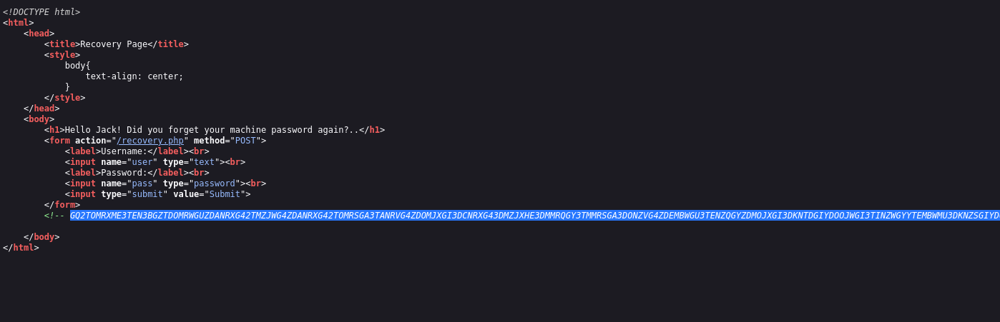

This one took a few more steps to unravel. Base32 decoded into a block of hex, and the hex turned into a string of letters that clearly wasn't English, but also didn't look like standard Base64 or Base32 output. I sat on that step longer than I'd like to admit before recognizing it as ROT13.

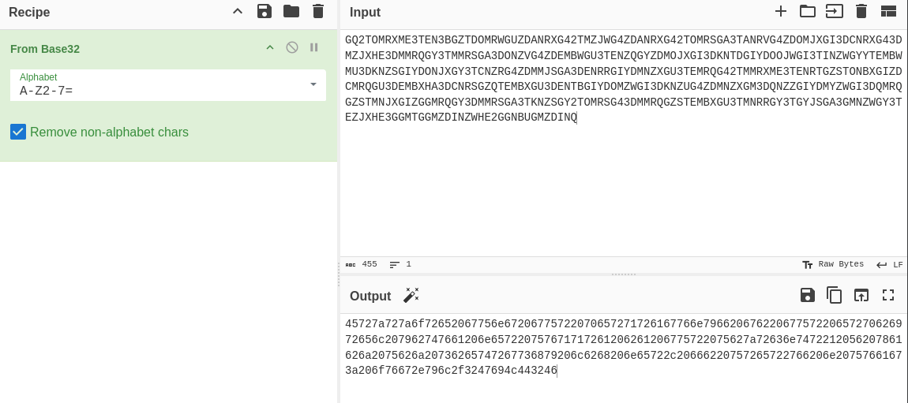
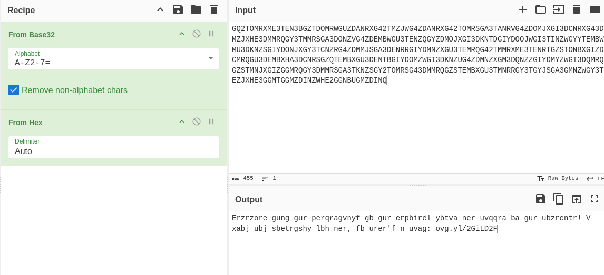
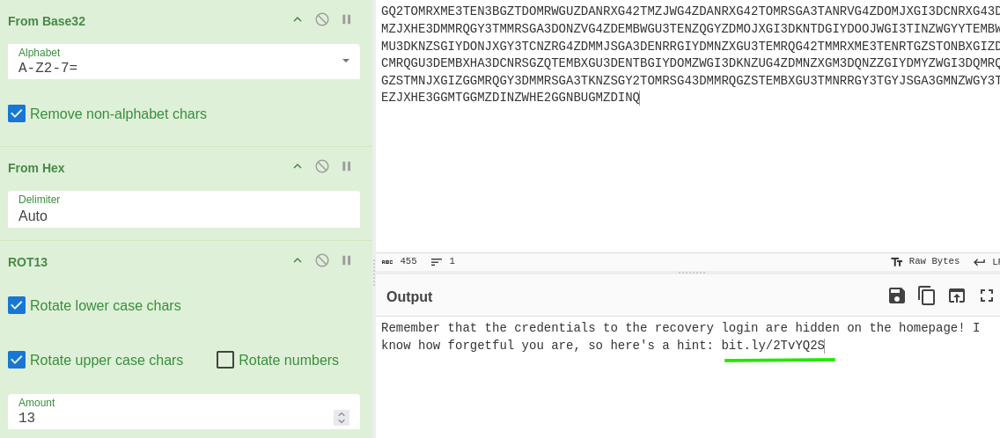

Decoded, it pointed to a shortened link with a reminder that the real credentials were hiding somewhere on the homepage.

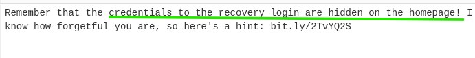

Following the link redirected to Wikipedia's article on Stegosauria: dinosaurs, again, and a fairly direct hint toward steganography.

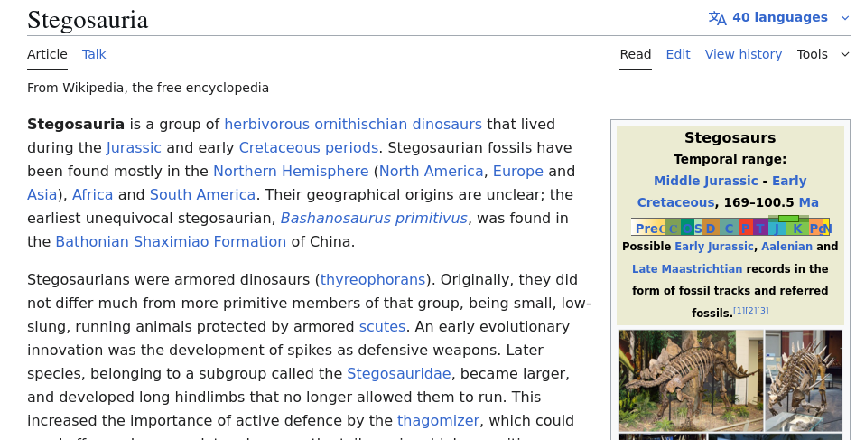

## Phase 4: Hunting for the Right Image

The homepage had more than one image to try. First up was the Stegosaurus model Jack mentioned in his introduction.

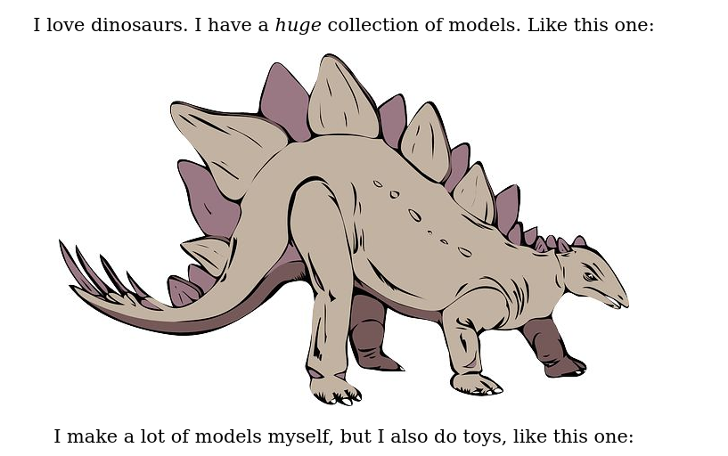

An EXIF check on the saved image didn't turn up anything, but `steghide`, using the password recovered earlier as the passphrase, successfully extracted a hidden file.

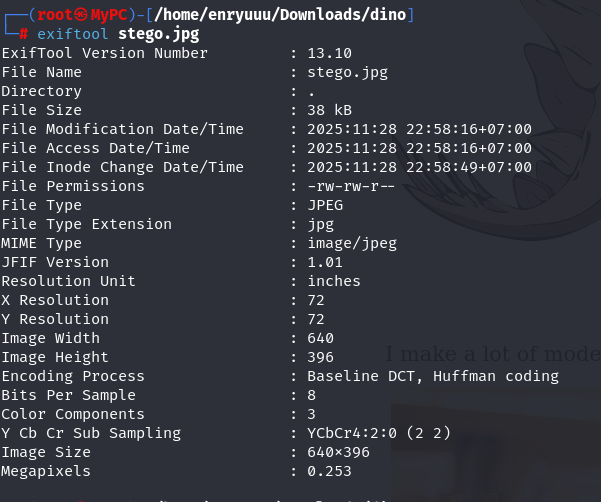
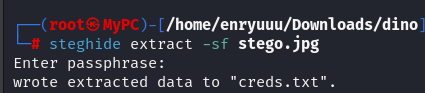

The extracted note was a troll: "Hehe. Gotcha! You're on the right path, but wrong image!"

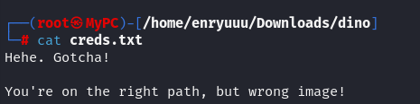

A second toy image on the homepage, a jack-in-the-box figure saved as `santa.jpg`, seemed like the next candidate. No luck there either; `steghide` couldn't extract anything from it with the same passphrase.


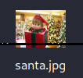
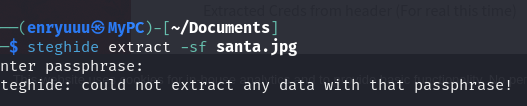

The image that finally worked was the last one left: the site's own banner/header image at the top of the homepage.


`steghide` extracted a real credential pair this time.

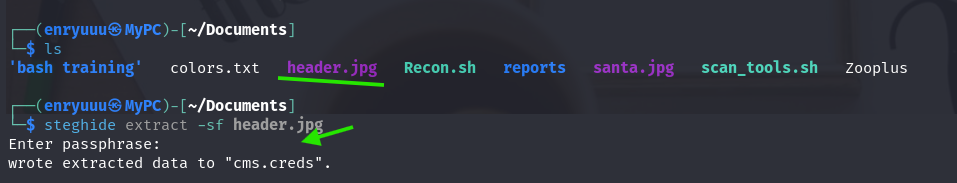
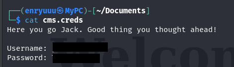

> **Security Issue #2:** Steganography Was Used as the Only Layer of Protection. Hiding credentials inside an image file only delays discovery; it doesn't prevent it. Once the passphrase and the right file were both known, the "hidden" credentials were extracted in one command. Steganography can be one layer of a defense, but it should never be the only one standing between an attacker and valid credentials.

## Phase 5: Command Execution, Handed Over Politely

Logging in through `/recovery.php` with the extracted credentials worked, redirecting to a randomly-named directory hosting a small control panel with a direct invitation: "GET me a 'cmd' and I'll run it for you, Future-Jack."

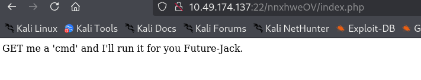

Appending `?cmd=whoami` to the URL executed the command server-side and returned `www-data`. No filtering, no restrictions, just straight execution.

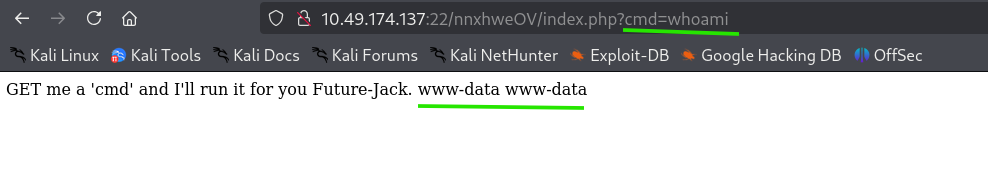

> **Security Issue #3:** A "Recovery" Feature That Runs Arbitrary Commands. Once past the login, the panel executed anything passed through a `cmd` GET parameter with no validation, sandboxing, or restriction. A feature built for account recovery had effectively become a remote shell with a web form bolted onto it.

## Phase 6: From Command Execution to a Real Shell

The `cmd` parameter could run one-off commands but wasn't interactive, so the next step was upgrading it to a proper shell. A reverse shell one-liner was generated and pointed at an attacker-controlled listener.

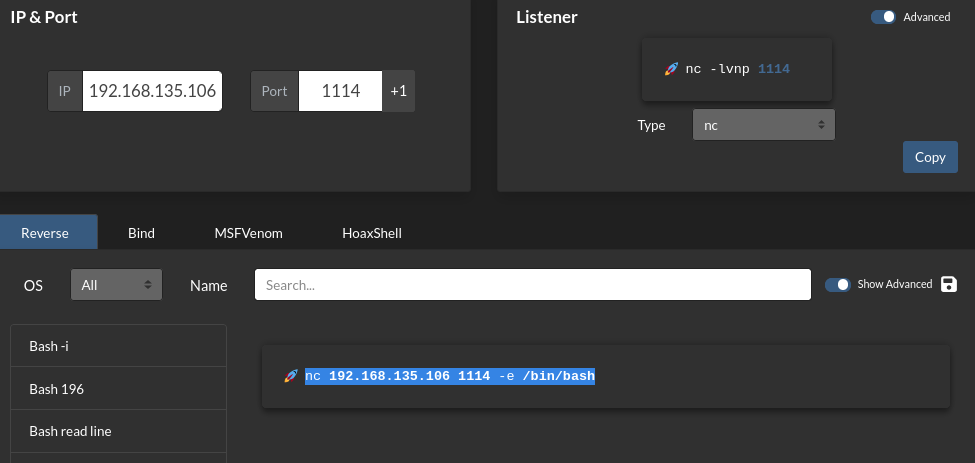

Passing that payload through the same `cmd` parameter and catching the callback on a listener produced an interactive shell as `www-data`.

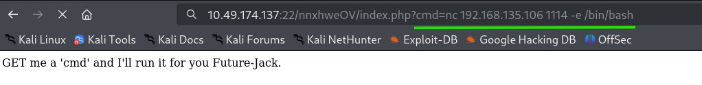
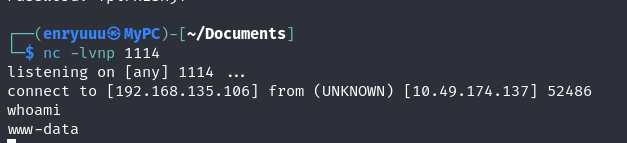

## Phase 7: Cracking Jack's SSH Password

Poking around `/home` from the `www-data` shell turned up something unusual: a file named `jacks_password_list` sitting right next to Jack's home directory, a custom wordlist, apparently for Jack's own account.

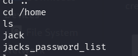
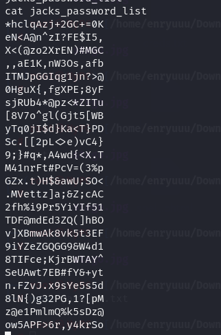

Since SSH was actually running on port 80 (recall the port swap from Phase 1), the wordlist was fed into Hydra against that port.

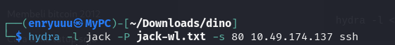

Hydra found a valid password on the first pass. No lockout kicked in, nothing slowed it down.

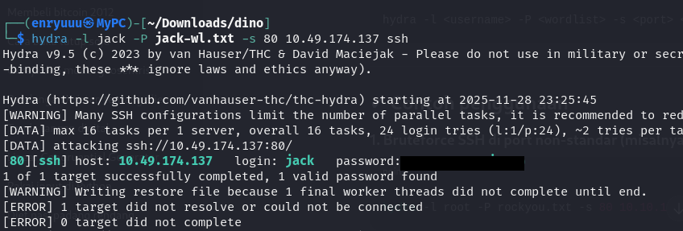

SSH access as Jack followed immediately.

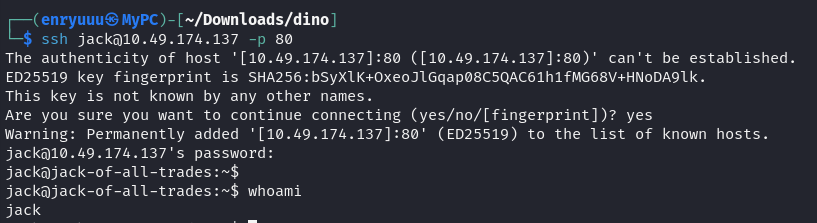

> **Security Issue #4:** A Weak Password Protected by Nothing but Obscurity. Jack's SSH account had no account lockout, no rate limiting, and a password short enough to be brute-forced against a small, custom wordlist in seconds. The only thing slowing an attacker down was not knowing SSH was hiding on port 80.

### The First Flag

Jack's home directory held a single interesting file: `user.jpg`.

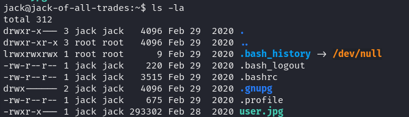

`python3` wasn't installed on the box, so spinning up a quick HTTP server to grab the file wasn't an option.

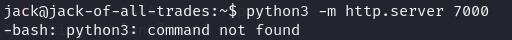

`nc` filled in instead, piping the file straight to a listener on the attack box.

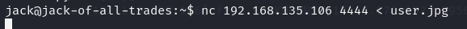
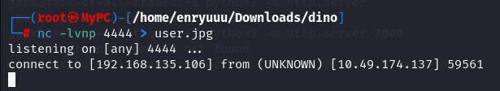

The image turned out to be a mock recipe card, "Recipe for Penguin Soup," with the first flag sitting among the ingredients.

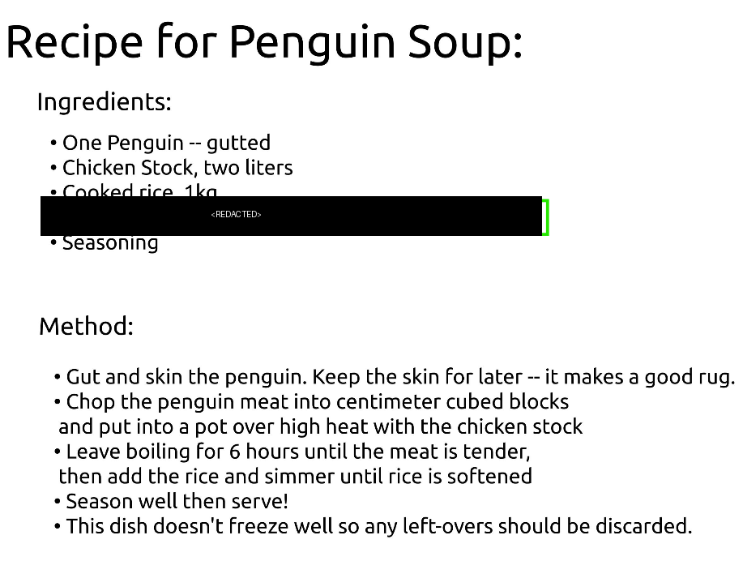

## Phase 8: Privilege Escalation and the Root Flag

A search for SUID binaries turned up the usual suspects (`passwd`, `sudo`, `su`) plus one that had no business being there: `/usr/bin/strings`, owned by root with the setuid bit set.

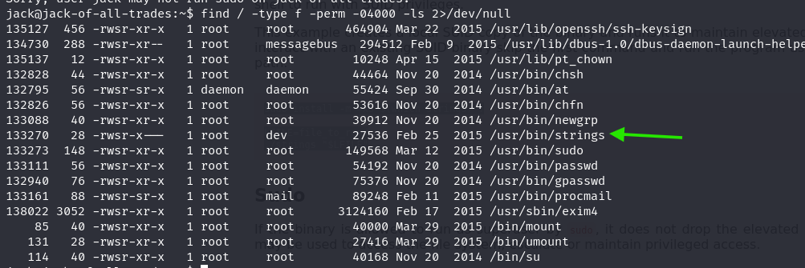

`strings` is normally a harmless tool for pulling readable text out of a binary file. With root's setuid bit attached to it, though, it can just as easily read the contents of any file on the system, including ones a normal user has no business opening. Running it against `/root/root.txt` printed the file out directly: a short to-do list from Jack, and the final flag sitting in the last line.

### Flag 2

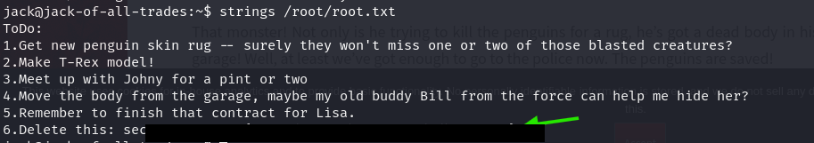

> **Security Issue #5:** A Dangerous SUID Bit on a Non-Standard Binary. A stock system utility had been re-permissioned with root's setuid bit, turning a harmless text-reading tool into a way to read any file on the box as root. SUID bits on binaries like this are almost never intentional or necessary, and they're exactly the kind of misconfiguration a routine audit should catch before an attacker does.

## Blue Team Perspective

Stepping back from the offensive side, here's what a defensive review would likely have caught, and where.

### 1. Secrets Left in Client-Facing Source Code

Both the initial password hint and the recovery page path were sitting in HTML comments anyone could read by viewing page source. Fix: strip debug notes, comments, and credentials from any file served to the browser as part of the deployment process, not as an afterthought.

### 2. An Undocumented Feature With Arbitrary Command Execution

The "recovery" panel behind `/recovery.php` executed shell commands passed through a URL parameter with no restriction once a user logged in. Fix: any feature that touches the shell, a database, or the filesystem needs the same security review as core application logic. "Internal" or "recovery-only" tools are not exempt.

### 3. Weak Credentials With No Brute-Force Protection

Jack's SSH password was crackable in seconds against a small wordlist, with no lockout or throttling to slow the attempt down. Fix: enforce a real password policy, add account lockout or rate limiting on authentication endpoints, and monitor for repeated failed logins.

### 4. Unaudited SUID Permissions

A standard binary had been given root's setuid bit for no functional reason, turning a read-only utility into a privilege escalation path. Fix: periodically audit the system for SUID/SGID binaries outside a known baseline, and remove the bit from anything that doesn't strictly need it.

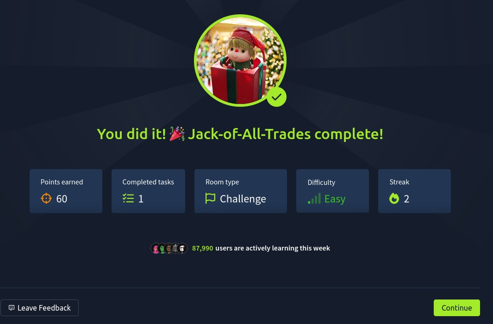

This write-up is part of my ongoing series documenting CTF challenges as I build my portfolio in cybersecurity. I approach each challenge from both offensive and defensive perspectives, because understanding both sides is what makes a well-rounded security professional.

If you're also on the journey toward a SOC or Security Engineering role, feel free to connect. I'm always happy to discuss techniques and share resources.
