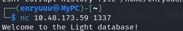
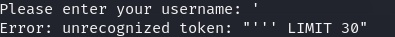
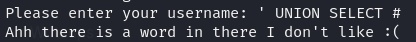
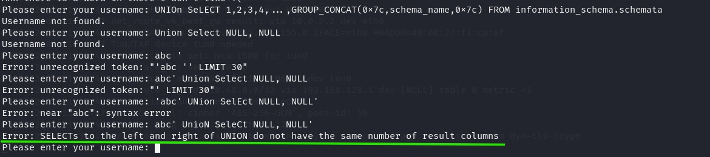
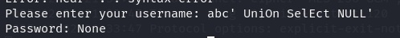
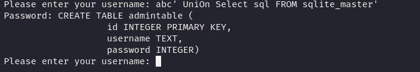
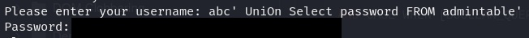
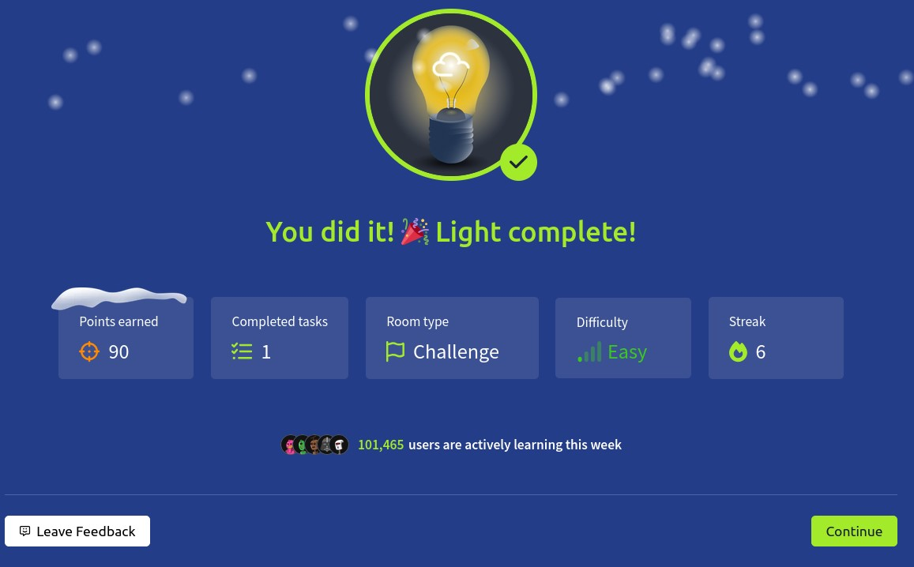

# Light Writeup

**Machine Name:** Light  
**Platform:** TryHackMe  
**Difficulty:** Easy

---


## Introduction

Light is an easy-difficulty TryHackMe room, and it skips the usual web-app formula entirely. No website, no login page, no HTTP anywhere in sight, just a single custom service listening on a raw port, waiting for a username. The room asks for two things, an admin credential and a flag, and both come out of that one input field once you realize what it's actually doing behind the scenes: taking whatever you type and dropping it straight into a SQL query.

It's small, but it's not shallow. Getting through it means confirming the injection, getting past a filter that blocks the obvious payloads, and then rebuilding the query by hand once the usual comment-based shortcut is off the table.

## Phase 1: Enumeration

A full TCP port scan against the target turned up two open ports.

```
nmap -p- -sV -sC <TARGET_IP>

PORT     STATE SERVICE VERSION
22/tcp   open  ssh     OpenSSH 8.2p1 Ubuntu 4ubuntu0.13 (Ubuntu Linux; protocol 2.0)
1337/tcp open  waste?
```

Nmap couldn't confidently label port 1337, it just guessed "waste?", but its version-detection probes still pulled back something useful: a captured banner reading "Welcome to the Light database! Please enter your username:". That's the whole reconnaissance phase in one line. No web server, no HTTP anywhere. Just a raw TCP service that talks like a database login prompt.

## Phase 2: Meeting the Database

Connecting directly confirmed what the nmap banner had already hinted at.



The service greeted me the same way, then asked for a username. No login form, no menu, nothing beyond that one prompt.

I tried the obvious first guess.


"admin" came back as "Username not found." An unremarkable response on its own, but it confirmed the input was being checked against something, most likely a direct lookup into a database table.

## Phase 3: Confirming the Injection

A username field that gets checked against a database is a username field worth testing with SQL. I sent a single quote in place of an actual username.



The response, "Error: unrecognized token", wasn't a generic error page or a silent failure. It was a raw SQL parser error, quoting my broken input back at me along with a trailing "LIMIT 30" I never typed. That confirmed two things at once: the input was landing inside a real SQL query unescaped, and the query itself ended in a LIMIT clause I could now work with.

> **Security Issue #1:** Unsanitized Input Reaches the Query. The username field is concatenated directly into a database query with no sanitization or parameterization. A single character was enough to break it and prove that.

## Phase 4: Bypassing the Filters

Injection confirmed, so I went for the standard next move: a UNION-based payload, closed off with a comment meant to swallow the rest of the query.


Blocked. The service replied with its own warning: it doesn't allow `/*`, `--`, or `%0b` in the input. A comment-based approach was off the table.

I tried a different comment style.



Blocked again, for a different reason this time: the app flagged "a word I don't like," which pointed to a keyword blacklist rather than a character filter. That meant it was likely matching literal strings like UNION and SELECT.

Blacklists built on exact string matches have an obvious weak point: case. I mixed the casing on the same payload.


The keyword filter let it through this time. The query itself still failed, but for a much more mundane reason: SQLite doesn't recognize `#` as a comment marker the way MySQL does, so it choked on the character rather than blocking the request outright. Small win either way. Now I knew the filter was case-sensitive, and I knew the database engine was SQLite.

> **Security Issue #2:** Blacklist Filtering Instead of Parameterized Queries. The app tries to block injection by matching specific banned substrings and keywords. Changing the letter casing of a blocked keyword was enough to slip past it entirely, a sign the fix belongs in how the query is built, not in filtering the input.

## Phase 5: A Comment-Free Payload

No comment syntax worked here, so the trailing part of the query (that `' LIMIT 30` from Phase 3) needed to be closed off with matching syntax instead of erased. Each attempt fed back a slightly different SQL error, and each one narrowed things down a bit more.



One attempt returned "SELECTs to the left and right of UNION do not have the same number of result columns," which was useful on its own, since it confirmed the base query returned a single column. Adjusting for that, and closing the string with a literal quote instead of a comment, finally produced a clean result.



`abc' UnioN SeLeCt NULL'` came back with "Password: None." No error, no rejection. The injection was live, and I had a working template to build on.

> **Security Issue #3:** Verbose SQL Errors Leak Database Internals. Every failed payload returned the underlying SQL parser error, down to the exact token it choked on and the column count it expected. That turned trial-and-error into a fairly quick process, since the database was explaining its own structure at every step.

## Phase 6: Mapping the Database

With a working UNION injection in hand, the next step was finding out what data actually existed. SQLite keeps its own schema in a built-in table called `sqlite_master`, so I queried it directly.



The response returned the full `CREATE TABLE` statement for a table called `admintable`, with three columns: `id`, `username`, and `password`. No more guessing at table or column names, they were handed over directly.

## Phase 7: Extracting the Flag

From there, pulling the actual data was a matter of swapping out which column the UNION query selected.


Selecting `username` from `admintable` returned the admin account name, redacted above.



Selecting `password` from the same table returned the room's flag, also redacted above. No privilege escalation, no second stage. The one injectable field was enough to read straight out of the admin table.

> **Security Issue #4:** Passwords Stored and Returned in Plaintext. The `password` column held a directly readable value with no hashing in sight. Anyone who reached this table, through this injection or otherwise, got the credential itself instead of something they'd still need to crack.

## Blue Team Perspective

Looking back at how this played out, here's where I think a defensive team would have caught it, and how.

### 1. Filtering Input Instead of Fixing the Query.

Blocking specific substrings and keywords is the wrong layer to fix this at, and the case-sensitivity gap here proves it. Fix: use parameterized queries or an ORM everywhere user input touches SQL, so injection isn't possible regardless of what the input contains.

### 2. Verbose Database Errors.

Raw parser errors gave away token positions, column counts, and eventually the database engine itself. Fix: catch database exceptions server-side and return one generic error message to the client; log the real detail internally instead.

### 3. Plaintext Password Storage.

A readable password column meant the moment the table was reachable, the credential was too. Fix: hash and salt every stored password (bcrypt, Argon2, or similar) so a leaked row doesn't hand over a usable login on its own.

### 4. A Raw Query Interface on an Open Port.

A service that takes free-text input and effectively runs it against a database, reachable on an open port with no authentication in front of it, is a lot of trust to place in one field. Fix: require authentication before any query capability is reachable, and rate-limit or alert on repeated malformed input.



This write-up is part of my ongoing series documenting CTF challenges as I build my portfolio in cybersecurity. I approach each challenge from both offensive and defensive perspectives, because understanding both sides is what makes a well-rounded security professional.

If you're also on the journey toward a SOC or Security Engineering role, feel free to connect, I'm always happy to discuss techniques and share resources.
