# Lookup Writeup

**Machine Name:** Lookup  
**Platform:** TryHackMe  
**Difficulty:** Easy

---


## Introduction

This write-up covers Lookup, an easy-difficulty TryHackMe room built around a small web application, a forgotten file manager, and a string of small mistakes that add up to full root access. It's not a one-flaw room like some of the others I've done. It plays more like a relay race: a leaky login form passes the baton to a brute-forced password, that password opens an exposed admin tool, the admin tool leads to a known exploit, and a custom SUID binary hands over the final set of keys. None of these steps is severe by itself. Chained together, they walk an anonymous visitor all the way to root.

## Phase 1: Enumeration

I started with a full TCP port scan against the target.

> nmap -p- -sV -sC \<TARGET_IP\>

Only two ports came back open:

```
PORT   SERVICE  VERSION
22/tcp SSH      OpenSSH 8.2p1 Ubuntu 4ubuntu0.9 (Ubuntu Linux; protocol 2.0)
80/tcp HTTP     Apache httpd 2.4.41 (Ubuntu)
|_http-server-header: Apache/2.4.41 (Ubuntu)
|_http-title: Did not follow redirect to http://lookup.thm
```

Nmap flagged a redirect to a virtual host name instead of a normal landing page. I added it to `/etc/hosts` and pointed the browser there, and it dropped straight onto a login form — no homepage, no blog, nothing else to look at.

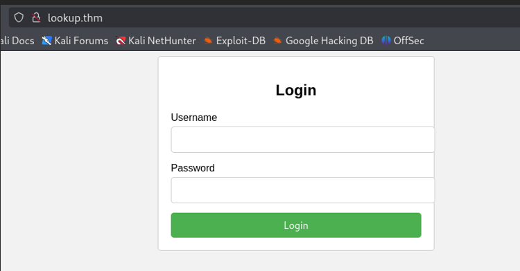

## Phase 2: A Login Form With Nothing Else Around It

Next I threw a directory and file scan at the site. Almost every request came back blocked, and the only meaningful hit in the whole run was the login page itself.

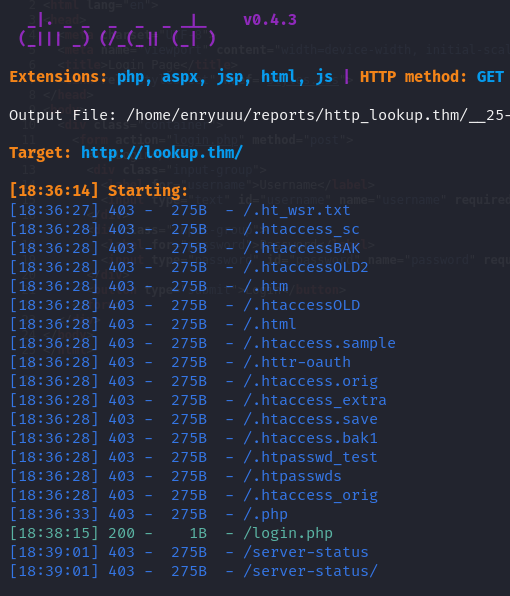

So that was that. No other pages to poke at, no obvious upload form, just one login page standing between me and whatever was behind it.

## Phase 3: An Error Message That Gives Away Usernames

While poking at the login form, I noticed something the developers probably never caught: the error message changed depending on whether the username existed at all. A valid username with the wrong password came back with one message. A username that didn't exist came back with another.

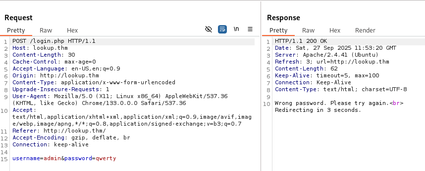
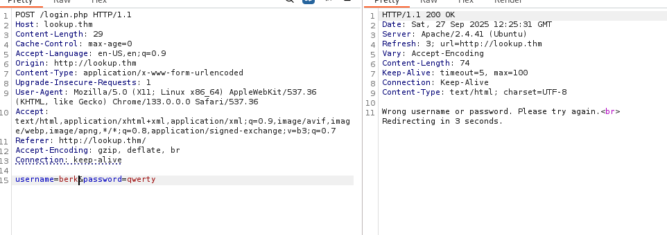

> **Security Issue #1:** Username Enumeration via Inconsistent Error Messages. A login form that answers differently for "wrong password" versus "wrong username or password" is basically handing out a free oracle. Instead of guessing a full username-and-password pair at once, an attacker can split the problem in two: find a real username first, then go after its password. That shortcut is what made the rest of this room possible.

## Phase 4: Automating Username Discovery

Once I'd confirmed the behavior, the obvious next step was to automate it. I put together a short Python script (with some help from ChatGPT) that sends a fixed password against a wordlist of common names, watches for the "wrong password" response, and logs any username that triggers it.

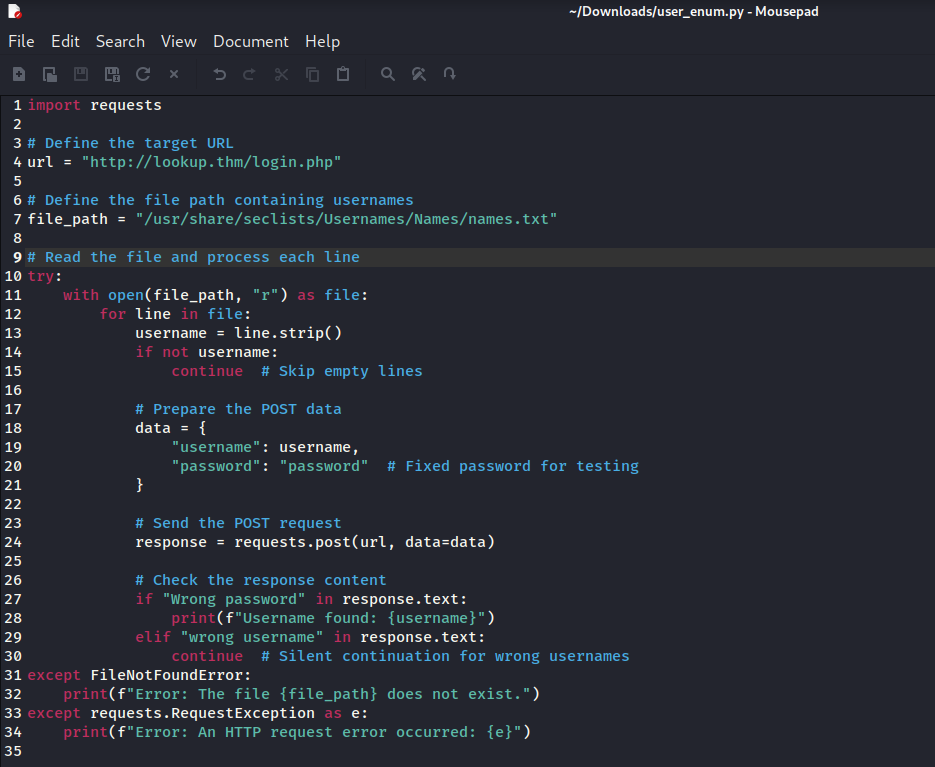

Ran it, and two valid accounts showed up almost immediately.

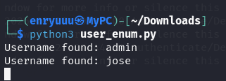

## Phase 5: Brute-Forcing the Password

With `jose` confirmed as a real account, the next step was Hydra against the login form:

> hydra -l jose -P /usr/share/wordlists/rockyou.txt lookup.thm http-post-form "/login.php:username=^USER^&password=^PASS^:Wrong" -f -V

`Wrong` at the end tells Hydra which response text means failure, `-f` stops at the first valid hit, and `-V` shows every attempt as it runs. It didn't take long to land a valid password.

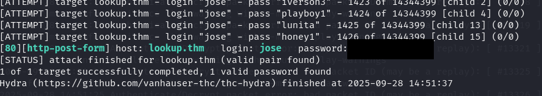

> **Security Issue #2:** Weak Password With No Brute-Force Protection. The password was a plain dictionary word with a number tacked on, and nothing on the login form ever slowed the attack down. No lockout, no rate limiting, no CAPTCHA, nothing. A form that lets an attacker fire off thousands of login attempts a minute is only ever as strong as the wordlist pointed at it.

## Phase 6: Inside the File Manager

Those credentials didn't lead to a CMS dashboard like I expected. They logged into a file browser instead, one listing a long shelf of text files named after common default and service accounts, most of them locked from viewing.

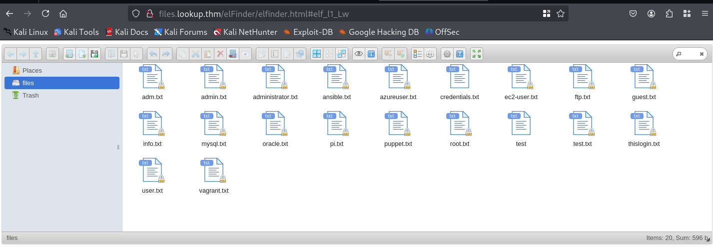

One file, `credentials.txt`, was actually readable, and it held a second set of login details for a user called `think`. Those didn't work against SSH, but at least I now had a real username to work toward.

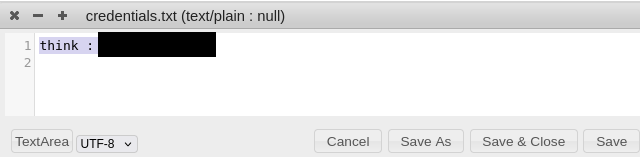

## Phase 7: Identifying the Software and Its Exploit

Turns out the file manager was elFinder, and its own "About" panel gave away the exact version in use without me having to guess.

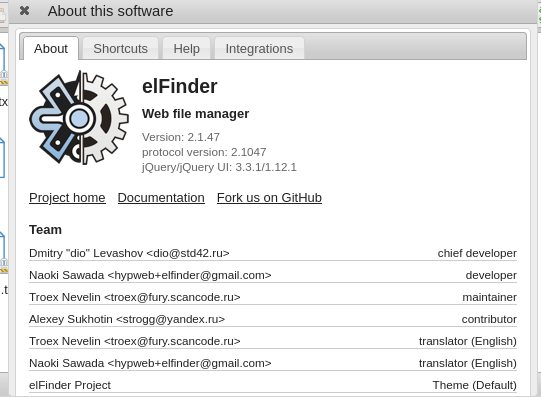

A quick `searchsploit` check confirmed that version had more than one public exploit sitting around.

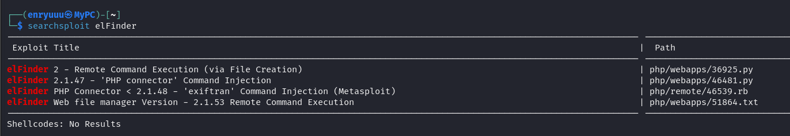

The one that caught my eye was **CVE-2019-9194** (EDB-46481), a command injection bug in elFinder's PHP connector. Uploaded image filenames containing shell metacharacters get passed straight into the `exiftran` utility during image rotation, unsanitized, which lets an unauthenticated attacker run arbitrary commands as the web server user. Metasploit already had a module for it, so I didn't even need to touch the raw PoC.

## Phase 8: Remote Code Execution via Metasploit

I fired up `msfconsole` and searched for the matching module.

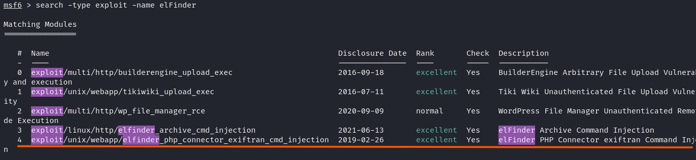

Loaded the elFinder PHP connector `exiftran` command injection module and checked its options.

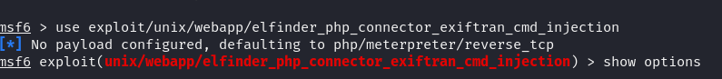

Set `LHOST`/`RHOST`, typed `run`, and a Meterpreter session popped a few seconds later.

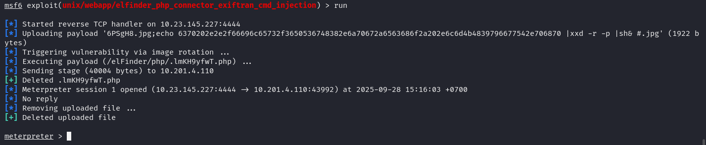

> **Security Issue #3:** Unauthenticated Remote Code Execution via an Outdated Component. The file manager was running a version with a public, ready-to-use Metasploit module, and no authentication in front of it. When a documented CVE already has a point-and-click exploit, patching stops being optional. It's one of the easiest ways to get remote code execution as an attacker, and one of the easiest ones to prevent as a defender.

## Phase 9: Shell as www-data

The Meterpreter session dropped me into a basic command shell. I upgraded it with a quick Python one-liner to get something I could actually work in.

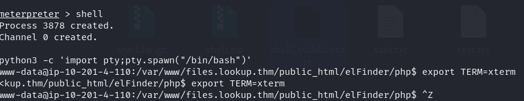

## Phase 10: Abusing a SUID Binary to Reach think

I wanted a way into `think`'s files, so I went looking for SUID binaries. Alongside the usual system utilities, one stood out immediately: `/usr/sbin/pwm`, which is not something you'll find on a stock Ubuntu install.

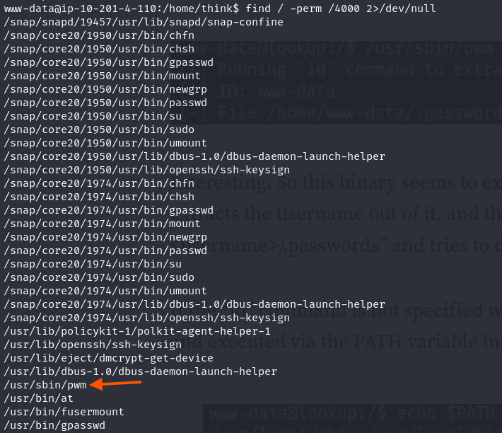

Running it as `www-data` showed exactly what it does: it checks the caller's identity, then tries to print that user's `.passwords` file.

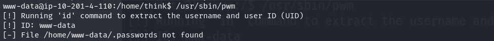

`www-data` didn't have that file, but `think` did. And here's the interesting part: the binary calls the `id` command by name, not by full path. That's a classic opening. If a fake `id` sits earlier on `$PATH`, the binary will run that instead of the real one and never know the difference. So I dropped a forged `id` script into `/tmp` that reports `think`'s UID, made it executable, and put `/tmp` at the front of `$PATH`.

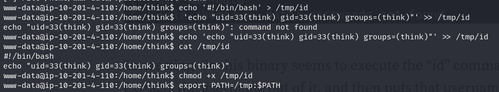

Ran `pwm` again. This time it believed the caller was `think` and printed the contents of `think`'s password file straight to the terminal.

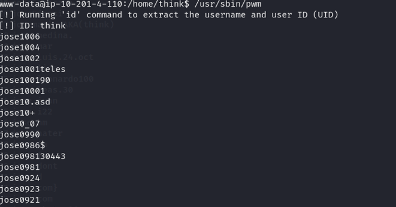

## Phase 11: Cracking the SSH Password

The leaked file wasn't really one password, it was a whole list of close variations on the same theme. I fed that list to Hydra as a custom wordlist against SSH.

> hydra -l think -P lookup/think_pass.txt \<TARGET_IP\> ssh -f -V

A valid SSH password for `think` came out of the run before long.

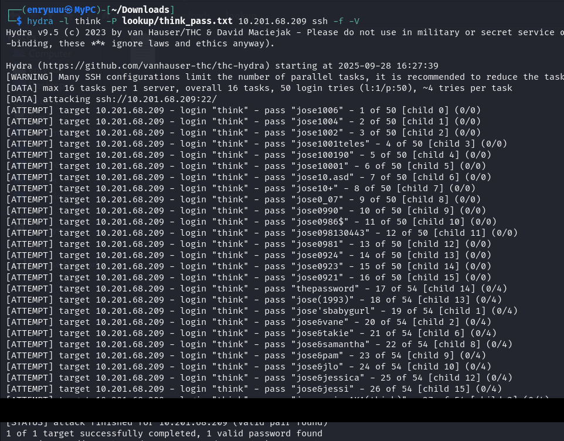

## Phase 12: SSH Login and the First Flag

Logged in over SSH and confirmed the access.

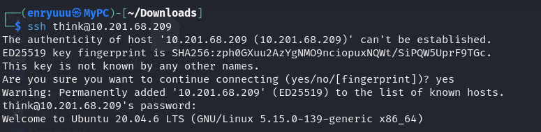


### First flag

`user.txt` sitting in `think`'s home directory closed out the user-level part of the room.

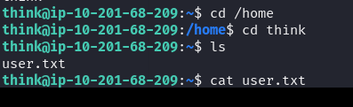

## Phase 13: Privilege Escalation via a Sudo Misconfiguration

`sudo -l` showed that `think` could run exactly one binary as root, no restrictions attached: `/usr/bin/look`.

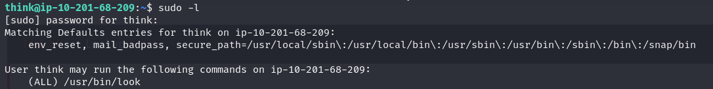

`look` is just a standard Linux utility for searching dictionary-style files by prefix, but it's also a well-known [GTFOBins](https://gtfobins.github.io/) entry. Run it under `sudo` with an empty search string and any target file, and it will print that file straight back out, no matter who owns it.

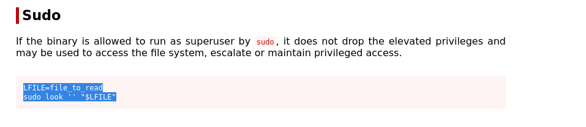

### Flag 2

Pointed `look` at `/root/root.txt` and it read the file out as root, closing the room.

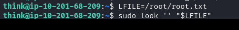

> **Security Issue #4:** Insecure Privilege Escalation Paths. Two separate weaknesses opened the door to root here. First, a custom SUID binary trusted the `$PATH` environment variable to find the `id` command instead of calling it by full path, so a low-privileged user could redirect it to a forged script. Second, a sudo rule let `think` run `/usr/bin/look` as root with no argument restrictions, and `look` happens to have a documented file-read trick on GTFOBins. Either one alone would already be a solid finding. Together, they turned a low-privilege foothold into full root.

## Blue Team Perspective

Working back through the chain, here's what I think a defensive team would have caught, and where.

### 1. Inconsistent Login Error Messages.

A login form that gives away whether a username is valid is a quiet but serious leak. Fix: return the exact same message, and ideally the same response time, no matter which field was wrong.

### 2. No Brute-Force Protection on Login or SSH.

Neither the web login nor SSH slowed down after repeated failures. Fix: lock the account or add exponential backoff after a handful of bad attempts, put fail2ban-style protection on SSH, and alert on high-volume login attempts from a single source.

### 3. Outdated, Internet-Facing Software With a Known CVE.

elFinder was running a version with a public exploit and no patch in sight. Fix: tie internet-facing software to a CVE feed with a real patch SLA, and don't leave admin or file-management tools like this reachable without authentication in front of them.

### 4. Overly Permissive Sudo Rules and PATH-Trusting Binaries.

A sudo rule for a GTFOBins-listed binary and a custom SUID tool that trusted `$PATH` both gave away more than they should have. Fix: check `sudo -l` output against GTFOBins during access reviews, and require custom SUID/SGID binaries to call other programs by absolute path, full stop.

---


This write-up is part of my ongoing series documenting CTF challenges as I build my portfolio in cybersecurity. I approach each challenge from both offensive and defensive perspectives, because understanding both sides is what makes a well-rounded security professional.

If you're also on the journey toward a SOC or Security Engineering role, feel free to connect — I'm always happy to discuss techniques and share resources.
