# Mustacchio Writeup

**Machine Name:** Mustacchio  
**Platform:** TryHackMe  
**Difficulty:** Easy

---

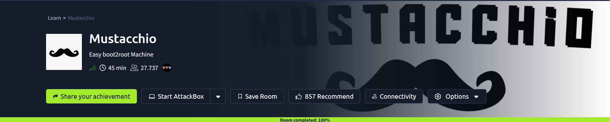

## Introduction

This write-up covers Mustacchio, an easy-difficulty TryHackMe room hiding behind a barbershop-themed template website. Nothing on the surface looks dangerous, just a homepage, a login panel, and a handful of static pages. Underneath, though, the box is a small chain of avoidable mistakes: a backup file left where anyone could grab it, a password hash weak enough to crack in seconds, an XML feature that trusted whatever it was fed, and a privileged binary that trusted its own PATH a little too much.

## Phase 1: Enumeration

Started with a full TCP port and version scan against the target.

> nmap -p- -sV -sC \<TARGET_IP\>

Three ports came back open: SSH on 22, an Apache web server on 80, and a second web server running on nginx at port 8765.

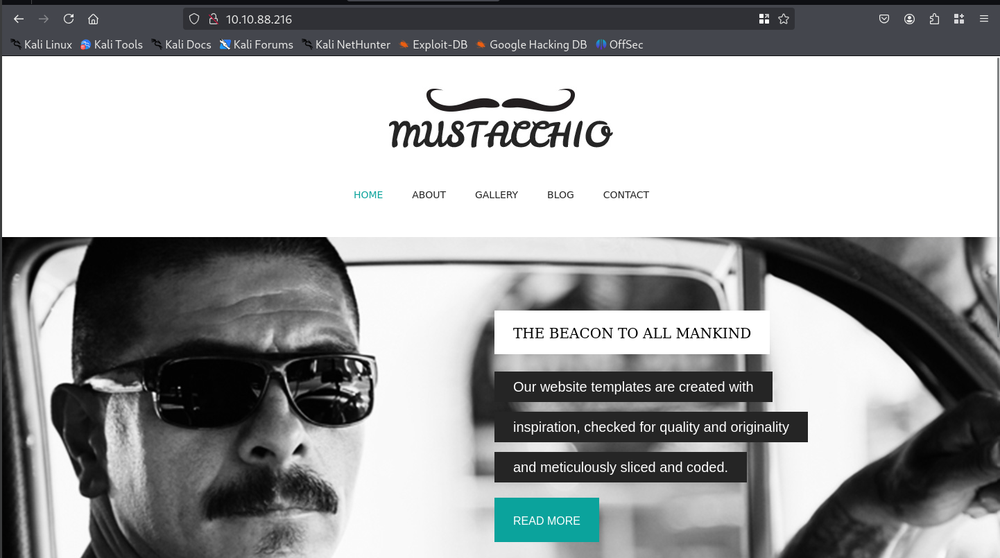

Port 80 hosted the main Mustacchio site, a static template with no obvious input fields. Port 8765 turned out to be something more interesting: a separate admin login panel, completely unauthenticated at this stage.

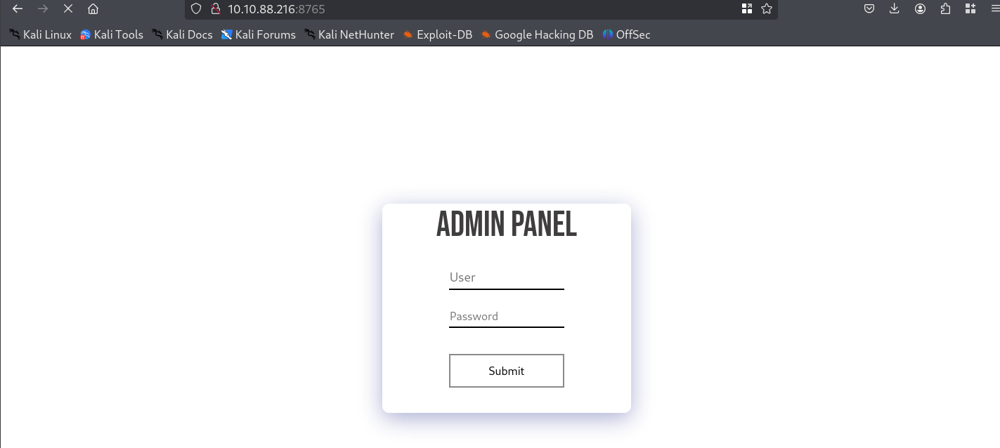

## Phase 2: A Backup File Left Sitting in the Open

A directory scan against the port 80 site turned up a `/custom/` folder that wasn't linked anywhere from the main pages.

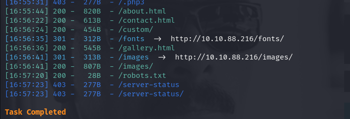

Browsing into it showed a `css/` and `js/` folder sitting under directory listing.

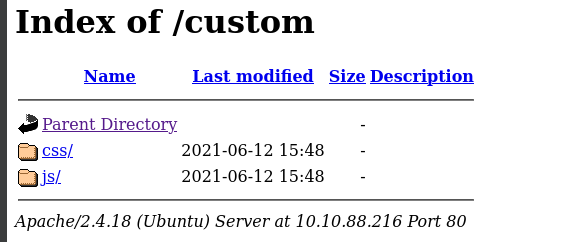

Inside `js/`, alongside the expected `mobile.js`, sat a file that had no business being there: `users.bak`.

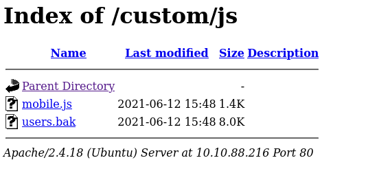

> **Security Issue #1:** Backup File Exposed in a Public Directory. A raw database backup was sitting inside a web-accessible folder with directory listing turned on. Anyone who stumbled onto that path could download it without authenticating first.

## Phase 3: Cracking the Admin Hash

`users.bak` turned out to be a raw SQLite database. Opening it and dumping its contents revealed a single `users` table holding one row: an admin username and a password hash.

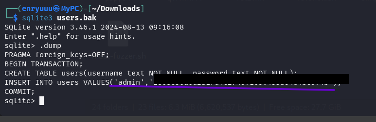

The hash format pointed to unsalted SHA-1, so it was saved to a file and handed straight to John the Ripper with the rockyou wordlist.

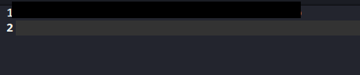

John cracked it in under a second.

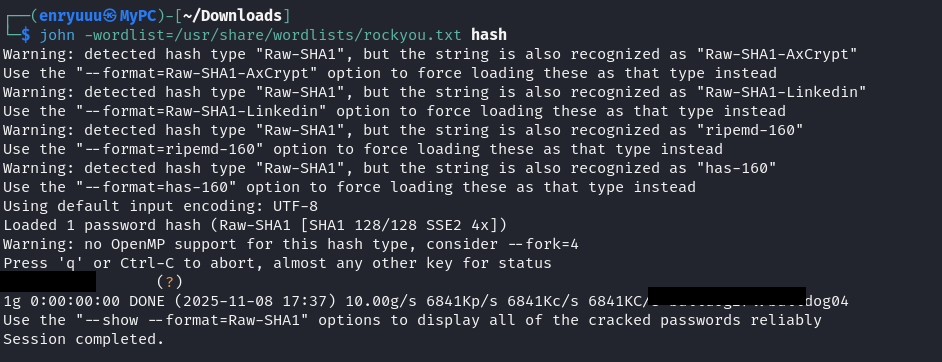

> **Security Issue #2:** Weak, Unsalted Password Hashing. A single unsalted SHA-1 hash and a wordlist attack were all it took to recover a working admin password. There was no rate limiting, no salting, and no password complexity requirement standing in the way.

## Phase 4: XXE Injection in the Admin Panel

The recovered credentials logged straight into the port 8765 admin panel, which turned out to host a single feature: a text box for adding a comment to the site.

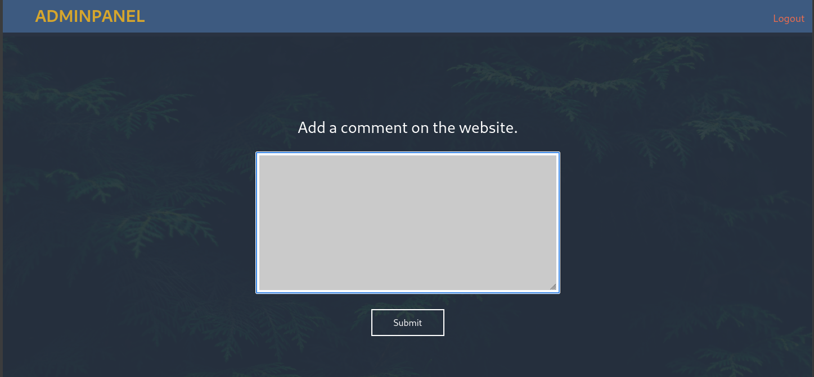

Capturing a submitted request in Burp Suite and reading the page's own source code turned up a suspicious comment left in by whoever built the site, hinting at a hidden backup path.

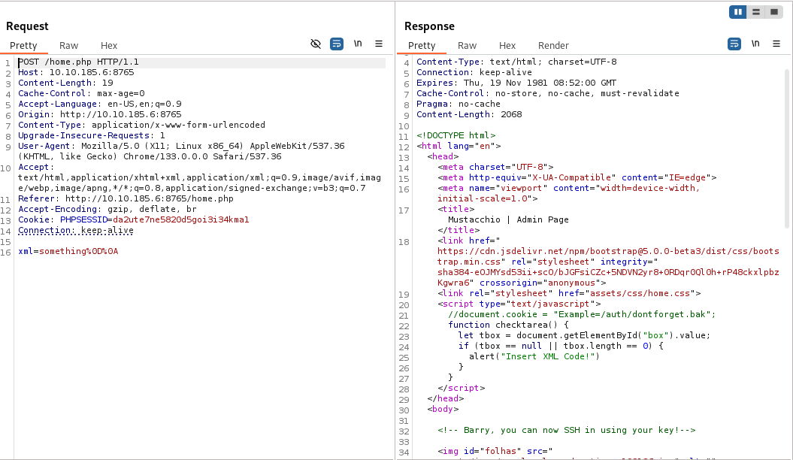
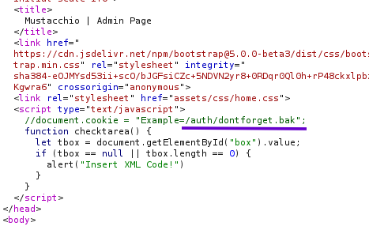

Pulling that path down gave up a small file, `dontforget.bak`.

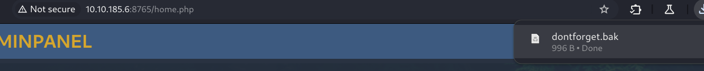

Its content wasn't a secret, it was a sample XML document, the exact structure the comment box expected: a name, an author, and a comment body.

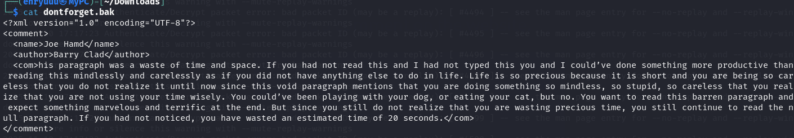

Feeding that structure back into the comment box confirmed the panel really was parsing raw XML and rendering the result back to the page.

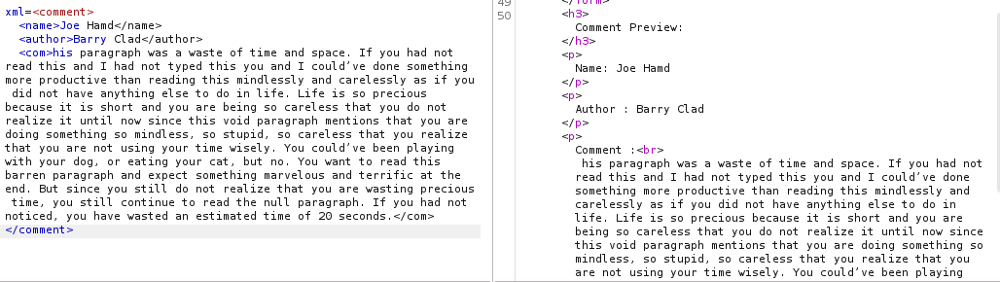

That's a strong signal for an XML External Entity (XXE) vulnerability. A payload defining an external entity pointed at a local file was submitted in place of a normal comment.

> Resource: https://github.com/payloadbox/xxe-injection-payload-list

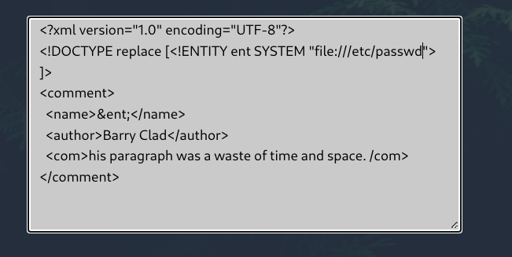

The application read the file without question and printed it straight back. That confirmed full local file disclosure, and it also handed over two system usernames.

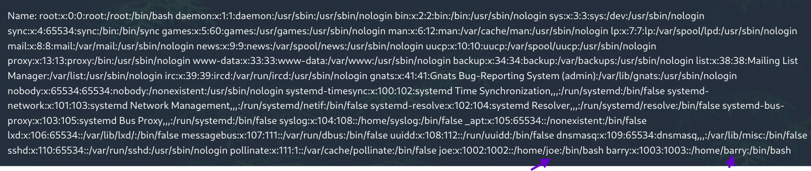

> **Security Issue #3:** XML External Entity (XXE) Injection. The comment feature parsed user-supplied XML without disabling external entity resolution, letting an attacker read arbitrary files on the server just by submitting a crafted comment.

## Phase 5: SSH Access via a Stolen Private Key

Another comment buried in the page source dropped a much bigger hint: one of the system users could apparently SSH in using a key.

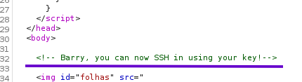

The same XXE technique was pointed at that user's SSH directory instead of `/etc/passwd`, and it worked. The encrypted private key came back in full inside the response.

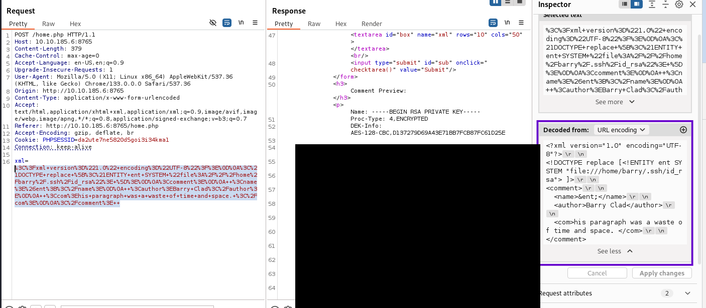

The key was passphrase-protected, so it was converted with `ssh2john` and handed back to John.

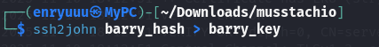

The passphrase fell to the same rockyou wordlist.

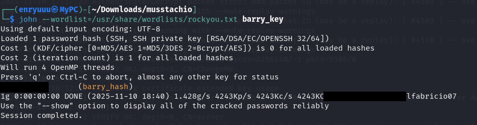

After fixing the key's file permissions, it unlocked SSH access as a low-privilege user, and the first flag was sitting right there in the home directory.

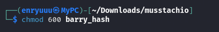
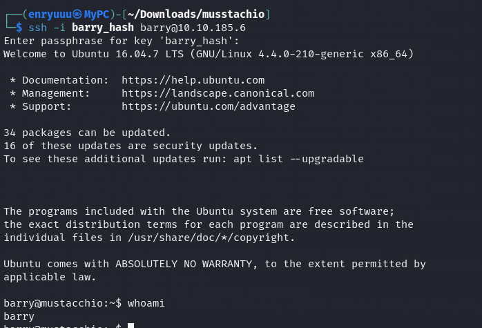

### First flag

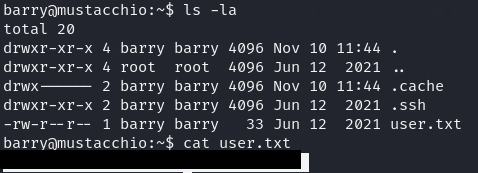

> **Security Issue #4:** Sensitive Private Key Readable via XXE. A passphrase-protected SSH key is a good practice on its own, but it's not a substitute for keeping the file out of reach. The same file-read flaw that leaked `/etc/passwd` was just as happy to hand over a private key.

## Phase 6: Privilege Escalation

A search for SUID binaries turned up an unusual entry sitting in another user's home directory: `live_log`, owned by root, executable by anyone.

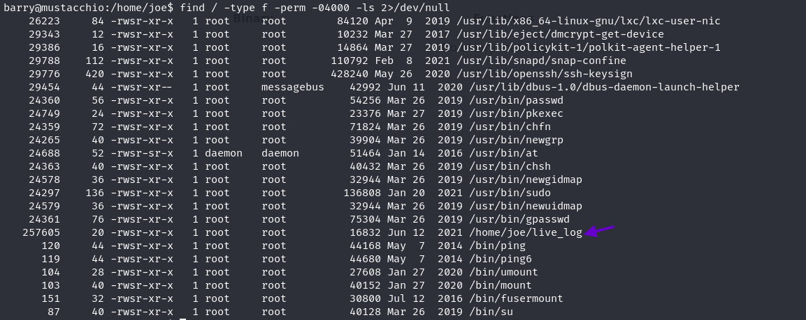

Running `strings` against it revealed what it actually did: a "Live Nginx Log Reader" that shells out to `tail -f /var/log/nginx/access.log`, calling the `tail` command by name only, with no full path attached.

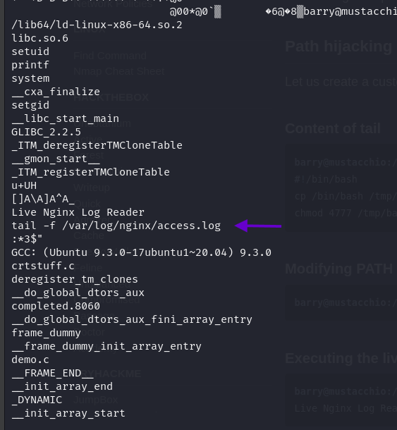

That's a textbook PATH hijack. A fake `tail` script was written that spawns a shell, made executable, and the current directory was prepended to `PATH` so the system would find the fake version before the real one.

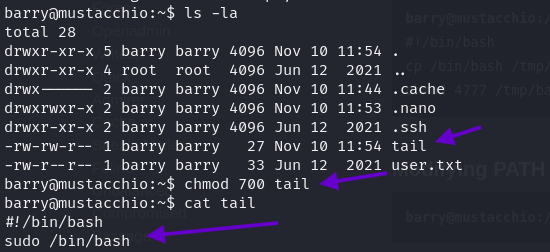
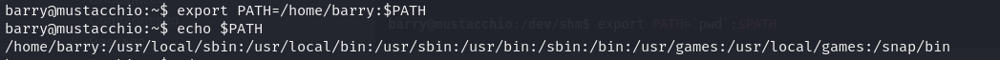

Moving into the binary's own directory and running it printed an odd error on screen, but that was a red herring.

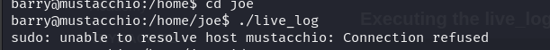

A quick `id` check told the real story: the shell was now running as root.

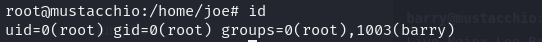

> **Security Issue #5:** PATH-Relative Command Execution in a SUID Binary. A root-owned, world-executable binary called an external command by name instead of by full path. Anyone able to influence the `PATH` environment variable before running it could redirect that call to their own code, with root's permissions attached.

### Flag 2

With a root shell in hand, `/root/root.txt` closed out the room.

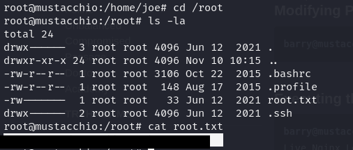

## Blue Team Perspective

Working back through this chain, here's what I think a defensive team would have caught, and where.

### 1. Backup File Exposed in a Public Directory.

A stray `.bak` file inside a web-accessible folder is an easy find for any content-discovery scan. Fix: keep backups out of the webroot entirely, and run periodic content-discovery scans against production as part of routine hygiene.

### 2. Weak, Unsalted Password Hashing.

A single unsalted SHA-1 hash fell to a wordlist in under a second. Fix: store credentials with a modern, salted, slow hashing algorithm such as bcrypt or Argon2, and enforce a minimum password strength policy.

### 3. XML External Entity (XXE) Injection.

Any feature that parses user-supplied XML is a potential file-read primitive if external entities aren't disabled. Fix: disable DTD processing and external entity resolution in the XML parser by default, and prefer a simpler format like JSON wherever raw XML input isn't strictly necessary.

### 4. PATH-Relative Command Execution in a SUID Binary.

A privileged binary trusted the current PATH to find an external command instead of specifying it directly. Fix: always call external commands using their full, absolute path inside privileged code, and remove the SUID bit from any binary that doesn't genuinely need it.

This write-up is part of my ongoing series documenting CTF challenges as I build my portfolio in cybersecurity. I approach each challenge from both offensive and defensive perspectives, because understanding both sides is what makes a well-rounded security professional.

If you're also on the journey toward a SOC or Security Engineering role, feel free to connect, I'm always happy to discuss techniques and share resources.
