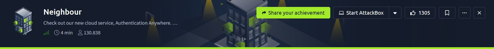
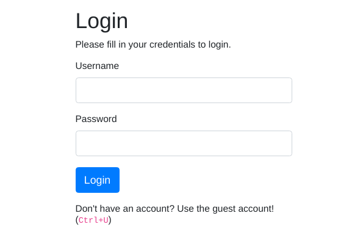
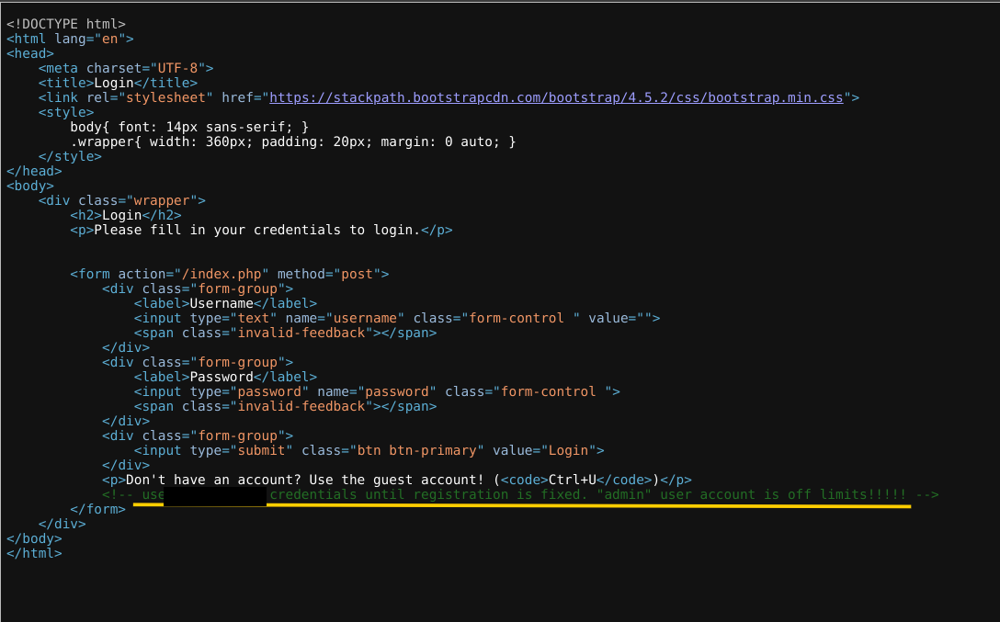
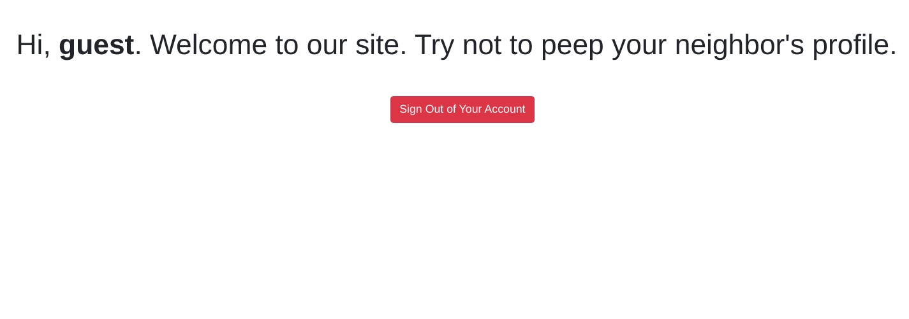
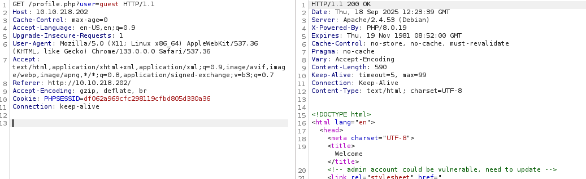
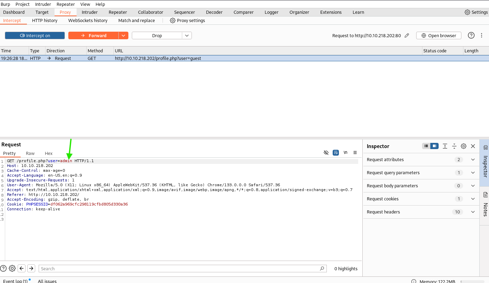
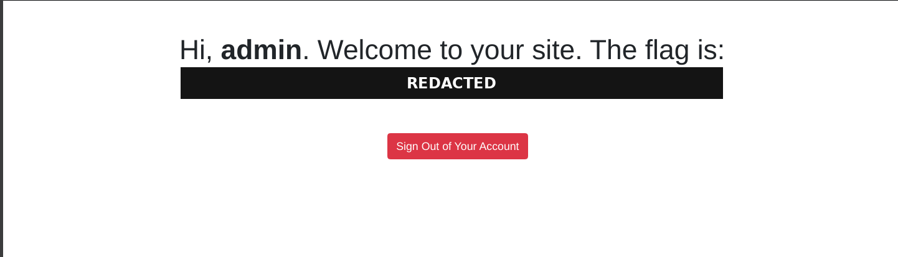
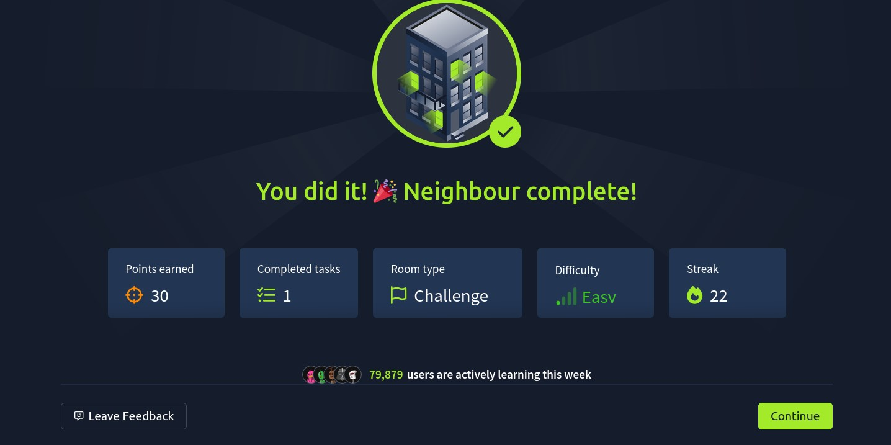

# Neighbour Writeup

**Machine Name:** Neighbour  
**Platform:** TryHackMe  
**Difficulty:** Easy

---

## Introduction

This write-up documents my approach to solving the Neighbour room on TryHackMe, an easy difficulty challenge built around a fictional login service called Authentication Anywhere. Behind that plain, single-page login form lies a short but complete attack chain: reading a leftover developer comment in the page source to recover working guest credentials, logging in, spotting a username exposed in the profile URL, and simply swapping it for admin to walk straight into another user's account and the flag.

## Phase 1: Straight to the Login Page

The room description rules out a recon phase, so I skipped it and pointed the browser straight at the target IP. What loaded was a plain login form: a username field, a password field, and a note underneath saying visitors without an account could use "the guest account," with a hint to press Ctrl+U.

Ctrl+U opens a page's source code in most browsers. A hint like that, sitting right on the login page, is basically an invitation to go look.

## Phase 2: A Comment Left Behind

The source code held an HTML comment near the bottom of the form, the kind that's meant to be stripped out before a site goes live:

> `<!-- use <REDACTED> credentials until registration is fixed. "admin" user account is off limits!!!!! -->`

> **Security Issue #1:** Credentials Exposed in Source Code. A note meant for a developer's eyes shipped straight to production. It handed over working login credentials, and as a bonus, flagged the admin account as the one thing not to touch. That's exactly what an attacker will try first.

## Phase 3: Logging In as Guest

The leaked credentials worked without any trouble. The page that greeted me afterward was short, and a little too honest: it welcomed me by name and asked me not to peep at my neighbour's profile.

That's an odd thing for a welcome message to say. It reads less like a warning and more like a dare.

## Phase 4: A Suspicious URL Parameter

Logging in redirected the browser to `/profile.php?user=guest`. A username sitting in plain view in the URL is a textbook shape for an IDOR, an Insecure Direct Object Reference, where an application hands back a record based on user-supplied input without checking whether the person asking is actually allowed to see it.

I intercepted the request in Burp Suite to look closer. The server, running Apache 2.4.53 with PHP 8.0.19, sent back a page with a leftover comment of its own: a note that the admin account "could be vulnerable" and needed an update. Someone on the dev team already knew.

## Phase 5: Swapping Guest for Admin

With the request paused in Burp's Proxy tab, I changed the `user` parameter from `guest` to `admin` and forwarded it.

> **Security Issue #2:** Insecure Direct Object Reference (IDOR). The application never checked whether the logged-in session actually owned the profile it was about to serve. Changing one word in the URL moved me from a guest account to the administrator's page, with no password guess and no exploit chain involved. The server simply trusted a parameter it never should have.

### Flag

The server didn't ask any follow-up questions. It served the admin's profile directly, greeting me by that name and printing the flag underneath.

## Blue Team Perspective

Working back through the chain, here's what I think a defensive team would have caught, and where.

### 1. Development Comments Left in Production

Both the login page and the profile response shipped with comments that were only ever meant for a developer. Fix: strip debug and setup comments as part of the build or deployment pipeline, not as a manual step someone has to remember.

### 2. No Server-Side Authorization Check

The profile endpoint trusted the `user` parameter instead of checking it against the logged-in session. Fix: every request for user-specific data should verify, server-side, that the session owner matches the record being requested. Never trust what the client sends.

### 3. Predictable, Guessable Object References

Using a plain username as the identifier in a URL makes every other account just one guess away. Fix: pair proper authorization checks with identifiers that aren't easy to guess, so a single missed check doesn't hand over the whole user base at once.

This write-up is part of my ongoing series documenting CTF challenges as I build my portfolio in cybersecurity. I approach each challenge from both offensive and defensive perspectives, because understanding both sides is what makes a well-rounded security professional.

If you’re also on the journey toward a SOC or Security Engineering role, feel free to connect — I’m always happy to discuss techniques and share resources.
