# New Hire, Old Artifacts Writeup

**Machine Name:** New Hire, Old Artifacts  
**Platform:** TryHackMe  
**Difficulty:** Medium

---

## Introduction

This writeup covers my run through New Hire, Old Artifacts on TryHackMe, a blue team room that puts you in the seat of a SOC analyst working for an MSSP, a managed security service provider handling detection and response for outside clients. The scenario: a workstation belonging to Finance01, a newly hired employee, has started behaving strangely, and it is my job to work through the Windows event logs already sitting in Splunk and reconstruct what actually happened on that machine. No live shell, no memory dump, just the logs the endpoint agent already captured. The title turns out to fit once you get into the investigation: a brand new employee, and a laptop already carrying a trail of old, half cleaned up artifacts.

## Phase 1: Isolating the Password Viewer Binary

_Objective: find the full path of a browser password viewer tool that ran on the infected workstation._

The question calls out a Web Browser Password Viewer specifically, so my filter needed to combine two things: process creation events, and the word "password" somewhere in the event. Sysmon logs process creation under Event ID 1, so I searched for that alongside the keyword and tabled the fields I actually needed.

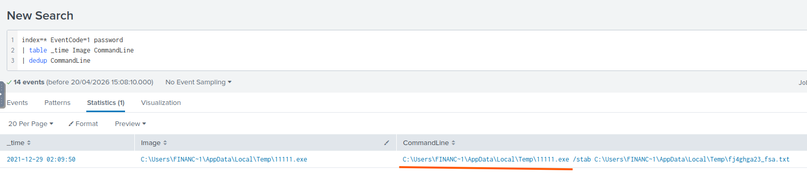

_A combined filter of EventID 1 and the keyword password, deduplicated on the command line._

> **Key Artifact:** `C:\Users\FINANC~1\AppData\Local\Temp\11111.exe`. Notice the "FINANC~1" folder name. That is Windows' old 8.3 short filename format, an alias Windows still generates automatically for long folder names like "Finance01", and it turns up whenever an event gets logged through an API that only records the short form.

## Phase 2: Identifying the Binary's Publisher

_Objective: find the company name listed on the binary from the previous phase._

Same query, one extra field. Adding `Company` to the table pulls that value straight from the binary's file metadata, no extra filtering required.

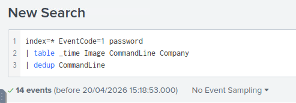

_The same search, with the Company field added to the table._

_The result confirms the publisher._

> **Key Finding:** `NirSoft`. NirSoft makes a long catalog of small, genuinely useful freeware utilities, and a handful of them, browser password viewers, cookie dumpers, network sniffers, get repurposed by attackers constantly because they are free, effective, and rarely flagged as inherently malicious on their own.

## Phase 3: Finding the Second Suspicious Binary

_Objective: identify a second suspicious binary running from the same Temp folder, along with its original filename._

I already knew the folder where the first binary lived, so I reused that as a filter and pulled every distinct `Image` and `OriginalFileName` pair out of that folder.

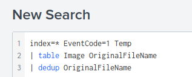

_Filtering on the same Temp directory and listing every binary that ran from it._

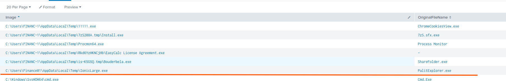

_A short list of binaries from that folder, with one row standing out from the rest._

> **Key Finding:** `IonicLarge.exe`, `PalitExplorer.exe`. The file on disk is called IonicLarge.exe, but its compiled metadata, the OriginalFileName field baked into the binary at build time, still reads PalitExplorer.exe. That mismatch between what a file is called and what it claims to be internally is a small detail, but it is exactly what separates a renamed payload from an ordinary Windows process.

## Phase 4: Tracing the Outbound Callback

_Objective: find the malicious IP address that the binary from the previous phase reached out to twice._

With the binary name in hand, I pulled every event tied to it and grouped the results by destination IP.

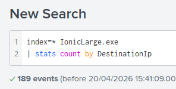

_Grouping all 189 events tied to IonicLarge.exe by destination IP._

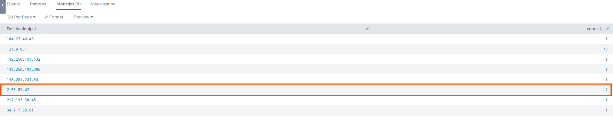

_Most destinations show a single hit or are ordinary telemetry endpoints. One address stands out with two connections._

Once I had the IP, I dropped it into CyberChef's Defang IP Addresses recipe to get it into a reporting safe format.

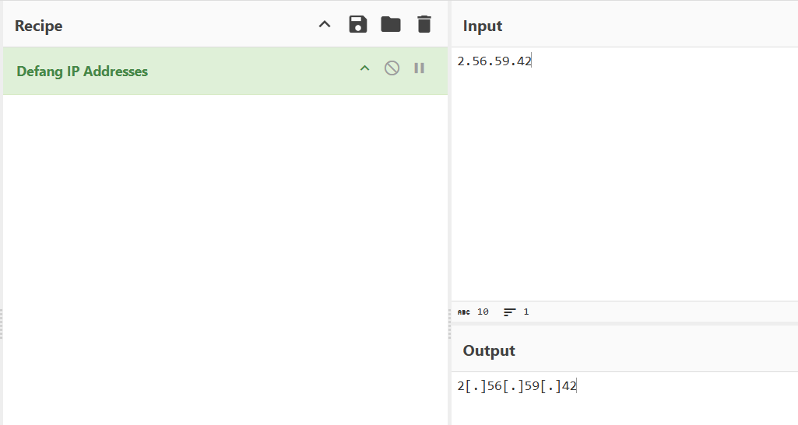

_Defanging the address before writing it down anywhere._

> **Key Artifact:** `2[.]56[.]59[.]42`. Two outbound connections to an address that otherwise never shows up in the dataset is a reasonable candidate for a command and control point, especially next to a binary that already looks like a renamed payload.

## Phase 5: Catching the Defender Registry Change

_Objective: find the registry key that the same binary modified._

Configuration changes like this usually show up in Sysmon as Event ID 13, a registry value set. I filtered that event ID against the binary name and read the full message field.

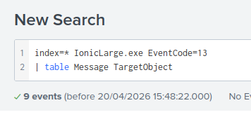

_Filtering registry modification events down to the ones tied to this specific binary._

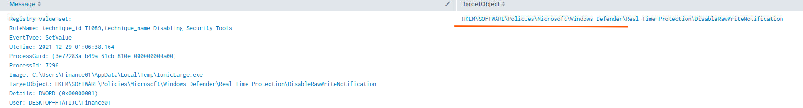

_The raw Sysmon message, complete with its own rule name and MITRE ATT&CK tag._

> **Key Artifact:** `HKLM\SOFTWARE\Policies\Microsoft\Windows Defender`. What makes this one easy to trust is that Sysmon's own detection rule already labeled it: `technique_id=T1089, technique_name=Disabling Security Tools`. The full path lands under the Real-Time Protection subkey, and the value written there is one of several quiet ways Windows Defender's behavior can be dialed back through the registry instead of through its own interface.

## Phase 6: Catching the Cleanup Commands

_Objective: identify two binaries that were killed and then deleted during the intrusion._

I used `taskkill` as a plain keyword search, since anything invoking that command deserves a look regardless of which field it lands in.

_A simple keyword search across the index, twelve events returned._

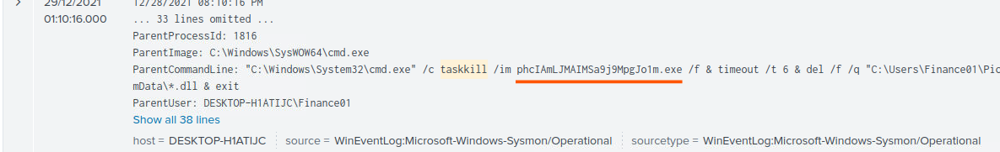

_One event: a cmd.exe parent process kills a process by name, waits six seconds, then deletes its own dll files._

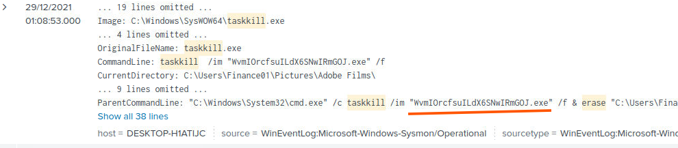

_A second, near identical event against a different binary._

> **Key Finding:** `WvmIOrcfsuILdX6SNwIRmGOJ.exe`, `phcIAmLJMAIMSa9j9MpgJo1m.exe`. Both names are long, random strings, which on its own is a fairly reliable sign of a dropped payload rather than a legitimate application. Both processes were killed and their files erased moments later, removing the binaries from disk once they had done their job.

## Phase 7: Recovering the Last Defender Bypass Command

_Objective: recover the final command in a series of PowerShell commands aimed at changing how Windows Defender behaves._

I combined Event ID 1 with the keywords "defender" and "powershell", tabled the timestamp and command line, and deduplicated the results so repeated variants collapsed into single rows.

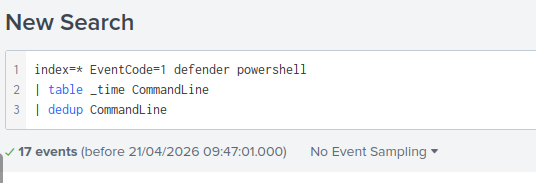

_Filtering process creation events down to anything mentioning Defender and PowerShell, seventeen events in total._

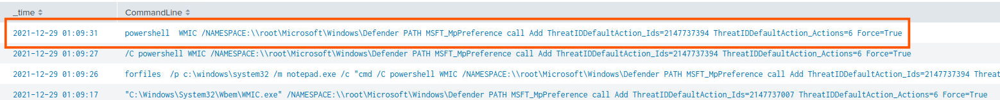

_Sorted by time, the most recent row is the one that answers the question._

> **Key Artifact:** `powershell WMIC /NAMESPACE:\\root\Microsoft\Windows\Defender PATH MSFT_MpPreference call Add ThreatIDDefaultAction_Ids=2147737394 ThreatIDDefaultAction_Actions=6 Force=True`. A few of the surrounding events show the same WMIC call launched through `forfiles.exe`, using a decoy target like notepad.exe or calc.exe purely to get an execution context. That is a living off the land technique: reaching for a utility that already ships with Windows instead of dropping another obviously suspicious binary.

## Phase 8: Sequencing the Threat ID Exceptions

_Objective: list the four Defender threat IDs set by the attacker in the order they were actually executed._

With the same query still active, the answer was already sitting in the table. I just had to read the timestamps in the right direction, oldest event first, to get the true execution order instead of the display order.

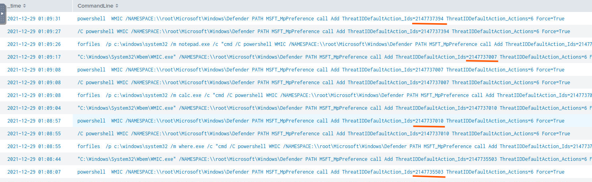

_Four separate calls to MSFT_MpPreference, each adding a different threat ID as an allowed exception, spaced roughly ten to thirty seconds apart._

> **Key Finding:** `2147735503, 2147737010, 2147737007, 2147737394`. Each ID maps to a specific Defender detection signature, and the `Actions=6` parameter tells Defender to allow that threat rather than remove it. Run in sequence, these four commands amount to the attacker manually whitelisting their own tools inside the very product meant to catch them.

## Phase 9: Locating the Roaming AppData Binary

_Objective: find the full path of another malicious binary, this time launched from a different AppData location._

I broadened the search to any executable running from anywhere under a user's AppData folder, then deduplicated on the image path to get a short, readable list.

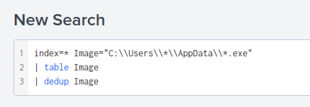

_A wildcard search covering the whole AppData tree instead of just Temp._

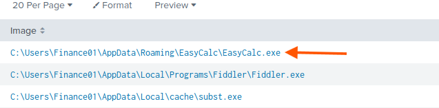

_Three binaries turn up. One of them lives under Roaming instead of Local, a small detail worth noticing._

> **Key Artifact:** `C:\Users\Finance01\AppData\Roaming\EasyCalc\EasyCalc.exe`. Back in Phase 3, one of the entries in the Temp folder was an installer literally named "EasyCalc License Agreement.exe". That installer is what dropped this binary into Roaming, a familiar pattern of hiding a second payload inside what looks like a harmless free calculator app.

## Phase 10: Mapping the Loaded DLLs

_Objective: list every DLL loaded by the binary from the previous phase, in alphabetical order._

I filtered directly on the EasyCalc.exe image path, added a wildcard for `.dll` on the ImageLoaded field, and deduplicated the results.

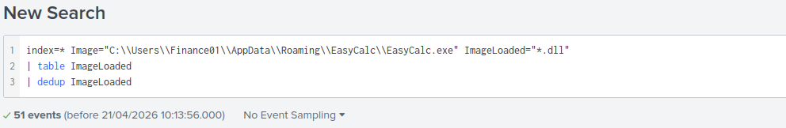

_Filtering module load events specifically tied to this binary._

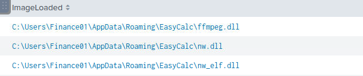

_Three distinct DLLs out of fifty one loaded events._

> **Key Artifact:** `ffmpeg.dll, nw.dll, nw_elf.dll`. All three belong to NW.js, a framework normally used to package web based apps as desktop applications. It is a fairly common trick: wrap a payload inside an NW.js shell dressed up as an everyday utility, since the resulting app installs and looks like any other small freeware tool.

## Reconstructed Attack Chain

Pulled together, the individual answers line up into one sequence:

1. The attacker ran a NirSoft credential viewer, disguised on disk as `11111.exe`, from Finance01's Temp folder, silently writing whatever it harvested out to a text file.
2. A second binary sat in the same folder: `IonicLarge.exe`, whose internal metadata still identified it as `PalitExplorer.exe`, a name that does not match the file on disk.
3. That binary reached out twice to an external address, `2[.]56[.]59[.]42`, the likely command and control point for this stage of the intrusion.
4. It also wrote a value under `HKLM\SOFTWARE\Policies\Microsoft\Windows Defender\Real-Time Protection`, an event Sysmon itself flagged against MITRE ATT&CK technique T1089, Disabling Security Tools.
5. Two more randomly named binaries, `WvmIOrcfsuILdX6SNwIRmGOJ.exe` and `phcIAmLJMAIMSa9j9MpgJo1m.exe`, were killed and had their files erased moments later, taking the evidence off disk.
6. In parallel, the attacker issued a series of WMIC calls against Defender's `MSFT_MpPreference` provider, some launched through `forfiles.exe` as a living off the land proxy, adding four threat IDs as allowed exceptions in sequence: `2147735503`, `2147737010`, `2147737007`, and finally `2147737394`.
7. A separate payload, `EasyCalc.exe`, was dropped through a fake installer and launched from the Roaming AppData path instead of Temp, a second, quieter foothold on the same machine.
8. That binary loaded three DLLs tied to the NW.js framework, `ffmpeg.dll`, `nw.dll`, and `nw_elf.dll`, the runtime used to package it as an ordinary looking desktop app.

This writeup is part of my ongoing series documenting CTF challenges as I build my portfolio in cybersecurity. I approach each challenge from both offensive and defensive perspectives, because understanding both sides is what makes a stronger, more complete security professional.

If you're also on the journey toward a SOC or Security Engineering role, feel free to connect. I'm always happy to discuss techniques and share resources.
