# Publisher Writeup

**Machine Name:** Publisher  
**Platform:** TryHackMe  
**Difficulty:** Easy

---

## Introduction

Publisher is an easy-difficulty TryHackMe room built around a content publishing site running SPIP CMS. Getting to root only takes three steps, but each one is a different flavor of the same mistake: something was left in a state it should never have shipped in.

None of it needed anything clever on my part. Nobody patched the CMS, so a known, unauthenticated remote code execution flaw was still sitting wide open. Nobody locked down a private key, so it was just there to read once I had a shell. And a root-owned helper script trusted a file any local user could edit. Line those three up and you've got a clean path from anonymous visitor to root.

## Phase 1: Enumeration

Started with a full TCP port scan against the target.

> nmap -p- -sV -sC <TARGET_IP>

Two ports came back: SSH on 22, and a web server on 80 running Apache 2.4.41 on Ubuntu. The banner grab also pulled the page title, "Publisher's Pulse: SPIP Insights & Tips," which was my first clue about what CMS I was dealing with.

## Phase 2: A Homepage That Didn't Say Much

The site itself turned out to be a normal-looking magazine homepage, "Community Magazine," complete with menus, sponsor logos, and a couple of blog posts. I didn't see anything pointing to an admin panel or a login form, so it was time to go looking.

A directory scan seemed like the obvious next move.

> dirsearch -u http://<TARGET_IP>/ -e php,html

All it turned up was an `/images/` folder full of static assets. No `robots.txt`, no install page, nothing resembling an admin path. Not a great start.

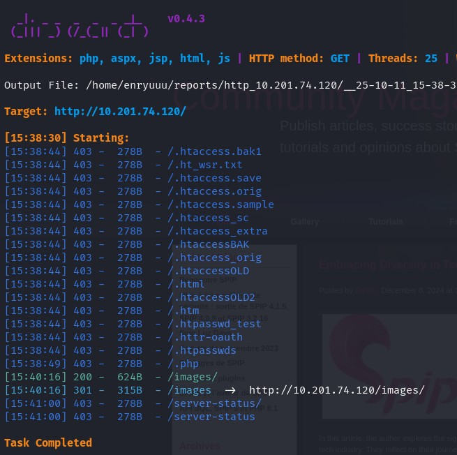
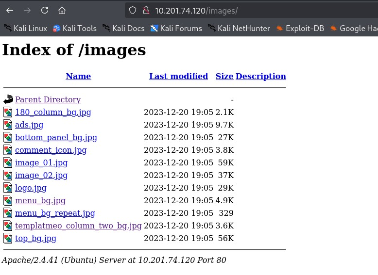

## Phase 3: Finding SPIP With a Bigger Wordlist

Since the default wordlist came up empty, I ran it again with a larger one through ffuf.

> ffuf -u http://<TARGET_IP>/FUZZ -w /usr/share/wordlists/dirbuster/directory-list-2.3-medium.txt -mc 200,301,302,401,403 -fs 0 -e .php,.html

That surfaced a single new path this time: `/spip`, returning a 301.

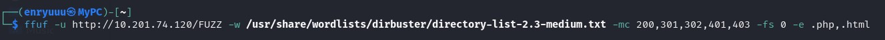

Browsing to it landed on a second, much plainer site called "Publisher," sitting under the same domain as the magazine.

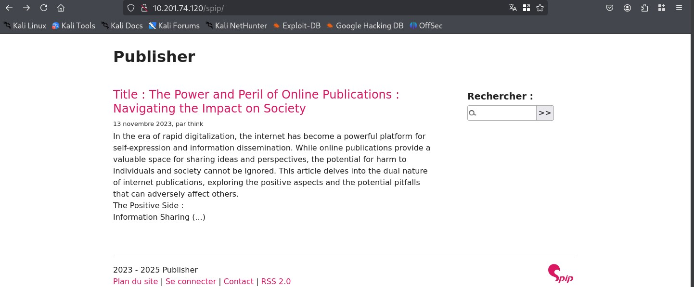

## Phase 4: Fingerprinting SPIP

A quick look with Wappalyzer confirmed the stack: SPIP 4.2.0, PHP, Apache 2.4.41, jQuery, all on Ubuntu.

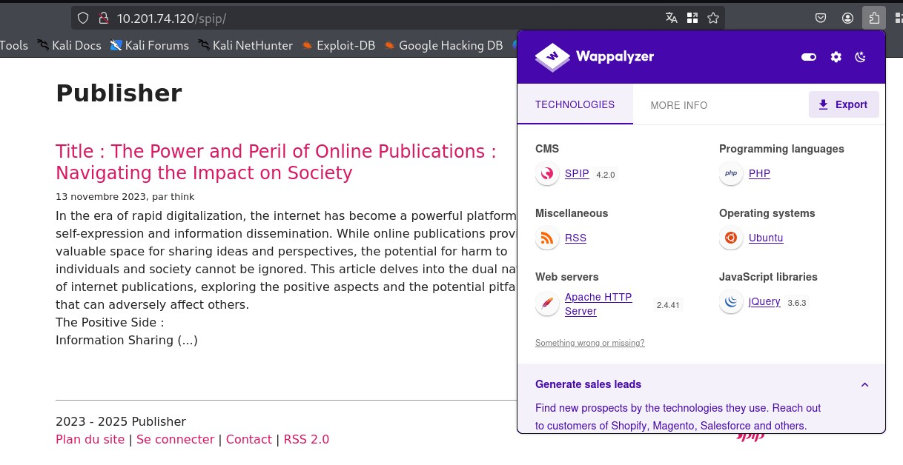

I walked through the CMS's own pages, "Plan du site," an article, a Contact form, the login page at `/connect`, and the RSS feed. It was a fairly ordinary SPIP install: one published article, one author named "think."

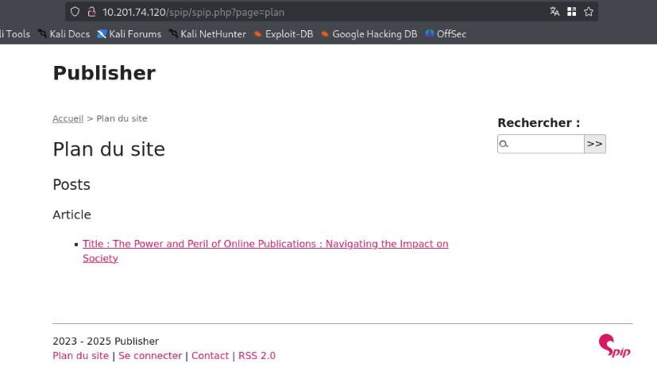
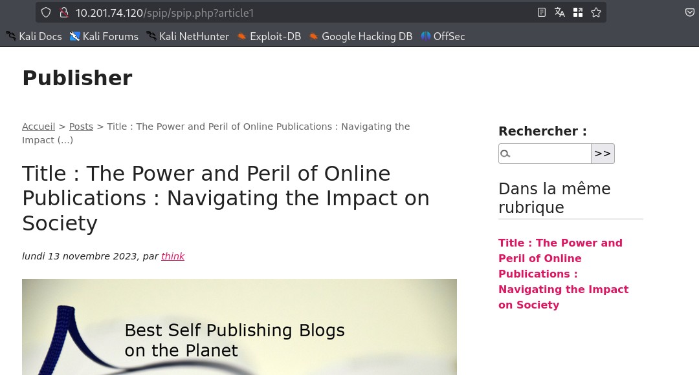
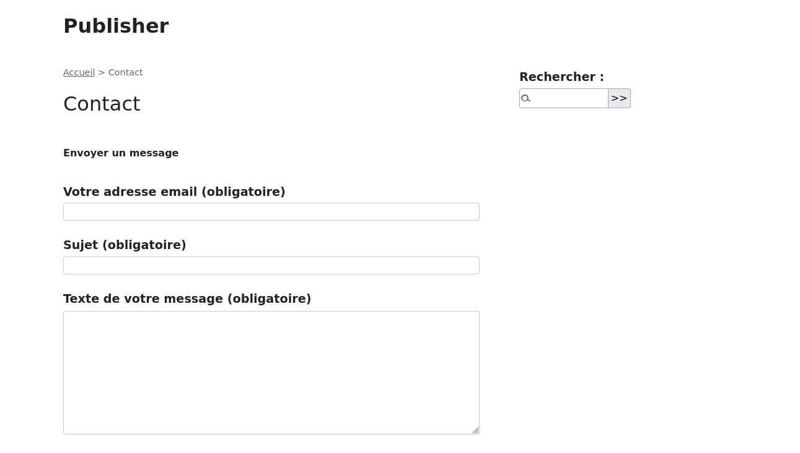
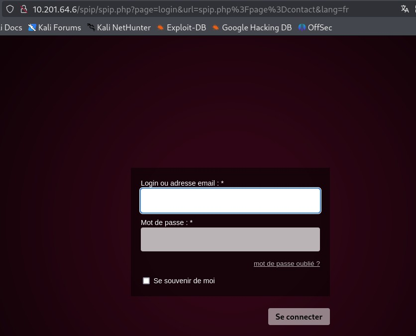
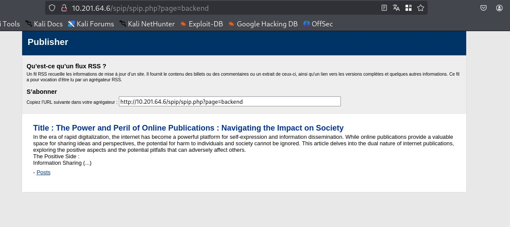

None of the forms looked worth fuzzing, and there was no point brute-forcing a login when checking the version number first was a lot less work.

## Phase 5: A Public, Unauthenticated RCE

Searching for known issues in SPIP 4.2.0 turned up a verified Exploit-DB entry, EDB-ID 51536, for CVE-2023-27372: a PHP injection in one of SPIP's public forms that needs no authentication at all.

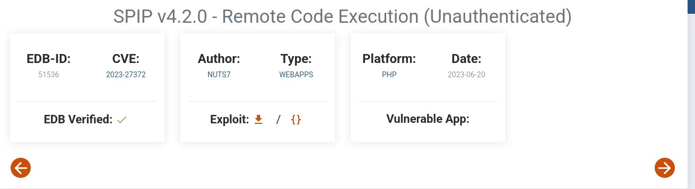

> **Security Issue #1:** Outdated CMS With a Public Unauthenticated RCE. CVE-2023-27372 had a verified proof of concept in the wild by the time this box was still running SPIP 4.2.0. An unpatched CMS with a documented, unauthenticated RCE barely counts as a challenge; the version number alone was enough to find a working exploit.

## Phase 6: Getting a Shell With Metasploit

Instead of pulling the standalone PoC, I went straight for the Metasploit module.

> msf6 > search cve-2023-27372

`exploit/multi/http/spip_rce_form` came back ranked "excellent" with a working check.

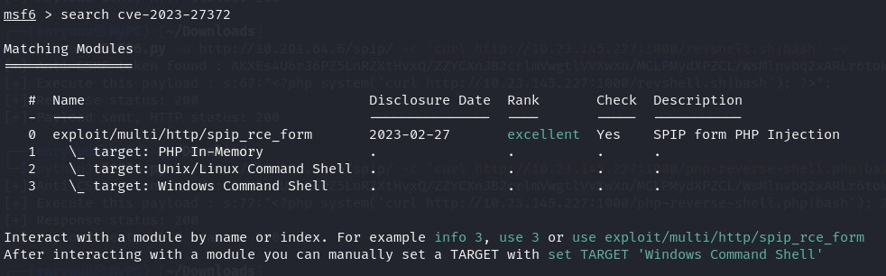

I pointed `RHOSTS` and `TARGETURI` at the target, set a reverse Meterpreter payload, and ran it. The module confirmed the SPIP version on its own, grabbed a valid anti-CSRF token, and fired.

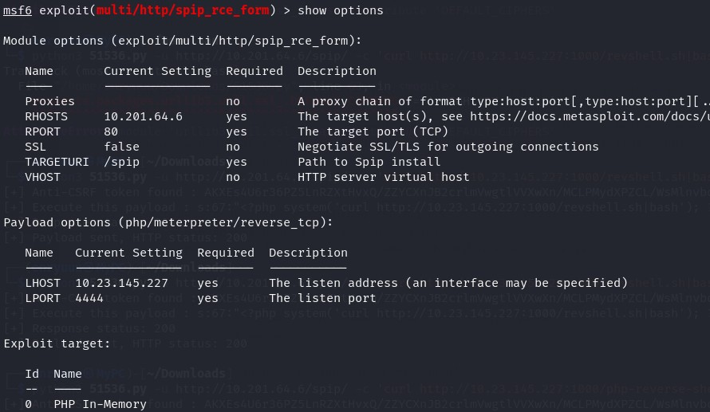
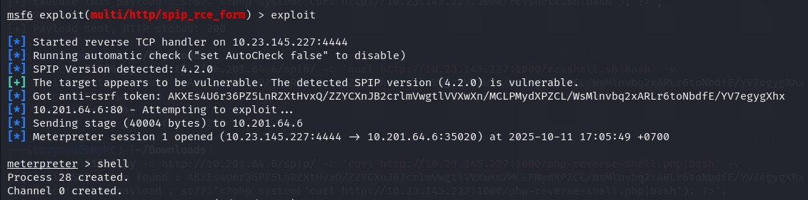

A Meterpreter session opened a few seconds later. Dropping into a shell confirmed I was running as the web server user.

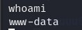

### First flag

`/home/think/user.txt` gave up the first flag.

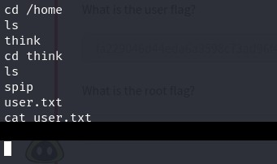

## Phase 7: An SSH Key Left Readable

As `www-data`, I went looking for a way to reach an actual user account. `think` was the only other user on the box, and their `.ssh` directory turned out to be readable, private key included.

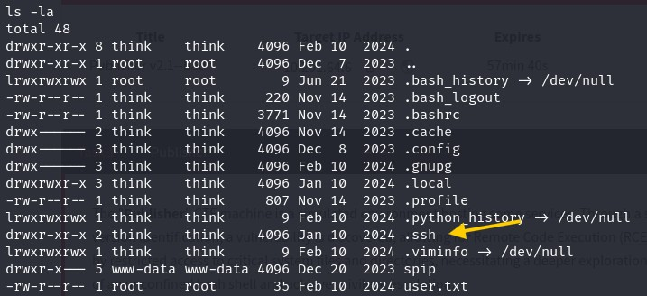

Reading the private key straight from the web shell worked with no restriction at all.

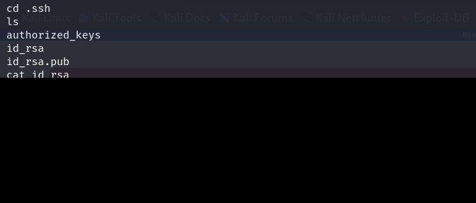

> **Security Issue #2:** Private SSH Key Readable From the Web Server Account. `www-data`, the low-privilege account running the CMS, could read `think`'s private key directly off disk. The key wasn't even passphrase-protected, so simply being able to read the file was enough to get a full SSH session as another user.

I copied the key out, locked the permissions down, and logged straight in over SSH as `think`.

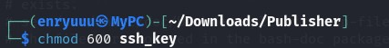
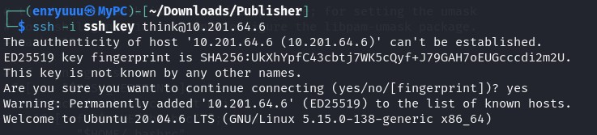
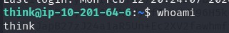

## Phase 8: A SUID Binary That Trusts a Writable Script

A search for SUID binaries turned up one that didn't belong with the rest of the usual suspects: `/usr/sbin/run_container`.

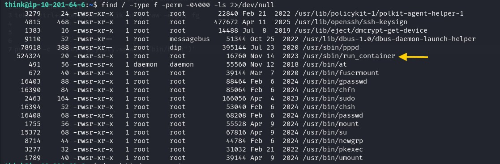

Running it dropped me into an interactive menu for managing a Docker container.

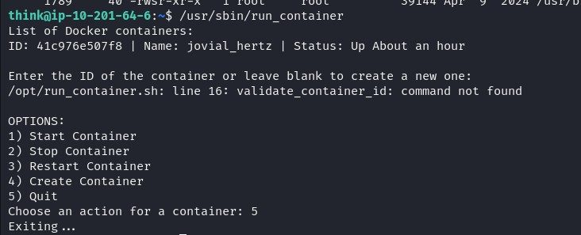

`strings` on the binary showed it wasn't self-contained. It just called out to a shell script, `/opt/run_container.sh`.

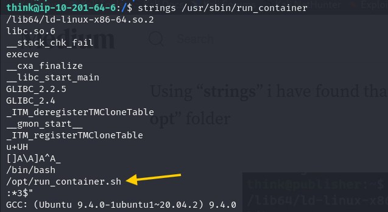

`/opt` wasn't listable from the shell `think` had landed in, a restricted `/bin/ash`, but I could still read its contents once I escaped that shell. Copying `/bin/bash` somewhere writable and running it directly got me a normal shell, and from there `/opt` and everything in it, script included, was fully visible.

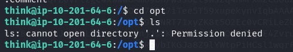

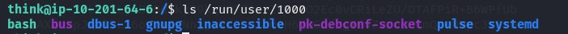
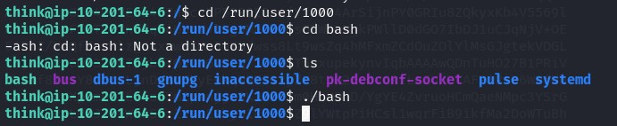
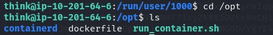

Reading `run_container.sh` confirmed the real problem: the script that `/usr/sbin/run_container` runs as **root** was writable by a normal user.

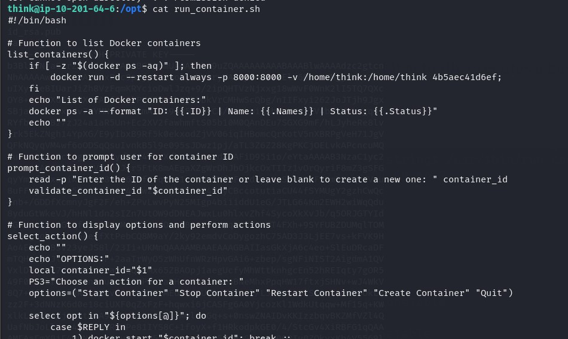

> **Security Issue #3:** SUID Binary Executing a World-Writable Script. `/usr/sbin/run_container` runs with root privileges by design, but it hands its actual logic off to a plain shell script anyone could edit. A SUID program is only as trustworthy as the files it calls, and this one called something wide open.

I dropped a short payload at the top of the script: copy `/bin/bash` to a new location, then set the SUID bit on the copy.

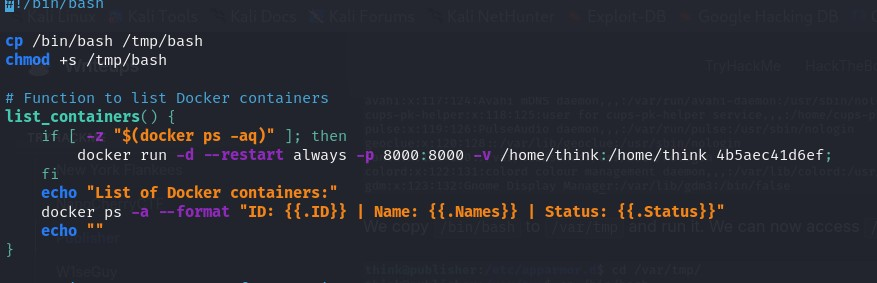
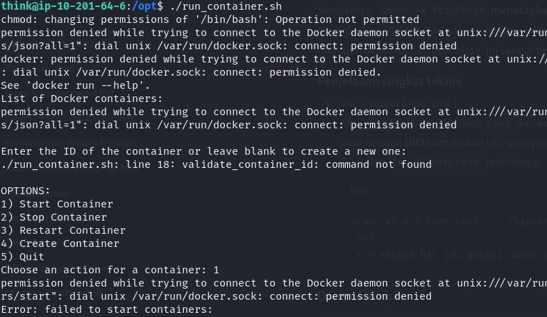
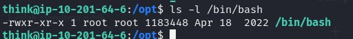

Running the SUID binary executed my modified script as root. The bash copy it produced came back owned by root with the SUID bit already set.

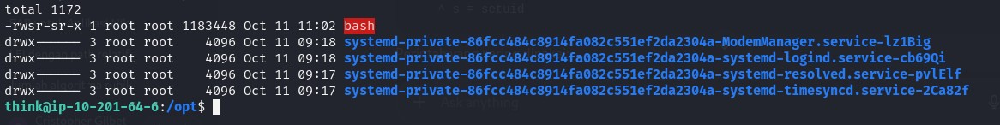

Running that copy with the privilege-preserving flag gave me a full root shell.

> bash -p

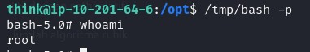

### flag 2

`/root/root.txt` closed the room out.

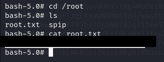

## Blue Team Perspective

Working back through this chain, here's what I think a defensive team would have caught, and where.

### 1. Outdated CMS With a Known CVE

Vulnerability scanning against the SPIP version running here would have flagged CVE-2023-27372 long before an attacker did. Fix: tie patch management to a CVE feed for any internet-facing CMS, and treat unauthenticated RCE advisories as urgent, not routine.

### 2. Sensitive Files Readable by the Wrong Account

A private SSH key should never be reachable by the account running the web application. Fix: enforce strict permissions on key material (`600`, owner-only), and run web services under an account that has no read access to other users' home directories.

### 3. SUID Programs Trusting Writable Files

A SUID root binary is only as safe as whatever it depends on. Fix: any script a SUID or SGID binary calls should be owned by root and writable only by root, full stop.

This write-up is part of my ongoing series documenting CTF challenges as I build my portfolio in cybersecurity. I approach each challenge from both offensive and defensive perspectives, because understanding both sides is what makes a well-rounded security professional.

If you're also on the journey toward a SOC or Security Engineering role, feel free to connect, I'm always happy to discuss techniques and share resources.
