# Shadow Trace Writeup

**Machine Name:** Shadow Trace  
**Platform:** TryHackMe  
**Difficulty:** Easy

---

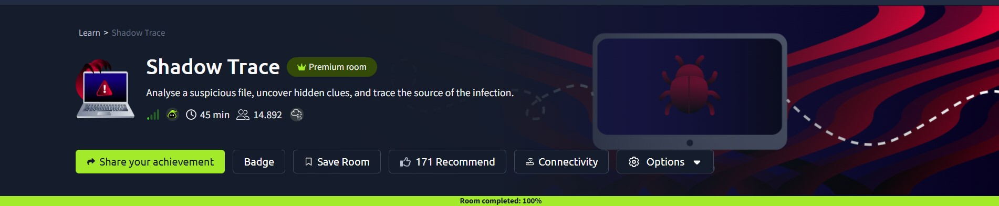

## Introduction

This write-up covers my run through Shadow Trace on TryHackMe, an Easy-difficulty room in the SOC Level 1 path built around static malware analysis and alert correlation. The scenario: I'm the only analyst on shift when a suspicious file, `windows-update.exe`, turns up on a user's desktop, and the EDR starts throwing alerts around the same time. The room splits into two halves. First, pulling every identifiable clue out of the file itself. Then switching over to the alert queue to see how that file's activity actually played out on a live host. My job was to work through both halves and connect what the static analysis found with what the EDR caught in real time.

## Phase 1: Identifying the Binary's Architecture

_Objective: confirm whether the suspicious file is 32-bit or 64-bit before anything else, since that decides which tools and offsets apply later on._

Before touching anything deeper, knowing whether a binary is 32-bit or 64-bit changes how the rest of the analysis gets approached. I ran Sysinternals' `sigcheck.exe` against the file sitting on the desktop, which reports signature status, publisher, and file metadata in one pass.

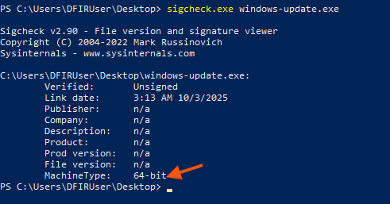

_Sigcheck confirms the binary is unsigned and 64-bit._

> **Key Finding:** `windows-update.exe` is a 64-bit, unsigned binary. One small red flag before the analysis even starts, since a genuine Microsoft updater would carry a valid signature.

## Phase 2: Hashing the Binary

_Objective: generate a SHA-256 hash to use as a unique fingerprint for the file, so it can be checked against threat intel feeds or shared with the rest of the team._

A hash is what turns "a suspicious file" into something searchable. I used PowerShell's `Get-FileHash` cmdlet with the SHA-256 algorithm.

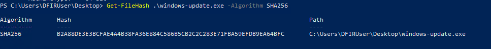

_`Get-FileHash -Algorithm SHA256` returns the file's fingerprint._

> **Key Artifact:** `B2A88DE3E3BCFAE4A4B38FA36E884C586B5CB2C2C283E71FBA59EFDB9EA64BFC`. One value, and it's enough to check the file against VirusTotal or an internal blocklist later.

## Phase 3: Pulling the Embedded URL

_Objective: find any URL hardcoded inside the binary that could point to where it downloads or reports to._

Droppers often carry a hardcoded staging URL in plaintext, even when the rest of the binary is packed or obfuscated. Running Sysinternals `strings.exe` against the file surfaces every printable string inside it.

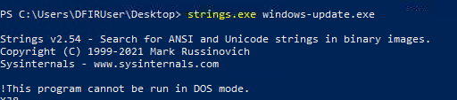

_Kicking off the strings dump._

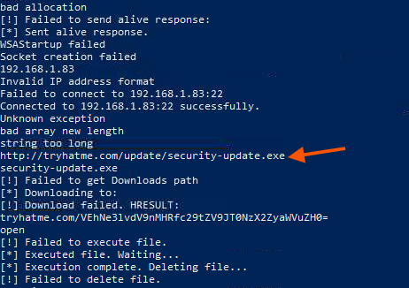

_Scrolling through the dump turns up a URL sitting right next to "Downloading to:" and "Failed to get Downloads path." That's download-handling logic, not a stray reference._

> **Key Artifact:** `http://tryhatme.com/update/security-update.exe`. The strings around it suggest the binary fetches and runs a second file once it lands on a host.

## Phase 4: Extracting the Domain

_Objective: isolate the domain from the surrounding strings to use as a standalone network IOC, something that can be blocked at the DNS or proxy level instead of just one file path._

A full URL is useful, but a domain travels further. It still works as a block even if the attacker changes the path later. Scrolling down the same `strings` output turns up a second, different domain.

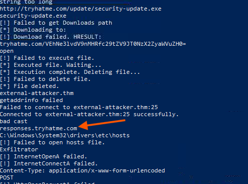

_A second domain, `responses.tryhatme.com`, sits further down the same dump, next to exfiltration-related error strings._

> **Key Finding:** `responses.tryhatme.com`. Two separate domains in one binary says something on its own: one for staging the payload, a different one for callback or exfil traffic.

## Phase 5: Decoding the Hidden Flag

_Objective: recover a flag encoded somewhere in the binary's strings, near the exfiltration domain found in the previous phase._

Sitting right next to the `responses.tryhatme.com` string is a long Base64-looking blob, tacked onto what reads like part of a URL path.

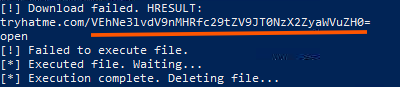

_The Base64 blob, sitting in the raw strings dump._

Feeding it into CyberChef with a single From Base64 step decodes it straight into a flag.

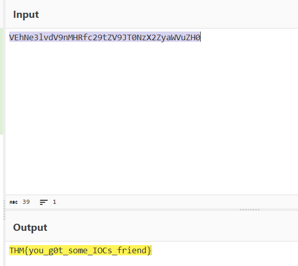

_From Base64 in CyberChef turns the blob into a readable flag._

> **Key Artifact:** `THM{you_g0t_some_IOCs_friend}`. Not every odd-looking string in a binary is just an error message. Some are worth decoding on a hunch.

## Phase 6: Identifying the Networking Library

_Objective: confirm which library the binary actually uses for socket communication, to check whether it has real network capability rather than just dead-text URLs._

Strings alone can be misleading; a URL sitting in a binary doesn't prove it's ever used. The import table settles that question. I loaded the file into PE-bear and checked the Imports tab.

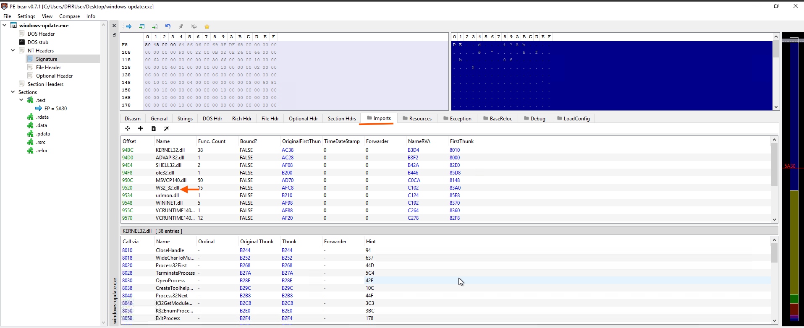

_The import table lists `WS2_32.dll` alongside the expected `KERNEL32.dll` and `WININET.dll` entries._

> **Key Finding:** `WS2_32.dll`, the Windows Sockets library. Paired with the URLs pulled in Phases 3 and 4, this confirms the binary can actually make outbound connections, not just reference addresses in text that never gets used.

## Phase 7: Correlating the PowerShell Alert

_Objective: move from static file analysis to the live EDR alert queue and recover the URL behind a critical PowerShell alert._

With the file itself profiled, the second half of the investigation shifts to what the EDR already flagged. A critical-severity alert caught suspicious PowerShell execution on `WIN-SRV-01.tryhackme.local`, running under the `CORPsvc_backup` account.

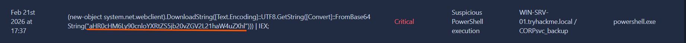

_The flagged command downloads a Base64 string, decodes it, and pipes the result straight into `IEX`._

The command itself doesn't show the destination in plain text. The target URL is Base64-encoded inside a `[Convert]::FromBase64String()` call. Pulling that string out and decoding it in CyberChef exposes the real address.

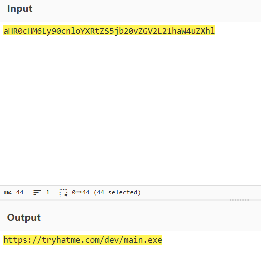

_From Base64 turns the encoded string into a plain download URL._

> **Key Artifact:** `https://tryhatme.com/dev/main.exe`. Same root domain that turned up inside the binary back in Phase 3. The live alert and the static analysis are pointing at the same infrastructure.

## Phase 8: Correlating the Browser Alert

_Objective: recover the URL behind a second, separate critical alert, this one triggered by chrome.exe instead of PowerShell._

A second critical alert on the same host and account flagged a suspicious browser download, this time from `chrome.exe`. The payload here isn't Base64. It's a JavaScript `fetch()` call built from an array of decimal character codes.

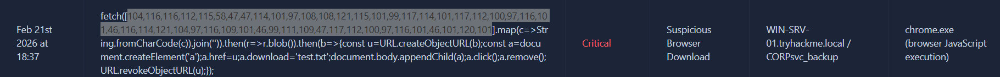

_That array of numbers is a URL, just written as decimal character codes instead of plain text._

CyberChef's From Charcode operation, set to a comma delimiter and base 10, converts the array straight back into a readable URL.

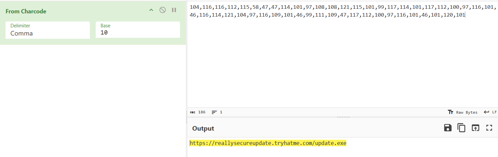

_From Charcode (delimiter: comma, base: 10) reconstructs the URL._

> **Key Artifact:** `https://reallysecureupdate.tryhatme.com/update.exe`. A second, distinct lookalike domain, separate from both the binary's embedded URLs and the PowerShell alert. That's more than one piece of staging infrastructure behind this incident.

## Phase 9: Identifying the Saved File Name

_Objective: find what filename the browser download from Phase 8 was saved under, to know what to hunt for on disk._

The same line of JavaScript that builds the download URL also sets the filename once the `fetch()` call resolves.

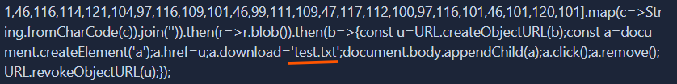

_The `a.download` property, underlined, shows exactly what the file gets named locally._

> **Key Finding:** `test.txt`. An oddly plain name for something pulled from a "secure update" lookalike domain, and a reasonable thing to sweep for on any host tied to this alert.

## Reconstructed Attack Chain

1. `windows-update.exe` lands on a user's machine posing as a legitimate update. It's a 64-bit, unsigned binary, already inconsistent with genuine Microsoft tooling.
2. Static analysis with `strings` and PE-bear pulls two embedded domains (`tryhatme.com` and `responses.tryhatme.com`) plus `WS2_32.dll` in the import table. The file is built to talk to the network, not just reference URLs it never uses.
3. A Base64 string sitting next to the exfiltration domain decodes to a flag, `THM{you_g0t_some_IOCs_friend}`, planted as a small breadcrumb inside the binary itself.
4. On the live host, `WIN-SRV-01.tryhackme.local`, the EDR catches PowerShell running as `CORPsvc_backup`, downloading and decoding a second-stage payload from `tryhatme.com/dev/main.exe`. Same root domain buried in the original binary.
5. A separate critical alert on the same host catches Chrome fetching a file from a different lookalike domain, `reallysecureupdate.tryhatme.com`, using an array of character codes instead of a plain URL to dodge simple string-matching detection.
6. That download gets saved locally as `test.txt`, a name plain enough to blend into any Downloads folder on a casual glance.

Static analysis of the dropped file and the live EDR alerts land on the same conclusion from two different directions: a fake Windows updater and a small cluster of lookalike domains, staging payloads on a compromised host through both PowerShell and the browser.

-THM.jpg>)

This write-up is part of my ongoing series documenting CTF challenges as I build my portfolio in cybersecurity. I try to approach each room from both "how was this built" and "how would I catch this in a real SOC," since that overlap is what the job actually asks for.

If you're also on the journey toward a SOC or Security Engineering role, feel free to connect. I'm always happy to discuss techniques and share resources.
