# Smol Writeup

**Machine Name:** Smol  
**Platform:** TryHackMe  
**Difficulty:** Medium

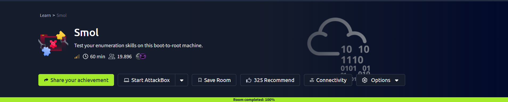

## Introduction

Smol is an medium TryHackMe machine. The whole box is one WordPress site, and almost every step traces back to the same idea: someone left something lying around that should have been cleaned up. A plugin nobody patched. A config file readable from outside. A password used twice. A backdoor nobody removed.

Nothing exotic happens here. What makes Smol worth writing up is the way a run of small, ordinary mistakes stacks into a full takeover of the server. I worked it from the attacker's side first, then went back and asked the question that actually matters to a defender: where could this have been stopped?

By the end, the site gives up its database credentials, a working shell, four separate user accounts, and finally root.

## Phase 1: Enumeration

I opened with a full TCP port scan.

> nmap -p- -sV -sC <TARGET_IP>

Two ports answered: SSH on 22 and Apache on 80. The web server tried to redirect to www.smol.thm, a hostname my machine had never heard of, so I added it to /etc/hosts before the site would load properly.

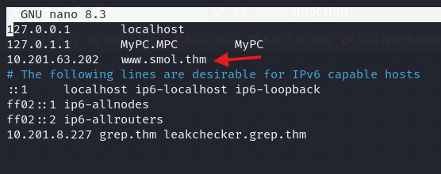

With the host entry in place, the page loaded as an ordinary looking blog.

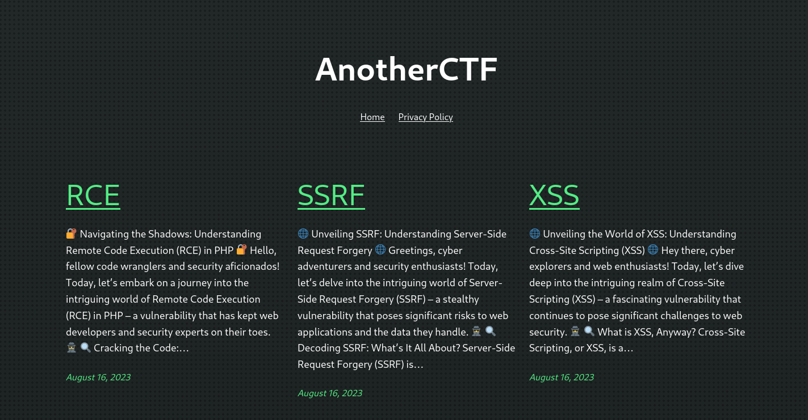

## Phase 2: Fingerprinting the CMS

A content discovery scan turned up the usual WordPress tells: wp-admin, wp-content/uploads, an akismet folder, a readme, a license file. Folders that start with "wp" are a strong hint the site runs WordPress.

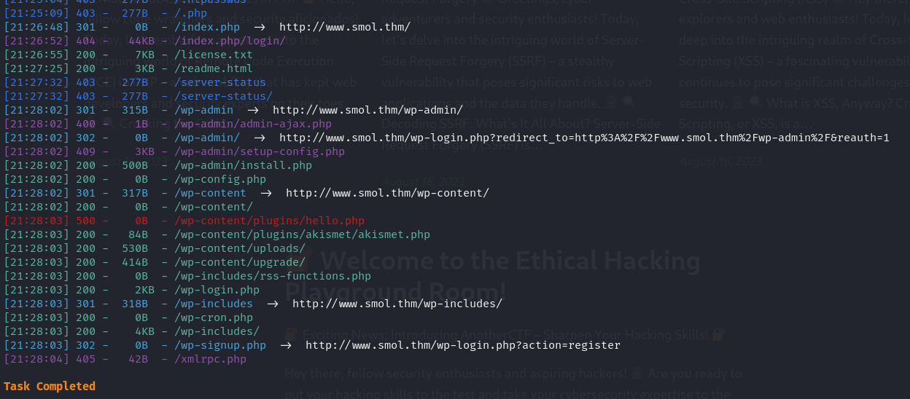

Knowing the platform, I switched to WPScan, a scanner built for WordPress that checks the core, themes, plugins, and users against a vulnerability database.

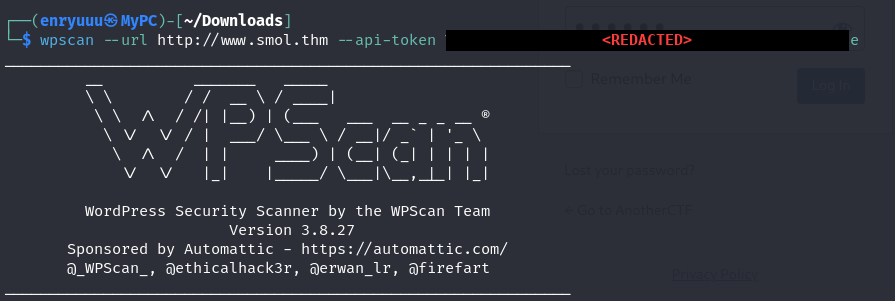

It flagged the interesting part right away: a plugin called jsmol2wp with known XSS and SSRF issues, plus a couple of usernames.

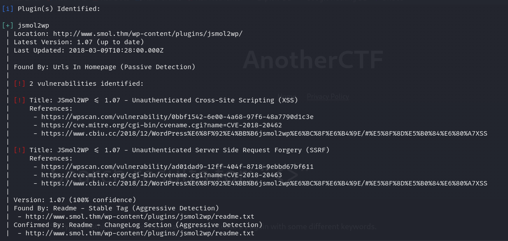

> **Security Issue #1:** Vulnerable plugin left installed. jsmol2wp shipped public XSS and SSRF flaws with working proof of concept code. A live site should not be running plugin versions that already have documented vulnerabilities.

## Phase 3: XSS and SSRF in a Plugin

The XSS was simple enough to confirm: grab the public proof of concept, swap its localhost placeholder for the real domain, load it in a browser, and watch the plugin reflect input straight back.

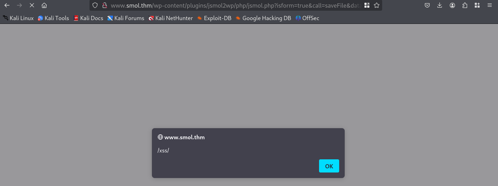

The SSRF was the one that paid off. Server Side Request Forgery makes the server fetch things on your behalf, and here I pointed it at the site's own wp-config.php. That file stores the WordPress database settings in plain text. It came back with a database username and password, no login required.

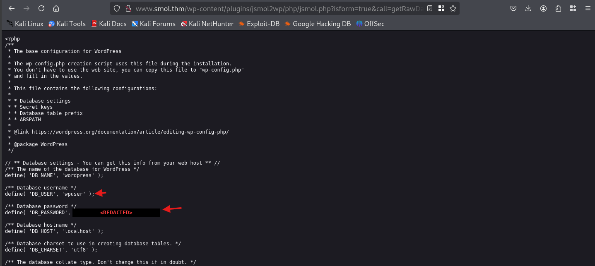

The same trick pulled other internal details too, like the active user.

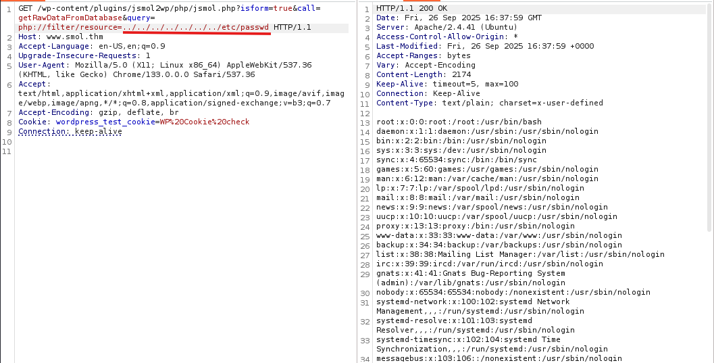

> **Security Issue #2:** SSRF exposed the database credentials. The plugin could be talked into reading a sensitive config file and handing it to an anonymous visitor. A config file with live credentials should never be reachable from outside, and the SSRF should not have worked at all.

## Phase 4: Logging into WordPress

The earlier scan had already shown a WordPress login page, and now I had a username and password from the SSRF leak. They belonged to wpuser, and they worked. Straight into the admin dashboard.

> Username: wpuser  
> Password: `<REDACTED>`

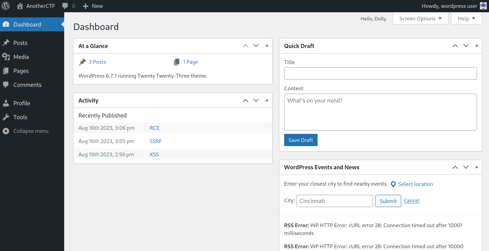

## Phase 5: Remote Code Execution via a Plugin Backdoor

Digging through the dashboard, the Pages section held an internal note left for the site's webmaster. It warned about a backdoor risk in Hello Dolly, a tiny default WordPress plugin whose only real job is to print a line of a Louis Armstrong song in the corner of the admin panel. It has nothing worth keeping, and it is a classic place to hide malicious code.

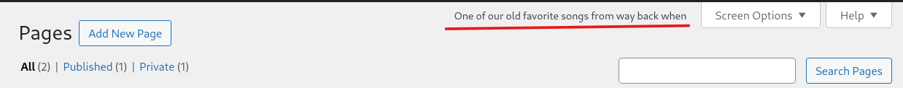

That warning was describing this exact box. After some trial and error I reached the plugin's hello.php file and found code that had been tampered with.

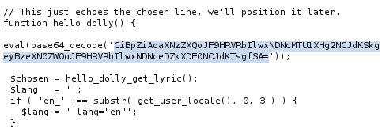

Decoding it revealed a backdoor that runs whatever command you pass in the URL, but only when the request comes from an admin session. I was already logged in as admin, so that condition was met. Adding cmd=whoami to the page returned www-data, the web server's account. That is remote code execution.

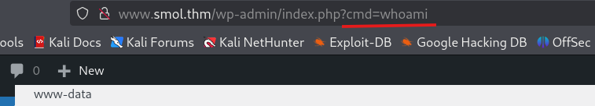

> **Security Issue #3:** A backdoored plugin was left active. The site even carried its own warning about it. Plugins like Hello Dolly that go unused should be removed, and any file that fails an integrity check should stop the deployment cold.

## Phase 6: Reverse Shell as www-data

Running commands one at a time through a URL gets old fast, so I upgraded to a real shell. With a listener waiting on my machine, I used the backdoor to fetch and run a PHP reverse shell. The callback landed a few seconds later as www-data.

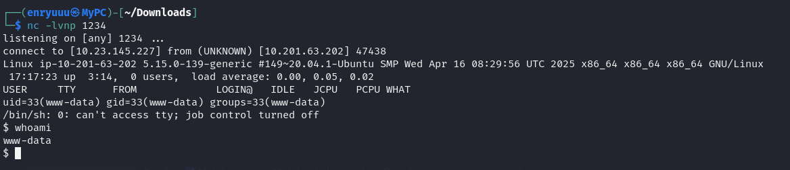

## Phase 7: Cracking the Password Hashes

As www-data I could see several user home folders but could not read into them. What I did have were the database credentials from the SSRF leak, so I logged into MySQL and dumped the WordPress users table. That handed over every account's password hash.

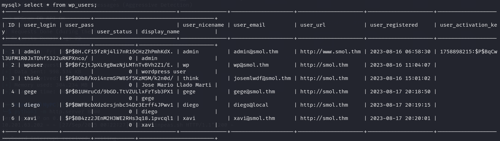

I dropped the hashes into a file and ran John the Ripper against them with the rockyou wordlist. One cracked cleanly.

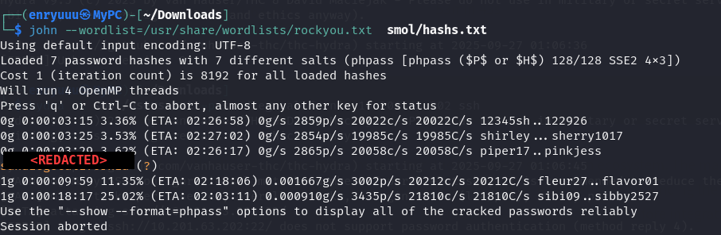

Four human users lived on the box, and I did not yet know which one the cracked password belonged to, so I tried it against each with su until one accepted it. It was diego.

> Username: diego  
> Password: `<REDACTED>`

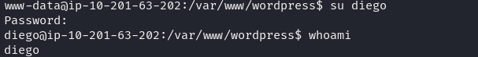

> **Security Issue #4:** Weak, reused passwords. One wordlist cracked a real user's password in seconds, and that same value unlocked a Linux account. Strong, unique passwords per account would have broken the chain right here.

### First flag

Logged in as diego, the first flag was sitting in his home directory.

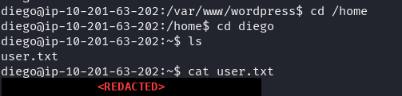

## Phase 8: Lateral Movement Between Users

diego could read into other users' folders, and the account named think stood out: it held an SSH private key. Copying that key to my own machine let me log in as think directly.

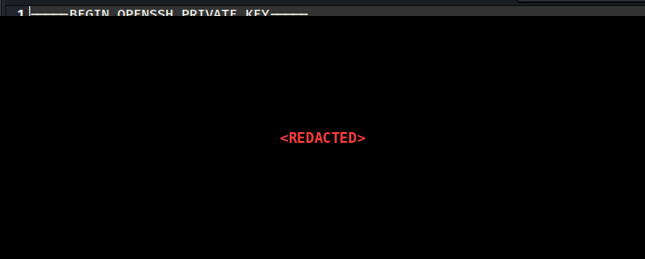

think had a small privilege of its own. It could switch to the user gege with no password at all.

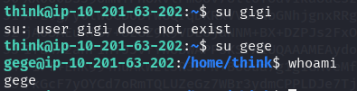

Inside gege's folder sat a password protected archive, wordpress.old.zip. I copied it back to my machine, turned it into a crackable hash with zip2john, and cracked it with John.

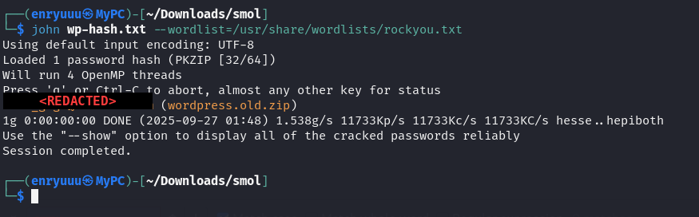

Unzipping it revealed an older wp-config.php, and that old config held yet another set of database credentials, this time for xavi.

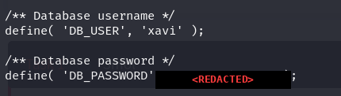

Those same credentials worked as xavi's system password.

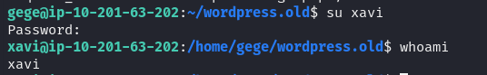

## Phase 9: Privilege Escalation and Second Flag

xavi's sudo rights closed the room out. A quick sudo -l showed the account could run any command as root, so it took one line.

> sudo /bin/bash

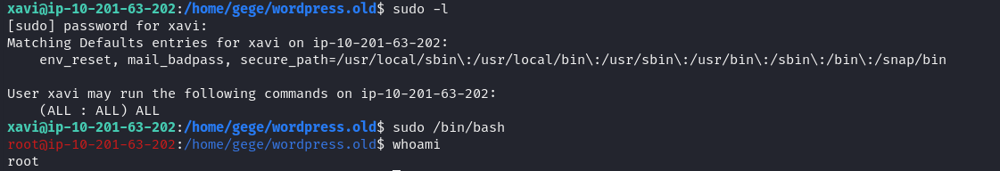

> **Security Issue #5:** Unrestricted sudo access. xavi was allowed to run every command as root. Sudo rights should be scoped to the exact commands an account needs, so that one foothold does not turn straight into root.

### Second flag

whoami confirmed root, and the final flag was waiting in /root.

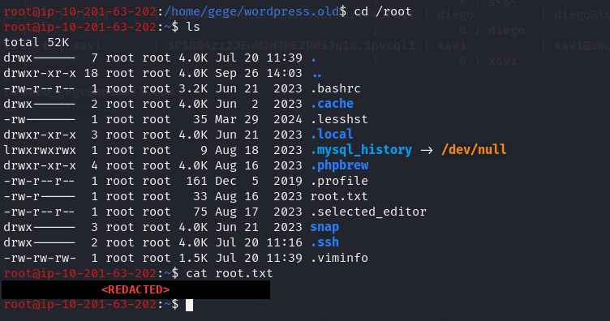

## Blue Team Perspective

Reading the chain backwards, here is where a defensive team could have cut it.

### 1. Patch and prune plugins.

The break in started with jsmol2wp and its public XSS and SSRF flaws, and got finished off in part by a backdoored Hello Dolly. Fix: keep plugins patched against a CVE feed, and pull any plugin the site does not actually use.

### 2. Keep secrets off the wire.

The SSRF returned wp-config.php, credentials and all, to an anonymous visitor. Fix: block the SSRF at the application layer, limit what the web account can read, and treat any config file that can be fetched remotely as an incident.

### 3. Enforce strong, unique passwords.

Two passwords on this box fell to a basic wordlist, and both were reused across a database account and a system login. Fix: require strong passwords, ban reuse across services, and keep credentials in a secrets manager instead of a plaintext config.

### 4. Apply least privilege.

Passwordless account switching and full sudo for xavi meant a single foothold rolled straight to root. Fix: scope sudo to specific commands, drop standing passwordless su, and review these rules on a schedule.

This write-up is part of an ongoing series where I document CTF challenges as I build my portfolio in cybersecurity. I try to take each box from both the attacker's and the defender's side, because knowing how something breaks and knowing how to stop it are two halves of the same job.

If you are working toward a SOC or security role too, feel free to connect. I am always happy to compare notes and swap resources.
