# ToolsRUs Writeup

**Machine Name:** ToolsRus  
**Platform:** TryHackMe  
**Difficulty:** Easy

---

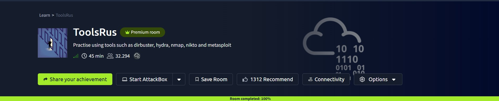

## Introduction

ToolsRUs is an easy TryHackMe room built around a handful of tools most pentesters end up using constantly: Nmap, a directory brute forcer, Hydra, Nikto, and Metasploit. The target is a Toys "R" Us themed web server, and the whole path to root comes down to one bad habit: the same weak password guarding two different logins.

There is no clever chaining here, no pivoting between users. Once that one password cracks, it opens the low value page it was meant for, and then it opens an admin panel it was never supposed to touch.

## Phase 1: Enumeration

A full port scan turned up four open ports.

```
22/tcp   open  ssh     OpenSSH 7.2p2 Ubuntu
80/tcp   open  http    Apache httpd 2.4.18 (Ubuntu)
1234/tcp open  http    Apache Tomcat/Coyote 1.1 (Tomcat 7.0.88)
8009/tcp open  ajp13   Apache Jserv (Protocol v1.3)
```

Port 80 and port 1234 were the interesting ones. Port 80 showed a placeholder page, and port 1234 was a stock Apache Tomcat welcome screen that looked like it had never been touched after install.

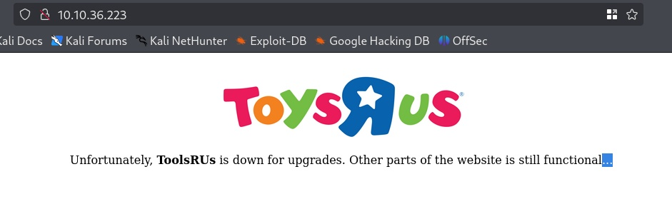
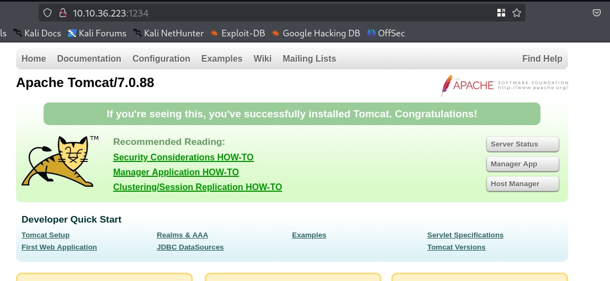

## Phase 2: Finding the Hidden Pages

Dirsearch against port 80 mostly returned dead ends: blocked `.htaccess` variants and a couple of paths that didn't lead anywhere useful. Gobuster gave a cleaner result: `/guidelines` and `/protected`.

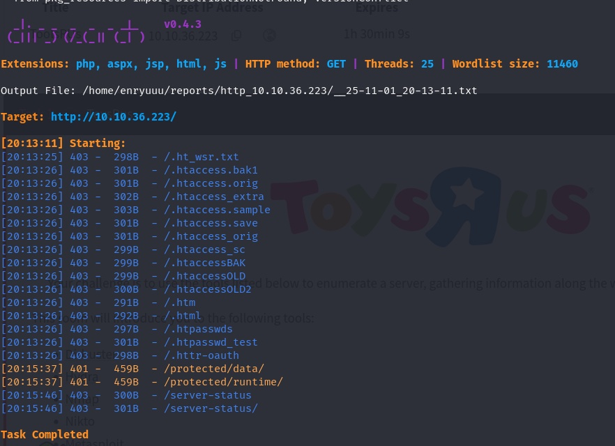
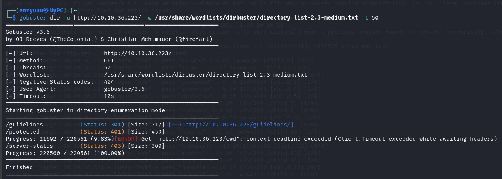

`/guidelines` wasn't written for a visitor. It read like a note one coworker left for another:

> "Hey bob, did you update that TomCat server?"

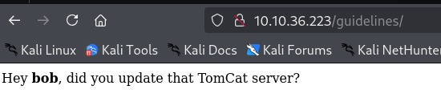

One sentence, and it gave up a valid username plus a hint about which service to check next. `/protected` sat behind a basic auth prompt, clearly waiting for a password to match that username.

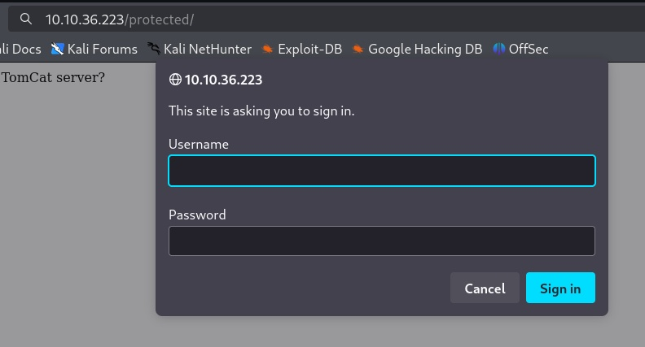

A separate scan against port 1234 turned up `/manager/html`, the Tomcat Manager login. Another door, same missing password.

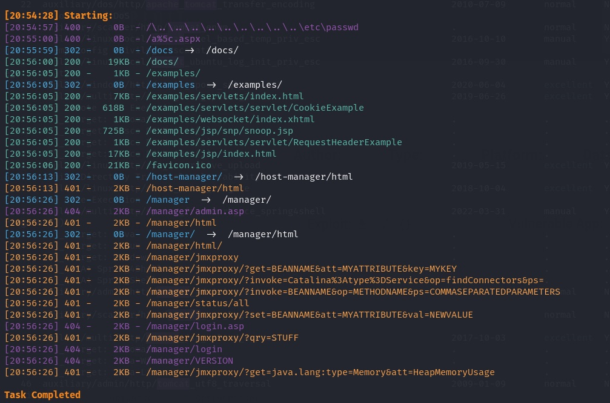

> **Security Issue #1:** Username Leaked on a Public Page. A note meant for one developer was reachable by anyone with a browser. It confirmed a real username and pointed straight at the next target, which turns a brute force attack into little more than guessing a password.

## Phase 3: Cracking a Weak Password

With a username confirmed, Hydra went after `/protected/` using rockyou.txt.

```
hydra -l bob -P /usr/share/wordlists/rockyou.txt http-get://<TARGET_IP>/protected/ -V
```

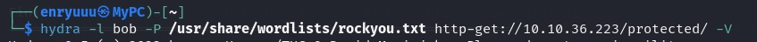

It found a match fast.

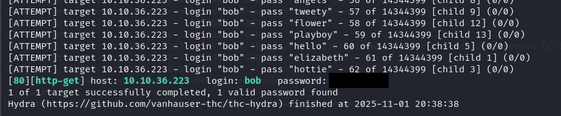

_(password redacted)_

Logging into `/protected/` with the cracked credentials confirmed it worked, though the page had one more thing to say. It had "moved to a different port."

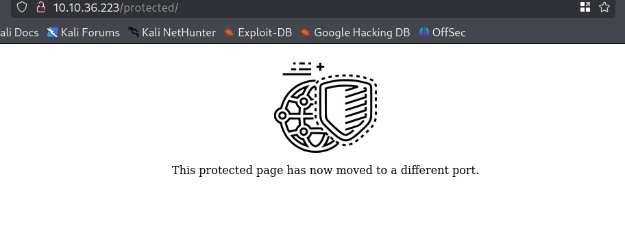

> **Security Issue #2:** Weak Password, No Lockout. The password gave in to a common wordlist within minutes, and nothing on the server slowed that down. No rate limiting, no lockout, no alert on repeated failed logins.

## Phase 4: One Password, Two Doors

That redirect pointed straight back to port 1234. Logging into the Tomcat Manager at `/manager/html` with the exact same username and password worked on the first try. No new password needed.

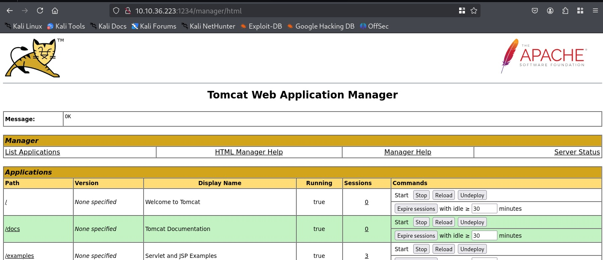

Running Nikto against the now authenticated manager confirmed the access and the exposed Tomcat version.

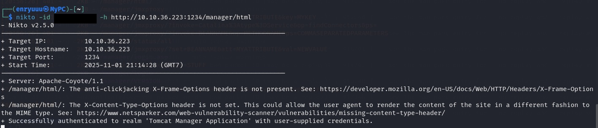

_(credentials redacted)_

> **Security Issue #3:** One Password, Two Systems. A password meant for a minor, low value page also unlocked an administrative panel, simply because someone reused it. The panel never asked for anything stronger.

## Phase 5: Remote Code Execution to Root

Tomcat 7.0.88 has a well known public exploit path: Metasploit's `exploit/multi/http/tomcat_mgr_upload`, which uses valid Manager credentials to upload and run a malicious web application.

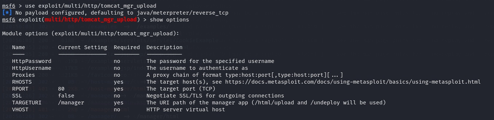

Target, port, and the cracked credentials went into the module options.

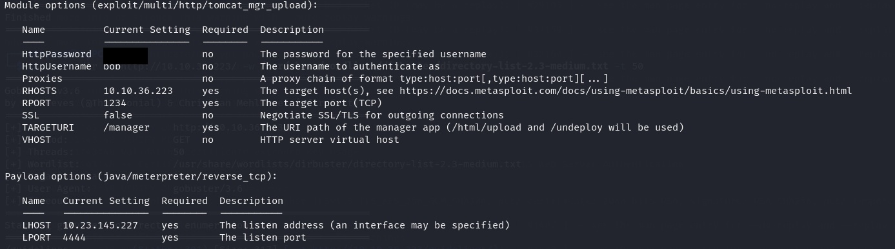

_(password redacted)_

The exploit ran cleanly and returned a Meterpreter session.

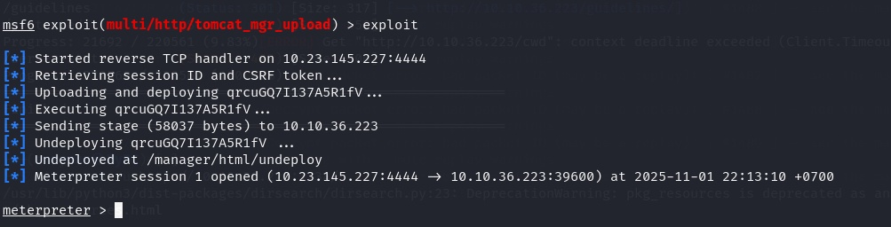

Dropping into a shell and checking identity showed there was no privilege escalation left to do at all.

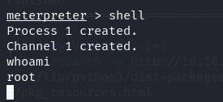

### Flag

The Tomcat service was already running as root. From `/root`, the flag was just sitting there.

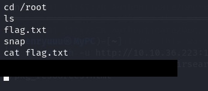

_(flag redacted)_

> **Security Issue #4:** Outdated Service Running as Root. A years old, publicly documented exploit still worked, and the service it hit had no separation from the operating system. Compromising the web app meant compromising the whole machine in one move.

## Blue Team Perspective

Working back through this chain, here's what a defensive team would likely have caught, and where.

### 1. Internal Notes Left on a Public Page

A note meant for one developer shouldn't be reachable by anyone who visits the site. Fix: treat every reachable path as public by default, and review pages for leftover internal notes before launch.

### 2. No Protection Against Password Guessing

A password fell to a common wordlist with zero resistance from the server. Fix: rate limiting and account lockout on login endpoints, plus alerts on repeated failed attempts.

### 3. Credential Reuse Across Systems

One login worked on two completely unrelated services. Fix: unique credentials per system, and a password manager or vault instead of relying on memory.

### 4. Unpatched Service Running With Excessive Privilege

Old, documented vulnerabilities stayed exploitable because the software was never updated, and it ran with far more privilege than it needed. Fix: tie patching to a CVE feed for anything internet facing, and run application services under a low privilege account, never root.


This write up is part of my ongoing series documenting CTF challenges as I build my portfolio in cybersecurity. I approach each challenge from both offensive and defensive angles, because understanding both sides is what makes a well rounded security professional.

If you're also on the journey toward a SOC or Security Engineering role, feel free to connect. I'm always happy to talk through techniques and share resources.
