# Watcher Writeup

**Machine Name:** Watcher  
**Platform:** TryHackMe  
**Difficulty:** Medium

---

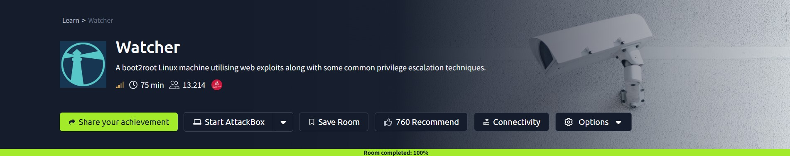

## Introduction

Watcher is a medium box on TryHackMe, and it plays out very differently from the usual easy room. There is no single lucky exploit that drops you straight to root. What you get instead is a ladder. One small misconfiguration reads a file it should not, that file hands you a foothold, and from there the box passes you from one user to the next, five in total, each handoff caused by someone leaving a door open they meant to close.

The site itself is a blog about cork placemats. Harmless on the surface. But a file inclusion bug near the start quietly unlocks most of the room, and the climb to root afterwards runs through most of the ways a Linux box gets left misconfigured: passwordless sudo, a scheduled script anyone can edit, a script that trusts a file it should not, and a private key left in a backup folder the wrong group can open.

Seven flags and five users sit between that first scan and root. Here is how the climb went.

## Phase 1: Enumeration

I started with a full TCP port scan against the target.

> nmap -p- -sV -sC \<TARGET_IP>

Three ports came back open: FTP on 21 (vsftpd 3.0.5), SSH on 22, and HTTP on 80 running Apache with a Jekyll generated site titled "Corkplacemats". Two of those three, FTP and the web server, end up mattering a lot.

Loading the site in a browser showed a tidy little blog with a few placemat posts, each with a "View" button.

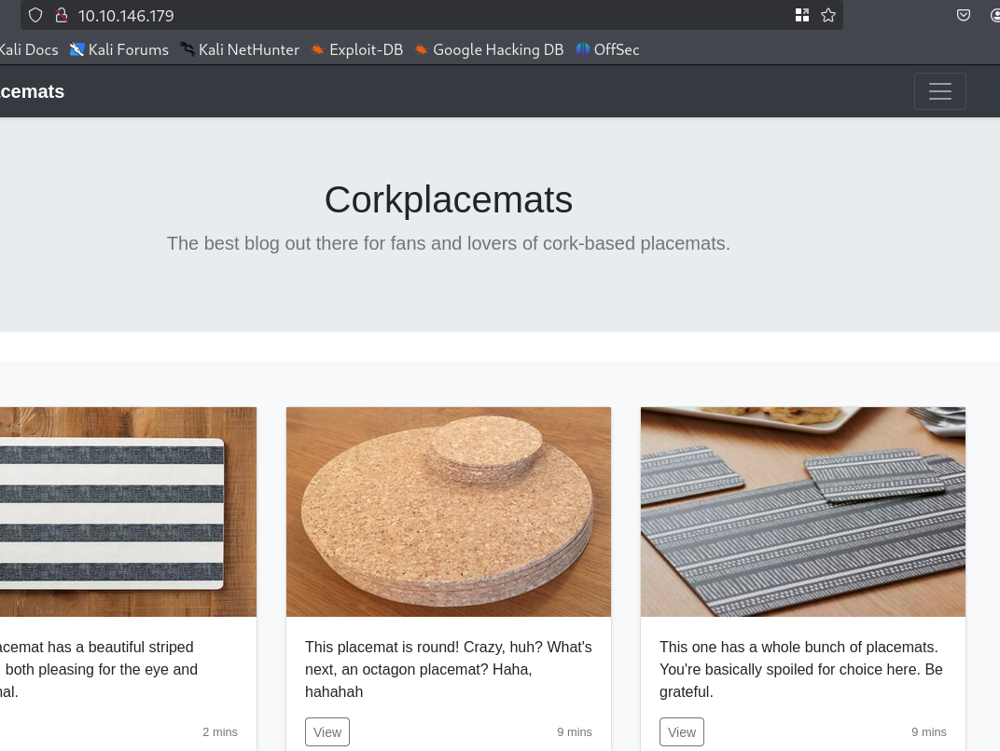

Nothing looked exploitable yet, so the next move was to see what else the server was hiding.

## Phase 2: Files That Should Not Be Public

A content discovery scan against the web root turned up an open `/images` directory listing and, more usefully, a `robots.txt`.

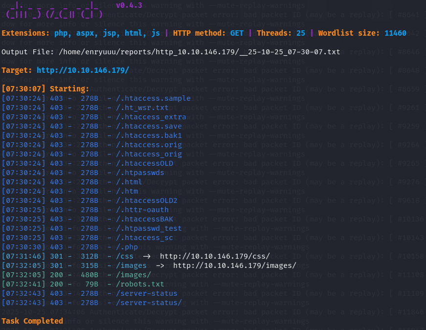

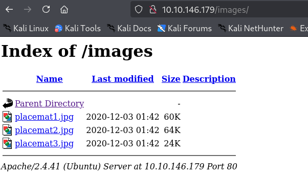

The `robots.txt` is where the room starts giving itself away. Instead of hiding anything, it points straight at two files.

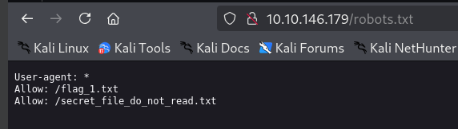

### Flag 1

One of them, `flag_1.txt`, opens without any barrier at all.

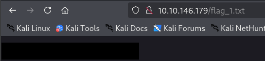

The first flag came for free, straight out of a file the server itself advertised.

The second entry, a "secret" note that the filename practically begs you not to read, returns a 403 when you request it directly.

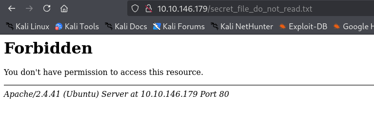

That 403 turns out to be the only thing standing between an attacker and the rest of the box, and it does not hold for long.

> **Security Issue #1:** Sensitive paths listed in robots.txt. `robots.txt` tells search engines what to skip, not what to protect. Listing a private note there just points every visitor at it.

## Phase 3: Local File Inclusion

Clicking "View" on a post loads it through `post.php?post=round.php`. A file name passed straight into a URL parameter is worth testing, so I swapped it for a path traversal and asked for `/etc/passwd`.

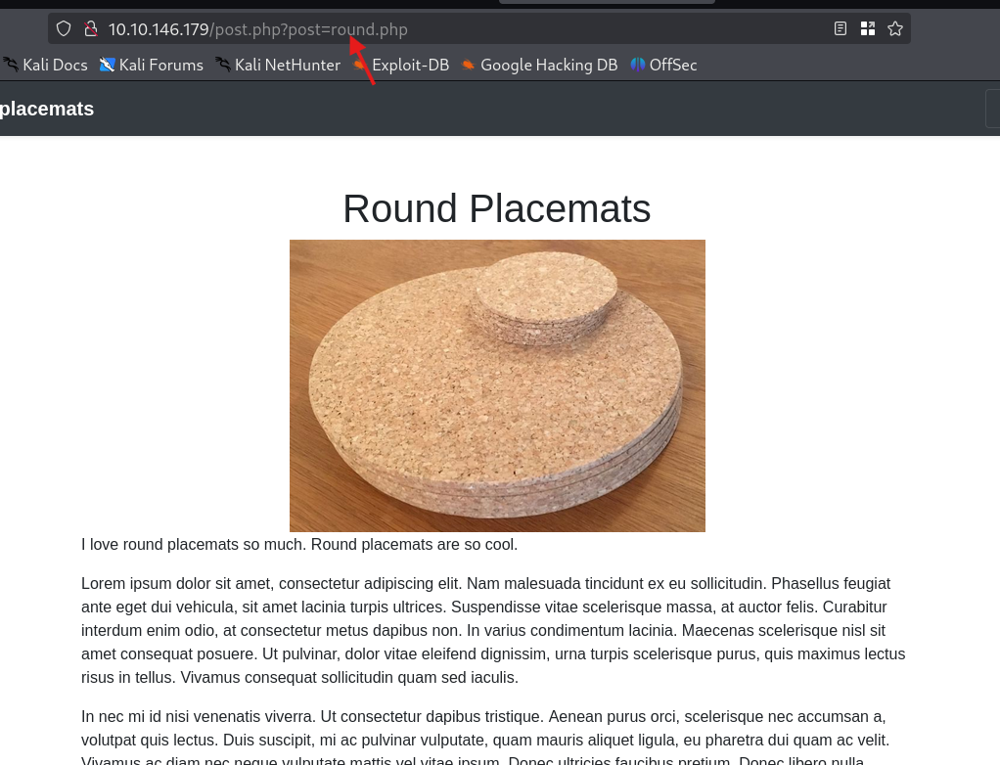

It came back.

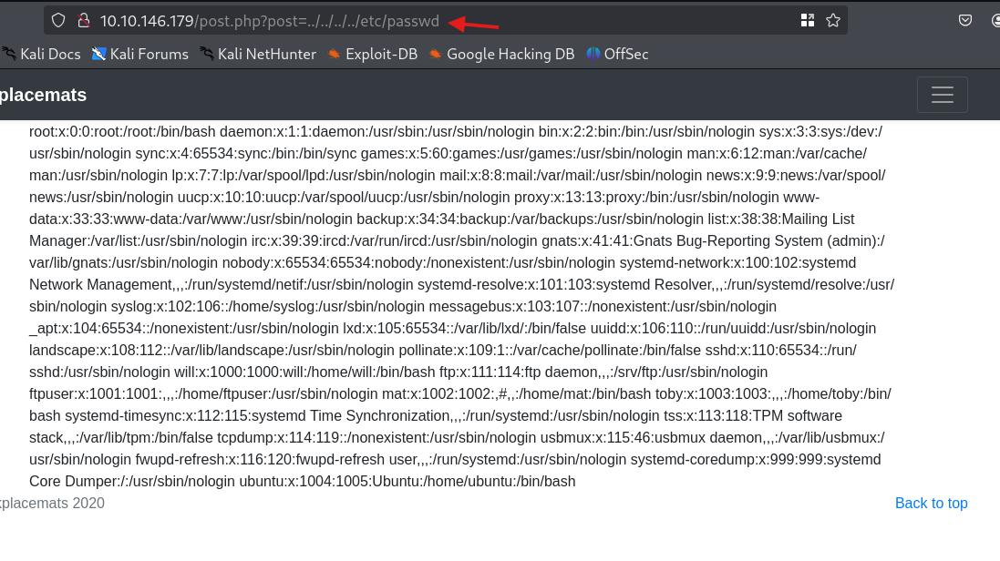

That confirms a Local File Inclusion, and `/etc/passwd` also handed me a full list of the box's users: `will`, `ftpuser`, `mat`, `toby`, and `ubuntu`. That user list becomes the map for the whole privilege escalation later.

Now, the earlier 403 on the secret note only blocked direct requests. The LFI does not ask the web server for the file the normal way, it reads it off disk, so the 403 no longer applies. I pointed the same parameter at the secret note.

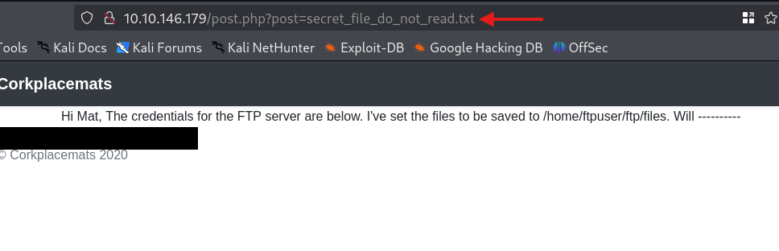

Inside was a message to "Mat" containing the FTP credentials in plain text (username and password both `<REDACTED>` here) and a helpful detail: uploaded files land in `/home/ftpuser/ftp/files`. Hold onto that path, it matters in a minute.

> **Security Issue #2:** Local File Inclusion in the post parameter. The `post` value is read from disk with no validation, so any file the web user can reach is readable through the browser, access controls and all.

## Phase 4: FTP Access

The credentials from the note worked on the FTP service on the first try.

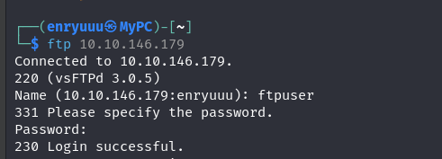

The home directory held a `files` folder and a second flag sitting in the open.

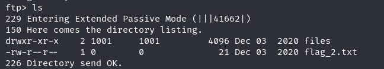

I pulled it down and read it locally.

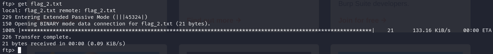

### Flag 2

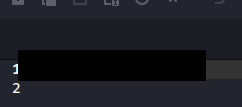

Two flags in, and so far the box has not required a single real exploit, only files that were left readable.

> **Security Issue #3:** Plaintext credentials in a readable file. Writing a live FTP password into a note on the web root means one file read is enough to log in. Secrets do not belong in files the web server can hand out.

## Phase 5: From File Read to Reverse Shell

Here the two halves of the box connect. FTP lets me write files into `/home/ftpuser/ftp/files`, and the LFI lets me read files off disk through the browser. That path was named right there in the secret note, and I could confirm the LFI reaches into the FTP home by reading the flag I already had through it.

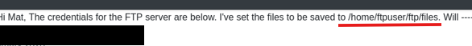

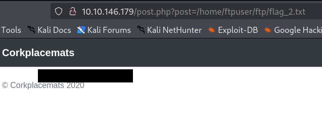

If I upload a PHP payload over FTP and then open it through the LFI, the web server executes it. So I uploaded a PHP reverse shell into the `files` folder.

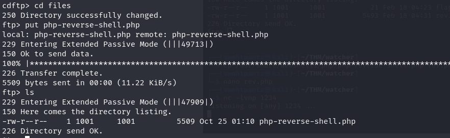

Started a listener,

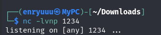

then browsed to the uploaded file through the vulnerable parameter to trigger it.

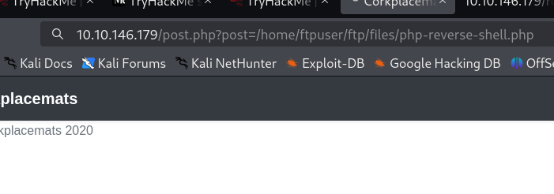

The callback landed a moment later. A shell as `www-data`.

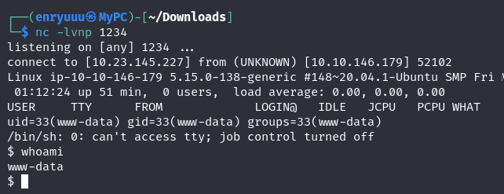

### Flag 3

Poking around the web root turned up an oddly named folder, `more_secrets_a9f10a`, holding the third flag.

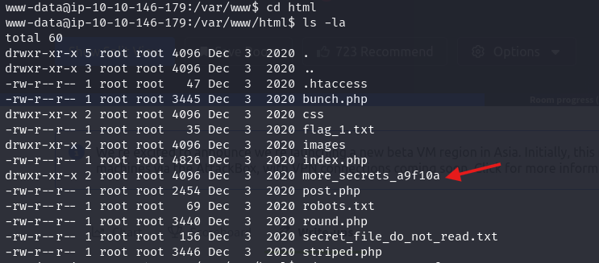

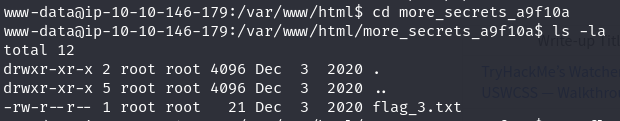

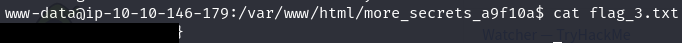

> **Security Issue #4:** Web writable directory served back to the browser. An FTP folder the web server can execute, combined with the file inclusion above, turns a simple upload into full code execution. Upload directories should never be executable, and the two bugs should never have been reachable together.

## Phase 6: Privilege Escalation

This is where Watcher earns its difficulty rating. Root is four users away, and every step up the chain is a separate misconfiguration.

### www-data to toby

The first check on any shell is `sudo -l`, and this one paid off immediately.

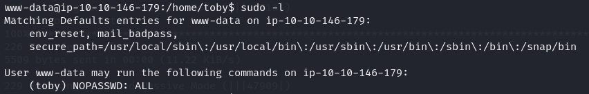

`www-data` can run anything as `toby` without a password. Switching user is a one liner.

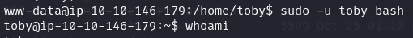

### Flag 4

The fourth flag was waiting in toby's home.

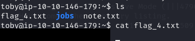

> **Security Issue #5:** Passwordless sudo to another user. Letting the web account become `toby` with no password removes the boundary between a compromised web service and a real user account.

### toby to mat

A note in toby's home mentioned cron jobs being set up, which is a strong hint.

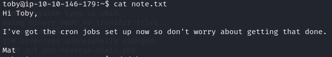

Toby owns a `jobs` folder with a script called `cow.sh` that copies a file out of mat's home. Since the job runs as mat and toby can edit the script, I can make it run whatever I want as mat.

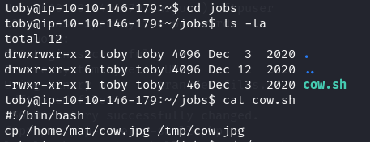

I appended a reverse shell line to the script.

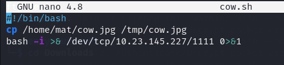

Then set up a listener and waited for the scheduled job to fire.

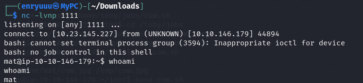

### Flag 5

A shell as mat, and the fifth flag with it.

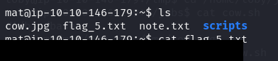

> **Security Issue #6:** Writable script run by a scheduled job. A cron job that executes a script one user can edit while running as another hands that first user the second user's shell.

### mat to will

Mat's home had its own note and its own `sudo -l` surprise.

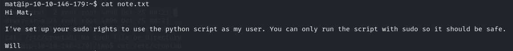

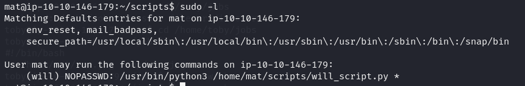

Mat can run a python script as `will` without a password. The script directory held two files: `will_script.py`, owned by will and not editable, and `cmd.py`, owned by mat.

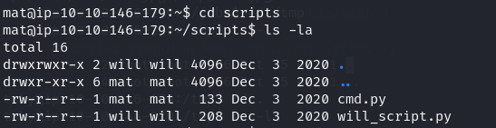

The trick is that `will_script.py` imports `cmd.py`. It has a command whitelist, but the whitelist check does not matter, because importing a module runs whatever is at the top of it. Since mat controls `cmd.py`, mat controls what runs the moment will's script imports it.

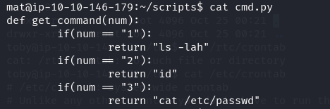

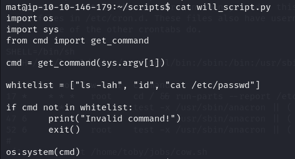

I generated a python reverse shell payload,

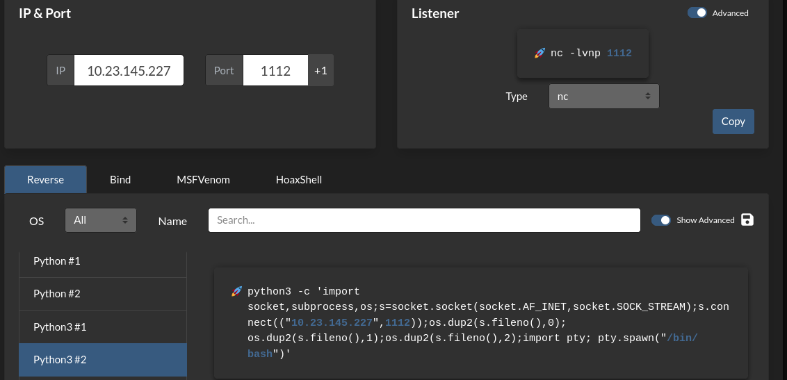

dropped it into `cmd.py`, and ran the sudo command. Will's script imported my file and executed the payload as will.

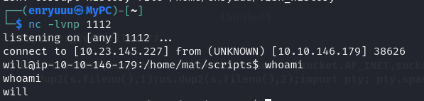

### Flag 6

The sixth flag was in will's home.

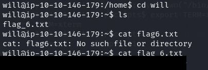

> **Security Issue #7:** Sudo script importing a user writable module. A trusted script is only as trusted as everything it imports. The whitelist looked safe, but the imported file was editable, so the safety check never got a chance to run.

### will to root

Will can read `/opt/backups`, where a file named `key.b64` sits owned by root but readable through the `adm` group.

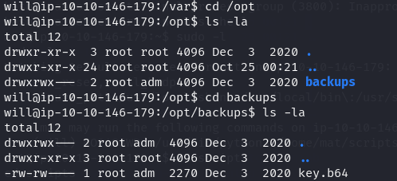

The contents are base64.

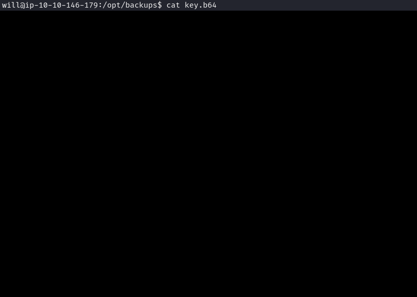

Decoding it gives a root SSH private key.

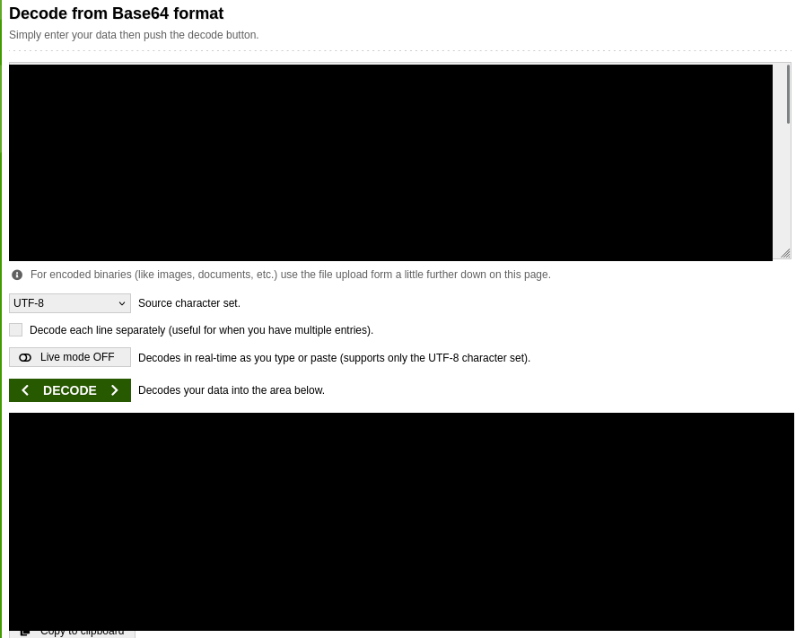

I saved the key, fixed its permissions,

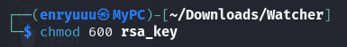

and used it to log straight in as root over SSH.

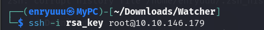

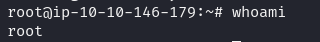

The final flag closed the room out.

### Flag 7

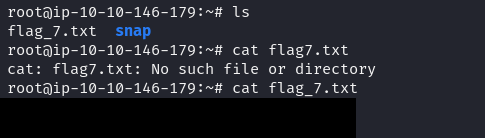

> **Security Issue #8:** Root private key left in a readable backup. A root SSH key stored in a backup folder that a low privilege group can read turns "read one file" into full root, no cracking required.

## Blue Team Perspective

Looking back over the whole chain, four lessons cover most of what went wrong here.

### 1. Stop leaking file paths.

The room practically narrates its own layout: `robots.txt` names a secret file, a directory listing exposes the images folder, and a config note spells out the FTP upload path. A defender catches most of this with a routine web scan. Fix: turn off directory listing, keep secrets out of web reachable files, and never treat `robots.txt` as an access control.

### 2. Close the file inclusion and upload path.

The LFI is the single bug that unlocks the room, and pairing it with a writable, executable upload folder is what turns a file read into code execution. Fix: validate the `post` parameter against a fixed list of allowed pages, and make sure upload directories can never be executed by the web server.

### 3. Kill plaintext and reused secrets.

An FTP password sat in a readable note, and a root SSH key sat base64 encoded in a backup folder. Neither was really hidden. Fix: store credentials in a secrets manager, keep keys out of shared readable locations, and rotate anything that was ever exposed like this.

### 4. Tighten the privilege boundaries.

Every step from `www-data` to root came from a permission that was too generous: passwordless sudo across users, a cron script anyone could edit, a sudo job importing a writable file, and a key readable by the wrong group. Fix: scope sudo rules narrowly, make scheduled scripts writable only by the account that runs them, and review file ownership on anything that touches a privileged account.

This write up is part of my ongoing series documenting CTF challenges as I build my portfolio in cybersecurity. I work each box from both the offensive and defensive side, because seeing how an attack lands is what teaches you where to stand to stop it.

If you are also working toward a SOC or Security Engineering role, feel free to connect. I am always happy to trade techniques and resources.
