# Year of the Rabbit Writeup

**Machine Name:** Year of the Rabbit
**Platform:** TryHackMe
**Difficulty:** Easy

---

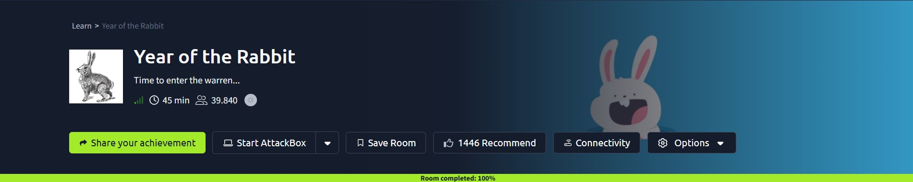

## Introduction

Year of the Rabbit is an easy-difficulty TryHackMe room, and it earns its own warning: _"can you hack into the box without falling down a hole?"_ That's not a throwaway line. The whole room is built around rabbit holes: a prank video, a fake redirect, and a page that outright tells you to turn your JavaScript off.

Once past the jokes, the actual path is a chain of small puzzles rather than a single flashy exploit. A CSS comment leaks a hidden page. That hidden page leaks a hidden folder. The folder holds an image with a password list stitched into it. The password unlocks an FTP account, which holds a file encoded in an esoteric programming language, which unlocks SSH. And the SSH session itself leaves a note pointing to the next puzzle. Nothing here needed a public CVE to get the first foothold, only patience and a willingness to check the places most people skip.

## Phase 1: Enumeration

Started with a full TCP port scan against the target.

> nmap -p- -sV -sC \<TARGET_IP\>

Three ports came back open: FTP (21), SSH (22), and HTTP (80). Port 80 loaded nothing more than the stock Apache2 Debian default page, the kind of placeholder most scanners walk straight past.

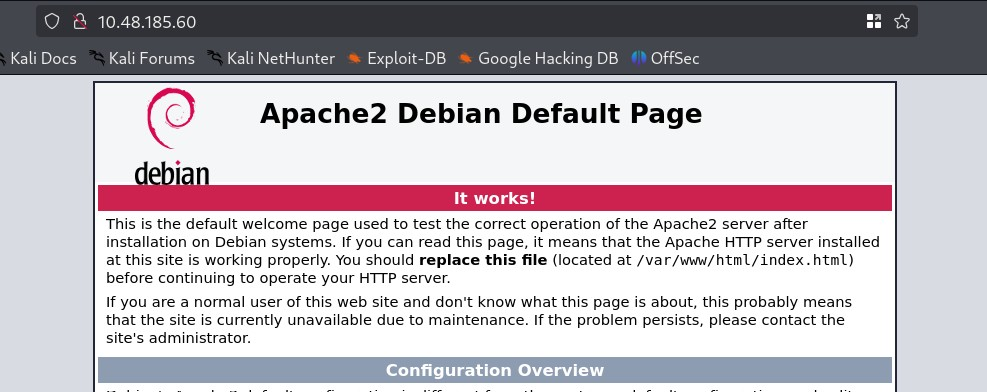

## Phase 2: A CSS Comment That Wasn't Meant to Be Read

A content discovery scan against the web root turned up a single interesting entry: `/assets/`.

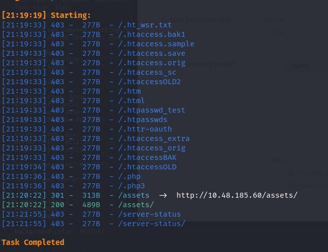

The directory listing held two files: a video named `RickRolled.mp4` (a joke, and an accurate one) and a `style.css`. A stylesheet on a page with no visible styling is a strange thing to find, so it was worth a look.

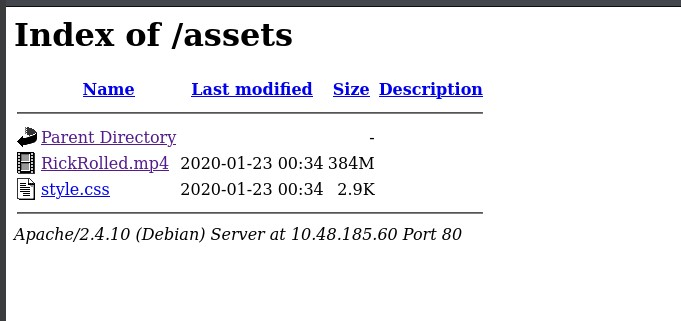

Inside the CSS, a comment addressed to anyone curious enough to check it:

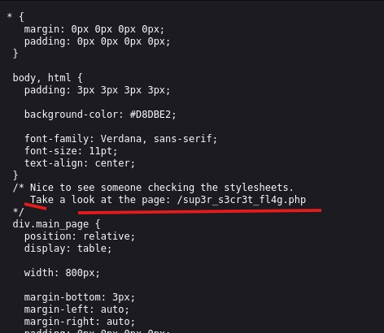

> **Security Issue #1:** Hidden Path Disclosed in Front-End Source Code. Client-side files such as CSS and JavaScript are fully visible to anyone who opens dev tools. Leaving developer notes, internal paths, or debug comments inside them hands over information that should never leave the server.

## Phase 3: A Page That Insists You Turn Off JavaScript

The path from the CSS comment led to a page that immediately threw a JavaScript alert warning to disable JavaScript, then tried to redirect to a YouTube video the moment the page loaded.

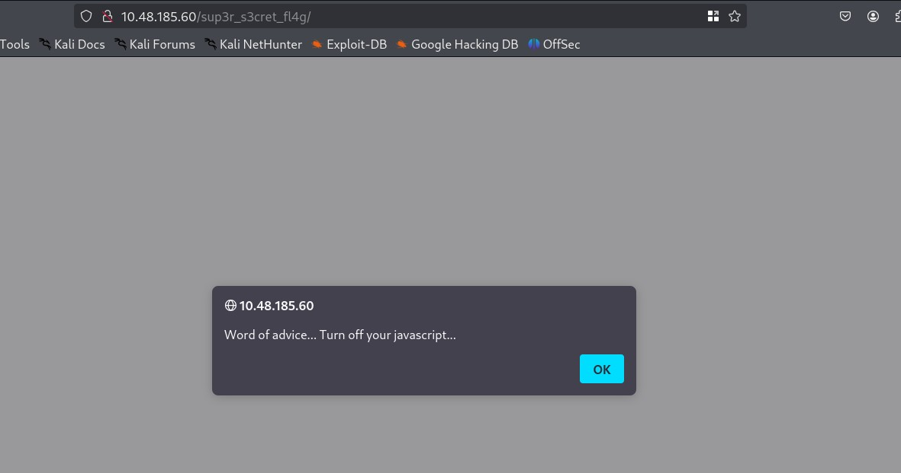

Capturing the response in Burp showed why: with JavaScript blocked, a `noscript` block appears instead of the redirect, and it spells out the next step directly: watch the video, with the sound turned up.

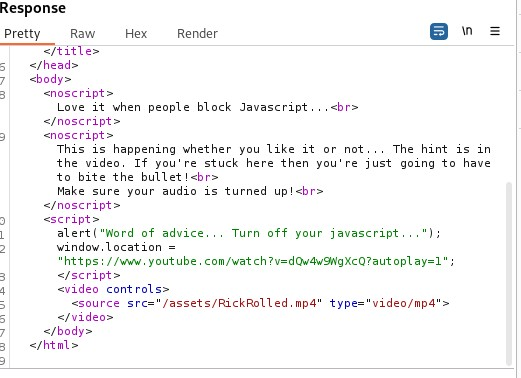

Disabling JavaScript in Firefox (`about:config` → `javascript.enabled` → `false`) and reloading the page confirmed it: the redirect never fired, and an embedded video loaded in its place.

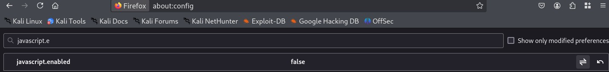
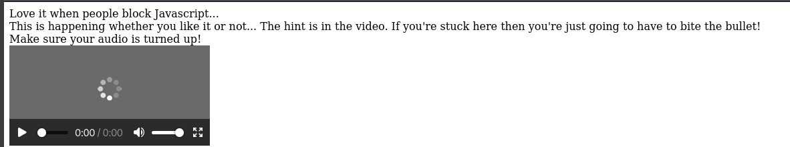

The video's audio hinted at a GET parameter to try against the page: `hidden_directory`. Sending a request with that parameter set (captured here in Burp) redirected to a real folder on the server that no scanner had turned up:

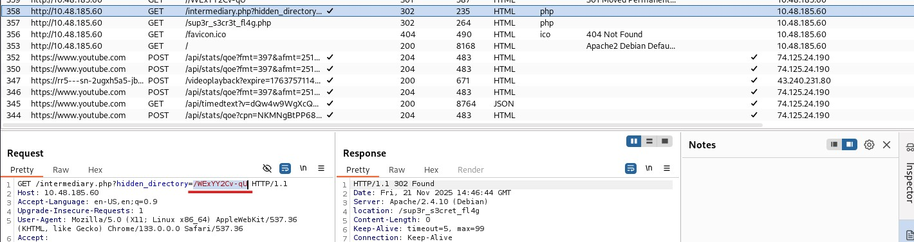

That folder contained a single image.

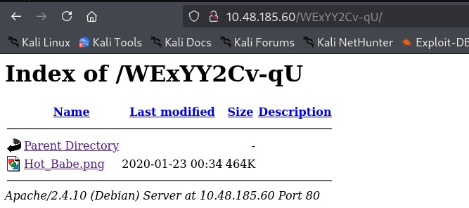
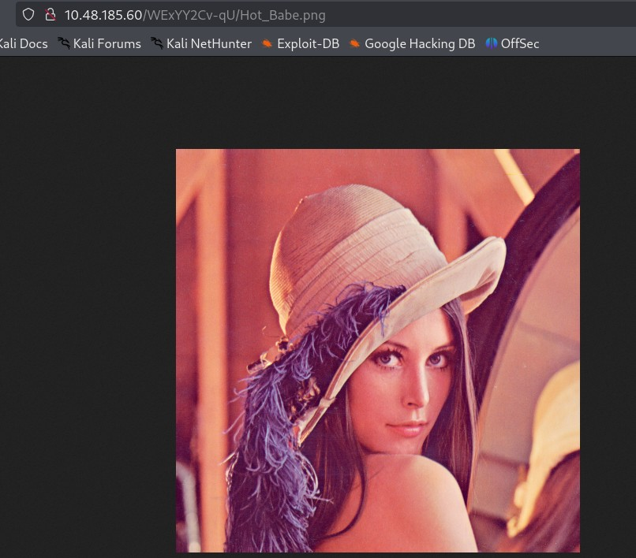

## Phase 4: A Password List Hidden Inside an Image

Running `exiftool` against the image didn't show anything unusual in the metadata itself, but it flagged trailer data sitting after the file's normal end marker, a sign that something had been appended to the file after the image data.

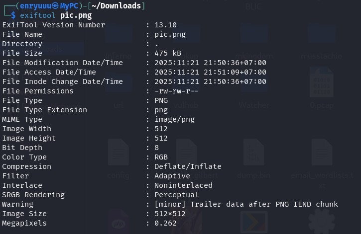

Pulling the raw strings out of the file confirmed it. Appended to the image was a message with an FTP username and a list of candidate passwords:

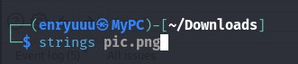
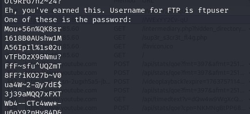

> **Security Issue #2:** Secrets Hidden Instead of Protected. Appending a password list to an image and relying on the file looking ordinary is not access control. Anyone who downloads the file gets the same shot at the hidden data as the intended recipient.

## Phase 5: Brute-Forcing FTP

With a username and a finite password list in hand, this was a job for Hydra rather than guesswork.

> hydra -l ftpuser -P wlist.txt \<TARGET_IP\> ftp

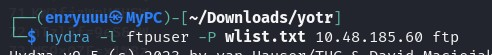

One valid combination came back out of the list.

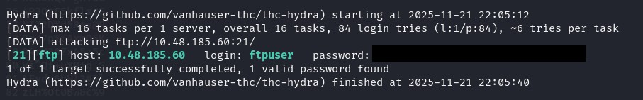

> **Security Issue #3:** No Brute-Force Protection on FTP. A small, finite password list is still a weak password policy if nothing stops repeated login attempts. The service accepted every attempt in the list without any delay, lockout, or alert.

Logging in with the recovered credentials worked immediately.

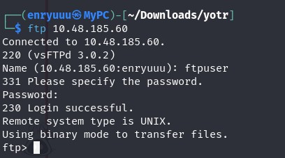

## Phase 6: FTP Enumeration and a Brainfuck-Encoded Secret

The FTP account had exactly one file sitting in it: `Eli's_Creds.txt`.

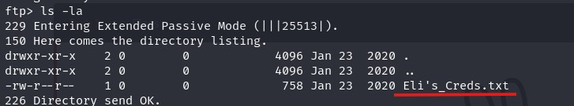
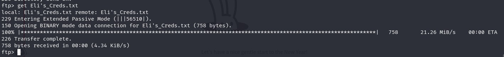
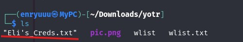

Its content wasn't plain text, it was written in Brainfuck, an esoteric programming language built entirely out of eight symbols.

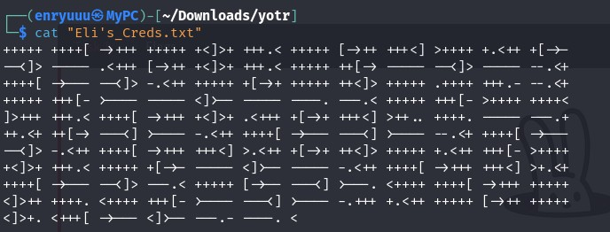

Running it through an online Brainfuck interpreter decoded it into a username and password for SSH. Same pattern as the image file earlier: a secret hidden by obscurity rather than protected by any real control, and just as easy to reverse once someone knows to look.

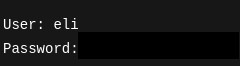

## Phase 7: SSH Access and a Message Left Behind

The decoded credentials logged straight into SSH. Waiting on login was a message, left by "Root" for another user on the box:

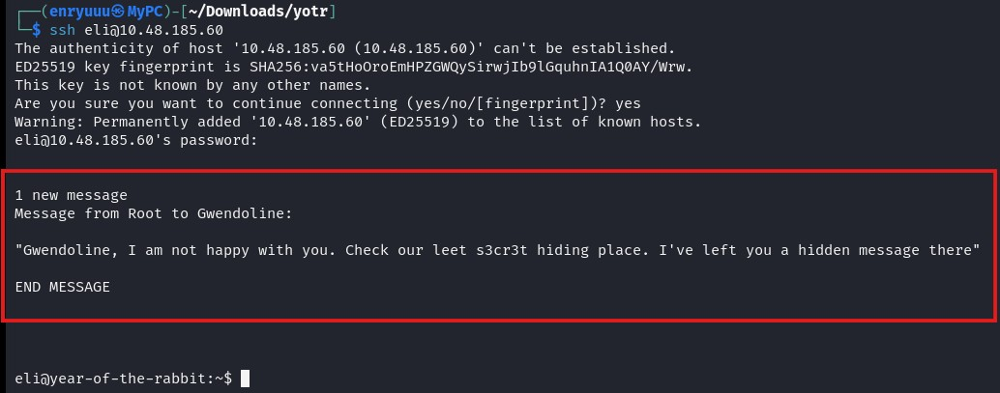

The message pointed to a "leet s3cr3t hiding place." Searching the filesystem for that string turned up a hidden, deliberately obfuscated filename sitting in an unrelated system directory.

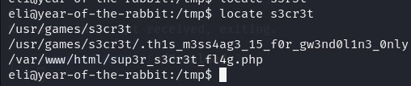

Reading it revealed a second note, this one scolding Gwendoline for a password far shorter than it should be, and naming that password outright.

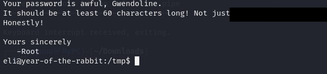

### First flag

Switching to her account with that password worked right away. From there, the first flag was sitting in her home directory.

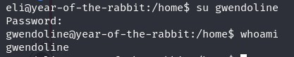
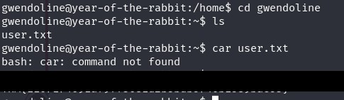

## Phase 8: Privilege Escalation via a Sudo Misconfiguration

Checking sudo permissions for the current user showed a rule that looked protective on the surface: the user could run `vi` as any user _except_ root, with no password required.

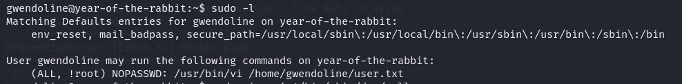

> resource https://www.exploit-db.com/exploits/47502

That exception is exactly what CVE-2019-14287 breaks. Older versions of sudo checked the excluded user by name, not by ID, so specifying a nonexistent user ID such as `-1` resolves internally to UID `0`, root, without ever matching the name that was supposedly blocked.

> sudo -u#-1 /usr/bin/vi /home/gwendoline/user.txt

With `vi` now running as root, escaping to a shell from inside the editor (`:!/bin/sh`) handed over a fully privileged session.

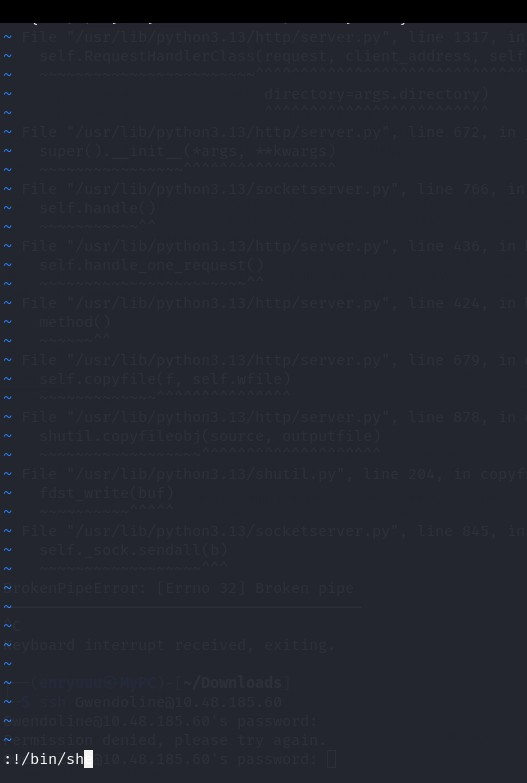
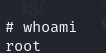

> **Security Issue #4:** Sudo Exception Bypassed via CVE-2019-14287. A sudoers rule written as "any user except root" is only as strong as the sudo version enforcing it. On vulnerable versions, that exception can be sidestepped entirely, turning a rule meant to limit privilege into a direct path to root.

### Flag 2

`root.txt` was waiting in `/root`, closing out the room.

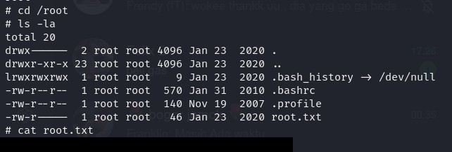

## Blue Team Perspective

Working back through this chain, here's what I think a defensive team would have caught, and where.

### 1. Hidden Paths Left in Client-Side Files

A comment in a CSS file, readable by anyone who opens dev tools, was the very first thread that unraveled this box. Fix: treat anything shipped to the browser as public, and strip developer notes, debug comments, and internal paths before deployment.

### 2. Secrets Hidden Rather Than Actually Protected

Both the FTP password list and the SSH credentials relied on being hard to notice rather than hard to access: one stitched onto the end of an image, the other encoded in an esoteric language. Fix: use a real secrets manager for credentials, never file steganography or encoding as a substitute for access control.

### 3. No Brute-Force Protection on FTP

A finite password list was all it took for Hydra to recover valid FTP credentials in a single run, with no lockout or alerting along the way. Fix: rate-limit or lock out repeated failed logins, and monitor for the login patterns brute-force tools produce.

### 4. Sudo Rules Are Only as Strong as the Sudo Version

The "any user except root" rule looked reasonable on paper but was bypassed outright by a known CVE. Fix: patch sudo against CVE-2019-14287, and treat every NOPASSWD exception as a potential privilege escalation path worth reviewing on its own.

This write-up is part of my ongoing series documenting CTF challenges as I build my portfolio in cybersecurity. I approach each challenge from both offensive and defensive perspectives, because understanding both sides is what makes a well-rounded security professional.

If you're also on the journey toward a SOC or Security Engineering role, feel free to connect, I'm always happy to discuss techniques and share resources.
